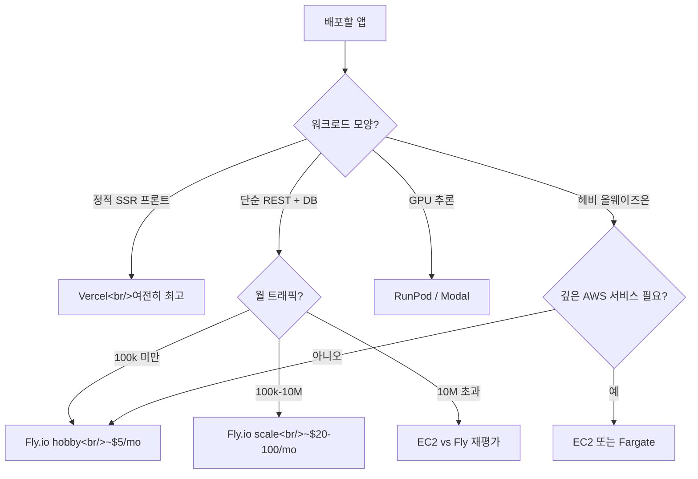

## 개요

세 개의 소스 — GeekNews 번역 두 편과 한국 개발자의 딥다이브 한 편 — 가 이번 주 같은 결론을 가리킨다: **Fly.io는 소·중규모 프로덕션 워크로드에서 손으로 돌리는 EC2나 펑션 과금 PaaS보다 싸고, 운영이 단순하고, 더 능력 있다.** 셋을 묶어 읽으면 글로 정리할 가치가 있는 의사결정 프레임워크로 수렴한다.

<!--more-->

## 케이스 1: Go 프로젝트, EC2 → Fly.io, 월 $9 절약

benhoyt.com의 글([GeekNews topic 8604](https://news.hada.io/topic?id=8604))은 Go 사이드 프로젝트 두 개를 EC2에서 Fly.io로 이관한 후기다. 숫자:

- **Ansible + 설정파일 500줄 제거.**
- **월 $9 절약** (절대값은 크지 않지만 기존 청구서의 100%).
- 정적 에셋 CDN을 `go:embed` + ETag 캐싱으로 대체.
- CRON을 백그라운드 goroutine으로 대체.
- 설정파일을 환경변수로 대체.

아키텍처는 변하지 않았다: Go `net/http` 서버 + SQLite DB. 바뀐 건 운영 표면. EC2 셋업은 Caddy로 SSL과 업그레이드를 챙겨야 했다. Fly.io는 기본으로 TLS 종단과 HTTPS를 포함한다. **3 VM까지 무료, 추가 VM은 월 $2** (1 shared CPU / 256 MB RAM) — 대부분의 Go 서버에 충분.

테이크어웨이는 구체적이다: 절약은 일부 달러, 대부분 **시간**. 500줄의 Ansible은 몇 주간 쌓인 운영 토일을 대리한다. Fly의 약속은 "더 싼 컴퓨트"가 아니라 "운영이 필요 없는 종류의 앱에 대한 운영 제거"다.

## 케이스 2: OpenStatus, Vercel → Fly.io

openstatus.dev의 글([GeekNews topic 12081](https://news.hada.io/topic?id=12081))은 반대 방향 — EC2 난민이 아니라 Vercel 이탈자. 그들의 이유:

- **경량 서버가 필요.** Vercel의 Next.js 서버는 모니터링 API에 무겁다. **Hono + Bun**으로 Fly에서 호스팅. 시작 시간: 0.19ms. 메모리: 91MB.
- **다중 지역 모니터링에 예측 가능한 비용 필요.** Vercel은 CPU 시간 과금이라 사용자 수 증가에 따라 비용이 예측 불가하게 는다. Fly의 VM별 가격이 그들의 모양에는 더 싸다.

이관 마찰은 솔직하게 기록됐다:

- **Docker 이미지 2GB → 700MB** 최적화.
- **Fly 배포가 자주 타임아웃**, 타임아웃 값을 늘려야 함.
- **이전 버전으로 빠른 롤백 없음** — Vercel 대비 실제 갭.
- **Bun 런타임 버그** — 요청 실패 증가. `keepalive: false`가 워크어라운드.

결론은 뉘앙스가 있다: *"여전히 Vercel은 좋아한다 — Next.js 앱에는 최적. Next.js 이외의 호스팅이 필요한 경우엔 최선이 아닐 수 있다."* 이 프레이밍이 중요하다. Fly.io의 쐐기는 "Vercel이 나쁘다"가 아니라 "Vercel은 한 모양에 특화됐고, 네 모양이 다르면 경제학이 뒤집힌다"다.

## 케이스 3: David's Blog — A to Z

[blog.jangdaw.it](https://blog.jangdaw.it/posts/fly-io/)의 가이드는 가장 완전한 워크스루다 — Go + Gin + Docker, `fly launch`, `fly.toml`, 단계 분리 배포, Grafana 메트릭(무료 번들), 스케일 in/out, 환경변수, Fly Postgres, Upstash Redis 연동, SQLite 복제를 위한 LiteFS. 눈에 덜 띄는 디테일 몇 가지:

- **3 VM 평생 무료, 160GB 아웃바운드** — 인바운드는 무제한.
- **월 $5 미만은 청구 안 됨.** 실질적으로 저트래픽 사이드 프로젝트는 $0.
- **Tokyo(nrt)가 한국에서 가장 가까운 리전** — 서울 리전은 아직 없음 (원문 시점).
- **`fly.toml`의 `auto_stop_machines` / `auto_start_machines`** 조합이 결정적 — idle이면 머신을 0으로 축소, 첫 요청에 다시 기동.

LiteFS 섹션이 특히 흥미롭다 — SQLite를 여러 지역에 복제한다는 건 파일 기반 DB에서 read-replica 아키텍처를 돌릴 수 있다는 뜻. 플랫폼이 머신 간 쓰기를 운반할 수 있어야 비로소 가능해지는 패턴.

## 세 편을 묶어 읽기

세 개의 서로 다른 이관, 세 개의 다른 비교 기준점. 그런데 같은 모양의 논증:

1. **흥미로운 경쟁자는 운영 헤비 셋업의 "PaaS 없음"(EC2)과 Next.js 전용 PaaS(Vercel)다.** Fly.io는 올바른 것(TLS, 리전, 시크릿, Dockerfile 배포)을 추상화하되 프레임워크 선택을 강요하지 않기 때문에 두 비교 모두에서 이긴다.
2. **가격은 단가가 아니라 트래픽 모양에 대한 것이다.** Vercel의 요청별 과금은 정적 중심·소형에는 훌륭하고 고볼륨 API 워크로드에는 예측 불가하다. Fly의 머신별 과금은 반대다.
3. **이관 비용은 대부분 Dockerfile과 fly.toml 정합성이다.** 세 글 모두 실제 컴퓨트 이관은 몇 시간이라고 적는다. 긴 꼬리는 도메인·시크릿·환경변수·롤백 툴링.

## Fly.io가 못 이기는 곳

이 글들이 말하지 않는 것도 말해둘 가치가 있다: **Fly.io는 스케일에서 AWS의 대체가 아니다.** DynamoDB가 필요하거나, 특정 VPC 피어링이 필요하거나, IAM 페더레이티드 서비스가 필요하면 다시 AWS다. GPU 워크로드는 RunPod나 Modal이 낫다. OpenStatus가 플래그한 대로 **빠른 롤백**이 Vercel보다 실제로 어렵다 — 핫픽스를 자주 쏘는 팀이면 감안해야 한다.

## 인사이트

세 케이스의 패턴: **작은 팀, 작은 프로젝트, "인프라는 풀타임이 아니어야 한다"는 강한 의견.** Fly.io의 경쟁 해자는 구체적으로 이 세그먼트다 — EC2 + Ansible(너무 많음)이나 요청별 PaaS(고트래픽에서 터짐) 사이에서 헤매는 개발자. Go 케이스의 월 $9 절약은 핵심이 아니다. **500줄의 Ansible 제거**가 핵심이다. 본인 팀을 위한 Fly.io 프레이밍은 "얼마나 싼가"가 아니라 "어떤 운영 복잡성이 사라지는가"다. 그리고 GPU + API + 프론트를 한 플랫폼에서 돌리게 되면 — popcon이 그렇다 — 경제학적 중력이 충분히 강해져서 대안은 높은 바를 넘어야 한다.
