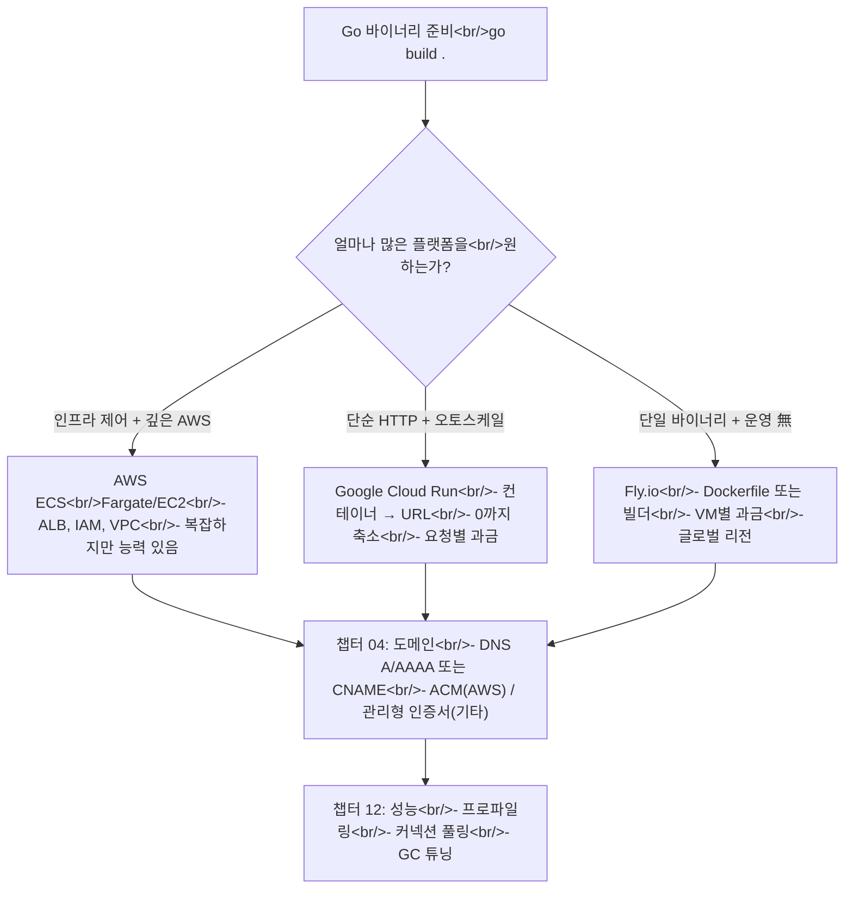

## 개요

wikidocs.net의 **"소설처럼 읽는 Go 언어"**의 배포 섹션은 Go 바이너리를 공개 인터넷에 올리는 세 가지 경로 — **AWS ECS**, **Google Cloud Run**, **Fly.io** — 와 도메인 연결·성능 최적화까지 다룬다. 챕터 자체는 짧지만, 드러나는 패턴은 더 긴 글로 정리할 가치가 있다. 다섯 챕터가 인코드하고 있는 의사결정 트리와, 각 경로가 실제로 하는 트레이드오프를 풀어본다.

<!--more-->



## 챕터 01: AWS ECS

ECS는 "이미 AWS에 산다"의 정답이다. 워크플로는 이렇다:

1. 멀티스테이지 Docker 이미지에 Go 바이너리 빌드.
2. ECR에 푸시.
3. Task Definition 정의 (CPU/RAM, 컨테이너 이미지, env, CloudWatch 로깅).
4. Cluster에 Service 생성 (서버리스 컨테이너는 Fargate, 호스트 관리는 EC2).
5. ALB 앞단에 타겟 그룹·헬스체크·Route 53 레코드.
6. 태스크가 S3·Secrets Manager 등에 접근하도록 IAM 폴리시 추가.

ECS가 주는 것: **AWS 나머지와의 깊은 통합.** 앱이 DynamoDB를 읽거나 SNS에 게시하거나 SQS에서 소비하거나 다른 계정의 S3 버킷에 접근하기 위해 역할을 가정해야 한다면 — ECS에서 모두가 IAM으로 말하기 때문에 깔끔하다. 값은: 수 시간의 첫 셋업, 이해해야 할 VPC + 서브넷 + 보안그룹, ALB 헬스체크와 컨테이너 기동 시퀀스가 어긋날 때 울리는 페이저.

## 챕터 02: Google Cloud Run

Cloud Run은 ECS의 반대편이다. 컨테이너 이미지(또는 소스 디렉터리 + Dockerfile)를 건네면 URL을 돌려준다. 서비스 특성:

- **요청에 따라 0에서 N으로 오토스케일.**
- **100ms 단위로 요청 시간 과금** — 요청이 없으면 $0.
- 제공되는 `run.app` URL에 **자동 HTTPS.**
- 로드밸런서 설정 필요 없음.

Cloud Run에서 Go 배포 모양:

```dockerfile
FROM golang:1.21-alpine AS build
WORKDIR /app
COPY . .
RUN go build -o main .

FROM alpine:3.18
COPY --from=build /app/main /main
EXPOSE 8080
CMD ["/main"]
```

그리고 `gcloud run deploy --source .`, 끝.

Cloud Run의 함정: **콜드 스타트.** 0까지 축소되면 idle 이후 첫 요청이 기동 비용을 낸다. Go 바이너리는 보통 1초 미만이라 대부분 워크로드엔 괜찮다 — 하지만 tail latency가 중요하면 `min-instances: 1`로 돌리고 과금을 감수한다.

## 챕터 03: Fly.io

Fly가 세 번째 경로이며 [별도 글에서 더 깊이 다룬다](/posts/2026-04-22-fly-migration-economics/). Go + Fly 모양:

1. `fly launch` — Dockerfile에서 `fly.toml` 생성.
2. `fly deploy` — Fly 원격 빌더로 빌드·배포.
3. `fly certs add yourdomain.com` — Let's Encrypt 자동으로 커스텀 도메인.

ECS 대비 셋업 단순성에서 이긴다. Cloud Run 대비 **작은 올웨이즈온 풋프린트**가 필요할 때 이긴다 (Cloud Run의 0축소는 버스트에, Fly의 월 $2/VM는 스테디 저볼륨에).

## 챕터 04: 도메인 연결

세 경로 공통 패턴:

- **A 레코드** — 안정적 IPv4 지목 (ECS는 ALB DNS, Fly는 할당 IP, Cloud Run은 Google 관리형 도메인 매핑).
- **AAAA 레코드** — IPv6 가용한 경우.
- **TLS 인증서** — AWS는 ACM(ALB 자동), Cloud Run은 Google 관리형, Fly는 `fly certs`를 통한 Let's Encrypt.

조용한 조언: **재현 불가능한 단일 레지스트라 + 네임서버 셋업에 도메인을 묶지 마라.** 존 파일로 export 가능한 DNS 프로바이더(Cloudflare, Route 53, Gandi)를 써라. 프로바이더를 떠나야 할 때만 한 번 중요해지는 종류의 디테일.

## 챕터 12: 성능 최적화

wikidocs 성능 챕터가 챙길 가치 있는 Go 전용 최적화를 모은다. 수익이 가장 큰 것:

- **`GOGC` 튜닝.** 기본 100은 대부분 워크로드에 괜찮다. 여유 메모리가 있고 GC 포즈를 줄이고 싶으면 200, 400으로.
- **`database/sql` 커넥션 풀 리밋.** `SetMaxOpenConns`와 `SetMaxIdleConns`가 중요한 두 노브. 기본 0(무제한)은 부하에서 물린다.
- **별도 포트에 `pprof` 엔드포인트** 노출 + 인증 보호. Go 성능 문제의 90%가 `pprof/heap`과 `pprof/goroutine`에서 진단된다.
- **`slog`로 구조화 로깅.** `log` + `fmt.Sprintf`보다 빠르고, 구조화 출력이 CloudWatch / Cloud Logging / Grafana Loki와 더 잘 어울린다.
- **`go:embed`로 정적 에셋.** 소·중규모 사이트에 CDN 필요 없고, 외부 의존성 하나 줄어든다.

## 의사결정 프레임워크

다섯 챕터를 함께 읽을 때의 진짜 유틸리티는 시사하는 프레임워크 — 세 줄 의사결정 트리다:

1. **깊은 AWS 서비스 통합이 필요한가?** → ECS. 아니면 no.
2. **베이스라인 0의 버스티 트래픽인가?** → Cloud Run.
3. **그 외 — 작은 팀, 꾸준한 트래픽, 인프라 생각하기 싫다?** → Fly.io.

작년 한 해 동안 본 Go 프로덕션 워크로드 중, DynamoDB 테이블과 Lambda 함수로 가득한 AWS 계정에 이미 붙박여 있지 않은 한 ECS가 명확히 정답이었던 적은 없었다.

## 인사이트

세 개를 나란히 보면 트렌드는 명백하다: **플랫폼이 운영 작업을 흡수했고, 남은 질문은 얼마나 많은 플랫폼을 원하느냐뿐이다.** ECS는 모든 것을 커스텀하게 하고 모든 것을 운영하라고 한다. Cloud Run은 컨테이너를 받고 HTTP URL을 준다. Fly.io는 Dockerfile을 받고 컨테이너 + 리전 + 커스텀 도메인을 준다. Go 바이너리는 작고 좋은 의미로 지루하다 — 셋 모두에 꽂힌다. 대부분의 프로덕션 Go 워크로드엔 솔직한 추천이 "버스티는 Cloud Run, 스테디는 Fly, ECS는 이미 살고 있을 때만"이다. 성능 챕터의 진짜 메시지는 어떤 최적화를 먼저 적용할지가 아니라, Go는 보통 그 중 아무것 없이도 충분히 빠르며, pprof가 구체적 지점을 가리킨 뒤에야 튜닝을 시작해야 한다는 것.
