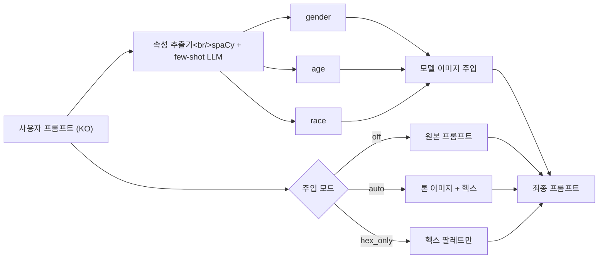

## 개요

16개 커밋, 세 갈래. 새 **HEX 전용 주입 모드**(톤 이미지는 빼고, 헥스 팔레트만 프롬프트에 주입), **앵글 피커를 3-카테고리로 분할**한 인라인 UI, 그리고 "하늘을 달리는 남자" 프롬프트에 여성 모델이 붙던 프로덕션 회귀를 잡는 **한국어 프롬프트 속성 추출기**. 작은 OTLP 튜닝(스팬 배치, 메트릭 간격 확대)이 뒷마무리.

이전 글: [hybrid-image-search-demo 개발 로그 #16](/posts/2026-04-17-hybrid-search-dev16/)

<!--more-->

## HEX 전용 주입 모드

톤 주입 시스템의 두 축: **톤 레퍼런스 이미지**(3장 또는 5장, 헥스 색으로 추출)와 **프롬프트 조각**(이미지를 생성 프롬프트 안에서 프레이밍). 기존 기본값은 두 가지를 함께 — 이미지도 주입하고 톤 방향성 텍스트도 넣는다. 이번 세션의 요청은 세 번째 모드, 즉 헥스 팔레트만 색상 가이드로 들어가고 톤 이미지 경로는 완전히 건너뛰는 것.

설계(`44d5bff`, `08916cb`)는 이를 3-way `injection_mode` 열거형으로 통합했다: `off` / `auto` / `hex_only`. 배선 작업이 대부분이었다.

- `refactor(prompt)`: `hex_colors`를 명시적 파라미터로 승격, 헥스 전용 프롬프트 블록 추가(`0a16f4f`).
- `feat(db)`: `log_generation`과 하이드레이션에 `injection_mode` 실기(`e53be41`) — 생성 레코드가 나중에 디버깅 시 모드를 재구성할 수 있어야 하므로 필요.
- `feat(backend)`: `injection_mode`를 end-to-end로 off/auto/hex_only 배선(`e6807e2`).
- Alembic 마이그레이션 `20260420_add_injection_mode.py`로 컬럼 추가.
- `feat(ui)`: 각 모드를 설명하는 a11y 툴팁이 달린 3-way 토글 필(`5659fd3`, `3b2cf22`).

UI 폴리시(`51464e6`)는 몇 번 돌았다. 초기 디자인은 비활성 상태가 중립 회색이었는데, "off"가 **비활성**으로 읽히지 않았다 — 사용자들이 여전히 활성 상태라고 오해했다. 픽스: 비활성 필은 빨강, 활성 필은 노랑. 대비가 강해지고, 상태를 한 번에 읽을 수 있다.

`fix(ui)` 커밋(`988ea37`)은 `hex_only` 모드에서도 톤 방향성 텍스트를 여전히 보여주던 프롬프트-표시 헬퍼를 덮었다 — 남아 있던 복사 경로. `chore(gen)`(`c419349`)은 세 모드가 Grafana 스팬에 또렷하게 뜨도록 텔레메트리 라벨을 정돈했다.

## 앵글 피커: 3-카테고리 인라인 UI

커밋 `61c5802`는 앵글 셀렉션을 플랫 리스트에서 3-카테고리 인라인 UI로 분할한다(#16에서 정리한 렌즈 피커 패턴으로 미루어 "general / beauty / product" 같은 구성일 것). 구조적 동기는 2회차 전 렌즈 피커 확장과 동일 — 5개가 넘는 플랫 리스트는 노이즈가 되고, 그룹화가 스캐너빌리티를 복구한다.

세련된 프론트엔드 이슈는 3-카테고리 분할에 결정적 표시 순서가 필요하다는 것 — 백엔드 `angle_registry`의 반영도와 JSON 스키마의 카테고리 메타데이터로 해결. 컴포넌트는 스키마를 한 번 읽고 섹션으로 렌더하며, 셀렉션은 여전히 단일 `angle_id`를 백엔드에 emit — API 표면은 변하지 않는다.

## 한국어 프롬프트 속성 추출

이 갈래를 시작하게 만든 프로덕션 버그: 프롬프트 "하늘을 달리는 남자"가 `Araya 05.png`(`data/model_labels.json`에서 여성으로 라벨됨)를 모델 레퍼런스로 붙여 생성했다. LLM 기반 속성 추출기가 성별을 잘못 고른 것.

픽스(`61e6c85`)는 **few-shot 프롬프트**로 성별/나이/인종 추출을 예시와 함께 강제한다. 분류기를 따로 돌리기보다 프롬프트 스키마를 조이는 쪽이 단순하다 — 세션 중의 결정은 마이너 가드레일로 충분하다는 것이었다. 한국어 프롬프트 입력 공간은 넓고, 제대로 된 분류기는 라벨된 코퍼스가 필요하니까.

spaCy 핀(`9f2773b`)도 연관. `en_core_web_sm`이 새 venv에서 자동 업그레이드되고 있었고, 프롬프트 파서는 특정 토큰 타입에 의존한다. 핀을 박아서 파싱을 재현 가능하게 만들었다.

## OTLP 텔레메트리 튜닝

두 개의 작지만 하중 있는 변경(`02c0c6c`): **스팬 배치**(per-span 대신) — 실제 트래픽에서는 반드시 덮어야 하는 OpenTelemetry 기본값 중 하나. 그리고 **메트릭 간격 확대** — Grafana Cloud 무료 플랜 수용량 안에 안정적으로 들어가도록. 트라이얼이 끝났으니 대시보드는 무료에 맞춰야 한다.

## 커밋 로그

| 메시지 | 변경 |
|---------|------|
| docs(spec): HEX-only tone injection mode design | 설계 |
| docs(plan): HEX-only tone injection implementation plan | 계획 |
| refactor(prompt): promote hex_colors to explicit param, add hex-only block | 프롬프트 빌더 |
| feat(angle): split angle selection into 3 categories with inline UI | 앵글 피커 |
| chore(deps): pin en_core_web_sm so venv rebuilds include spaCy model | 재현성 |
| feat(db): thread injection_mode through log_generation and hydration | DB + ORM |
| feat(backend): wire injection_mode end-to-end (off/auto/hex_only) | 백엔드 배선 |
| fix(deploy): restart backend and frontend via pm2 | 배포 핫픽스 |
| feat(ui): 3-way injection mode toggle (off/auto/hex_only) | UI |
| chore(ui): polish injection mode pill a11y and tooltips | a11y |
| fix(ui): respect hex_only mode in prompt-display helpers | UI 동기 |
| style(ui): make all inactive injection pills red for stronger active signal | 비주얼 대비 |
| fix(generation): extract gender/age/race reliably from Korean prompts | 파서 픽스 |
| fix(telemetry): batch spans and widen metric interval | OTLP 튜닝 |

## 인사이트

두 갈래가 같은 교훈을 공유한다: **명시적 모드가 암묵적 폴백을 이긴다.** `injection_mode` 열거형은 "플래그 기본값이 두 가지를 동시에 건드리는" 기존 설계보다 순전히 낫다 — 각 코드 경로가 호출 지점에서 읽힌다. 여덟 개 불리언을 추적하지 않아도 된다. 한국어 프롬프트 추출기도 같은 결. 예전에는 LLM의 기본 동작에 의존했는데, **대부분** 되다가 어느 순간 안 된다. few-shot 프롬프트도 여전히 LLM 기반이지만 이제 결정이 프롬프트 자체에 가시화된다. 비주얼 대비도 같은 원리 — "off" 토글이 중립으로 보이는 순간 사용자는 off로 읽기를 멈춘다. 다음 세션의 초점: 세션 4에서 나온 자동채움 토큰 확장 — 3장이나 5장을 한 번에 편집하는 UI가 필요.
