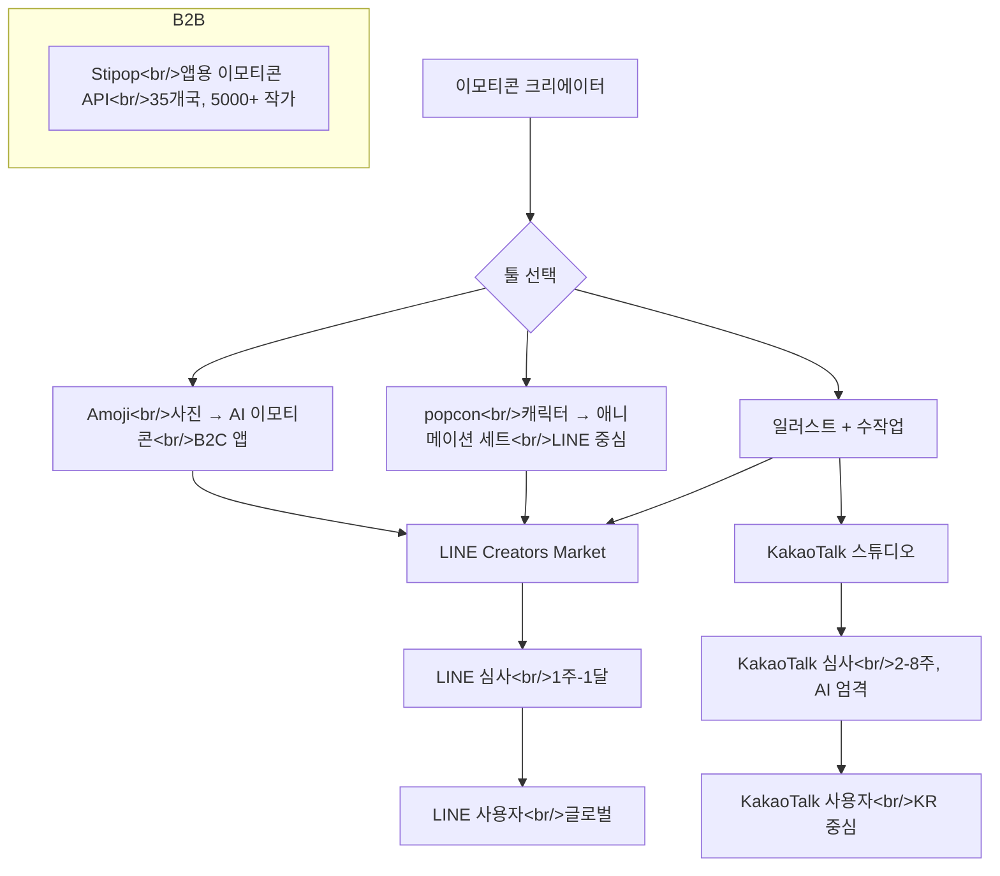

## 개요

같은 시장을 보는 세 가지 시점: **Amoji**(컨슈머 AI 이모티콘 생성기), **Stipop**(B2B 이모티콘 API), 그리고 **LINE Creators Market**(LINE 사용자에게 이모티콘을 유통하는 게이트웨이). 셋을 함께 읽으면 AI 애니메이션 이모티콘 도구 popcon이 실제로 어디에 맞고, 어디에 맞지 않는지가 분명해진다.

<!--more-->

## Amoji — 컨슈머 플레이

[Amoji](https://ddoaus.github.io/)(아모지)는 **데브킷**(DevKit)이 만든다. 피치: 사진을 업로드하면 앱이 이모티콘·스티커·프로필 이미지를 자동 생성. 나열된 프로덕트 축:

- **사진 기반 AI 이모티콘 생성**
- **캐릭터화 / 아바타 변환**
- **자동 스타일 적용 및 변형**
- **다양한 해상도 출력**
- **생성 결과 다운로드 및 공유**

프라이버시 문구는 직접적이고 안심된다: 사진 외부 미제공, 요청 시 즉시 삭제, HTTPS 종단간. 연락처는 개인 이메일, 대표자 이름 명시(오세준). 소규모 팀/1인 창업 운영, B2C 포지셔닝.

Amoji는 이미 **LINE Creators에서 판매 중**([amoji – LINE 이모티콘](https://store.line.me/emojishop/product/5f09296cc77ced18b4f65e09/ko)). LINE에서 판매되는 Amoji 세트의 존재가 포지셔닝을 흥미롭게 만든다 — 이모티콘을 만드는 도구가 동시에 *그 이모티콘을 겨냥 플랫폼에 직접 출하*하고 있다. 순수 도구 공급자는 자연스럽게 가질 수 없는 수직 통합.

## Stipop — 인프라 플레이

[Stipop](https://stipop.io/ko/about)은 시장의 반대편: 다른 앱 안에서 쓰이는 B2B 이모티콘 API. 포지셔닝 숫자:

- 글로벌로 Stipop 이모티콘을 쓰는 앱의 **2억 사용자**.
- **35개국 5,000+ 작가.**
- **Y Combinator 백업**, 언론이 평균 주간 14% 성장 인용 — YC 자체 표준은 주간 7%가 건강, 10% 이상이 뛰어난 수치.

Stipop의 피치는 데이팅 앱, 소셜 라디오, 핀테크, 라이브 스트리밍, 선물 리워드, 디자인 도구를 위한 이모티콘-as-API. 겨냥하는 수직은 *챗 표면을 만드는 프로덕트 팀* — 키보드, 검색, 분석을 원하는 측. 크리에이터가 아님.

벤치마크로서 Stipop이 흥미로운 점: **이모티콘에 API 회사로 버틸 만큼의 상업적 중력이 있다는 것을 증명했다.** popcon 같은 크리에이터 지향 도구에 대한 함의는 종착 상태가 "LINE에 제출하고 희망하기"만은 아니라는 것 — API 파트너를 통한 병렬 유통 채널이 개별 스토어 제출 없이 총합 리치를 가져올 수 있다.

## LINE Creators Market — 제출 파이프라인

[LINE Creators Market 애니메이션 이모티콘 가이드라인](https://creator.line.me/ko/guideline/animationemoji/)과 [심사 가이드라인](https://creator.line.me/ko/review_guideline/)은 모두가 지나가야 하는 게이트. **애니메이션 이모티콘** 세트의 기술 요건:

- **메인 세트:** 이미지 8–40개 (풀 라틴 문자/가나 세트는 100+로 확장).
- **이미지 크기:** 180 × 180 px.
- **포맷:** APNG.
- **파일 크기:** 이미지당 300 KB, 전체 zip 20 MB.
- **애니메이션 재생 시간:** 이모티콘당 ≤ 4초.
- **애니메이션 반복:** 이모티콘당 1–4회.
- **프레임 수:** APNG당 PNG 5–20프레임.
- **배경:** 투명. 72 dpi. RGB.
- **탭 이미지:** 96 × 74 px의 이미지 1장.

가이드라인의 디자인 팁은 알 만한 가치가 있다 — 왜 많은 AI 생성 이모티콘이 LINE에서 실패하는지 설명해주기 때문에:

- **굵고 짙은 테두리** — 얇거나 밝은 테두리는 다양한 채팅 배경에서 읽히지 않는다.
- **스티커처럼 사용할 수 있도록** — 혼자 보낸 이모티콘은 텍스트 속에 있는 이모티콘과 다른 크기로 렌더된다.
- **작은 크기에서 식별성** — 이모티콘은 대화 메시지에서 매우 작게 나타난다.
- **미니멀한 플러리시** — 가이드라인은 스티커에 흔했던 반짝임 효과와 하트를 명시적으로 deprecated 처리.

**심사 가이드라인**(윤리 + 비즈니스 게이트)도 똑같이 하중이 있다:
- 시인성(그라데이션, 얇은 선, 8등신 캐릭터: 모두 탈락 사유).
- 순수 로고나 순수 텍스트 이모티콘 불가.
- 윤리: 폭력, 약물, 정치, 차별 금지.
- 경쟁 메신저나 외부 서비스 홍보 금지.
- 구매 조건으로 개인정보 수집 불가.

결정적으로, LINE에는 명시적 AI 생성 콘텐츠 금지가 없다. KakaoTalk과 다르다(KakaoTalk은 2023-09부터 원본 AI 이미지 제한). 실제 경쟁 동학이다 — LINE을 겨냥하는 AI 이모티콘 도구가 KakaoTalk을 겨냥하는 도구보다 심사 환경이 우호적이다.

## popcon이 어디에 맞는가

셋을 가로질러 읽으면 popcon의 포지션은 **Amoji보다 좁은 쐐기**이자 **Stipop보다 크리에이터 지향의 쐐기**다. 구체적으로:

- **캐릭터 → 애니메이션 세트**, 사진 → 정적 스티커가 아님. LINE의 애니메이션 이모티콘 포맷과 거의 정확히 매치(8–40장, APNG ≤4초).
- **LINE 우선.** 가이드라인이 popcon의 파이프라인 출력과 깔끔하게 매핑된다 — 180×180 APNG, 투명 배경, 매팅 단계를 통한 굵은 테두리 강제.
- **B2B API 아님, 사진 변환 아님.** popcon은 세트를 **출하**하고 싶은 크리에이터를 겨냥한다.

프로덕트 모양의 함의:

1. **출력 포맷 계약은 기본값으로 LINE 호환이어야 한다** — export 옵션이 아니라 파이프라인 기본 출력으로.
2. **윤리 필터가 중요하다.** LINE 심사는 정치적·홍보성 이모티콘을 거절한다. popcon의 프롬프트 레이어가 이런 것을 미리 필터링해서 크리에이터의 낭비를 줄여야 할 가능성이 크다.
3. **Stipop의 B2B 레인이 흥미로운 2차 유통 채널** — popcon이 의미 있는 카탈로그를 갖는 순간, API 파트너십이 개별 심사 큐를 우회하는 경로가 된다.

## KakaoTalk, 더 어려운 시장

[KakaoTalk AI 이모티콘 판매에 대한 YouTube 분석](/posts/2026-04-22-chatgpt-kakao-emoji-viability/)이 반대편을 다룬다. KakaoTalk은 2023-09 기준 원본 AI 생성 콘텐츠에 **적극 적대적**. 거기서 성공하는 크리에이터는 AI를 아이디에이션(캐릭터 콘셉트, 대사)에 쓰고 최종 이미지를 손으로 그리거나 헤비하게 편집한다. LINE의 popcon은 더 우호적인 초기 시장. KakaoTalk은 나중의, 더 어려운 물결.

## 인사이트

한국 이모티콘 시장은 세 개의 깔끔한 레이어 — **크리에이터 도구**(Amoji, popcon), **B2B 유통**(Stipop), **플랫폼 게이트**(LINE Creators, KakaoTalk Studio). 초기 사고 대부분이 레이어 1은 맞추고 2·3을 무시한다. 세 소스를 함께 읽고 나온 솔직한 테이크어웨이는 **플랫폼 제약이 프로덕트를 정의한다**는 것. LINE의 180×180 APNG, ≤4초 애니메이션, 굵은 테두리는 제안이 아니다 — 파이프라인이 만들어야 하는 모양이다. LINE에서 볼륨을 출하하고 싶은 도구에게 가이드라인과 매치되는 파이프라인 기본값은 어떤 UI 폴리시보다 값지다. 그리고 Stipop 예시가 보여주는 것 — 크리에이터 카탈로그가 있으면 2차 유통 레이어가 존재한다. LINE Store 랭킹만으로 이겨야 하는 게 아니다.
