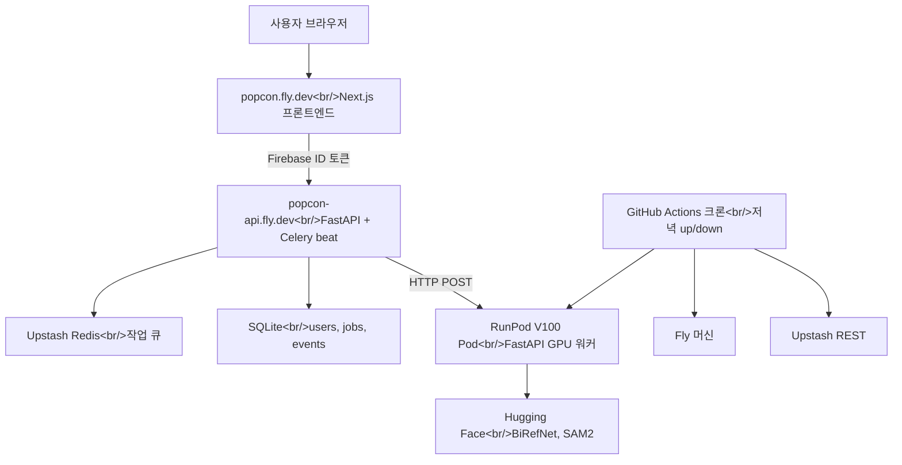
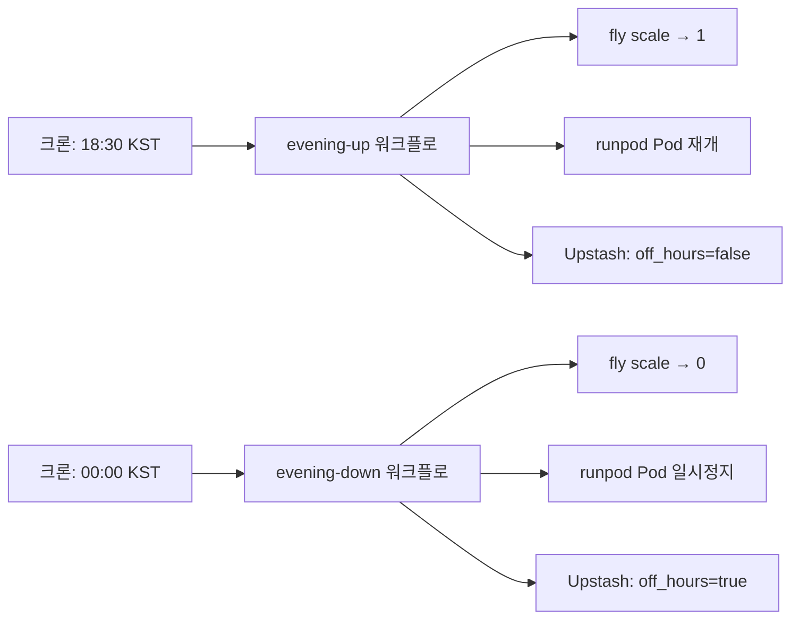

## 개요

약 33시간에 66개 커밋. 이번 회차는 "로컬에서 돌아간다"와 "인터넷 사용자 누구나 로그인하고 이모티콘 세트를 만든다" 사이의 간극을 닫는다. 세 갈래가 동시에 달렸다. **Firebase Google 로그인 + 사용자별 SQLite 감사 로그**, **RunPod Serverless → Pod 이관**(콜드 스타트를 없애기 위해), 그리고 **Fly.io 스케줄 가용성 배포**를 GitHub Actions 크론으로 제어하는 구조. 각각 단독 기능이 아니라, 함께 "배포 가능한 프로덕션 형태"를 구성한다.

이전 글: [popcon 개발 로그 #9](/posts/2026-04-17-popcon-dev9/)

<!--more-->

## Google 로그인과 사용자별 감사 로그

익명 플로우는 더 이상 유지할 수 없었다. GPU 기반 생성기를 공개 인터넷에 올리는 순간, **누가** 프레임을 돌리고 있는지 알아야 한다 — 비용, 어뷰즈, 제품 설계 모두의 이유로. 로그인 마이그레이션은 두 단계로 진행됐다.

**백엔드(`1dde783` → `8735e3b`):** `sqlalchemy`, `alembic`, `firebase-admin` 의존성 추가, 동시 쓰기를 위한 WAL 프래그마를 가진 엔진 모듈(`2475e17`), `users`·`jobs`·`emoji_results`·`events` ORM 모델(`c3e9d69`), 초기 Alembic 마이그레이션(`a1d5965`)을 작성했다. 300-이벤트 동시성 테스트(`83d4b48`)로 WAL 경로를 검증. FastAPI `current_user` 의존성이 Firebase ID 토큰을 검증하고(`9dafed4`), `/api/jobs`는 사용자 스코프가 됐고(`6c79aaa`), 파이프라인의 모든 단계가 이벤트를 emit한다(`8735e3b`, `c8eaf5f`) — `job.created`, `job.stage_completed`, `job.completed`, `job.failed`. 감사 테이블이 프로덕션 디버깅의 새 단일 진실이다.

**프론트엔드(`6c53eeb` → `f06e5af`):** Firebase 클라이언트 초기화, `AuthProvider`, `useUser` 훅, Google 로그인 버튼, 모든 API 호출에 ID 토큰을 주입하는 패턴. 에디터와 refine 페이지를 로그인 게이트에 넣고(`7cdd747`), "Start Creating" 버튼은 비로그인 상태면 로그인 트리거를 띄운다(`f4c930e`). 커밋 `39d285c`는 env 로딩을 레포 루트로 끌어올려 프론트와 백엔드가 같은 `.env`를 읽게 했다 — 작은 변화지만, Firebase 프로젝트 ID가 드리프트할 때마다 나오는 "내 컴퓨터에서는 되는데" 이슈를 없앤다.

눈에 잘 안 띄는 마이그레이션 포인트: 커밋 `873ccc8`는 `0002` 마이그레이션에서 `user_id`를 `NOT NULL`로 만든다. 그 전까지는 컬럼은 존재하되 전환 중이던 기존 작업을 위해 `NULL` 허용이었다. 익명 정리 beat(`7a5ed5d`)는 플로우가 로그인 전용이 되는 순간 `01b867e`에서 제거됐다.

## RunPod Serverless → Pod, 콜드 스타트 때문에

#7에서 PopCon의 GPU 워커는 RunPod Serverless 위에 있었다. Serverless는 ~30초 콜드 스타트를 감내할 수 있으면 훌륭하다. 애니메이션 이모티콘은 불가능하다 — 생성 중에도 사용자는 이미 로딩을 보고 있고, 거기에 30초가 더 붙으면 경험이 박살난다. 그래서 워커는 FastAPI HTTP 래퍼가 붙은 Pod(V100, Tokyo)로 이관됐다(`d91df0b`). 클라이언트는 Pod URL을 타겟(`ec0e1e3`), `config.runpod_pod_url`가 Serverless dispatcher를 대체한다(`00c2786`).

Pod의 대가는 기본값으로 24/7 실행 = 24/7 요금이다. 해법은 **스케줄 가용성** — 유저가 있을 시간에만 올리고, 아닐 때는 전부 내린다. 이게 세 번째 갈래다.

## 스케줄 가용성: Fly.io + RunPod + Upstash, GitHub Actions가 오케스트레이션

여기가 재미있는 부분이다. 설계(`73125b2`, `59fc9ac`)는 앱이 고장난 것처럼 보이지 않으면서 근무 시간 외 비용을 평평하게 유지하는 방향. 공유 스케줄러 모듈(`b0b9e07`)이 Fly 머신 기동/중지, RunPod Pod 재개/일시정지, Upstash 플래그 전환을 알고 있다. GitHub Actions 워크플로(`57a01e9`)가 크론으로 저녁에 스택을 올리고, 마감 후 내린다.

윈도우 바깥에서는 `/api/generate-set`가 off_hours 플래그 기반으로 `503`을 돌려주고(`1c45386`, `c2ae323`), beat 워커가 다음 기동 시 일시정지된 이모티콘을 소진한다(`08c6481`). 통합 중 물렸던 구체적 버그: 커밋 `30e1886`는 Upstash REST 페이로드를 고친다 — REST API는 `{command: ...}`가 아니라 **배열 본문**을 기대한다. 당해봐야 배우는 종류의 와트. 또 하나: `c4350f5`는 Fly 설정의 `auto_start_machines = true` — 그렇지 않으면 워커가 idle 상태일 때 세션 중 사용자 요청이 락아웃된다.

수동 워크플로(`9388606`)는 원시 사용자 입력 대신 `env` 변수 + 화이트리스트를 쓴다. `workflow_dispatch` 핸들러의 명백한 커맨드 인젝션 경로를 닫는다.

## Fly.io 배포 토폴로지

작은 설계 엇박: 초기 스펙(`73125b2`)은 세 개 앱(프론트엔드, 백엔드, 워커) 구조였다. 실제로는 백엔드와 워커가 작업 파일을 위해 볼륨을 공유해야 하고, Fly는 볼륨을 물리 호스트에 핀한다. **honcho**로 둘을 한 앱에 병합(`20a02d5`)한 게 깔끔한 선택이었다. `popcon-beat`도 같이 사라졌다(`224e94d`) — 단일 `worker_ready` 시그널로 충분하니까.

Firebase 자격증명은 **컨테이너 부팅 시점에 base64 시크릿에서 디코드**된다(`47ed4b3`) — JSON 서비스 계정 파일을 단일 `fly secrets` 값으로 운반하는 표준 패턴. `NEXT_PUBLIC_FIREBASE_*`는 build args로 빌드 타임에 구워야 한다(`dc03275`). Next.js가 `NEXT_PUBLIC_*`를 클라이언트 번들에 인라인하기 때문 — 한 번은 모두가 당하는 포인트.

프로덕션 전용 픽스 몇 개가 따라왔다: CORS에 `popcon.fly.dev` 허용(`a9bf1b2`), celery와 redis-py 사이의 `ssl_cert_reqs` 정규화(`671c664`) — Upstash의 TLS URL과 라이브러리 기본값이 맞지 않았다. 파일 경로를 프로덕션에서는 API URL로 변환(`3b52bf0`) — 로컬에서 `/tmp`를 그대로 노출하던 지름길은 `/tmp`가 컨테이너별로 분리되면 통하지 않는다.

## 커밋 로그

| 메시지 | 변경 |
|---------|------|
| feat(db): sqlalchemy engine with WAL pragmas | DB 레이어 |
| feat(auth): firebase-admin current_user dependencies | 토큰 검증 |
| feat(audit): emit events from every pipeline stage | 감사 로그 |
| feat(gpu-worker): FastAPI HTTP wrapper for Pod deployment | Pod 이관 |
| feat(deploy): fly.io machine configs (frontend, backend, worker, beat) | fly 초기 설정 |
| feat(scheduler): shared fly + RunPod + Upstash control module | 오케스트레이터 |
| feat(ci): scheduled workflows (evening up/down, in-window health, manual) | 크론 컨트롤러 |
| fix(scheduler): Upstash REST expects array body, not {command: ...} | REST 계약 |
| simplify(deploy): drop popcon-beat, use worker_ready signal | 아키텍처 단순화 |
| fix(deploy): merge backend+worker into one fly app (shared volume via honcho) | 토폴로지 |
| fix(frontend): pass NEXT_PUBLIC_FIREBASE_* at build time via build args | Next.js 워트 |
| fix(redis): normalize ssl_cert_reqs between celery and redis-py | Upstash TLS 호환 |
| fix(fly): auto_start_machines=true so mid-session idle doesn't lock out | 오토스케일 UX |

## 인사이트

이번 세션에서 가장 쓸모 있었던 멘탈 전환은 **"앱이 동작한다"와 "앱이 스케줄에 따라 가용하다"를 분리한 것**. 비용 최적화를 신경 쓰는 인디 프로젝트와 진지한 프로덕트 양쪽 모두 같은 아이디어로 수렴한다 — 아무도 쓰지 않는 새벽 4시에 GPU를 돌릴 이유가 없다. 아교(GitHub Actions 크론 + Fly + RunPod + Upstash)는 **가용성**을 일급 추상으로 다루고 세 시스템을 한 모듈로 제어하는 순간 싸게 짤 수 있다. Upstash의 `off_hours` 플래그가 API에 시간 창을 하드코딩하지 않고도 우아한 성능 저하를 가능하게 하는 핵심이다. 이관 과정 전체가 디시플린을 강제한다 — 모든 외부 경계(TLS, CORS, env 주입, 시크릿 포맷)가 명시적이고, 문서화되고, 새 체크아웃에서 재현 가능해진다. 다음 회차는 실사용자 인시던트 리포트가 될 가능성이 높다 — 그런 건 언제나 일주일 안에 온다.
