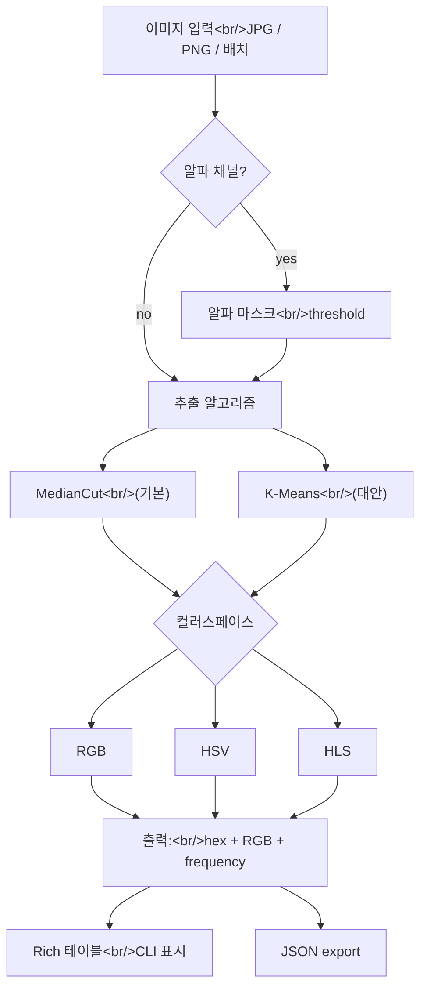

## 개요

[qTipTip/Pylette](https://github.com/qTipTip/Pylette)은 이미지에서 컬러 팔레트를 추출하는 작은 Python 라이브러리다(**스타 164개, 포크 16개**). 설명이 짧게 들리지만 — Pylette은 설치하고 나면 다시 생각할 필요가 없을 만큼 **한 가지**를 완벽히 해내는 종류다. CLI, Python API, 여러 추출 알고리즘, 세 가지 컬러스페이스, 병렬 배치 처리, JSON export, 컬러 프리뷰가 있는 progress 표시까지. 전체가 Python + Pillow + 약간의 숫자 의존성.

<!--more-->



## Pylette이 실제로 하는 일

README의 예시가 가장 빠른 이해법:

```bash
pip install Pylette
pylette sunset.jpg
```

출력:
```
✓ Extracted 5 colors from sunset.jpg
┏━━━━━━━━━━┳━━━━━━━━━━━━━━━━━┳━━━━━━━━━━┓
┃ Hex      ┃ RGB             ┃ Frequency ┃
┡━━━━━━━━━━╇━━━━━━━━━━━━━━━━━╇━━━━━━━━━━┩
│ #FF6B35  │ (255, 107, 53)  │    28.5% │
│ #F7931E  │ (247, 147, 30)  │    23.2% │
│ #FFD23F  │ (255, 210, 63)  │    18.7% │
│ #06FFA5  │ (6, 255, 165)   │    15.4% │
│ #4ECDC4  │ (78, 205, 196)  │    14.2% │
└──────────┴─────────────────┴──────────┘
```

컬러별 **frequency**는 비견되는 CLI 대부분이 빠뜨리는 기능. `#FF6B35`가 노을인지 구석의 간판인지 알려주는 건 바로 이 값이다.

## 알 만한 기능들

README에서 뽑은 것:

- **다양한 알고리즘.** `--mode MedianCut`(기본) + 대안. MedianCut은 고전 — 지배 축의 중앙값에서 컬러 공간을 재귀적으로 분할. K-Means는 다른 흔한 선택, Python API로 조정.
- **다양한 컬러스페이스.** `--colorspace {rgb,hsv,hls}`. HSV는 예술적 팔레트에 종종 낫다 — 원시 RGB 유사도 대신 색조로 그룹.
- **알파 핸들링.** `--alpha-mask-threshold 128`이 투명 픽셀을 팔레트 계산에서 제외. 투명 배경 로고와 스티커에 필수.
- **배치 + 병렬.** `pylette *.jpg --n 6 --num-threads 4`로 많은 이미지를 동시 처리.
- **JSON export.** `--export-json --output results/`로 이미지당 파일 하나, 출력이 단일 `.json`이면 통합 파일.
- **테이블 출력 억제.** 순수 프로그래머틱 사용에는 `--no-stdout`.

## Python API

파이프라인을 위한 라이브러리 API가 중요한 부분:

```python
from Pylette import extract_colors

palette = extract_colors(
    image="sunset.jpg",
    palette_size=5,
    mode="MedianCut",
    colorspace="hsv",
    alpha_mask_threshold=128,
)

for color in palette:
    print(color.rgb, color.hex, color.frequency)

palette.to_json("out.json")
```

`Palette` 객체는 이터러블하고 직렬화 가능하며 컬러별 메타데이터를 들고 다닌다. 더 큰 이미지 처리 파이프라인 안에서 잘 작동하는 모양 — 컬러 거리 함수, 조화 스코어러, 프롬프트 빌더를 통과시킬 수 있다.

## AI 이미지 스택에서의 위치

이미지 파이프라인이 있으면 컬러 팔레트 추출이 곳곳에 나타난다:

- **레퍼런스 이미지 톤 주입.** [hybrid-image-search-demo](/posts/2026-04-22-hybrid-dev17/) 프로젝트의 "HEX 전용 주입" 모드가 레퍼런스 이미지 팩에서 헥스 컬러를 추출해 생성 프롬프트에 주입한다. Pylette-모양의 출력이 정확히 맞는 입력 포맷.
- **제품 컬러 매칭.** e-커머스 이미지 검색은 종종 팔레트 유사도를 쓴다. Pylette의 빈도-가중 팔레트가 맹한 지배-컬러 추출보다 유용하다.
- **생성 이모티콘 스타일 조화.** 이모티콘 세트는 팔레트를 공유해야 한다. 레퍼런스 하나에서 팔레트를 뽑아 나머지에 유사도를 강제한다.
- **아트워크에서 테마 생성.** 로고에서 팔레트를 뽑아 전체 사이트 테마를 시드.

## 패키지 위생

작은 라이브러리치고 유지보수 시그널이 좋다:

- **Dependabot 활성** — 최근 커밋은 모두 actions 버전 자동 범프.
- **Material for MkDocs 문서** [qtiptip.github.io/Pylette](https://qtiptip.github.io/Pylette/).
- **Zenodo를 통한 DOI 발행** — 프로젝트에 인용 가능 레퍼런스, 학계 사용에 중요.
- **PyPI + uv 지원** — `pip install Pylette`와 `uv add Pylette` 모두 동작.

의존성 수가 적고 안정적. 놀라운 트랜지티브 팽창 없음.

## 알고리즘 메모

두 추출 모드는 의미 있게 다른 동작:

**MedianCut** (기본):
- 주어진 이미지에 대해 결정론적.
- 빠름.
- 공간적 컬러 다양성을 보존하는 경향 — 서로 다른 이미지 영역의 컬러를 얻는다.

**K-Means**:
- 기본은 확률적 (재현성을 위해 랜더마이저 시드).
- 약간 느림.
- 컬러 유사도로 클러스터링. MedianCut이 잡는 작지만 뚜렷한 악센트 컬러를 놓칠 수 있다.

같은 레퍼런스를 처리할 때마다 같은 팔레트를 만들어야 하는 재현성 필요 파이프라인에는 MedianCut이 더 안전한 기본값이다.

## 인사이트

Pylette은 놀라움이 없어야 마땅한 종류의 라이브러리다. **컬러 팔레트 추출은 풀린 문제**고, 올바른 API는 "이미지를 건네면 컬러스페이스 선택과 함께 N개 컬러와 빈도를 받는다"다. Pylette은 그것을 잘 유지되는 코드베이스, 좋은 문서, 예쁜 테이블을 출력하는 CLI로 한다. AI 이미지 생성 주변 생태계 — 레퍼런스 이미지 주입, 스타일 전이, 제품 매치 — 는 Pylette 같은 라이브러리를 조용히 하중 있게 만든다. 팔레트를 건드리는 모든 Python 이미지 작업에는 이걸 설치하고 본 문제로 넘어가라.
