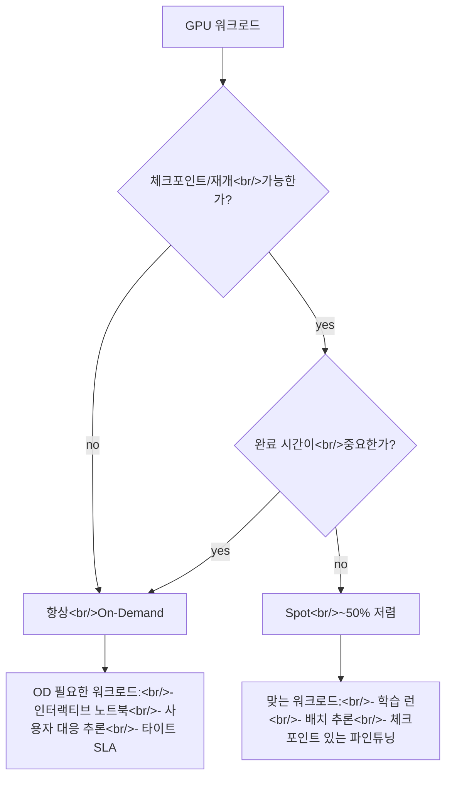

## 개요

[RunPod의 "Spot vs. On-Demand Instances" 블로그 글](https://www.runpod.io/blog/spot-vs-on-demand-instances-runpod)은 짧지만, 많은 사람이 잘못 내리는 결정을 정확히 프레이밍한다. 스팟은 같은 GPU의 온디맨드 대비 대략 절반 가격이지만 예고 없이 중단될 수 있다. 이게 득이냐 재앙이냐는 워크로드의 단 하나의 속성에 달렸다: **체크포인트하고 재개할 수 있는가?**

<!--more-->

## 가격의 실체

글의 예시: A6000이 **스팟 $0.232/gpu/hour**, **온디맨드 $0.491/gpu/hour**. 할인율은 RTX 4090·A100·H100 등 대부분 SKU에서 50% 근처로 일관된다. 정확한 차이는 가용성에 따라 흔들린다. 계산은 깔끔하다: 24시간 학습 런이 온디맨드 $11.78, 스팟 $5.57. 한 달 헤비 학습이면 $353 vs $167의 차이.

가격이 매력적이라 질문은 "스팟을 쓸까"가 아니라 "어떤 워크로드가 중단을 견디는가"다.

## 중단 계약

글의 핵심 문장: *"스팟 인스턴스는 예고 없이 중단될 수 있고, 온디맨드 인스턴스는 중단 불가."* AWS EC2 스팟과 비교하면 RunPod 스팟은 **더 거칠다** — AWS는 종료 전 2분 경고를 준다. RunPod은 주지 않을 수 있다. 실전 의미:

- **graceful shutdown 핸들러에 상태 저장을 의존할 수 없다.** 두 줄 코드 사이에 인스턴스가 사라질 수 있다.
- **영속 볼륨 스토리지가 계약이다.** 중단 순간 팟 임시 디스크에 있던 건 사라진다. 붙은 볼륨에 있는 건 살아남는다.
- **체크포인트 빈도가 비용/신뢰성 노브다.** 1분마다 찍으면 체크포인트 쓰기에 컴퓨트를 낭비한다. 시간마다 찍으면 55분에 선점당해 55분을 잃는다.

## 잘 맞는 워크로드

글과 프로덕션 경험을 종합:

**자동 체크포인트 있는 학습 런.** PyTorch Lightning의 `ModelCheckpoint`, Hugging Face `Trainer(save_steps=...)`, 또는 N 스텝마다 커스텀 체크포인트 루프를 쓰는 것. 학습 루프가 마지막 체크포인트에서 1–2분 이상 손실 없이 재개할 수 있으면 스팟이 거의 항상 맞다.

**대용량 배치 추론.** 완료 항목 리스트를 붙은 볼륨에 영속해서 진행을 체크포인트한다. 선점되면 새 팟이 리스트를 읽고 이어간다. 고전적인 embarrassingly parallel 배치 작업.

**옵티마이저 상태 스냅샷 있는 파인튜닝.** 7B 모델의 LoRA 파인튜닝은 대체로 시간 단위 걸리고 자연스럽게 중간 체크포인트를 만든다. 스팟 선점 → 재기동 → 마지막 체크포인트에서 재개. 총 wall time은 늘지만 비용은 절반.

## 온디맨드가 필요한 워크로드

**인터랙티브 Jupyter 노트북.** 실험 중간 상태를 잃고 싶은 사람은 없다. 글의 문장: *"Jupyter 노트북에서 실험 흐름 중간에 중단되는 걸 원하는 사람은 없다."*

**사용자 대응 추론.** 실제 사용자가 응답을 기다리면 요청 중간에 워커를 선점할 수 없다. PopCon의 GPU 워커가 바로 이 모양 — 사용자가 "생성"을 클릭하고 초 단위 응답을 기대한다.

**타이트 SLA 잡.** 4시간 데드라인을 놓치는 비즈니스 비용이 있다면, 스팟의 예측 불가 wall-clock은 리스크다. 달러 절약이 데드라인 리스크를 덮지 못한다.

## 숨은 세 번째 옵션: Serverless

글이 다루지는 않지만 RunPod **Serverless**는 의미 있는 세 번째 카테고리다. Serverless가 풀 관리를 대신 한다 — 인스턴스가 워밍되고, 요청이 올 때까지 idle로 유지되고, 실행 시간 초 단위로 과금. 전통적 의미의 스팟도 온디맨드도 아니지만, 스팟이 해결하는 문제(idle GPU에 지불하지 않기)를 다른 메커니즘(관리 풀 + 요청별 과금)으로 푼다.

언제 무엇을 고를까:

| 워크로드                     | 최적       | 이유                                   |
|------------------------------|----------------|------------------------------------------|
| 인터랙티브 노트북         | On-demand Pod  | 중단을 허용할 수 없음              |
| 사용자 대응 추론 (저QPS) | Serverless  | 0축소, 웜 엔드포인트의 콜드 스타트 페널티 無 |
| 사용자 대응 추론 (고QPS) | On-demand Pod | 일관된 레이턴시, 스케일에서 예측 가능한 비용 |
| 학습 런 (체크포인트)  | Spot           | ~50% 비용 절감, 중단 복구 가능 |
| 배치 추론              | Spot           | embarrassingly parallel, 체크포인트 쉬움 |
| 파인튜닝                  | Spot           | 체크포인트가 워크플로에 자연스럽게 있음  |

## 실전 룰

글의 프레이밍: *"자동화가 잘 되어 있거나, 워크로드가 그다지 중요하지 않고 도박을 감수할 수 있을 때 스팟을 써라. 멈추지 않음을 보장받아야 할 때 온디맨드를 써라."*

옳지만 실전 엔지니어링 룰을 빼놓았다: **스팟 등급 절감은 체크포인트/재개를 이미 짰을 때에만 얻는다.** 안 짰다면 스팟의 실효 비용은 온디맨드 + 선점으로 실험이 파괴됐을 때 다시 짜는 시간이다. 네 시급을 절감 계산에 넣어라.

## 인사이트

스팟/온디맨드/서버리스 삼각형이 오늘날 GPU 클라우드 비용을 생각하는 맞는 방식이다. 너무 많은 팀이 모든 걸 온디맨드 기본값으로 돌리고 GPU 청구서를 불평한다. 반대편 실패 모드 — 체크포인트 없이 스팟 기본값 — 도 똑같이 나쁘다. 결정적 질문은 항상: **이 인스턴스가 다음 60초 안에 죽으면 어떻게 되는가?** 답이 "마지막 체크포인트에서 재개한다"면 스팟. 답이 "실험을 잃는다 / 사용자가 에러를 본다"면 온디맨드나 Serverless. 체크포인트 레이어는 한 번 만들어두면 스팟이 청구서를 반으로 자르는 첫 학습 런에서 본전을 뽑는다.
