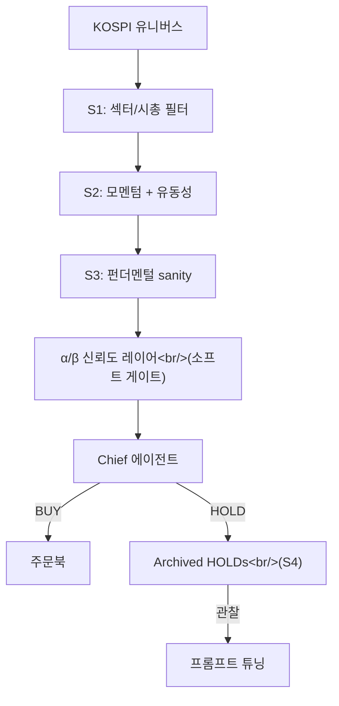

## 개요

2-커밋 세션이지만, 그 뒤의 결정이 더 흥미롭다. #13 이후 리서치 에이전트가 라이브로 돌고 있었는데, 로그의 패턴이 명확했다 — 스캐너의 유니버스가 너무 작고, 하드 필터가 너무 보수적이라서 Chief 에이전트가 BUY 결정을 내릴 만큼의 후보를 받지 못한다. 이번 회차는 스코프를 넓히고(S1–S3) 부드러운 신뢰도 레이어(α/β)를 추가한 뒤, HOLD 결정을 **조용히 버리지 않고 아카이빙**해서 Chief의 추론 패턴을 감사·튜닝할 수 있게 한다(S4).

이전 글: [trading-agent 개발 로그 #13](/posts/2026-04-16-trading-agent-dev13/)

<!--more-->

## 문제: 빈 깔대기

한 주 분량 로그를 읽으니 불편한 패턴이 보였다. 스캐너가 BUY 시그널을 거의 만들지 않고 있었고, 시장이 재미없어서가 아니라 S1–S3 단계의 하드 필터가 Chief 에이전트에게 도달하기도 전에 너무 많은 티커를 걸러내고 있었다. 좁은 유니버스 + 보수적 게이트가 만들어낸 퇴행적 깔대기: 리서치 볼륨은 적당한데, 깔대기 바닥이 굶는다. 세션에서의 사용자 표현이 정확했다 — "리서치하는 종목의 scope이 너무 작습니다 … 실 구매로 이어지는 것이 매우 어렵습니다."

두 개의 선택지가 있었다. 첫째, 하드 게이트는 유지하고 S1의 유니버스만 넓히기. 후보가 많아지지만 S2/S3에서 어차피 걸러질 확률이 크고, 깔대기 모양은 바뀌지 않는다. 둘째, 그리고 채택된 — **게이트를 완화하고 다운스트림에 더 부드러운 신뢰도 레이어(α/β)를 추가.** 하드 필터는 규칙으로 거절한다. 소프트 레이어는 스코어링한다. 스코어가 있으면 Chief 에이전트가 마지널한 후보를 볼 수 있다 — 아예 질문조차 되지 않던 후보를.

## 커밋 1: 유니버스 확장 + S1–S3 완화 + α/β

커밋 `6cb3ec8`은 `feat(scanner): expand research universe and loosen gates (S1-S3 + α/β)`. 한 커밋에 세 동작:

1. **유니버스 확장.** S1로 흐르는 KOSPI 유니버스가 너무 좁았다 — 시총/섹터 필터가 한 번쯤 흥미로웠을 수 있는 티커를 잘라내고 있었다. 새 유니버스는 넓고, 나머지 파이프라인이 관련성을 판단한다.
2. **S1–S3 완화.** 하드-룰 임계값을 로그 데이터가 지나치게 자주 바인딩된다고 보여준 곳에서 느슨하게 했다. 설계는 단계를 제거하지 않는다 — S1–S3는 여전히 검색 공간을 깎는 저비용 필터다 — 다만 임계값이 더 많은 티커를 풍부한 분석으로 통과시킨다.
3. **α/β 신뢰도 레이어.** S3 다운스트림에 새 소프트-스코어링 레이어. 모멘텀 + 펀더멘털 시그널에 α/β 가중치를 적용해 Chief가 읽을 수 있는 신뢰도 점수를 낸다. "통과/탈락"을 랭크된 숏리스트로 바꾼다.

## 커밋 2: HOLD 아카이빙 (S4)

커밋 `08e4326`은 `feat(scanner): archive HOLD decisions instead of silently discarding (S4)`. 이 전까지 Chief의 HOLD 결정은 증발했다 — 티커는 구매되지 않고, 로그 한 줄 외에는 아무것도 기록되지 않는다. 튜닝에는 최악의 형태인데, HOLD가 Chief가 가장 많이 사유하는 지점이기 때문이다. 이제 HOLD 결정은 풀 컨텍스트(입력, 스코어, 추론 요약)와 함께 영속되고 `?status=archived`로 조회 가능하다.

운영 후속은 관찰: Chief가 반복적으로 홀드하는 티커를 지켜보고(세션에서 반복 "펀더 강 + 기술적 과매수" 거절로 언급된 삼성전기·SK하이닉스), Stochastic K가 60 밑으로 떨어지는 날에 같은 티커가 BUY로 플립되는지 본다. 아카이브된 테이블이 그 가설의 검증 기반 — 없으면 가설에 실체가 없다.

## 롤아웃 모양

세션 계획은 P0(관찰, 코드 변경 없음)와 P1(Chief 프롬프트 튜닝, 1–2시간)을 분리했다. 이번 커밋 묶음은 P0의 전제조건 — 아카이브된 데이터 + α/β 스코어가 P1이 필요로 하는 데이터를 준다. 아직 프롬프트 변경은 없다.

## 커밋 로그

| 메시지 | 변경 |
|---------|------|
| feat(scanner): expand research universe and loosen gates (S1-S3 + α/β) | 유니버스, 게이트, 신뢰도 |
| feat(scanner): archive HOLD decisions instead of silently discarding (S4) | HOLD 영속 |

## 인사이트

이번 세션의 핵심 인사이트는 LLM 에이전트보다 오래된 것: **결정 레이어에 감사 기록이 없으면 튜닝할 수 없다.** Chief 에이전트의 HOLD는 정확히 연구할 가치가 가장 큰 추론을 담고 있었다 — *왜 이 후보가 리서치할 만큼 흥미롭지만 살 만큼은 아닌가* — 그런데 기본값으로 그 추론이 버려지고 있었다. 아카이빙은 공짜다(불리언 상태 플립 + 테이블). 그리고 모든 HOLD를 미래의 지도학습 튜닝 데이터 단위로 바꾼다. α/β 레이어도 같은 결 — 하드 필터를 소프트 스코어로 바꾸면 다운스트림 검사를 위한 정보가 보존된다. 다음 세션의 초점: 실제로 아카이브 데이터를 들여다보고 Chief 프롬프트가 펀더멘털 대 기술적 시그널의 가중치를 다시 잡아야 할지, 아니면 S2의 모멘텀 휴리스틱에서 더 상류의 이슈인지 판단.
