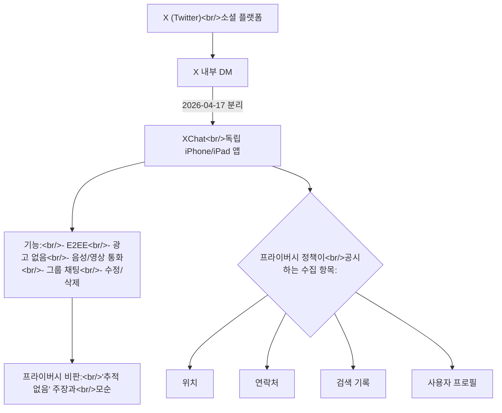

## 개요

**2026년 4월 17일**, X(구 Twitter)가 **XChat** — iPhone과 iPad용 독립 메신저 앱을 출시했다. 피치는 WhatsApp이나 Signal과 비슷하다: **종단간 암호화, 광고 없음, 추적 없음.** 음성·영상 통화, 그룹 채팅, 파일 전송, 메시지 수정·삭제까지 포함된다. 하지만 스토어 리스팅이 올라간 며칠 안에 프라이버시 전문가들이 마케팅 문구와 앱의 실제 데이터 수집 공시 사이의 모순을 플래그했다.

<!--more-->

## XChat이란 무엇인가

[디자인 나침반](https://designcompass.org/2026/04/13/x-independent-messenger-xchat-app-store-launch/)과 [클리앙 뉴스](https://www.clien.net/service/board/news/19176041) 기준, 출시 모양:

- **플랫폼:** iOS(iPhone + iPad) 우선. App Store 라이브 2026-04-17.
- **가격:** 무료. 광고 미공시.
- **기능:** 종단간 암호화, 음성 통화, 영상 통화, 파일 전송, 그룹 채팅, 메시지 수정·삭제.
- **UI:** 깔끔, 대화 중심 — 활발한 채팅방을 중심에 두도록 설계, 연락처 리스트가 아니라.

프로덕트 프레이밍은 소셜 피드 너머의 확장. *"X가 단순한 소셜 플랫폼을 넘어 커뮤니케이션 인프라로 확장하려는 의도를 드러냈다."* 이 포지셔닝은 XChat을 WhatsApp, Signal, Telegram, 그리고 한국에서는 KakaoTalk과 정면으로 겨룬다.

## 프라이버시 모순

여기서 불편해진다. 앱 스토어 리스팅이 공시하는 수집 항목:

- **위치 데이터**
- **연락처 목록**
- **검색 기록**
- **사용자 프로필 정보**

메신저 앱의 표준 카테고리다 — WhatsApp도 연락처를 수집하며 그게 연락처 기반 발견이 작동하는 방식이다. 질문은 이 카테고리가 잘못됐느냐가 아니라, 데이터가 수집되고 신원과 연결되며 단순한 메시지 전달 이외에 쓰일 거라는 사실을 감안할 때 **"추적 없음"** 메시징이 정직한가다.

디자인 나침반이 잡은 비판: *"프라이버시 보호를 강하게 내세우면서 동시에 폭넓은 사용자 데이터를 다루는 구조가 모순처럼 보인다."*

합당한 비판이다. 종단간 암호화는 *메시지 내용*을 보호한다. *메타데이터*는 보호하지 않는다 — 누구에게, 얼마나 자주, 언제, 어디서 메시지를 보냈는가. 메신저는 E2EE일 수 있으면서도 메타데이터만으로 상세한 소셜 그래프를 만들 수 있다.

## 머스크–WhatsApp 맥락

이 롤아웃을 추가로 긁힌 상태로 만드는 구체적 정치 동학이 있다. 일론 머스크는 올해 초 WhatsApp의 프라이버시 정책을 공개적으로 비판했고, WhatsApp은 직접 반박했다. XChat의 출시는 따라서 즉각 머스크의 WhatsApp 대안으로 읽히며 — 그가 WhatsApp을 비판했던 같은 기준으로 심사받게 된다.

디자인 나침반의 프레이밍: *"단순히 암호화 기능을 넣는 것만으로는 신뢰를 얻기 어렵고 실제 데이터 수집 범위와 운영 방식이 더 중요하다."*

맞는 프레이밍이다. 암호화 메신저 시장은 복잡하다(Signal, WhatsApp, Telegram의 비밀 대화, iMessage). 2026년의 차별점은 신뢰 — 신뢰는 마케팅 카피로 생기지 않는다. 앱이 실제로 하는 것의 범위로 생긴다. 위치 + 연락처 + 검색 기록 + 프로필을 수집하는 앱은 암호화 스토리와 상관없이 WhatsApp *보다 덜* 침해적이라고 팔기 어렵다.

## 경쟁 플랫폼에 대한 의미

**WhatsApp:** 방어적. XChat은 그들의 정확한 가치 제안(E2EE 메신저 + 통화 + 그룹)을 겨냥한다. 프라이버시 비판은 양쪽을 자른다 — XChat은 프라이버시를 강조하고, WhatsApp은 운영 신뢰도가 낫고, 둘 다 비판을 벗어나지는 않는다.

**KakaoTalk:** 간접 압력. 한국 시장은 KakaoTalk에 충성적이지만, E2EE · 광고 없음 · 국제 리치를 가진 자금이 풍부한 대안은 파워 유저 세그먼트를 잠식할 수 있다 — 이미 KakaoTalk의 채팅방 내 광고 배치에 짜증난 사용자들.

**Signal:** 포지셔닝 불변. Signal의 브랜드는 *구성부터 프라이버시*. XChat은 Signal을 Signal의 기준으로 고른 사용자에게는 신빙성 있는 대안이 아니다.

**Telegram:** 약간 압력. Telegram의 E2EE-not-default 선택은 꾸준한 비판이었고, XChat의 E2EE-first 프레이밍이 그 갭을 부각시킨다.

## 이모티콘·스티커 질문

이모티콘·스티커 생태계(popcon 작업과 관련) 관점에서 XChat은 새 유통 표면이다. 주요 메신저가 애니메이션 이모티콘 비즈니스의 유통 레이어:

- **WhatsApp:** 서드파티 팩을 통한 스티커.
- **Telegram:** 일급 콘텐츠로서의 애니메이션 스티커.
- **KakaoTalk:** 강한 이모티콘 경제, 연간 1,000억 원+ 규모 스토어.
- **LINE:** 글로벌 유통의 Creators Market.
- **XChat:** TBD. 스토어 리스팅에 스티커 지원 언급 없음, 하지만 전례 상 출시 후 6–12개월 안에 도착할 가능성.

XChat이 스티커 경제를 추가하면 기존 네 개에 나란히 다섯 번째 유통 레인이 된다. LINE 포맷 APNG 세트를 만드는 도구에겐 순 양호 — 포맷이 이동한다.

## 인사이트

XChat은 의미 있는 프로덕트 출시이자 익숙한 프라이버시 대치다. 의미 있는 부분은 X가 WhatsApp에 진지한 도전을 할 유통, 신빙성 있게 E2EE를 출하할 엔지니어링, 브랜드를 차별화할 의견 있는 CEO를 가졌다는 것. 익숙한 부분은 **마케팅 카피로서의 "프라이버시"는 쉽고, 아키텍처로서의 프라이버시는 어렵다**는 것, 그리고 둘 사이의 갭이 모든 신규 메신저가 걸리는 정확한 지점이라는 것. 앞으로 석 달간 지켜볼 질문은 XChat이 메타데이터 범위 비판에 실제 프로덕트 변경 — 더 좁은 데이터 수집, 더 명확한 보존 정책, 공개 투명성 보고서 — 로 답하느냐, 아니면 브랜드와 E2EE에만 기대느냐다. 어느 쪽이 되든 2026년에 "프라이버시 우선 메신저"가 실제로 무엇을 의미하는지 가르쳐줄 것이다.
