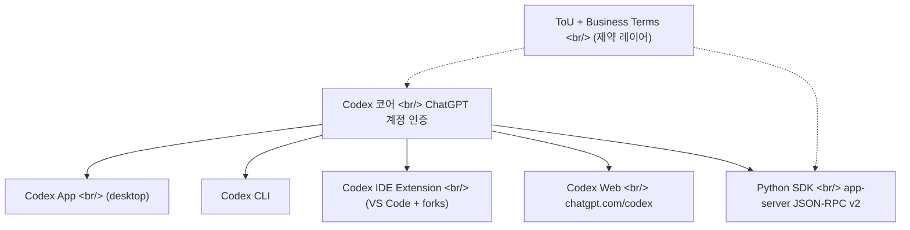
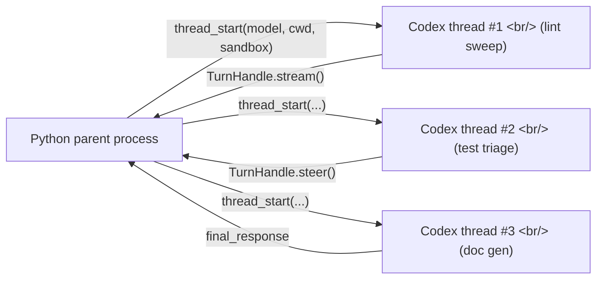

## 개요

OpenAI가 [Codex 공식 도움말 페이지](https://help.openai.com/en/articles/11369540-codex-in-chatgpt)를 업데이트하며 **Codex를 ChatGPT 플랜 안으로 정식 편입**했다. 한 줄 요약: "Codex는 ChatGPT Plus, Pro, Business, Enterprise/Edu 플랜에 포함되며, 한시적으로 Free와 Go에도 포함, 그 외 모든 플랜은 2배 rate limit"이다. 같은 시점에 [`openai/codex` 리포지토리](https://github.com/openai/codex)의 [`sdk/python`](https://github.com/openai/codex/tree/main/sdk/python) 디렉토리에 **Codex app-server를 JSON-RPC v2로 감싸는 실험적 Python SDK** 가 올라왔다. 묶어서 보면 Codex가 더 이상 CLI 하나가 아니라 **앱·CLI·IDE 확장·웹·SDK 5개 표면을 하나의 ChatGPT 계정 아래 통일한 통합 코딩 에이전트** 로 재정렬됐다는 신호다.

<!--more-->



본 글은 세 갈래로 본다 — **(1) Codex in ChatGPT라는 제품 전선**, **(2) Python SDK가 여는 헤드리스 자동화/서브에이전트 활용**, **(3) 약관/비즈니스 텀에서 무엇이 허용되고 무엇이 회색인가**. 마지막에 [Claude Code](https://www.anthropic.com/claude-code) / [Cursor](https://cursor.com/) / Codex in ChatGPT / [codex-r](https://github.com/thedalbee/codex-r) 중 어떤 워크플로가 어디에 맞는지 추천한다.

## 1. Codex in ChatGPT — GTM 재정렬

도움말 페이지 본문은 다음을 못박는다.

- **포함 플랜**: ChatGPT Plus, Pro, Business, Enterprise/Edu
- **한시 포함**: Free, Go (그리고 다른 플랜은 2배 rate limit)
- **클라이언트 4종 + 웹**: [Codex app](https://developers.openai.com/codex/app), [Codex CLI](https://developers.openai.com/codex/cli), [Codex IDE extension](https://developers.openai.com/codex/ide), [Codex web](https://chatgpt.com/codex)
- **인증**: 모두 ChatGPT 계정 SSO. 웹만 GitHub 연결 추가 필요
- **약관**: ChatGPT [Terms of Use](https://openai.com/policies/terms-of-use/) + [Privacy Policy](https://openai.com/policies/privacy-policy/), 비즈니스는 [Online Services Agreement](https://openai.com/policies/services-agreement/) 적용
- **엔터프라이즈 컨트롤**: [RBAC](https://help.openai.com/en/articles/11750701-rbac), 워크스페이스 App controls, [Compliance API](https://chatgpt.com/admin/api-reference#tag/Codex-Tasks)에 CLI/IDE/웹/클라우드 사용 로그 통합 노출

### 이 발표가 의미하는 것

GitHub Copilot이 IDE 안에, [Cursor](https://cursor.com/)가 IDE-as-product로, Anthropic의 Claude Code가 터미널·VS Code 확장으로 사용자를 끌어들이는 동안, OpenAI는 **이미 가진 ChatGPT 사용자 베이스를 IDE/터미널로 흘려보내는 역방향 GTM** 을 택했다. ChatGPT에 카드 등록한 Plus 사용자가 별도 결제 없이 Codex CLI를 그대로 깐다. Free/Go 한시 포함은 이 흐름을 더 가속한다.

Cursor와 부딪치는 표면은 [Codex IDE extension](https://developers.openai.com/codex/ide)이고, [GitHub Copilot](https://github.com/features/copilot)과 부딪치는 표면은 IDE extension + 웹(`chatgpt.com/codex`), Claude Code와 부딪치는 표면은 [Codex CLI](https://developers.openai.com/codex/cli)다. 4개 표면을 다 가지면서도 **결제와 인증은 ChatGPT 한 곳**이라는 점이 진짜 무기다.

엔터프라이즈 관점에서는 [Compliance API](https://chatgpt.com/admin/api-reference#tag/Codex-Tasks)에 CLI·IDE·웹·클라우드 사용이 모두 로그되는 점이 중요하다. SOC/SOX 감사 흐름에 Codex 사용을 single source of log로 묶을 수 있다 — Cursor는 자체 enterprise log, Claude Code는 [Anthropic Console](https://console.anthropic.com/) 로그를 각각 봐야 한다.

## 2. Python SDK — 헤드리스 자동화의 문이 열렸다

[`sdk/python`](https://github.com/openai/codex/tree/main/sdk/python) 디렉토리는 패키지 `openai-codex-app-server-sdk`로 게시 예정이고, 핵심 인터페이스는 `codex_app_server.Codex` 다.

```python
from codex_app_server import Codex

with Codex() as codex:
    thread = codex.thread_start(model="gpt-5.4", config={"model_reasoning_effort": "high"})
    result = thread.run("Summarize Rust ownership in 2 bullets.")
    print(result.final_response)
```

### 구조

- **Transport**: `codex app-server` 바이너리를 stdio로 띄우고 **JSON-RPC v2** 로 대화. SDK는 그 위에 Pydantic 모델 레이어를 얹는다.
- **Runtime 패키징**: SDK 버전과 정확히 핀된 `openai-codex-cli-bin` 패키지가 플랫폼별 휠로 바이너리를 가져온다. macOS arm64/x86_64, musllinux aarch64/x86_64, win arm64/amd64 매트릭스.
- **API surface** — `Codex` / `AsyncCodex`, `thread_start` / `thread_resume` / `thread_fork` / `thread_archive`, `Thread.run(...)` / `Thread.turn(...)`, `TurnHandle.steer(...)` / `interrupt()` / `stream()`
- **Async parity**: `async with AsyncCodex()` 가 sync와 거울 인터페이스
- **동시성**: 한 `Codex` 인스턴스가 **여러 active turn을 turn ID로 라우팅** 해 동시 스트리밍 가능

### 이게 왜 중요한가

`thread.run("...")`은 한 줄짜리 편의 API지만, `thread.turn(...)`이 반환하는 `TurnHandle`은 `steer()`, `interrupt()`, `stream()`을 노출한다. **이건 서브에이전트와 헤드리스 자동화를 짤 때 필요한 정확히 그 인터페이스다**.

- 서브에이전트 패턴: 부모 Python 프로세스가 `thread_start(...)`로 자식 Codex 스레드를 떼어내 cwd·sandbox·model·approval policy를 격리한 채 위임. 각 자식은 [MCP](https://modelcontextprotocol.io/) 서버나 plug-in 권한을 별도로 가질 수 있다.
- 헤드리스 자동화: CI 잡, 스케줄된 cron, [GitHub Actions](https://docs.github.com/en/actions) 워커에서 Codex를 띄워 PR diff 리뷰, 마이그레이션 dry-run, 에러 로그 트리아지를 돌리고 결과를 다시 Python으로 받아 후속 처리.
- 멀티턴 스레드 관리: `thread_resume(thread_id)`로 과거 스레드를 이어붙이고, `thread_fork(...)`로 동일 컨텍스트에서 가지치기. [codex-r 분석에서 봤던](/posts/2026-05-07-codex-r-claude-code-bridge/) external session import RPC와 같은 라인의 진화다.

Claude Code도 [Anthropic Agent SDK](https://docs.claude.com/en/api/agent-sdk-overview)로 같은 방향을 잡았지만, **OpenAI Codex SDK가 노리는 것은 "ChatGPT 인증 사용자가 한 줄 install로 헤드리스 에이전트를 띄울 수 있는 경로"** 다. API 키 발급·결제·rate limit 별도 관리가 사라지고, ChatGPT 플랜이 곧 자동화 한도가 된다.



## 3. 정책 — 무엇이 허용되고 무엇이 회색인가

### 개인 사용자 ([Terms of Use](https://openai.com/policies/terms-of-use/), Effective 2026-01-01)

명시적으로 **금지**되는 것:

- "Automatically or programmatically extract data or Output." — **자동/프로그램적 추출 금지**. SDK로 ChatGPT Plus 계정에 붙여 대량 추출 자동화는 위반 소지.
- "Use our Services in a way that violates ... rate limits or restrictions or bypass any protective measures or safety mitigations."
- "Use Output to develop models that compete with OpenAI." — **경쟁 모델 학습 금지**.
- "Modify, copy, lease, sell or distribute any of our Services."

명시적으로 **허용**되는 것:

- "you ... (a) retain your ownership rights in Input and (b) own the Output. We hereby assign to you all our right, title, and interest, if any, in and to Output." — **Output 소유권은 사용자**.
- "Our Services may allow you to download software ... Our software may include open source software that is governed by its own licenses." — Codex SDK 자체는 Apache-2.0 라이선스로 풀려 있고 별도 다운로드 가능.

회색 영역:

- **서브에이전트 / 스케줄 자동화**: 약관은 "automatic extraction"을 금지하지만, "scheduled coding task"는 명시되지 않았다. 도움말 페이지가 [Automations](https://developers.openai.com/codex/app/automations)를 정식 기능으로 제시하고 있어, OpenAI가 제공한 자동화 표면 안에서 돌리는 것은 의도된 사용으로 보인다. 다만 SDK로 외부 큐(Celery, Airflow)에 물려 돌리는 것은 ToU와 API 약관 사이의 경계가 모호 — 대량/지속적이면 rate limit 우회로 해석될 여지.
- **Output 재배포**: 소유권은 사용자에게 있지만 "Similarity of content"가 명시 — 다른 사용자도 비슷한 Output을 받을 수 있고, 그건 사용자 소유가 아니다.

### 비즈니스 사용자 ([May 2025 Business Terms](https://openai.com/policies/may-2025-business-terms/))

핵심 차이:

- **§4.1**: Customer가 Input의 ownership을 retain하고 Output을 own. OpenAI는 Output에 대한 자기 권리를 Customer에게 assign.
- **§4.2**: "OpenAI will not use Customer Content to develop or improve the Services, unless Customer explicitly agrees to such use." — **비즈니스 기본값은 학습 비사용**. 도움말 페이지가 같은 내용을 재확인한다: "By default, OpenAI does not use any inputs or outputs from our products for business users".
- **§3.3 Restrictions**: (d) Reverse Engineer 금지, (e) Output으로 OpenAI 경쟁 모델 학습 금지 ("Permitted Exception" 제외), (f) Services 외 경로로 데이터 추출 금지, (g) API 키 매매 금지, (h) rate limit 우회 금지.
- **§1.4 Affiliates**: 같은 워크스페이스/org ID 안에서 affiliate 사용 허용. **별도 결제는 별도 Order Form 필요**.
- **§9.3 Feedback**: 사용자가 보낸 feedback은 OpenAI가 무제한 활용 가능.

비즈니스 약관은 개인 ToU보다 훨씬 자동화 친화적이다. **§2.2가 "Customer Applications에 Services를 integrate"하는 권리를 명시적으로 부여** — SDK 기반 헤드리스 에이전트를 사내 도구에 박는 것은 명확히 허용된다. 단, **§3.3(i) "violate or circumvent Usage Limits or otherwise configure the Services to avoid Usage Limits"** 는 명확한 stop sign — workspace 한도를 우회하려고 여러 계정을 부려서 round-robin 돌리는 패턴은 위반.

### 한 줄 요약

- **개인 ChatGPT Plus로 SDK 깔아서 자동화 돌리기** → 의도된 사용 범위 안에서는 OK. 단, 외부 데이터 대량 추출 / rate limit 우회 / 경쟁 모델 학습은 금지.
- **회사 워크스페이스에서 Codex 사내 도구 통합** → 비즈니스 약관 §2.2가 명시적으로 허용. 학습 비사용은 기본값.
- **Codex Output을 외부에 재배포** → 사용자/Customer가 소유하므로 가능, 단 OpenAI 브랜드 표기 / 인간 작성으로 위장 / 경쟁 모델 학습은 별개로 금지.

## 4. 어떤 워크플로를 언제 쓸 것인가

| 시나리오 | 추천 도구 |
|---|---|
| IDE 안에서 인라인 완성·리팩토링 + GitHub 통합 | [Cursor](https://cursor.com/) 또는 [Codex IDE extension](https://developers.openai.com/codex/ide) |
| 터미널 중심 에이전트 워크플로, 긴 멀티턴 세션 | [Claude Code](https://www.anthropic.com/claude-code) 또는 [Codex CLI](https://developers.openai.com/codex/cli) |
| 이미 ChatGPT Plus/Pro 사용 중, 결제 단일화 원함 | Codex (CLI + IDE) — ChatGPT 계정 그대로 사용 |
| Anthropic 생태계 (Claude Code 세션 자산) | Claude Code 메인 + [codex-r](https://github.com/thedalbee/codex-r)로 세션 이식 |
| Python에서 헤드리스 / CI / 서브에이전트 | [Codex Python SDK](https://github.com/openai/codex/tree/main/sdk/python) 또는 [Anthropic Agent SDK](https://docs.claude.com/en/api/agent-sdk-overview) |
| 엔터프라이즈 컴플라이언스 / 사용 로그 통합 | Codex (Compliance API + RBAC + workspace controls) |
| 무료로 시작 | Codex Free/Go (한시 포함) 또는 Claude Code free tier |

**중복 사용도 멀쩡한 전략이다**. 같은 IDE에서 Cursor로 인라인 편집을 받고, 별도 터미널에서 Codex CLI로 멀티 파일 작업을 돌리고, 백그라운드 cron에서는 Codex SDK가 헤드리스로 PR diff를 리뷰하는 식. **OpenAI가 ChatGPT 계정 하나로 4개 표면을 묶은 의도가 정확히 이 흐름** — 한 결제로 IDE·터미널·헤드리스를 다 커버.

## 인사이트

Codex in ChatGPT의 진짜 사건은 가격표 변경이 아니다. **OpenAI가 코딩 에이전트의 결제·인증·로그·자동화 평면을 ChatGPT 한 곳으로 통일했다는 것** 이다. CLI 따로, IDE 따로, 웹 따로 결제하는 시대는 끝났다 — Anthropic도 이미 [Claude.ai 계정 = Claude Code 계정](https://www.anthropic.com/claude-code) 통합을 진행 중이고, OpenAI는 그 통합을 ChatGPT 거대 사용자 베이스로 한 번에 끝내려는 그림이다.

Python SDK가 같은 시점에 풀린 것도 우연이 아니다. `thread_start` / `thread_fork` / `TurnHandle.steer` 인터페이스는 [Anthropic Agent SDK](https://docs.claude.com/en/api/agent-sdk-overview)나 [LangChain의 멀티에이전트 패턴](https://python.langchain.com/docs/concepts/multi_agent/)과 거의 동일한 추상을 ChatGPT 인증 위에 얹은 것이다. **"한 ChatGPT 계정으로 헤드리스 자동화 + 서브에이전트 오케스트레이션까지 가능"** — 이건 API 키 발급 / 별도 결제 / 별도 rate limit 관리를 통째로 우회하는 GTM 무기다.

약관 측면에서는, 비즈니스 텀이 자동화·SDK 사용·사내 통합을 명확히 허용하면서 학습 비사용을 기본값으로 두는 것이 핵심이다. 개인 ToU는 "automatic extraction" 금지 조항이 회색 영역을 만들지만, OpenAI가 직접 제공하는 Automations / SDK / app-server를 통한 자동화는 의도된 경로 안이다. **사내 도구에 박을 거면 워크스페이스 플랜으로 가는 것이 정책·로그·rate limit 모두에서 정답** 이다.

결국 이 발표 이후 코딩 에이전트 시장의 축은 **"어느 도구가 더 똑똑한가" → "어느 도구가 내 인증/결제/로그/자동화를 가장 적은 마찰로 묶는가"** 로 이동한다. Codex의 4 표면 통합과 Python SDK는 OpenAI가 이 축에서 먼저 자리를 잡았다는 신호다.

## 참고

**Official docs**
- [Using Codex with your ChatGPT plan](https://help.openai.com/en/articles/11369540-codex-in-chatgpt) — Codex가 ChatGPT 플랜에 포함되는 공식 도움말
- [Codex developer portal](https://developers.openai.com/codex/) — 클라이언트별 진입점 및 모델 정보
- [Codex Python SDK](https://github.com/openai/codex/tree/main/sdk/python) — `openai-codex-app-server-sdk` 실험 SDK
- [Codex CLI](https://developers.openai.com/codex/cli) / [Codex App](https://developers.openai.com/codex/app) / [Codex IDE](https://developers.openai.com/codex/ide) / [Codex Web](https://chatgpt.com/codex)

**Policy pages**
- [OpenAI Terms of Use](https://openai.com/policies/terms-of-use/) — 2026-01-01 effective, 개인 ChatGPT 사용자에게 적용
- [May 2025 Business Terms](https://openai.com/policies/may-2025-business-terms/) — API·Enterprise·Business 적용
- [Usage Policies](https://openai.com/policies/usage-policies/) — 금지된 사용 사례 카탈로그
- [Privacy Policy](https://openai.com/policies/privacy-policy/) — 데이터 처리 원칙

**Related blog posts**
- [CODEX-R 분석](/posts/2026-05-07-codex-r-claude-code-bridge/) — Claude Code 세션을 Codex로 이식하는 마이크로 스킬
- [OpenAI 2026-05-07 디지스트](/posts/2026-05-07-openai-2026-05-07-announcement-digest/) — 같은 주에 풀린 5건의 발표 정리

**Competitors / Related tools**
- [Anthropic Claude Code](https://www.anthropic.com/claude-code) + [Agent SDK](https://docs.claude.com/en/api/agent-sdk-overview)
- [Cursor](https://cursor.com/) — IDE-as-product 코딩 에이전트
- [GitHub Copilot](https://github.com/features/copilot) — IDE 인라인 어시스턴트
- [Model Context Protocol](https://modelcontextprotocol.io/) — 에이전트 표준 레이어
