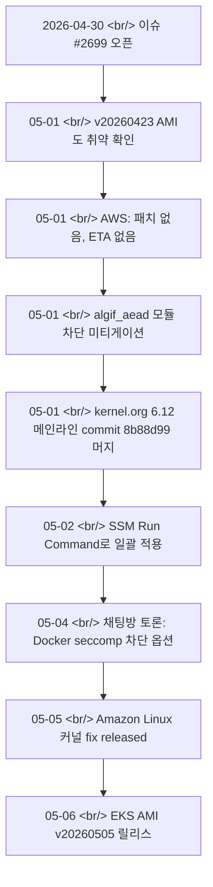

## 개요

2026-04-30, [awslabs/amazon-eks-ami issue #2699](https://github.com/awslabs/amazon-eks-ami/issues/2699) 가 열렸다. 제목은 단순했다 — "🚨 Patch for: CVE-2026-31431". 하지만 AWS의 답은 "패치 없음, ETA 못 줌" 이었고, 그동안 [컨테이너 탈출 PoC가 공개](https://github.com/Percivalll/Copy-Fail-CVE-2026-31431-Kubernetes-PoC)됐다. 결국 [v20260505 EKS AMI](https://github.com/awslabs/amazon-eks-ami/releases/tag/v20260505)가 6일 뒤 풀릴 때까지, **공식 패치보다 커뮤니티의 미티게이션이 먼저 움직인** 사례다.

<!--more-->



## CVE-2026-31431 — Copy-Fail 핵심

이 취약점은 리눅스 커널의 [algif_aead](https://www.kernel.org/doc/html/latest/crypto/userspace-if.html) — AF_ALG socket의 AEAD interface — 에 있는 메모리 처리 결함이다. 통칭 "Copy-Fail" 로 불린다. 핵심 특성 세 가지.

- **로컬 인증된 사용자**가 트리거 가능. 원격 비인증 공격은 불가
- **컨테이너 워크로드에서 컨테이너 탈출**이 가능 — 멀티테넌트 K8s, CI runner, sandbox에 직접 영향
- 공개 PoC: [Percivalll/Copy-Fail-CVE-2026-31431-Kubernetes-PoC](https://github.com/Percivalll/Copy-Fail-CVE-2026-31431-Kubernetes-PoC)
- GitHub 어드바이저리: [GHSA-2274-3hgr-wxv6](https://github.com/advisories/GHSA-2274-3hgr-wxv6)

원격 공격자가 직접 트리거할 수는 없지만, "로컬"이라는 단어가 K8s 환경에서는 가장 약한 가정이다. 멀쩡한 컨테이너 안에서 unprivileged process 가 호스트 커널을 건드릴 수 있다는 뜻.

## 사건 흐름 — 이슈 #2699

| 날짜 | 진행 |
|---|---|
| 2026-04-30 | issue #2699 오픈. 제목: "🚨 Patch for: CVE-2026-31431" |
| 05-01 | 커뮤니티 검증: 최신 v20260423 AMI의 커널 6.12.79-101.147.amzn2023 도 **여전히 취약** |
| 05-01 | AWS 서포트 답변: **"패치 없음, ETA 못 줌"** |
| 05-01 | AWS 공식 미티게이션 가이드 — `algif_aead` 모듈 로딩 차단 |
| 05-01 | 6.12 메인라인 커널엔 [commit 8b88d99](https://git.kernel.org/pub/scm/linux/kernel/git/stable/linux.git/commit/?id=8b88d99341f139e23bdeb1027a2a3ae10d341d82) 약 10시간 전 머지됨 |
| 05-02 | 사용자가 [AWS SSM Run Command](https://docs.aws.amazon.com/systems-manager/latest/userguide/execute-remote-commands.html) 로 클러스터 일괄 미티게이션 적용 |
| 05-04 | 카카오톡 채팅방 토론: "Docker 쓰시는 분들은 seccomp으로 막아도" — 미티게이션 추가 옵션 제시 |
| 05-05 | Amazon Linux 커널 fix — [ALAS-2026 페이지](https://alas.aws.amazon.com/AL2023/) 갱신 |
| 05-06 | **[EKS AMI v20260505 릴리스](https://github.com/awslabs/amazon-eks-ami/releases/tag/v20260505)** — kernel 6.12.80-106.156 / 6.1.168-203.330. 이슈 lock 예정 |

## AWS 공식 미티게이션 (패치 전)

기본 아이디어는 단순하다 — 취약한 커널 모듈을 로딩 자체로 차단하는 것.

```bash
echo "install algif_aead /bin/false" > /etc/modprobe.d/disable-algif.conf
rmmod algif_aead 2>/dev/null || true
```

`install algif_aead /bin/false` 는 modprobe가 모듈을 로드하려 할 때 `/bin/false` 를 대신 실행하게 만든다 — 즉 절대 로드되지 않는다. `rmmod` 는 이미 로드된 모듈을 즉시 제거한다.

## 클러스터 단위 일괄 적용 — SSM Run Command

이슈 댓글에서 사용자들이 공유한 패턴.

```bash
aws ssm send-command \
  --region eu-west-3 \
  --document-name "AWS-RunShellScript" \
  --targets "Key=tag:eks:cluster-name,Values={{CLUSTER_NAME}}" \
  --parameters 'commands=[
    "echo \"install algif_aead /bin/false\" > /etc/modprobe.d/disable-algif.conf",
    "rmmod algif_aead 2>/dev/null || true",
    "lsmod | grep algif && echo STILL_LOADED || echo MITIGATED"
  ]' \
  --comment "CVE-2026-31431 mitigation"
```

마지막 줄은 검증 — `lsmod | grep algif` 가 비어 있으면 모듈이 사라진 것. 클러스터에 노드가 수십 대라도 한 번에 적용된다.

## Managed Node Groups / Karpenter UserData 베이크

한 사용자 사례: [Karpenter](https://karpenter.sh/) 의 NodePool UserData에 미티게이션을 박아 두면, **모든 신규 노드가 부팅 즉시 보호된 상태로 올라온다**. 기존 노드는 SSM으로 일회성 처리, 새 노드는 UserData로 자동화 — 저영향, 저노력.

PoC로 차단 검증, 사이드카·데몬셋 호환성 확인 후 단계적 롤아웃이 정석.

## Bottlerocket AMI는 별도 트랙

이슈 댓글 중 한 명이 보고: "[Bottlerocket](https://bottlerocket.dev/) AMI 쓰는 클러스터는 미티게이션 적용 실패. 이건 이 레포 소관 아닐 듯." Bottlerocket은 read-only filesystem과 다른 모듈 로딩 정책을 갖기 때문에 [bottlerocket-os](https://github.com/bottlerocket-os/bottlerocket) 쪽에서 별도 트래킹이 필요하다.

## AWS 커뮤니케이션 비판

이슈 전반에 흐르는 톤은 한 줄로 요약된다 — **"AWS의 커뮤니케이션이 부족했다."**

- 다른 매니지드 K8s 호스팅 업체들은 사전 경고 메일 발송, AWS만 무소식
- "패치 release 후 X일 내 AMI release" 같은 구체적인 ETA를 줬어야
- 커뮤니티가 PoC와 메인라인 커밋을 먼저 추적하는 사이 AWS 서포트는 "ETA 못 줌"

이게 v20260505가 풀린 뒤 "이슈 lock 예정" 으로 정리된 배경이다.

## 인사이트

이 이슈가 던지는 진짜 메시지는 패치 자체가 아니라 **타임라인의 모양**이다. 메인라인 커널 커밋이 머지된 뒤 EKS AMI가 풀리기까지 약 6일이 걸렸고, 그 6일 동안 PoC는 이미 공개돼 있었다 — 멀티테넌트 K8s, CI runner, sandbox 환경 모두에서 컨테이너 탈출이 실증 가능한 상태였다는 뜻. 그래서 운영자에게 진짜 가치 있는 신호는 "AMI가 곧 나온다"가 아니라 **"패치 전 6일 동안 어떻게 살아남는가"** 다. 답은 두 줄로 정리된다 — `algif_aead` 모듈 차단을 SSM으로 모든 노드에 즉시 적용, Karpenter/MNG의 UserData에 베이크해 신규 노드도 자동 보호. AWS의 "ETA 못 줌" 응답은 별도 문제로, 다른 매니지드 호스팅 업체들이 사전 경고 메일을 돌리는 동안 AWS만 침묵했다는 점은 운영팀이 **공식 채널 이상의 정보 소스(이슈 트래커, 카카오톡 채팅방, kernel.org)** 를 평소에 모니터링해야 한다는 결론으로 이어진다. 채팅방에서 5월 4일에 이미 "Docker seccomp으로 막아야" 토론이 나왔다는 사실이 그 증거다 — 공식 발표보다 커뮤니티가 위협을 빠르게 인식했다. 다음 비슷한 사건에서도 패턴은 반복될 것이고, **레포 알림 + 채팅방 + ALAS 페이지 모니터링** 이 운영팀의 기본 자세가 돼야 한다.

## 참고

**Issue and AMI release**
- [awslabs/amazon-eks-ami issue #2699](https://github.com/awslabs/amazon-eks-ami/issues/2699) — 🚨 Patch for: CVE-2026-31431
- [EKS AMI v20260505 release](https://github.com/awslabs/amazon-eks-ami/releases/tag/v20260505) — kernel 6.12.80-106.156 / 6.1.168-203.330 (2026-05-06 published)

**CVE / advisories**
- [GHSA-2274-3hgr-wxv6](https://github.com/advisories/GHSA-2274-3hgr-wxv6) — GitHub advisory
- [Linux kernel commit 8b88d99](https://git.kernel.org/pub/scm/linux/kernel/git/stable/linux.git/commit/?id=8b88d99341f139e23bdeb1027a2a3ae10d341d82) — 메인라인 fix
- [Percivalll/Copy-Fail-CVE-2026-31431-Kubernetes-PoC](https://github.com/Percivalll/Copy-Fail-CVE-2026-31431-Kubernetes-PoC) — 컨테이너 탈출 PoC
- [Linux algif_aead userspace API docs](https://www.kernel.org/doc/html/latest/crypto/userspace-if.html)
- [Amazon Linux Security Center (ALAS)](https://alas.aws.amazon.com/AL2023/)

**Mitigation references**
- [AWS SSM Run Command](https://docs.aws.amazon.com/systems-manager/latest/userguide/execute-remote-commands.html)
- [Karpenter](https://karpenter.sh/) — UserData 베이크용
- [Bottlerocket](https://bottlerocket.dev/) · [bottlerocket-os GitHub](https://github.com/bottlerocket-os/bottlerocket) — 별도 트랙
