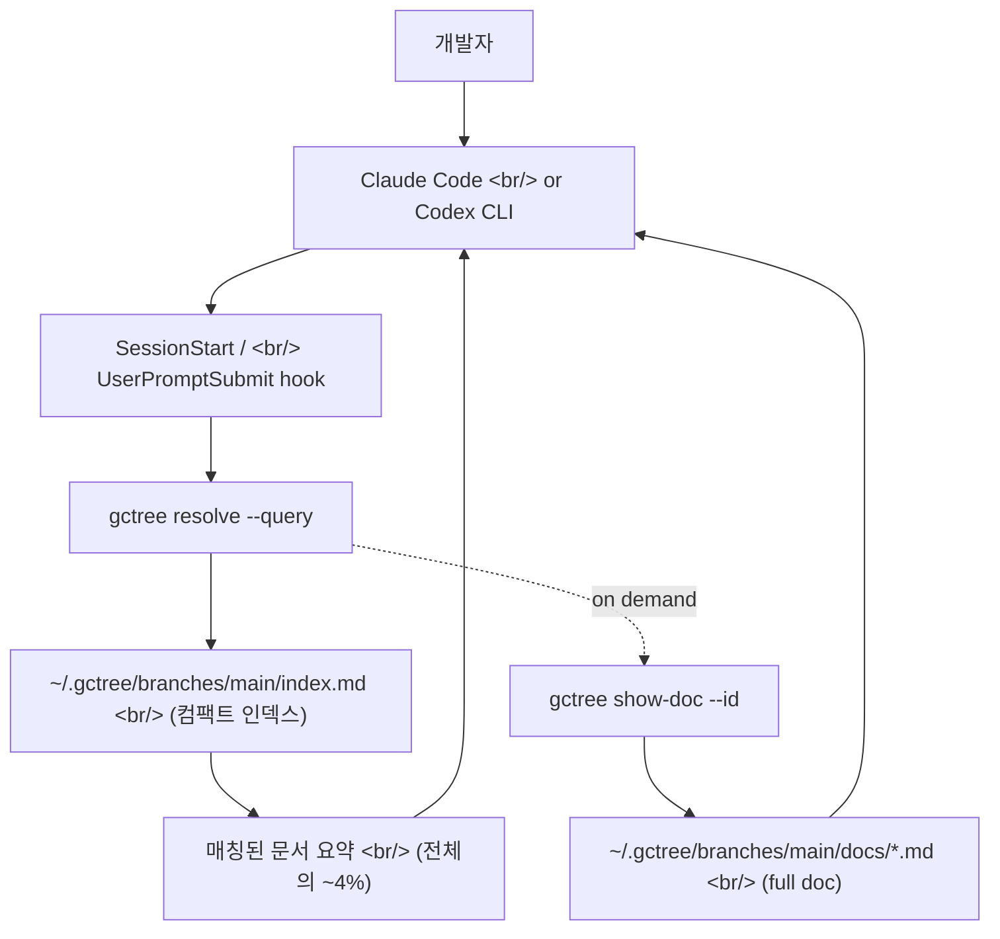

## 개요

[`@handsupmin/gc-tree`](https://www.npmjs.com/package/@handsupmin/gc-tree)는 [Claude Code](https://www.anthropic.com/claude-code)와 [OpenAI Codex CLI](https://github.com/openai/codex) 같은 AI 코딩 도구를 위해 **레포 위 레이어**(above-the-repo)에 글로벌 컨텍스트를 저장하는 [Node.js 20+](https://nodejs.org) CLI다. 이름의 "gc"는 garbage collection이 아니라 **Global Context**, "tree"는 [Git branch](https://git-scm.com/book/en/v2/Git-Branching-Branches-in-a-Nutshell)처럼 컨텍스트 레인을 분기·전환한다는 의미다. [CLAUDE.md](https://docs.claude.com/en/docs/claude-code/memory)와 [AGENTS.md](https://agents.md/)가 한 레포 안에서 잘 작동한다면, [gc-tree](https://github.com/handsupmin/gc-tree)는 **여러 레포·여러 워크스트림을 가로지를 때** 매 세션마다 반복 설명을 하지 않도록 만드는 도구다.

<!--more-->



## 1. 무엇이 문제인가

AI는 당신을 모른다. 어떻게 일하는지, 팀이 어떤 용어를 쓰는지, 어느 레포가 어느 레포와 묶이는지, 어떤 루틴을 무의식적으로 반복하는지. 그래서 매 세션마다 같은 짓을 한다 — 자기소개 다시, 도메인 언어 다시, 아키텍처 문서 다시 붙여넣기.

[CLAUDE.md](https://docs.claude.com/en/docs/claude-code/memory)와 [AGENTS.md](https://agents.md/)는 한 레포 안에서는 훌륭하다. 문제는 **레포 경계를 넘는 순간** 시작된다 — [monorepo](https://monorepo.tools/) 가 아닌 환경에서 backend/frontend/platform 레포가 따로 있을 때, 공통 백그라운드는 어디에 두는가? 매번 양쪽에 중복 복사할 것인가? gc-tree는 이 반복을 제거하기 위해 만들어졌다.

## 2. 작동 모델 — Git 브랜치처럼

gc-tree의 멘탈 모델은 단순하다. **Git 브랜치 = 코드 레인**이라면 **gc-branch = 컨텍스트 레인**이다.

```bash
gctree checkout -b project-b
gctree onboard
```

이 한 줄로 `project-b`라는 독립 컨텍스트가 생긴다. 다른 워크스트림으로 옮길 때 `gctree checkout main`으로 돌아오면 그쪽 컨텍스트가 통째로 활성화된다. 같은 [Git branching](https://git-scm.com/book/en/v2/Git-Branching-Basic-Branching-and-Merging) 멘탈 모델을 그대로 빌려왔기 때문에 새 개념을 배울 게 거의 없다.

저장 구조도 직관적이다.

```
~/.gctree/
  branches/
    main/
      index.md          ← 가장 먼저 로드되는 컴팩트 인덱스
      docs/
        auth.md         ← 필요할 때만 읽히는 full doc
        architecture.md
    project-b/
      index.md
      docs/
        ...
  branch-repo-map.json  ← 어떤 레포가 어떤 gc-branch에 속하는지
  settings.json
```

레포 바깥에 있으니 [`.gitignore`](https://git-scm.com/docs/gitignore) 규칙도 필요 없고, 실수로 커밋될 일도 없다. 같은 gc-branch를 쓰는 모든 프로젝트가 같은 컨텍스트를 공유한다.

## 3. Progressive disclosure — 토큰 윈도우 ~4%만 주입

gc-tree의 핵심 성능 주장은 [`gctree resolve`](https://github.com/handsupmin/gc-tree/blob/main/docs/usage.md)가 **progressive disclosure**로 동작한다는 것이다.

- `gctree resolve --query "..."` → 안정적인 ID와 함께 컴팩트 매치만 반환
- `gctree related --id <match-id>` → 그 매치 주변 보조 문서
- `gctree show-doc --id <match-id>` → 해당 문서의 full markdown

```bash
gctree resolve --query "auth token rotation policy"
```

```
[gc-tree] 1 matching doc  gc-branch="main"  repo="my-repo"
[Auth & Session Conventions] JWT rotation on every request, refresh tokens in httpOnly cookies, 15-min access token TTL
[Auth & Session Conventions] show full doc: gctree show-doc --id "auth" --branch "main"
```

핵심 수치 — **쿼리당 전체 컨텍스트의 ~4%만 주입된다.** 나머지 96%는 디스크에 남아 토큰 윈도우 바깥에 있다. 이는 [Anthropic의 long-context best practices](https://docs.claude.com/en/docs/build-with-claude/prompt-engineering/long-context-tips)가 권고하는 "필요할 때만, 관련된 것만"과 정확히 일치한다.

또한 매칭이 없거나 레포가 스코프에서 제외됐을 때 모호하게 실패하지 않고 **명시적 상태**를 돌려준다는 점도 중요하다. AI 도구가 "컨텍스트가 없다"와 "컨텍스트를 찾지 못했다"를 구분할 수 있어야 잘못된 추측을 안 한다.

## 4. Hook 통합 — SessionStart / UserPromptSubmit

[`gctree init`](https://github.com/handsupmin/gc-tree)이 하는 일은 단순한 파일 스캐폴딩이 아니다. Claude Code의 [SessionStart hook](https://docs.claude.com/en/docs/claude-code/hooks)과 [UserPromptSubmit hook](https://docs.claude.com/en/docs/claude-code/hooks)에 gc-tree를 물려 **세션 시작 전 자동 체크**를 거는 것이 진짜 가치다.

- SessionStart → 세션 시작 시 gc-tree가 활성 브랜치를 확인
- UserPromptSubmit → 사용자 프롬프트 직전에 `resolve --query`로 관련 문서 검색
- 빈 결과 / no-match는 세션 동안 캐시 → 매번 디스크 읽지 않음
- 매치된 요약은 컨텍스트에 직접 주입 → AI가 제목만이 아니라 **실제 패턴과 명령어**를 본다

Codex 쪽도 동일하다. [Codex의 skill 시스템](https://github.com/openai/codex)에 `$gc-resolve-context`, `$gc-onboard`, `$gc-update-global-context`가 설치되고 `codex exec`에서 동일하게 동작한다.

```bash
gctree scaffold --host claude-code   # CLAUDE.md 스니펫 + /gc-onboard 등
gctree scaffold --host codex         # AGENTS.md 스니펫 + $gc-onboard 등
gctree scaffold --host both          # 양쪽 동시
```

두 provider가 **같은 컨텍스트 저장소**(`~/.gctree`)를 공유한다는 점이 핵심이다. 온보딩 한 번이면 양쪽 도구에서 같이 쓴다.

## 5. 검증된 성능 — DEV/HOLDOUT 분리

대부분의 OSS 도구가 "잘 작동한다"고만 말하는 반면 gc-tree는 [tests/eval/RUBRIC.md](https://github.com/handsupmin/gc-tree/blob/main/tests/eval/RUBRIC.md) 기반의 정량 평가를 공개한다.

| Metric | DEV | HOLDOUT |
|---|---|---|
| recall@1 | **100.0%** | **85.7%** |
| recall@3 | **100.0%** | **92.9%** |
| MRR | **100.0%** | **89.3%** |
| Negative precision (irrelevant → empty) | **100.0%** | **100.0%** |
| Tokens injected per query vs. total | **~7%** | **~13%** |

이 표가 인상적인 이유는 **HOLDOUT 픽스처를 튜닝 루프에서 격리**했다는 점이다. autoresearch 루프는 DEV에만 적합하고, HOLDOUT은 정직한 리포팅용으로만 쓴다. Generalization gap = 10.0 pts. 8개 카테고리(exact-keyword, paraphrase, glossary, mixed-language, same-domain distractor, same-domain negative, cross-branch negative)에 38개 라벨 케이스. [recall@k](https://en.wikipedia.org/wiki/Evaluation_measures_(information_retrieval))와 [MRR](https://en.wikipedia.org/wiki/Mean_reciprocal_rank)을 함께 본다는 건 정보 검색 평가의 정석을 따른다는 뜻이다.

`npm run eval:ranked`로 재현 가능. **이 정도 evaluation 디시플린을 갖춘 개인 OSS 도구는 흔치 않다.**

## 6. CLAUDE.md / AGENTS.md와의 비교

| 항목 | CLAUDE.md / AGENTS.md | gc-tree |
|---|---|---|
| 스코프 | 레포 1개 | 다중 레포, 단일 컨텍스트 |
| 영속성 | 레포별 파일 | 레포 바깥, 세션 간 재사용 |
| 컨텍스트 전환 | 수동 파일 편집 | `gctree checkout project-b` |
| 관련성 필터링 | 전부 또는 전무 | 매칭 문서만 주입 (~4%) |
| 온보딩 | 수기 작성 | AI 도구가 가이드 |
| Codex 호환 | 가능 | 가능 |
| Claude Code 호환 | 가능 | 가능 |

이 표의 가장 흥미로운 행은 **관련성 필터링**이다. CLAUDE.md는 본질적으로 **all-or-nothing** 파일이다 — 세션에 들어오거나 들어오지 않거나. 반면 gc-tree는 **쿼리 기반 부분 주입**이다. 컨텍스트가 커질수록 이 차이가 결정적이 된다.

## 7. 흔한 사용 패턴

**레포 스코프 분리:**

```bash
gctree set-repo-scope --branch project-b --include   # 현재 레포 포함
gctree set-repo-scope --branch project-b --exclude   # 현재 레포 제외
```

이게 필요한 이유 — 같은 머신에서 `monorepo-a`와 `legacy-b`를 같이 만지는데 `project-b` 컨텍스트가 `legacy-b`에 새도록 두면 AI가 엉뚱한 컨벤션을 따른다. `set-repo-scope`가 그걸 명시적으로 막는다.

**컨텍스트 업데이트:**

```bash
gctree update-global-context   # 별칭: gctree update-gc / gctree ugc
```

AI 도구가 "뭐가 바뀌었어?"를 묻고 답을 받아 gc-branch에 다시 쓴다. CLAUDE.md를 수기로 편집하는 워크플로가 가이드된 업데이트로 바뀐다.

**gc-tree 자체 업데이트:**

```bash
gctree update
```

[npm](https://www.npmjs.com/)에서 최신 버전을 가져온 뒤, 이전에 설치한 모든 provider를 자동 재스캐폴딩한다. 사용자가 hook 통합 코드를 수동으로 옮길 필요가 없다.

## 8. 작은 도구가 채우는 큰 틈

[madge](https://github.com/pahen/madge)가 JS 모듈 의존성을 시각화하고, [depcheck](https://github.com/depcheck/depcheck)이 미사용 deps를 찾고, [git의 reflog/gc](https://git-scm.com/docs/git-gc)가 도달 불가능 객체를 정리하듯 — **이름은 비슷해 보여도 gc-tree는 완전히 다른 결의 도구**다. AI 코딩 워크플로에서 매번 반복되던 마찰점을 정확히 한 군데 — **레포 위, 세션 위, 도구 위** — 의 레이어로 분리해 해결한다.

[Anthropic이 SessionStart hook과 skill 시스템](https://docs.claude.com/en/docs/claude-code/hooks)을 열어둔 덕분에, 그리고 [OpenAI Codex CLI](https://github.com/openai/codex)도 같은 결의 확장점을 제공한 덕분에 이런 "외부에서 컨텍스트를 주입하는" 도구가 만들어질 수 있다. CLAUDE.md가 vim의 `.vimrc`라면, gc-tree는 [`stow`](https://www.gnu.org/software/stow/)나 [`chezmoi`](https://www.chezmoi.io/)가 dotfile에 한 일을 컨텍스트에 한다.

## 인사이트

gc-tree가 흥미로운 건 기능 자체보다 **AI 코딩 도구의 컨텍스트 계층이 어떤 모양으로 진화하는가**를 보여주기 때문이다. 첫 단계는 **레포 내부 마크다운**(CLAUDE.md, AGENTS.md)이었다. 그 다음은 **레포 위 글로벌 컨텍스트**(gc-tree)다. 그 다음은 아마 **팀 공유 컨텍스트**, **버저닝된 컨텍스트**, **컨텍스트 머지/리베이스** 같은 [Git이 코드에 한 일](https://git-scm.com/book/en/v2)을 컨텍스트에 그대로 가져오는 단계일 가능성이 높다 — gc-tree의 작명이 이미 그 방향을 가리킨다. 또 하나 주목할 건 평가 디시플린이다. **DEV/HOLDOUT 분리**, recall@k + MRR + negative precision, mixed-script 쿼리까지 커버하는 픽스처를 갖춘 개인 OSS 도구는 드물고, 이는 컨텍스트 검색을 진지하게 정보 검색 문제로 다룬다는 뜻이다. 한국 개발자 입장에서 즉시 시도해볼 만한 건 `npm install -g @handsupmin/gc-tree && gctree init`으로 시작해서, 평소 자주 반복 설명하던 도메인 용어 한 다발을 `gctree onboard`로 한 번 넣어 두고, 세션 시작 시 AI 도구가 그 컨텍스트를 자동으로 끌어가는지 확인하는 길이다. 매 세션 첫 3~5분의 반복 설명이 사라지는 것만으로도 ROI가 명확하다.

## 참고

**Source**
- [handsupmin/gc-tree (GitHub)](https://github.com/handsupmin/gc-tree)
- [@handsupmin/gc-tree (npm)](https://www.npmjs.com/package/@handsupmin/gc-tree)
- [README.ko.md (한국어)](https://github.com/handsupmin/gc-tree/blob/main/README.ko.md)

**Docs**
- [Concept](https://github.com/handsupmin/gc-tree/blob/main/docs/concept.md)
- [Principles](https://github.com/handsupmin/gc-tree/blob/main/docs/principles.md)
- [Usage](https://github.com/handsupmin/gc-tree/blob/main/docs/usage.md)
- [Evaluation rubric](https://github.com/handsupmin/gc-tree/blob/main/tests/eval/RUBRIC.md)

**호스트 AI 도구**
- [Claude Code](https://www.anthropic.com/claude-code) — [memory / CLAUDE.md docs](https://docs.claude.com/en/docs/claude-code/memory), [hooks](https://docs.claude.com/en/docs/claude-code/hooks)
- [OpenAI Codex CLI](https://github.com/openai/codex)
- [AGENTS.md spec](https://agents.md/)

**비교/배경**
- [madge — JS 모듈 의존성 시각화](https://github.com/pahen/madge)
- [depcheck](https://github.com/depcheck/depcheck)
- [git gc 공식 문서](https://git-scm.com/docs/git-gc)
- [chezmoi](https://www.chezmoi.io/) / [GNU Stow](https://www.gnu.org/software/stow/) — dotfile 매니지먼트 비유
