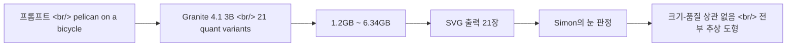

## 개요

[Simon Willison](https://simonwillison.net/)이 [IBM Granite 4.1 3B](https://huggingface.co/ibm-granite/granite-4.1-3b-instruct) 양자화 21종(1.2GB ~ 6.34GB, 합계 51.3GB)에 자기 시그니처 프롬프트인 "Generate an SVG of a pelican riding a bicycle"를 던졌다. 결론은 한 줄: *"There's no distinguishable pattern relating quality to size — they're all pretty terrible!"*. 이번 글은 그 갤러리를 출발점으로, 비공식 벤치마크가 공식 점수판이 못 잡는 무엇을 잡아내는지, 그리고 양자화-품질 곡선을 측정하려면 어디서부터 봐야 하는지를 정리한다.

<!--more-->

## "SVG 펠리컨" 이 뭐길래

[Simon Willison의 pelican-riding-a-bicycle 시리즈](https://simonwillison.net/tags/pelican-riding-a-bicycle/)는 새 LLM이 나올 때마다 그가 고정으로 돌리는 비공식 평가다. 프롬프트는 단 한 줄.

> "Generate an SVG of a pelican riding a bicycle."

SVG는 텍스트 모델이 좌표·path·viewBox를 직접 출력해야 하는 양식이라 시각적 사고를 강제한다. 더 중요한 건 결과가 **즉시 그림으로 렌더링** 되어 모델 간 비교가 직관적이라는 점이다. [LMArena](https://lmarena.ai/) 의 익명 페어 비교나 [MMLU](https://paperswithcode.com/dataset/mmlu) 의 객관식 점수에는 잡히지 않는 실패 모드 — 비례, 선의 연속성, 부품 배치 — 가 한 장의 SVG에서 드러난다.

## 이번 실험

| 항목 | 내용 |
|---|---|
| 대상 | [IBM Granite 4.1 3B Instruct](https://huggingface.co/ibm-granite/granite-4.1-3b-instruct) |
| 변형 | 양자화 21종 (1.2GB ~ 6.34GB, 합 51.3GB) |
| 프롬프트 | "Generate an SVG of a pelican riding a bicycle" |
| 출력 | SVG 21장, 한 페이지 갤러리 |
| 판정자 | Simon Willison 본인 (눈) |

[원본 갤러리 글](https://simonwillison.net/2026/May/4/granite-41-3b-svg-pelican-gallery)에 21장이 그대로 펼쳐져 있다.

## 결과 — Simon의 평가

> *"There's no distinguishable pattern relating quality to size — they're all pretty terrible!"*

- **모델 크기와 품질 사이에 구별 가능한 패턴이 없다.** 1.2GB와 6.34GB가 사실상 같은 줄에 선다.
- 21장 모두 추상 도형 덩어리. 펠리컨도, 자전거도 명확히 식별되지 않는다.
- 흥미롭게도 **가장 작은 모델이 자전거를 가장 잘** 표현했고, 가장 큰 모델이 펠리컨에 가까운 형태를 그렸다 — 크기-품질 관계가 단조 증가가 아닐 수 있다는 작은 단서.
- Simon 본인은 "기대보다 덜 흥미롭다", "더 잘 그리는 모델로 다시 해보겠다"고 마무리.

## 의미 — 무엇을 측정한 것인가

### 1. 양자화 곡선은 본판 capability ceiling에 막힌다

5배 메모리 차이(1.2GB → 6.34GB)에도 출력 품질에 의미 있는 차이가 없었다. 그러나 결론은 **"양자화가 무해하다"** 가 아니다. **"이 모델 자체가 SVG 펠리컨에서 약하다"** 가 더 정확한 해석이다.

양자화 영향을 깔끔하게 측정하려면 본판이 그 과제에서 충분히 강해야 한다. 본판이 이미 floor 근처면 [AutoRound](https://github.com/intel/auto-round)·GGUF·AWQ 어떤 방식으로 누르든 변별이 안 나온다. 즉 양자화 벤치를 설계할 때는 **모델의 capability ceiling을 먼저 확인** 해야 한다는 교훈.

### 2. 비공식 벤치마크가 공식 점수판을 보완한다

[LMArena](https://lmarena.ai/) 의 페어 비교나 [MMLU](https://paperswithcode.com/dataset/mmlu) 같은 표준 벤치는 텍스트 토큰의 정답률·선호도를 잡는다. 하지만 "이 모델이 좌표 평면에 부품을 배치할 줄 아는가" 같은 질문은 잘 안 잡힌다. SVG 펠리컨은 그 갭에 정확히 들어간다 — **공식 벤치엔 없지만 모두가 동의하는 빠른 sanity check**.

### 3. Granite 패밀리에 대한 시사

[IBM Granite](https://www.ibm.com/granite) / [watsonx Granite 라인업](https://www.ibm.com/products/watsonx-ai/foundation-models)은 엔터프라이즈 RAG·도구 호출·코드 작업을 타깃으로 잡혀 있다. 그 좌표계에서 보면 SVG 펠리컨은 분포 밖 과제라 약한 게 어쩌면 당연하다. 다만 같은 시기 풀린 [Google Gemma + LiteRT MTP](https://developers.googleblog.com/) 같은 모바일 친화 small model 흐름과 나란히 두면, **3B 클래스 small open model의 실용성은 모델 패밀리/제조사가 어디에 capability를 몰아넣었는지에 따라 크게 갈린다.**

## 인사이트

비공식 벤치마크가 살아남는 이유는 점수판이 못 잡는 결함을 한 장의 그림으로 보여주기 때문이다. SVG 펠리컨은 [MMLU](https://paperswithcode.com/dataset/mmlu)·[LMArena](https://lmarena.ai/) 의 보완재이지 대체재가 아니다 — 둘이 같이 있어야 모델의 강점·약점이 드러난다. 양자화-품질 곡선은 본판 capability에 강하게 의존하므로, 양자화 벤치를 설계할 때는 본판이 그 과제에서 충분히 위에 있는지를 먼저 본다. [AutoRound](https://github.com/intel/auto-round) 같은 방식으로 압축률을 더 짜내도 floor 근처 모델에서는 변별이 안 난다. 21장 갤러리에서 가장 작은 모델이 자전거를 가장 잘 그렸다는 디테일은 단조 관계 가정 자체를 의심하게 만든다 — 양자화 비교는 단일 점수가 아니라 분포로 봐야 한다는 뜻. [IBM Granite](https://www.ibm.com/granite)가 엔터프라이즈 좌표계를 정조준하는 동안 시각적 추론 같은 분포 밖 과제가 약한 건 당연한 결과이고, 그래서 small open model을 고를 때는 "어느 패밀리가 어디에 capability를 몰아넣었나"를 봐야 한다. Simon 같은 외부 관찰자가 21종을 한 페이지에 깔아주는 건 결국 모두를 위한 빠른 모델 카드 역할 — 공식 벤치 결과가 풀리기 전에 한 장으로 감을 잡게 해준다.

## 참고

**Original gallery post**
- [Simon Willison: Granite 4.1 3B SVG Pelican Gallery (2026-05-04)](https://simonwillison.net/2026/May/4/granite-41-3b-svg-pelican-gallery)
- [pelican-riding-a-bicycle 시리즈 태그](https://simonwillison.net/tags/pelican-riding-a-bicycle/)
- [Simon Willison's Weblog](https://simonwillison.net/)

**IBM Granite**
- [IBM Granite 4.1 3B Instruct (Hugging Face)](https://huggingface.co/ibm-granite/granite-4.1-3b-instruct)
- [IBM Granite 공식 페이지](https://www.ibm.com/granite)
- [watsonx 파운데이션 모델 라인업](https://www.ibm.com/products/watsonx-ai/foundation-models)

**Related benchmark refs**
- [LMArena (페어 비교 리더보드)](https://lmarena.ai/)
- [MMLU (Papers with Code)](https://paperswithcode.com/dataset/mmlu)
- [Intel AutoRound (양자화 라이브러리)](https://github.com/intel/auto-round)
