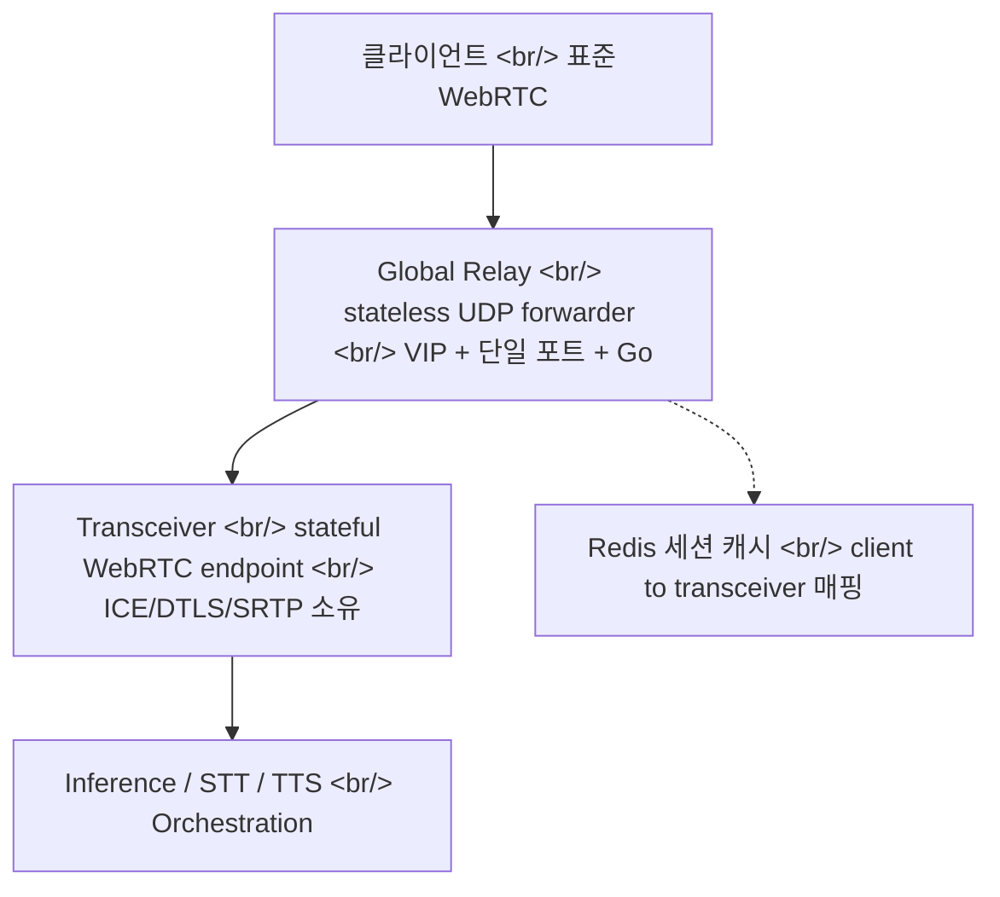
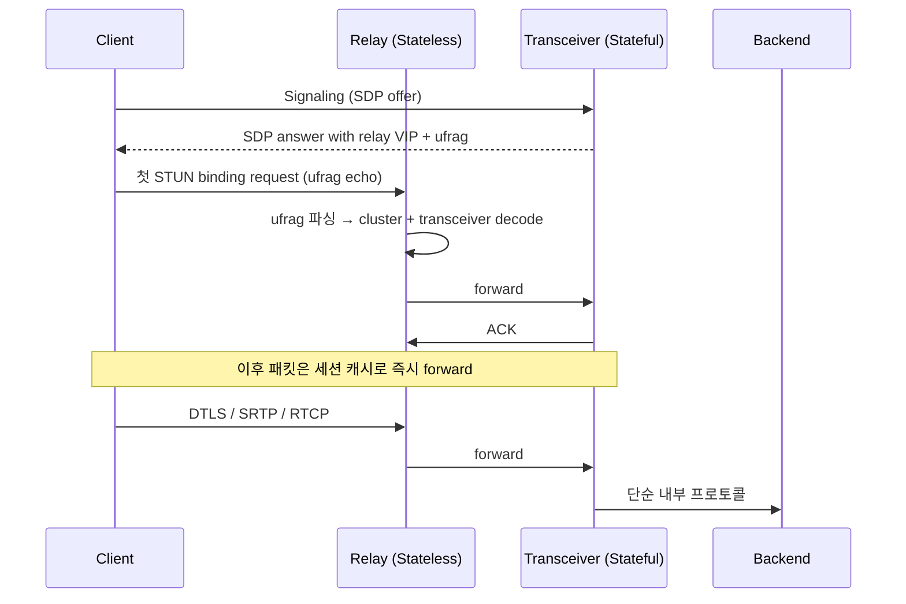

## 개요

OpenAI Engineering이 [Delivering Low-Latency Voice AI at Scale](https://openai.com/index/delivering-low-latency-voice-ai-at-scale/)에서 Realtime 음성 모델 뒤에 깔린 네트워크 인프라를 공개했다. 핵심은 [WebRTC](https://webrtc.org/) 트래픽을 Kubernetes 위에서 돌리기 위해 stateless **Global Relay**와 stateful **Transceiver**를 분리하고, [ICE](https://webrtc.org/getting-started/peer-connections) ufrag에 라우팅 메타데이터를 인코딩해 핫 패스 lookup을 지운 디자인이다. 같은 시기에 발표된 MRC, Realtime API 와 합쳐 보면 OpenAI 인프라 스택의 윤곽이 또렷해진다.

<!--more-->

## 왜 WebRTC인가

[WebRTC](https://webrtc.org/)는 브라우저·모바일·서버 사이의 저지연 오디오·비디오·데이터 전송 표준이다. NAT 통과를 위한 ICE, 암호화를 위한 DTLS와 SRTP, 코덱 협상, RTCP 품질 제어, 에코 캔슬, 지터 버퍼처럼 까다로운 부분을 모두 표준으로 묶어둔 게 가치다 (관련 RFC 묶음은 [webrtc.org standards](https://webrtc.org/getting-started/overview)에서 인덱싱된다).

음성 AI에 결정적인 속성은 **오디오가 연속 스트림으로 들어온다**는 점이다. 사용자가 말하는 동안 모델은 transcribe, reason, tool call, 음성 생성을 동시에 시작할 수 있다. 푸시-투-토크가 아니라 진짜 대화가 되는 이유다.

또 하나 눈여겨볼 점: WebRTC 표준을 만든 [Justin Uberti](https://en.wikipedia.org/wiki/Justin_Uberti)와 Pion 메인테이너 [Sean DuBois](https://github.com/Sean-Der), 그리고 Discord에서 음성 인프라를 깐 인력들 ([discord.com 엔지니어링 블로그](https://discord.com/category/engineering)) 까지 OpenAI에 모였다. 단순 인재 영입을 넘어 인프라 트랙의 방향을 통째로 결정하는 acquihire 신호다. 이 흐름의 중심에 Go로 작성된 [Pion WebRTC](https://github.com/pion/webrtc) (16k+ stars) 가 있다.

## 미디어 아키텍처 선택 — SFU vs Transceiver

회의·교실·다자간 콜이 메인이라면 SFU(Selective Forwarding Unit)를 쓴다. 참여자마다 별도의 WebRTC 연결을 유지하고 AI는 또 한 명의 참여자처럼 끼는 구조다. 다자간 패턴에서 효율적이라 [LiveKit](https://docs.livekit.io/home/self-hosting/kubernetes/), [mediasoup](https://mediasoup.discourse.group/), [l7mp/stunner](https://github.com/l7mp/stunner) 같은 Kubernetes WebRTC 게이트웨이가 모두 SFU 패턴을 가정한다.

OpenAI 워크로드는 압도적으로 1:1이다. 사용자 한 명과 모델 한 명, 또는 앱 하나와 에이전트 하나. 이 경우엔 **Transceiver model**이 더 깔끔하다. 엣지 서비스가 클라이언트 WebRTC 세션을 종단하고, 미디어와 이벤트를 더 단순한 내부 프로토콜로 바꿔서 추론·STT·TTS·tool use·오케스트레이션 백엔드로 넘긴다. **백엔드는 일반 서비스처럼 스케일**한다. WebRTC peer 행세를 할 필요가 없다.

## 핵심 문제 — WebRTC와 Kubernetes의 충돌

전통적 WebRTC는 **세션당 UDP 포트 하나**를 잡는다. 동시 수만 세션이면 수만 개 공개 UDP 포트가 노출돼야 한다는 뜻이다. Kubernetes 위에선 이게 망가진다.

- 클라우드 LB와 k8s Service는 한 서비스에 수만 UDP 포트를 다는 운영을 가정하지 않는다
- 큰 UDP 포트 범위는 외부 노출 표면이 넓어지고 정책 감사가 어렵다
- pod 추가·삭제·재스케줄될 때마다 포트 범위를 reserve, advertise 해야 해서 오토스케일링과 충돌한다

대안은 **서버당 단일 UDP 포트** + 애플리케이션 레이어 demux. 그런데 두 번째 문제가 따라온다. ICE/DTLS는 stateful이라 세션을 만든 프로세스가 그 세션의 패킷을 끝까지 받아야 한다. 같은 세션 패킷이 다른 프로세스로 가면 setup이 깨지거나 미디어가 망가진다.

목표가 분명해진다: **작고 고정된 공개 UDP surface** + 모든 패킷이 정확한 owning transceiver로 라우팅되도록.

## 해법 — Relay와 Transceiver 분리

- **Relay**는 미디어를 복호화하지 않는다. ICE state machine을 돌리지 않고, 코덱 협상도 하지 않는다. 패킷 메타데이터만 읽어 forward만 한다.
- **Transceiver**는 평소대로 WebRTC 흐름을 처리한다. ICE, DTLS, SRTP, 세션 lifecycle 전부 소유한다.
- **클라이언트 입장에선 변화가 없다.** 표준 WebRTC만 쓴다. 브라우저·모바일 호환성은 그대로다.

## 핵심 트릭 — ICE ufrag 라우팅

첫 패킷이 도착했을 때 그 세션을 누가 소유하는지 어떻게 알지? 외부 lookup 서비스에 의존하면 핫 패스에 latency가 박힌다.

해법: **ICE username fragment(ufrag)** 에 라우팅 힌트를 인코딩한다.

- Signaling 단계에서 transceiver가 세션 state를 할당하고, SDP answer에 shared relay VIP + UDP port + 서버 측 ufrag를 함께 반환한다
- 첫 미디어 패킷인 STUN binding request에 그 ufrag가 echo된다
- Relay는 첫 STUN 패킷의 ufrag만 파싱해 목적 cluster와 owning transceiver를 디코드 후 forward
- 이후의 DTLS·RTP·RTCP 패킷은 세션 캐시를 통해 곧장 forward (ufrag 재파싱 없음)
- Relay가 재시작되더라도 다음 STUN 패킷이 다시 ufrag를 보고 세션을 재구축. 추가 안전장치로 `<client IP+port, transceiver IP+port>` 매핑을 Redis에 캐시

**프로토콜 native field에 라우팅 메타데이터를 인코딩한다** — 이 한 문장이 디자인의 중심이다. [Cloudflare Calls의 anycast WebRTC 모델](https://blog.cloudflare.com/cloudflare-calls/)이 비슷한 결의 idea를 다른 레이어에서 풀어낸 케이스로 비교할 만하다.

## Global Relay — 지오 분산 ingress

작고 고정된 UDP surface를 확보한 다음엔 globally 배치한다.

- [Cloudflare 지오·proximity steering](https://developers.cloudflare.com/load-balancing/understand-basics/traffic-steering/steering-policies/proximity-steering/)으로 signaling을 가장 가까운 transceiver cluster로 보낸다
- SDP answer에는 가까운 Global Relay 주소를 광고한다
- ufrag에 cluster 라우팅 정보가 들어 있어 미디어도 가까운 relay로 진입한다

첫 client→OpenAI hop이 짧아진다. 결과는 더 낮은 latency, 더 적은 jitter, 더 적은 loss bursts. 음성 AI에선 모두 그대로 사용자 체감에 박힌다.

## Relay 구현 — Go, kernel-bypass 없이

OpenAI는 의도적으로 **userspace Go**를 골랐다. DPDK 같은 kernel-bypass 프레임워크는 쓰지 않는다. 사용자 트래픽이 작은 relay footprint로 충분히 커버됐기 때문이다.

핵심 Go 트릭:

- **[`SO_REUSEPORT`](https://man7.org/linux/man-pages/man7/socket.7.html)** — 한 머신의 여러 worker가 같은 UDP 포트에 bind한다. 커널이 패킷을 worker들에게 분산해 단일 read-loop 병목을 없앤다
- **[`runtime.LockOSThread`](https://pkg.go.dev/runtime#LockOSThread)** — UDP 읽기 goroutine을 OS thread에 핀한다. SO_REUSEPORT와 결합하면 같은 flow의 패킷이 같은 CPU core로 가서 cache locality가 올라가고 context switching이 줄어든다
- **Pre-allocated buffers + minimal copying** — Go GC를 회피한다
- **Ephemeral state** — client→transceiver 매핑은 small in-memory map만, 짧은 timeout으로 운영

## 결과

- 수만 UDP 포트 노출 없이 Kubernetes에서 WebRTC 미디어를 운영
- 작고 고정된 UDP surface는 보안 표면을 줄이고 LB를 단순화하며, 큰 공개 포트 범위 reserve도 필요 없게 한다
- "SFU-less 디자인이 OpenAI 워크로드에 맞다"가 운영으로 검증됨 — 1:1, latency-sensitive, 추론 서비스가 WebRTC peer 행세할 필요 없음

## 저자가 강조한 4가지 디자인 원칙

1. **표준 프로토콜 의미를 엣지에서 보존** — 클라이언트는 표준 WebRTC만, 브라우저·모바일 호환성 유지
2. **Hard session state는 한 곳에** — Transceiver가 ICE/DTLS/SRTP/lifecycle 모두 소유, Relay는 forward만
3. **이미 setup에 있는 정보로 라우팅** — ufrag가 첫-패킷 라우팅 훅을 제공, 핫 패스 lookup 의존성 zero
4. **Common case를 먼저 최적화. kernel-bypass에 손대지 마라** — 좁은 Go 구현 + SO_REUSEPORT + thread pinning + low-alloc 파싱이면 충분

## 인사이트

진짜 보틀넥이 어디인지를 보여주는 사례다. 모델 자체보다 **모델로 가는 경로**가 더 어렵다. WebRTC를 production-grade로 Kubernetes에서 굴리는 패턴은 음성 AI를 진지하게 만드는 모든 회사가 풀어야 하는 문제이고, 이 글은 그중 하나의 답안지다. 동시에 Justin Uberti와 Sean DuBois가 OpenAI 합류라는 사실은 인재 영입 이상의 의미를 가진다 — Pion 기반 Go 스택이 OpenAI 음성 인프라의 근간이 된다는 신호이고, 결과적으로 [Pion 생태계 전체](https://github.com/pion/webrtc) 의 무게중심이 이동한다. 같은 시기에 발표된 [MRC](https://openai.com/index/mrc-supercomputer-networking) (GPU 네트워크) 와 [Realtime API](https://platform.openai.com/audio/realtime) 와 묶어 보면 OpenAI 인프라 스택의 그림이 더 선명해진다 — **MRC (GPU 네트워크) + Relay+Transceiver (사용자 네트워크) + Realtime API (모델 인터페이스)** 세 레이어가 동시에 자기 표준을 박는 중이다. SFU가 정답인 다자간 워크로드와 달리 1:1 추론에는 transceiver 모델이 답이라는 점은, 같은 음성 인프라라도 워크로드 형태에 따라 디자인이 갈라진다는 사실의 방증이다. 마지막으로 kernel-bypass를 의도적으로 안 쓴 선택은 "common case를 먼저 최적화하라"는 원칙의 모범 사례 — 이미 충분한 곳에 더 손대지 않는 절제는 인프라 팀의 신호다.

## 참고

**Original post**

- [Delivering Low-Latency Voice AI at Scale (OpenAI Engineering)](https://openai.com/index/delivering-low-latency-voice-ai-at-scale/)
- 같은 시기 OpenAI 발표: [MRC supercomputer networking](https://openai.com/index/mrc-supercomputer-networking) · [Advancing voice intelligence](https://openai.com/index/advancing-voice-intelligence-with-new-models-in-the-api) · [Stargate / Compute infrastructure](https://openai.com/index/building-the-compute-infrastructure-for-the-intelligence-age/)

**WebRTC ecosystem and Pion**

- [WebRTC standards (webrtc.org)](https://webrtc.org/) · [Getting started overview](https://webrtc.org/getting-started/overview)
- [Pion WebRTC (Go implementation)](https://github.com/pion/webrtc) — Pure Go WebRTC, 16k+ stars
- [Justin Uberti](https://en.wikipedia.org/wiki/Justin_Uberti) (WebRTC 표준 원조) · [Sean DuBois (Pion 메인테이너)](https://github.com/Sean-Der)
- [Discord engineering blog](https://discord.com/category/engineering) — 음성 인프라 레퍼런스
- [Cloudflare Calls — anycast WebRTC](https://blog.cloudflare.com/cloudflare-calls/)
- [NVIDIA GB200](https://www.nvidia.com/en-us/data-center/gb200-nvl72/) · [Microsoft Fairwater](https://news.microsoft.com/source/features/ai/microsoft-fairwater-data-center/) · [Open Compute Project](https://www.opencompute.org/)

**Kubernetes WebRTC patterns**

- [l7mp/stunner — Kubernetes WebRTC gateway](https://github.com/l7mp/stunner)
- [LiveKit — Self-hosting on Kubernetes](https://docs.livekit.io/home/self-hosting/kubernetes/)
- [mediasoup discussion forum](https://mediasoup.discourse.group/)
- [Cloudflare proximity steering](https://developers.cloudflare.com/load-balancing/understand-basics/traffic-steering/steering-policies/proximity-steering/)

**Linux/Go optimization references**

- [Linux `socket(7)` — SO_REUSEPORT](https://man7.org/linux/man-pages/man7/socket.7.html)
- [Go `runtime.LockOSThread`](https://pkg.go.dev/runtime#LockOSThread)
