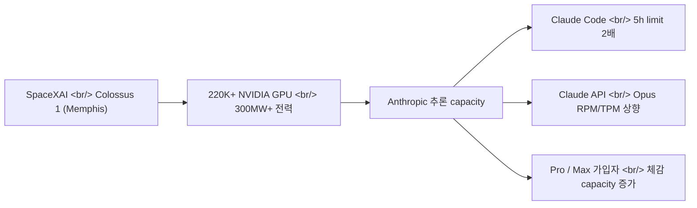
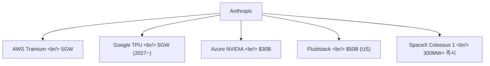
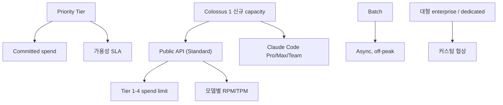

## 개요

2026년 5월 6일, [Anthropic](https://www.anthropic.com/)이 두 가지 발표를 한 묶음으로 내놨다. (1) [Claude Code](https://claude.com/product/claude-code)와 [Claude API](https://claude.com/platform/api)의 사용 한도 인상, (2) [SpaceX](https://www.spacex.com/)와의 컴퓨트 파트너십. 두 번째가 첫 번째의 원인이다. 헤드라인은 "한도 인상"이지만 실제 뉴스는 **Anthropic이 경쟁사 [xAI](https://x.ai/)가 운영하던 Colossus 1 슈퍼컴퓨터 전량을 통째로 임대했다**는 사실이다.

<!--more-->

## 발표 내용 — 한도 변경 3건

[공식 글](https://www.anthropic.com/news/higher-limits-spacex)이 명시한 **즉시 효력** 변경:

| 항목 | 변경 |
|---|---|
| Claude Code 5시간 rate limit | **2배 인상** — [Pro](https://claude.com/pricing) · [Max](https://claude.com/pricing/max) · [Team](https://claude.com/pricing/team) · seat 기반 [Enterprise](https://claude.com/pricing/enterprise) |
| Claude Code 피크 시간대 감산 | **제거** — Pro / Max 계정 |
| Claude API rate limit | **Opus 계열 대폭 상향** — 자세한 변경은 [API rate limits 문서](https://platform.claude.com/docs/en/api/rate-limits) 참조 |

[Opus 모델](https://www.anthropic.com/claude/opus)에 적용된다는 점이 중요하다. Sonnet / Haiku는 명시 대상이 아니다. Opus가 가장 비싼 모델이자 frontier reasoning 워크로드에 쓰이는 라인이라, **새로 들어온 GPU 용량이 가장 비싼 추론을 가장 먼저 풀어주는 데 쓰인다**는 뜻이다.

## 새 컴퓨트 — Colossus 1 전량 임대

핵심 수치:

- **300MW+** 신규 capacity
- **220,000+ NVIDIA GPU** — H100 / H200 / 차세대 GB200 혼합
- **한 달 내 가용**
- 위치: [멤피스 Boxtown 지구의 옛 Electrolux 공장 부지](https://capacityglobal.com/news/anthropic-secures-full-capacity-of-spacex-data-centre/)

이 클러스터는 원래 [xAI가 자사 Grok 모델을 위해 record-time으로 세운 것](https://en.wikipedia.org/wiki/Colossus_(supercomputer))이다. 같은 날 발표된 [SpaceXAI 측 글](https://x.ai/news/anthropic-compute-partnership)이 이를 확인한다:

> "SpaceXAI has signed an agreement with Anthropic to provide access to Colossus 1... Anthropic plans to use this additional compute to directly improve capacity for Claude Pro and Claude Max subscribers."

[xAI는 Colossus 2 구축에 집중](https://www.datacenterdynamics.com/en/news/anthropic-to-use-all-of-spacex-xais-colossus-1-data-center-compute/)하면서 1세대 클러스터를 직접 경쟁사 Anthropic에 통째로 넘긴 셈이다. Elon Musk의 [코멘트](https://www.tomshardware.com/tech-industry/artificial-intelligence/musks-spacex-has-rented-out-access-to-its-supercomputers-220-000-nvidia-gpus-and-300-megawatts-of-ai-compute-power-to-rival-anthropic-musk-says-no-one-set-off-my-evil-detector-antrhropic-also-interested-in-orbital-data-centers): "No one set off my evil detector."

## Anthropic 전체 컴퓨트 포트폴리오

이번 SpaceX 건은 Anthropic이 6개월간 쌓아온 megadeal 시리즈의 가장 최근 조각이다.

| 파트너 | 규모 | 시기 | 출처 |
|---|---|---|---|
| Amazon ([Trainium](https://aws.amazon.com/ai/machine-learning/trainium/)) | 최대 **5GW**, 2026년 말까지 ~1GW 신규 | 진행 중 | [공식](https://www.anthropic.com/news/anthropic-amazon-compute) |
| Google ([TPU](https://cloud.google.com/tpu)) + [Broadcom](https://www.broadcom.com/) | **5GW**, 2027년 가동 시작 | 미래 | [공식](https://www.anthropic.com/news/google-broadcom-partnership-compute) |
| Microsoft + [NVIDIA](https://www.nvidia.com/) | Azure에 **$30B** 규모 | 전략적 | [공식](https://www.anthropic.com/news/microsoft-nvidia-anthropic-announce-strategic-partnerships) |
| [Fluidstack](https://www.fluidstack.io/) (미국 인프라) | **$500억** 자체 투자 | 다년 | [공식](https://www.anthropic.com/news/anthropic-invests-50-billion-in-american-ai-infrastructure) |
| SpaceX / xAI | **300MW+**, 220K GPU | **즉시 (~1개월 내)** | [공식](https://www.anthropic.com/news/higher-limits-spacex) |

세 가지 가속기 — [AWS Trainium](https://aws.amazon.com/ai/machine-learning/trainium/), [Google TPU](https://cloud.google.com/tpu), NVIDIA GPU — 위에서 Claude를 학습·운영한다고 공식 글이 명시한다. **단일 칩 종속이 가장 큰 리스크라는 인식**이 깔려 있고, SpaceX 건은 그 중 NVIDIA 라인을 즉시 보강한다.

## Rate limit 구조 복습 — 어디로 들어오나

Anthropic API의 한도 체계를 짧게 짚어두면 이번 인상이 어디에 꽂히는지가 명확해진다.

[Rate limits 문서](https://platform.claude.com/docs/en/api/rate-limits)는 두 층을 분리한다:

1. **Spend limits** — 월 단위 소비 한도. Tier 1 ($100) → Tier 2 ($500) → Tier 3 ($1,000) → Tier 4 ($200,000) → Monthly Invoicing (무제한).
2. **Rate limits** — 분 단위 RPM / TPM (requests/tokens per minute), 모델별로 다름.

그 위에 별도로 [Service Tiers](https://platform.claude.com/docs/en/api/service-tiers) 가 얹힌다:

- **Priority Tier** — committed spend 대가로 가용성·예측 가능 가격 보장. 응답 헤더에 `anthropic-priority-input-tokens-limit` 같은 별도 카운터.
- **Standard** — 기본.
- **Batch** — 비동기, 정상 capacity 밖 워크로드용.

이번 발표가 명시적으로 손댄 곳은 **Standard Tier의 Opus RPM/TPM**과 **Claude Code 5시간 윈도우**다. Priority Tier 자체 변경은 언급되지 않는다 — Priority는 이미 capacity가 보장된 라인이고, 이번에 풀린 GPU는 **Standard 가입자의 체감 한도**를 위로 끌어올리는 데 우선 배정됐다고 읽힌다.

## 같은 시기에 회자된 비교 — 경쟁사 megadeal

대형 LLM 벤더가 capacity 딜을 마케팅 자산으로 활용하는 패턴은 새롭지 않다.

- [OpenAI · Microsoft](https://news.microsoft.com/source/2025/01/21/openai-microsoft-stargate-project/) — Stargate. [Oracle](https://www.oracle.com/) · [SoftBank](https://www.softbank.jp/en/) 합류해 [수십 GW 규모 추진](https://openai.com/index/announcing-the-stargate-project/).
- [OpenAI · AMD](https://openai.com/index/openai-and-amd-strategic-partnership/) — 다년 GPU 공급 + AMD 지분 워런트.
- [OpenAI · Broadcom](https://openai.com/index/openai-and-broadcom-strategic-partnership/) — 자체 AI 가속기 공동 개발.

각 발표의 공통 문법: (a) GW 단위 capacity 수치, (b) 다년 약정, (c) 모델 가입자 경험 개선 약속. 이번 Anthropic 발표는 같은 문법을 따르되 한 가지가 다르다 — **타사 라이벌 클러스터를 그대로 받아쓴다**는 점.

## 무엇이 뉴스이고 무엇이 아닌가

**뉴스인 것:**
- 경쟁사가 만든 frontier 슈퍼컴퓨터를 통째로 임대하는 모델이 시장에 성립한다는 점. AI 인프라가 vendor-neutral commodity처럼 거래되기 시작했다.
- "분기 단위가 아니라 한 달 안에" 300MW 신규 가용이라는 속도. 이건 보통 새로 짓는 데 18-24개월 걸린다.
- Anthropic이 Trainium · TPU · NVIDIA 3축을 모두 보유하면서, 그 위에 **유동적 임대 capacity**까지 얹는 4축 전략을 명확히 했다.

**뉴스가 아닌 것:**
- 모델 업그레이드 아님. [Opus](https://www.anthropic.com/claude/opus) · [Sonnet](https://www.anthropic.com/claude/sonnet) · [Haiku](https://www.anthropic.com/claude/haiku) 자체에는 변화 없음.
- 가격 인하 아님. [pricing 페이지](https://claude.com/pricing)는 그대로.
- Enterprise 전용 신규 SKU 아님. [Priority Tier](https://platform.claude.com/docs/en/api/service-tiers) 변경 없음.

## 궤도(orbital) 컴퓨트 — 한 줄 더

공식 글 마지막 단락에 "[궤도 AI 컴퓨트 capacity 다중 GW 개발 의향](https://www.anthropic.com/news/higher-limits-spacex)" 표현이 들어갔다. SpaceX 측은 [더 직접적으로](https://x.ai/news/anthropic-compute-partnership) 표현한다:

> "SpaceX is the only organization with the launch cadence, mass-to-orbit economics, and constellation operations experience to make orbital compute a near-term engineering program rather than a research concept."

가까운 미래에 들어올 deliverable은 아니다. 다만 데이터센터 전력·냉각·부지 한계를 **궤도 [Starlink 인접 인프라](https://www.starlink.com/)** 로 우회한다는 시나리오가 양사 공식 문서에 들어간 첫 사례다.

## 인사이트

이 발표를 한 줄로 요약하면: **"가입자의 한도를 풀어주려고, 라이벌의 슈퍼컴퓨터를 통째로 빌렸다."**

이게 의미하는 바는 세 가지다.

1. **AI capacity는 이제 commodity처럼 거래된다.** GPU·전력·냉각·네트워크가 모두 갖춰진 운영 중인 frontier 클러스터를, 라이벌이 한 달짜리 SLA로 받아쓸 수 있다는 사실 자체가 시장의 성숙 신호다.
2. **단일 칩 종속을 회피하는 다축 전략이 표준이 됐다.** Anthropic은 Trainium · TPU · NVIDIA · 임대 capacity의 4축. 단일 사고로 서비스가 끊기지 않게 하는 동시에, 가장 빨리 들어오는 라인을 즉시 사용자 한도로 환산하는 라우팅 유연성이 생긴다.
3. **사용자 입장에서는 단순하다.** Pro / Max 가입자가 Claude Code를 더 오래 끊김 없이 돌릴 수 있다는 것. 5시간 윈도우 2배 + 피크 감산 제거 + Opus API 상향, 세 가지가 한꺼번에 들어왔다.

다음으로 볼 만한 신호: (a) Standard Tier RPM/TPM 표 자체가 [docs](https://platform.claude.com/docs/en/api/rate-limits)에서 실제로 갱신되는지, (b) [Priority Tier](https://platform.claude.com/docs/en/api/service-tiers) 자체에도 동일한 capacity 가용성 개선이 따라 나오는지, (c) "[orbital compute](https://x.ai/news/anthropic-compute-partnership)"가 구체 일정으로 나오는 시점.

## 참고

**1차 발표**
- [Anthropic: Higher usage limits for Claude and a compute deal with SpaceX](https://www.anthropic.com/news/higher-limits-spacex)
- [xAI/SpaceXAI: New Compute Partnership with Anthropic](https://x.ai/news/anthropic-compute-partnership)

**Anthropic 컴퓨트 megadeal 시리즈**
- [Anthropic × Amazon, 최대 5GW](https://www.anthropic.com/news/anthropic-amazon-compute)
- [Anthropic × Google × Broadcom, 5GW](https://www.anthropic.com/news/google-broadcom-partnership-compute)
- [Anthropic × Microsoft × NVIDIA 전략 파트너십](https://www.anthropic.com/news/microsoft-nvidia-anthropic-announce-strategic-partnerships)
- [Anthropic의 $50B 미국 AI 인프라 투자 (Fluidstack)](https://www.anthropic.com/news/anthropic-invests-50-billion-in-american-ai-infrastructure)
- [데이터센터발 전기 요금 인상분 충당 commitment](https://www.anthropic.com/news/covering-electricity-price-increases)

**Anthropic 플랫폼 문서**
- [API Rate Limits](https://platform.claude.com/docs/en/api/rate-limits) · [Service Tiers (Priority/Standard/Batch)](https://platform.claude.com/docs/en/api/service-tiers)
- [Pricing](https://claude.com/pricing) · [Enterprise plan](https://claude.com/pricing/enterprise) · [Max plan](https://claude.com/pricing/max) · [Team plan](https://claude.com/pricing/team)
- [Claude Code](https://claude.com/product/claude-code) · [Claude Code Enterprise](https://claude.com/product/claude-code/enterprise)
- [Models: Opus](https://www.anthropic.com/claude/opus) · [Sonnet](https://www.anthropic.com/claude/sonnet) · [Haiku](https://www.anthropic.com/claude/haiku)

**Colossus 1 / 멤피스 배경**
- [Tom's Hardware: SpaceX rents Colossus to Anthropic, Musk on "evil detector"](https://www.tomshardware.com/tech-industry/artificial-intelligence/musks-spacex-has-rented-out-access-to-its-supercomputers-220-000-nvidia-gpus-and-300-megawatts-of-ai-compute-power-to-rival-anthropic-musk-says-no-one-set-off-my-evil-detector-antrhropic-also-interested-in-orbital-data-centers)
- [DCD: Anthropic to use all of SpaceX-xAI's Colossus 1](https://www.datacenterdynamics.com/en/news/anthropic-to-use-all-of-spacex-xais-colossus-1-data-center-compute/)
- [Capacity: Anthropic secures full capacity of Memphis data centre](https://capacityglobal.com/news/anthropic-secures-full-capacity-of-spacex-data-centre/)
- [Wikipedia: Colossus (supercomputer)](https://en.wikipedia.org/wiki/Colossus_(supercomputer))

**비교 — 경쟁사 megadeal**
- [OpenAI · Microsoft · Oracle · SoftBank — Stargate](https://openai.com/index/announcing-the-stargate-project/)
- [OpenAI × AMD 전략 파트너십](https://openai.com/index/openai-and-amd-strategic-partnership/)
- [OpenAI × Broadcom 전략 파트너십](https://openai.com/index/openai-and-broadcom-strategic-partnership/)
- [Microsoft 보도자료: Stargate Project](https://news.microsoft.com/source/2025/01/21/openai-microsoft-stargate-project/)
