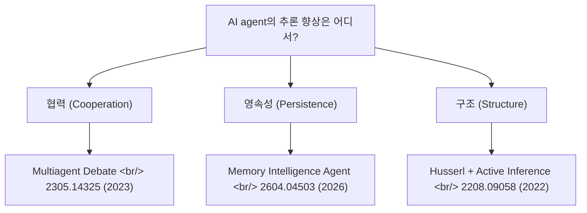
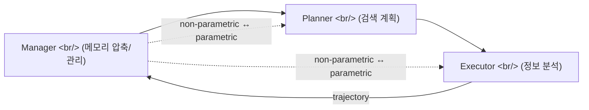

## 개요

같은 [오픈 채팅방](https://open.kakao.com/)에 며칠 사이 던져진 [arxiv](https://arxiv.org/) 논문 3편. 시기·주제·접근이 모두 다르지만 묶어서 보면 **"AI agent의 추론 향상은 어디서 오는가?"** 라는 한 질문에 협력·영속성·구조라는 다른 각도로 답한다. 단일 LLM 추론 강화의 plateau가 보이는 시점에, 다음 라운드의 키워드가 어디서 오는지를 본다.

<!--more-->

| # | 논문 | 연도 | 한 줄 요약 |
|---|---|---|---|
| 1 | [Multiagent Debate](https://arxiv.org/abs/2305.14325) | 2023 | 여러 LLM 인스턴스가 토론하면 추론이 향상된다 |
| 2 | [Memory Intelligence Agent (MIA)](https://arxiv.org/abs/2604.04503) | 2026 | Deep Research Agent엔 진화하는 메모리가 필요하다 |
| 3 | [Husserlian Phenomenology + Active Inference](https://arxiv.org/abs/2208.09058) | 2022 | 의식의 현상학을 계산 모델로 매핑한다 |

## 1. Multiagent Debate — 2305.14325

[Yilun Du](https://yilundu.github.io/), Shuang Li, [Antonio Torralba](https://groups.csail.mit.edu/vision/torralbalab/), [Joshua B. Tenenbaum](https://cocosci.mit.edu/josh), [Igor Mordatch](https://research.google/people/igor-mordatch/) — [MIT](https://www.mit.edu/) (2023-05). [ICLR 2025](https://iclr.cc/Conferences/2025) accepted.

### 핵심
하나의 LLM에게 더 잘 추론하라고 하는 대신, **여러 LLM 인스턴스가 서로 답을 제시하고 토론하게 한다.** 다중 라운드를 거치며 공통 답변에 도달한다. [마빈 민스키](https://en.wikipedia.org/wiki/Marvin_Minsky)의 [Society of Mind](https://en.wikipedia.org/wiki/Society_of_Mind) 접근법을 LLM에 도입한 셈.

### Contribution
- 멀티에이전트 토론 프레임워크 → 수학·전략적 추론 향상
- 할루시네이션 감소, 사실적 타당성 개선
- 블랙박스 LLM에 그대로 적용 가능, 모든 태스크에 같은 프롬프트 — fine-tuning 불필요
- 단일 모델 강화가 아닌 **인스턴스 협력**으로 추론을 끌어올린 첫 번째 깔끔한 결과

### 왜 지금 다시 보나
2023년 5월 논문이지만 2026년 시점에서 더 의미가 커졌다. 단일 모델 추론 강화의 plateau가 보이는 시점에, [GPT-Realtime-2](https://openai.com/index/advancing-voice-intelligence-with-new-models-in-the-api)가 강조하는 **parallel tool call** 의 흐름과 곧장 연결된다. agent-skills 같은 인프라 도구가 **여러 에이전트 동시 운용**을 전제로 설계되는 이유의 이론적 근거이기도 하다.

## 2. Memory Intelligence Agent (MIA) — 2604.04503

Jingyang Qiao 외 (2026-04). [Deep Research Agent](https://openai.com/index/introducing-deep-research/) 계열을 정조준한 메모리 아키텍처 논문.

### 핵심
Deep Research Agent — LLM 추론 + 외부 도구를 결합한 에이전트 — 의 약점은 메모리다. 기존 방식(과거 궤적 retrieval)은 비효율적이고 저장·검색 비용이 폭증한다. MIA는 **Manager-Planner-Executor** 3계층 아키텍처 + 비매개변수(non-parametric) 메모리 + 매개변수(parametric) 에이전트 2종으로 푼다.

### Contribution
- **압축된 검색 궤적**을 저장하는 비매개변수 메모리
- **교대 강화학습** — Planner와 Executor가 번갈아가며 강화. 검색 계획 수립과 정보 분석을 분리.
- **테스트 시간 학습 (test-time learning)** — 추론을 멈추지 않고 on-the-fly로 Planner 업데이트
- **매개변수 ↔ 비매개변수 메모리 양방향 변환** — 효율적 메모리 진화
- 11개 벤치마크 우수 성능

### 왜 지금 다시 보나
[agentmemory](https://github.com/elder-plinius/agentmemory) 같은 도구의 학술적 배경이다. 같은 채팅방에 agentmemory와 이 논문이 며칠 차이로 올라왔다는 사실 자체가 **"메모리가 다음 라운드 에이전트의 핵심 차별화 요소"** 라는 업계 합의를 보여준다. Manager-Planner-Executor 분리는 향후 멀티에이전트 프레임워크의 사실상 표준 후보로 보인다. [MCP](https://modelcontextprotocol.io/) 같은 도구 인터페이스 표준이 자리잡는 흐름과 묶어 봐야 한다.

## 3. Husserlian Phenomenology + Active Inference — 2208.09058

Mahault Albarracin, Riddhi J. Pitliya, [Maxwell J. D. Ramstead](https://maxwelljdramstead.com/), Jeffrey Yoshimi (2022-08). [Karl Friston](https://www.fil.ion.ucl.ac.uk/~karl/)의 [active inference](https://en.wikipedia.org/wiki/Free_energy_principle) 프레임워크를 [에드문트 후설](https://plato.stanford.edu/entries/husserl/)의 [현상학](https://plato.stanford.edu/entries/phenomenology/)에 매핑한 작업.

### 핵심
**현상학(phenomenology)** = 의식 경험의 엄밀한 기술적 연구. 이 논문은 후설의 의식 기술을 **active inference** — 뇌가 생성 모델로 세계를 예측한다는 신경과학 프레임워크 — 의 수학적 구성요소에 매핑한다.

### Contribution
- 후설의 시간의식(time consciousness) — retention/protention — 이론을 active inference에 연계
- 현상학적 기술 ↔ 계산 신경과학 모델 간 이론적 다리
- 의식의 구조를 **생성 모델(generative model)**의 구성 요소로 해석
- **계산 현상학(computational phenomenology)** 학제 분야의 발전

### 왜 지금 다시 보나
이건 가장 추상적이지만 가장 흥미롭다. AI agent가 "메모리"와 "추론"을 갖춰가면서, **"agent가 경험을 어떻게 구조화하는가"** 가 다시 철학적 질문이 된다.

- MIA의 메모리 진화 ≈ 후설의 retention/protention?
- Multiagent debate ≈ 의식의 자기-반성 구조?

PDF 직접 링크(`/pdf/`)로 공유된 걸 보면 누군가 **본문까지 진짜 읽고 있었다**는 신호. 채팅방의 시니어 한 명이 "AI agent의 다음 라운드는 인지과학에서 온다" 같은 베팅을 하고 있을 가능성.

## 묶어서 본 흐름

세 논문이 향하는 곳: **단일 LLM의 한계 → 인스턴스 협력 + 진화하는 메모리 + 의식 구조의 차용.**

| 차원 | 답 | 논문 |
|---|---|---|
| 협력 | 여러 인스턴스의 토론 | Multiagent Debate (2023) |
| 영속성 | 압축·진화하는 메모리 | MIA (2026) |
| 구조 | 시간의식 → 생성 모델 | Husserl + Active Inference (2022) |

이번 주 채팅방의 픽이 우연히도 깔끔한 3-layer stack을 만든다. agentmemory + agent-skills(전 포스트)와 같이 보면 **연구·도구·실무 합의가 같은 방향으로 수렴 중**임이 드러난다.

## 인사이트

세 논문은 발표 시점도 주제도 다르지만, 묶어 읽을 때 같은 합의를 가리킨다 — 단일 LLM의 추론 plateau를 뚫는 길은 모델을 한 사이즈 더 키우는 게 아니라, **여러 인스턴스의 협력 + 진화하는 메모리 + 경험 구조의 명시적 모델링**이라는 합의다. Multiagent Debate가 "어떻게 협력시키는가"의 첫 번째 깔끔한 답이라면, MIA는 "그 협력을 어떻게 시간에 걸쳐 누적시키는가"에 답하고, 후설 + Active Inference 매핑은 "그 누적이 결국 어떤 구조를 닮아가야 하는가"라는 더 먼 좌표를 던진다. 같은 채팅방에 [agentmemory](https://github.com/elder-plinius/agentmemory)·agent-skills 같은 실무 도구와 이 세 논문이 며칠 차이로 흐른다는 점은 **연구-도구-실무 합의가 같은 방향으로 수렴 중**이라는 신호다. 다음 라운드의 차별화는 모델 크기가 아니라 협력 토폴로지·메모리 진화 정책·경험 구조 모델링에서 나올 가능성이 높다.

## 참고

**Papers**
- [Improving Factuality and Reasoning in Language Models through Multiagent Debate (2305.14325)](https://arxiv.org/abs/2305.14325) — Du, Li, Torralba, Tenenbaum, Mordatch ([MIT](https://www.mit.edu/), 2023)
- [Memory Intelligence Agent (2604.04503)](https://arxiv.org/abs/2604.04503) — Qiao 외 (2026)
- [Mapping Husserlian Phenomenology onto Active Inference (2208.09058)](https://arxiv.org/abs/2208.09058) — Albarracin, Pitliya, Ramstead, Yoshimi (2022)

**Related concepts**
- [Society of Mind](https://en.wikipedia.org/wiki/Society_of_Mind) — [Marvin Minsky](https://en.wikipedia.org/wiki/Marvin_Minsky)의 다중 에이전트 인지 이론
- [Deep Research Agent](https://openai.com/index/introducing-deep-research/) — OpenAI의 도구 사용 에이전트 시스템
- [Active Inference / Free Energy Principle](https://en.wikipedia.org/wiki/Free_energy_principle) — [Karl Friston](https://www.fil.ion.ucl.ac.uk/~karl/)
- [Husserl 현상학 (SEP)](https://plato.stanford.edu/entries/husserl/) · [Phenomenology (SEP)](https://plato.stanford.edu/entries/phenomenology/)
- [Model Context Protocol (MCP)](https://modelcontextprotocol.io/) — 도구 인터페이스 표준
- [ICLR 2025](https://iclr.cc/Conferences/2025)

**Background reading**
- [arxiv.org](https://arxiv.org/) — 프리프린트 서버
- [Yilun Du](https://yilundu.github.io/) · [Joshua Tenenbaum](https://cocosci.mit.edu/josh) · [Antonio Torralba](https://groups.csail.mit.edu/vision/torralbalab/) · [Igor Mordatch](https://research.google/people/igor-mordatch/)
- [Maxwell J. D. Ramstead](https://maxwelljdramstead.com/)
- [GPT-Realtime-2 (parallel tool call 도입)](https://openai.com/index/advancing-voice-intelligence-with-new-models-in-the-api)
