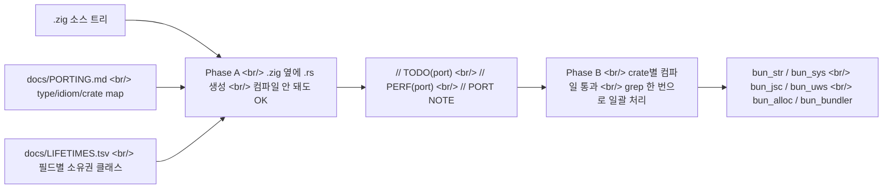

## 개요

JavaScript 런타임 [Bun](https://bun.com)의 GitHub 레포 [oven-sh/bun](https://github.com/oven-sh/bun)에 [`claude/phase-a-port`](https://github.com/oven-sh/bun/tree/claude/phase-a-port)이라는 의미심장한 이름의 브랜치가 올라왔다. 이 브랜치 안에는 [`docs/PORTING.md`](https://github.com/oven-sh/bun/blob/claude/phase-a-port/docs/PORTING.md)라는 30KB+짜리 포팅 가이드가 들어 있고, 내용은 [Zig](https://ziglang.org/)로 짜인 Bun 코드베이스를 [Rust](https://www.rust-lang.org/)로 1:1 번역하기 위한 type map / idiom map / crate map이다. 브랜치 이름이 `claude/`로 시작한다는 점에서 [Anthropic Claude Code](https://www.anthropic.com/claude-code)를 써서 자동 포팅 중일 가능성이 매우 높다.

<!--more-->

## 발견된 사실

- [oven-sh/bun](https://github.com/oven-sh/bun) (89K+ stars, "Incredibly fast JavaScript runtime, bundler, test runner, and package manager – all in one")에 [`claude/phase-a-port`](https://github.com/oven-sh/bun/tree/claude/phase-a-port) 브랜치가 살아 있다.
- 그 안 [`docs/PORTING.md`](https://github.com/oven-sh/bun/blob/claude/phase-a-port/docs/PORTING.md)는 Zig 코드를 Rust로 옮기기 위한 1:1 번역 가이드다. 분량은 수만 줄급, 완전한 type map / idiom map / crate map을 포함한다.
- Phase A의 목표는 명확하다. **"draft `.rs`가 `.zig` 옆에 생긴다. 컴파일 안 돼도 OK. 로직만 정확하게."**
- Phase B에서 crate-by-crate 컴파일 통과를 시킨다.

## 왜 의미 있나

Bun은 [Zig](https://ziglang.org/)로 만들어진 가장 큰 인프라 프로젝트다. 런타임, 번들러, 패키지 매니저까지 한 바이너리에 들어 있고 [홈페이지](https://bun.com)도 단일 도메인으로 통일됐다. Zig는 0.x 메이저 변경이 잦고 ABI/언어 안정성에서 reservation을 받는 언어인데, 그 위에 쌓인 가장 큰 코드베이스가 Rust로 옮겨가는 결정 자체가 **industry signal**이다. Zig에서 Rust로 가는 포팅은 일반적이지 않은 방향이다.

브랜치 이름이 `claude/phase-a-port`라는 점은 강력한 단서다. 인간이 다 짜는 거라면 이런 식으로 네이밍하지 않는다. 이건 [Claude Code](https://www.anthropic.com/claude-code) 에이전트에게 "phase A를 너가 처리해라" 라고 던지는 형태에 가깝다.

## 가이드의 구조 (PORTING.md 발췌)

### Ground rules

- `.rs`는 `.zig`와 같은 디렉토리, 같은 basename
- 크로스 area 타입은 `bun_<area>::Type`으로 참조 (Phase B에서 Cargo.toml 와이어업)
- **금지**: tokio, rayon, hyper, async-trait, futures, std::fs/net/process — Bun은 자체 이벤트 루프 + 시스템콜
- **금지**: `async fn` — 모두 콜백 + 상태머신
- `unsafe`는 Zig가 unsafe였던 곳에서 OK. 모든 unsafe block에 `// SAFETY: <why>`
- **확신 안 서면 `// TODO(port): <reason>` 남기기** — 추측보다 플래그가 낫다
- Zig의 perf 이디엄 (`appendAssumeCapacity`, arena bulk-free, comptime monomorphization)은 평범한 Rust로 → `// PERF(port): ...` 마킹 후 Phase B에서 grep + 벤치

### Crate map (예시)

| Zig namespace | Rust crate |
|---|---|
| `bun.String`, `bun.strings`, `ZigString` | `bun_str` |
| `bun.sys`, `bun.FD`, `Maybe(T)` | `bun_sys` |
| `bun.jsc`, `JSValue`, `JSGlobalObject` | `bun_jsc` |
| `bun.uws`, `us_socket_t`, `Loop` | `bun_uws_sys` / `bun_uws` |
| `bun.allocators`, `MimallocArena` | `bun_alloc` |
| `bun.shell` | `bun_shell` |
| `bun.bake` | `bun_bake` |
| `bun.install` | `bun_install` |
| `bun.bundle_v2`, `Transpiler` | `bun_bundler` |

`MimallocArena`는 [mimalloc](https://github.com/microsoft/mimalloc) 위에 올린 arena allocator고, `bun.uws`는 Bun 자체 이벤트 루프(uSockets) 바인딩이다. 두 곳 모두 Rust 표준의 [tokio](https://tokio.rs/) 같은 async 런타임을 쓰지 않는다는 점이 결정적이다.

### Type map (예시)

| Zig | Rust |
|---|---|
| `[]const u8` (struct field) | **`Box<[u8]>` / `Vec<u8>` / `&'static [u8]` / 아레나 raw ptr** — `deinit`을 보고 결정 |
| `[:0]const u8` | `&ZStr` (length-carrying NUL-terminated) |
| `?T` | `Option<T>` |
| `anyerror!T` | `Result<T, bun_core::Error>` (Phase A 항상) |
| `comptime T: type` | `<T>` (제네릭 + trait bound) |
| `comptime n: uN` | `<const N: uN>` |
| `inline for` over tuple | `const [T; N]` + `for` |
| `for (slice, 0..) \|x, i\|` | `for (i, x) in slice.iter().enumerate()` |
| `defer x.deinit()` | **삭제** — `impl Drop`으로 암묵적 처리 |
| `errdefer alloc.free(x)` (방금 만든 로컬) | **삭제** — `?`가 알아서 drop |
| `errdefer { side effects }` | [`scopeguard::guard(...)`](https://docs.rs/scopeguard/) + 성공 경로에서 disarm |

### 인상적인 미시 규칙

- `bun_core::Error`가 **`#[repr(transparent)] NonZeroU16`** — 힙 할당 없는 Copy 가능 에러 newtype + link-time 등록 name table. `anyhow::Error` / `Box<dyn Error>` 금지 이유는 heap-alloc, !Copy, `@errorName` snapshot 호환성 깨짐.
- `bun.Wyhash11`은 **on-disk 호환성 때문에** `std.hash.Wyhash` (seed 0)와 별개로 유지. lockfile, npm manifest cache, integrity 모두 이거 의존 → Rust로 갈 때도 별도 구현 유지.
- `defer pool.put(x)` → Rust pool은 Drop 가드 반환. **수동 defer 금지.**
- `scopeguard::guard((), \|_\| ...)` 같은 unit-state 패턴 **금지** — RAII 누락의 신호.
- `@errorName(e)` → `IntoStaticStr` derive. **`Display` / `format!("{e:?}")` 절대 금지** — JS `error.code`, snapshot test, crash-handler trace가 정확한 string에 의존.
- `for (a, b) \|x, y\|` → `for (x, y) in a.iter().zip(b)` + **`debug_assert_eq!(a.len(), b.len())`** (Zig는 assert, Rust zip은 silent truncate)
- TLS 코드는 [BoringSSL](https://boringssl.googlesource.com/boringssl/) FFI 그대로 유지. RustTLS 같은 풀-Rust로 다시 짜지 않는다.

## Phase A vs Phase B

- **Phase A** = 한 `.zig` → 한 `.rs`. 컴파일 안 돼도 됨. 로직 충실성 + idiomatic 형태.
- **Phase B** = crate별 컴파일 통과. `// TODO(port)`, `// PERF(port)` grep으로 일괄 처리.

이 분리가 핵심이다. 한 번에 다 짜려고 하면 LLM 컨텍스트가 무너지지만, 하나의 `.zig` 파일을 하나의 `.rs`로 바꾸는 단위로 쪼개면 한 세션 안에서 끝낼 수 있다. 컴파일 통과 강제는 다음 phase로 미룬다.

## 의미 — agent-skills의 실전 적용

이 PORTING.md 자체가 흥미로운 사례다.

1. **LLM이 따라야 할 가이드를 인간이 미리 만들어 둔 형태**다. 30KB+ 분량을 미리 작성한 건, "Claude가 알아서 포팅해라"가 아니라 "**Claude에게 정확히 무엇을 어떻게 번역할지 강제하기 위함**"이다. [Anthropic이 말하는 agent-skills](https://www.anthropic.com/news/skills) 사상의 실전 적용이다.
2. **type-by-type 결정을 미리 박아둠** — `[]const u8` (필드)을 `Box<[u8]>`으로 갈지 `&'static [u8]`으로 갈지를 LLM이 자기 마음대로 정하게 두지 않고, **"deinit 보고 결정하라"** 는 메타-규칙으로 못박았다.
3. **`docs/LIFETIMES.tsv`** 라는 사전 분석 파일을 가이드가 명시한다. 필드별 OWNED / SHARED / BORROW_PARAM / STATIC / JSC_BORROW / BACKREF / INTRUSIVE / FFI / ARENA / UNKNOWN 클래스를 미리 매겨두고 그 컬럼 그대로 쓰라는 형태. **LLM에게 줄 cross-file analysis를 사전에 만들어두는 패턴**이다.
4. **`PORT NOTE` / `TODO(port)` / `PERF(port)`** 세 마커로 phase 간 핸드오프 — 다음 단계 작업자(또는 다른 LLM 세션)가 grep 한 번으로 일거리를 잡을 수 있게 설계됐다.

## 인사이트

Bun처럼 큰 코드베이스의 언어 마이그레이션을 LLM 자동화로 시도하는 케이스가 처음으로 공개적으로 등장했다. 흥미로운 점은 **핵심 노하우가 모델 자체가 아니라 가이드의 정밀도** 라는 사실이다. PORTING.md는 type map과 idiom map을 미리 박아두고, LIFETIMES.tsv로 필드별 소유권을 사전 분석해두며, TODO/PERF/PORT NOTE 세 마커로 phase 간 핸드오프를 설계했다. 결과적으로 LLM은 창의적인 결정을 하지 않고 **"이 줄을 이 줄로 바꾼다"** 는 기계적 작업만 한다. tokio / rayon / async-trait 같은 흔한 Rust async 스택을 아예 금지한 것도 같은 맥락 — Bun은 자체 이벤트 루프와 [BoringSSL](https://boringssl.googlesource.com/boringssl/) 같은 FFI 자산을 유지하기 때문에 LLM이 멋대로 "Rust답게" 바꾸면 인프라가 깨진다. 이 PORTING.md는 LLM-driven port의 일종의 **교과서** 가 될 가능성이 있다. 거대 코드베이스 마이그레이션이 LLM 비용으로 풀린다면, 그 비용 효율을 결정하는 것은 GPU도 모델도 아니라 **사전에 짜둔 가이드의 두께** 다.

## 참고

### Bun과 포팅 브랜치

- [Bun 홈페이지](https://bun.com)
- [oven-sh/bun GitHub 레포](https://github.com/oven-sh/bun)
- [`claude/phase-a-port` 브랜치](https://github.com/oven-sh/bun/tree/claude/phase-a-port)
- [`docs/PORTING.md`](https://github.com/oven-sh/bun/blob/claude/phase-a-port/docs/PORTING.md)

### 언어와 생태계

- [Zig 언어](https://ziglang.org/)
- [Rust 언어](https://www.rust-lang.org/)
- [Anthropic Claude Code](https://www.anthropic.com/claude-code)
- [Anthropic agent-skills 발표](https://www.anthropic.com/news/skills)

### 도구 / crate 레퍼런스

- [scopeguard crate](https://docs.rs/scopeguard/) — `errdefer` 대응 RAII 가드
- [mimalloc](https://github.com/microsoft/mimalloc) — `MimallocArena` 의존 allocator
- [BoringSSL](https://boringssl.googlesource.com/boringssl/) — TLS FFI 유지 대상
- [tokio](https://tokio.rs/) — Phase A에서 명시적으로 금지된 async 런타임
