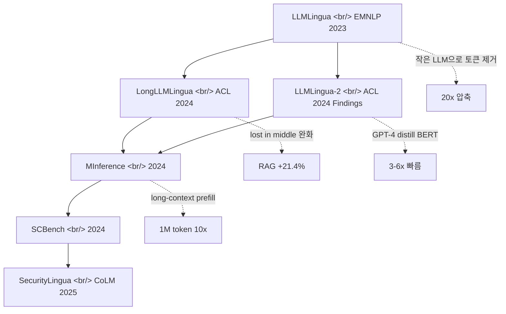

## 개요

채팅방에서 누군가 [LLMLingua](https://github.com/microsoft/LLMLingua)를 던졌고, 다른 멤버가 *"네 굉장히 저평가 되있다고 생각합니다"* 라고 동의했다. 별 6,156개에 MIT 라이선스, EMNLP'23부터 CoLM 2025까지 6편의 논문이 이어진 시리즈인데도 운영 사례를 찾기 어려운 도구다. 압축률 20배에 거의 무손실이라는 강력한 결과가 있는데 왜 production 채택이 더디게 진행되는지 — 채팅방의 "저평가"라는 한 단어를 풀어보면 **연구 → 프로덕션 사이의 갭**이 그대로 보인다.

<!--more-->



## 시리즈 6편 한 표로

| 논문 | 연도 | 핵심 결과 |
|---|---|---|
| [**LLMLingua**](https://aclanthology.org/2023.emnlp-main.825) | EMNLP 2023 | 작은 LLM(GPT2-small, LLaMA-7B 등)으로 비핵심 토큰 제거 → **20x 압축**, 최소 성능 저하 |
| [**LongLLMLingua**](https://aclanthology.org/2024.acl-long.91) | ACL 2024 | "Lost in the middle" 완화. RAG 성능 **+21.4%**, 토큰 1/4로 |
| [**LLMLingua-2**](https://aclanthology.org/2024.findings-acl.57) | ACL 2024 Findings | GPT-4 distillation 기반 BERT-level encoder. **3-6x 빠르고** out-of-domain에 강함 |
| [**MInference**](https://arxiv.org/abs/2407.02490) | 2024 | Long-context inference 가속. **A100에서 1M 토큰 prefill 10배** |
| **SCBench** | 2024 | KV cache 중심 long-context 메서드 평가 벤치마크 |
| **SecurityLingua** | CoLM 2025 | Jailbreak 방어. 압축 기반 보호로 SOTA 가드레일 대비 **100x 적은 토큰** |

원논문 모음과 데모는 프로젝트 페이지 [llmlingua.com](https://llmlingua.com/) 에서 모두 모아 볼 수 있다.

## 핵심 효과 6가지

- **비용 절감** — 프롬프트와 생성 길이를 동시에 단축, 압축 오버헤드는 작은 LLM 한 번 호출 정도
- **확장 컨텍스트** — long-context 모델 위에 얹어 "lost in middle" 완화, 같은 토큰 예산으로 더 많은 정보
- **추가 학습 불필요** — 본 LLM은 그대로, 앞단 압축기만 끼우는 plug-in 구조
- **지식 보존** — ICL(In-Context Learning) 예제와 reasoning chain 같은 핵심 정보는 유지하도록 설계
- **KV-Cache 압축** — 추론 메모리/지연 동시 감소
- **복원 가능** — GPT-4가 압축 프롬프트에서 핵심 정보를 복원할 수 있음을 실험으로 보임

## 사용 예시 (LLMLingua 1)

```python
from llmlingua import PromptCompressor

llm_lingua = PromptCompressor()
result = llm_lingua.compress_prompt(
    prompt, instruction="", question="", target_token=200
)
# {
#   'compressed_prompt': '...',
#   'origin_tokens': 2365,
#   'compressed_tokens': 211,
#   'ratio': '11.2x',
#   'saving': ', Saving $0.1 in GPT-4.'
# }
```

quantized 모델도 지원: `TheBloke/Llama-2-7b-Chat-GPTQ` 사용 시 **8GB 미만 GPU 메모리**로 압축기를 돌릴 수 있다.

## 사용 예시 (LongLLMLingua RAG 모드)

```python
compressed = llm_lingua.compress_prompt(
    prompt_list,
    question=question,
    rate=0.55,
    condition_in_question="after_condition",
    reorder_context="sort",
    dynamic_context_compression_ratio=0.3,
    condition_compare=True,
    context_budget="+100",
)
```

retrieved chunk를 question 조건 아래 정렬하고, 위치별로 압축률을 동적으로 조절하는 옵션들이 RAG에서 정확도를 끌어올린다.

## 통합

- [LangChain retrievers 통합](https://python.langchain.com/docs/integrations/document_transformers/llmlingua) — `LLMLinguaCompressor`를 `ContextualCompressionRetriever`에 끼우기만 하면 끝
- [LlamaIndex node postprocessor 통합](https://docs.llamaindex.ai/en/stable/examples/node_postprocessor/LongLLMLingua/) — query engine pipeline 마지막 단계에 추가
- [Microsoft Prompt flow 통합](https://microsoft.github.io/promptflow/) — Azure 환경에서 표준 노드로 사용 가능

## 인사이트

채팅방의 *"저평가"* 라는 한 단어가 정확하다. **연구 결과는 5편 6편 쌓였고, 통합도 LangChain·LlamaIndex·Prompt flow까지 다 있고, 적용하면 즉시 비용이 1/3에서 1/10으로 떨어지는데, production 사례는 의외로 적다.** 이유를 추정하면 첫째, 압축된 prompt의 디버깅이 어렵다 — "왜 이 토큰이 빠졌지"를 사람이 추적하기 힘들어 회귀 테스트가 까다롭다. 둘째, 압축기로 작은 LLM을 한 번 더 돌려야 해서 latency 예산이 빡빡한 실시간 시스템에는 들이밀기 어렵다. 셋째, GPT-5나 Claude 4.x 처럼 토큰 단가가 비싼 모델이 본격적으로 깔린 지금이야말로 ROI가 분명한데, 정작 이 시점에 운영팀의 인지도가 낮다. 같은 채팅방에 OpenAI Privacy Filter (Reversible Tokenization) 같은 LLM 파이프라인 중간 레이어들이 같이 흘러왔다는 점이 결정적인데 — 압축, 가명화, 복원, KV cache 관리는 production tooling으로 분화 중이고, **agentmemory + agent-skills + LLMLingua = "에이전트의 컨텍스트 관리 스택"** 이 만들어지는 흐름이 보인다. 한마디로, "성능 좋은데 잘 안 쓰이는" 도구는 도구의 문제가 아니라 통합 레이어의 미성숙 문제일 가능성이 높다.

## 참고

**Repo and demos**
- [microsoft/LLMLingua](https://github.com/microsoft/LLMLingua) — GitHub 본 저장소 (별 6,156, MIT)
- [llmlingua.com](https://llmlingua.com/) — 프로젝트 페이지 (논문, 데모, 블로그 모음)
- [HuggingFace LLMLingua 데모](https://huggingface.co/spaces/microsoft/LLMLingua)
- [HuggingFace LLMLingua-2 데모](https://huggingface.co/spaces/microsoft/LLMLingua-2)

**Papers**
- [LLMLingua (EMNLP 2023)](https://aclanthology.org/2023.emnlp-main.825)
- [LongLLMLingua (ACL 2024)](https://aclanthology.org/2024.acl-long.91)
- [LLMLingua-2 (ACL 2024 Findings)](https://aclanthology.org/2024.findings-acl.57)
- [MInference (arXiv 2407.02490)](https://arxiv.org/abs/2407.02490)

**Integrations**
- [LangChain LLMLinguaCompressor](https://python.langchain.com/docs/integrations/document_transformers/llmlingua)
- [LlamaIndex LongLLMLingua postprocessor](https://docs.llamaindex.ai/en/stable/examples/node_postprocessor/LongLLMLingua/)
- [Microsoft Prompt flow](https://microsoft.github.io/promptflow/)
