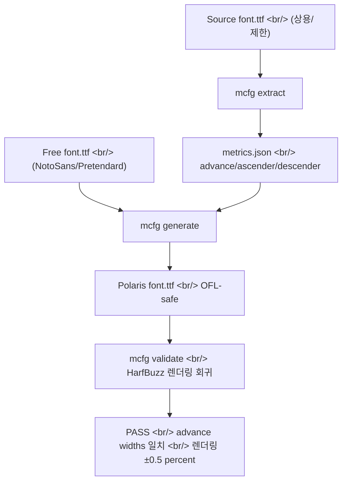

## 개요

[PolarisOffice/polaris_mcfg](https://github.com/PolarisOffice/polaris_mcfg)는 2026-04-26에 풀린 폴라리스오피스 제품팀의 도구로 보인다. 한컴 폰트나 사내 상용 폰트처럼 **재배포가 제한된 폰트**에서 **레이아웃 메트릭만** 추출해, [NotoSans](https://fonts.google.com/noto/specimen/Noto+Sans)·[Pretendard](https://github.com/orioncactus/pretendard) 같은 자유 라이센스 폰트의 글리프 디자인에 입혀 새 폰트를 만든다. 결과물은 **원본 문서의 줄바꿈/페이지 분할이 그대로 유지되면서도 라이센스가 안전한 폰트**다. 흥미로운 점은 같은 채팅방 같은 시간대에 **LLM 평가 루브릭** 이야기가 흘렀다는 것 — 두 토픽 모두 production-grade engineering의 단면이다.

<!--more-->



## 풀려는 문제

기업 문서 환경에서 한컴 폰트로 작성된 .hwp/.docx를 다른 환경에서 열면 **줄바꿈과 페이지 분할이 깨진다**. 글리프 모양이 다른 게 문제가 아니다 — advance width, ascender, descender, line gap 같은 **숫자 메트릭이 다르기 때문**이다. polaris_mcfg는 이 문제를 정확히 한 줄로 풀었다: outline은 건드리지 않고, 숫자 메트릭만 자유 폰트에 이식한다.

## 핵심 분리 — 라이센스 안전 경계

도구가 다루는 데이터는 **숫자 메트릭만**이다. 글리프 outline은 추출도 복제도 하지 않는다. 따라서 생성된 폰트의 시각적 디자인은 100% 자유 폰트 쪽이고, 라이센스도 자유 폰트의 라이센스를 따른다. [SIL Open Font License (OFL)](https://openfontlicense.org/) 1.1 — 2007년 SIL International의 Victor Gaultney와 Nicolas Spalinger가 마지막으로 손본 이후 20년 가까이 변하지 않은, 폰트 산업의 사실상 표준 자유 라이센스다. NotoSans·Pretendard 모두 OFL.

## CLI

| 서브커맨드 | 설명 |
|---|---|
| `mcfg extract <font.ttf>` | 메트릭 → JSON |
| `mcfg compare a b` | 두 폰트(또는 JSON) 비교 (text/json/html) |
| `mcfg generate --metrics … --design …` | 합성 폰트 생성 |
| `mcfg validate <font> --against …` | 메트릭 만족 여부 검증 |

```bash
mcfg extract NotoSansKR-Bold.ttf -o bold.json

mcfg generate \
  --metrics bold.json \
  --design  NotoSansKR-Regular.ttf \
  --output  PolarisBoldMetrics-Regular.ttf \
  --apply   global,advance \
  --license-text "SIL Open Font License 1.1"

mcfg validate PolarisBoldMetrics-Regular.ttf \
  --against NotoSansKR-Bold.ttf \
  --render-default \
  --render-tolerance-pct 0.5
# → result: PASS  (advance widths 일치, 렌더링 ±0.5% 이내)
```

검증 단계에 [HarfBuzz](https://harfbuzz.github.io/)를 쓴다. OpenType shaping의 사실상 표준 엔진이라 — 실제 렌더링 결과를 픽셀 단위로 비교해야 메트릭 이식이 진짜 통했는지 확인할 수 있기 때문이다.

## 마일스톤과 라이센스 책임

M1 메트릭 추출기 + JSON 스키마부터 M7 패키징/문서까지 모두 완주, 84 tests 통과. 도구 코드는 MIT, 생성된 폰트는 디자인 폰트 라이센스(OFL 등)을 따른다. 다만 **소스 폰트의 EULA가 메트릭 추출을 허용하는지 검토할 책임은 사용자 본인**(Requirements.md §6)이다. 도구가 라이센스 회피 자동화 머신이 아니라 정직한 분리 도구라는 점을 분명히 한다.

## 같은 채팅방의 LLM 평가 루브릭 토론

이 링크의 직전 대화가 무관해 보이지만 사실 매우 흥미로운 LLM 평가 토론이었다.

> "벡터유사도나 RAGAS 지표는 채점에 적합한 방법은 아닌 것 같구요. 주관식 채점은 무조건 결국 llm 태우셔야 하고, 평가 루브릭을 먼저 작성해서 이거 기반으로 하는게 보통일 것 같습니다."

이 한 줄에 LLM-as-Judge 운영의 통념이 압축되어 있다. (1) [Vector similarity / RAGAS](https://github.com/explodinggradients/ragas)는 의미 일치를 점수화한다고 해도 채점 기준이 못 됨. (2) 주관식 채점 = LLM 호출 필수 — rule-based로 점수화 불가. (3) 평가 루브릭을 먼저 작성. LLM에게 "잘 했는지 봐줘"는 안 됨. **명시적 기준표**가 있어야 일관성이 나온다.

이 흐름은 최근 LLM eval 도구들 — [DeepEval](https://github.com/confident-ai/deepeval), [Evidently](https://github.com/evidentlyai/evidently), [OpenAI Evals](https://github.com/openai/evals) — 가 모두 가는 방향과 일치한다. **rubric-driven judge**가 사실상 표준이 됐다.

## 인사이트

폰트 메트릭 추출기와 LLM 평가 루브릭이 같은 시간대 같은 채팅방에 흐른다는 것은, 그곳이 **"실제 제품을 만드는 사람들이 모인 곳"**이라는 신호다. 두 토픽이 표면상 무관해 보여도 본질은 같다 — 둘 다 "사람의 직관에 의존하는 영역을 명시적·검증 가능한 규칙으로 환원하는 작업"이다. 폰트 도구는 "메트릭이 호환되는가"를 HarfBuzz 렌더링 회귀로 객관화하고, LLM-as-Judge는 "답이 좋은가"를 루브릭으로 객관화한다. 둘 다 자동화 가능한 검증 단계를 만들어내야 production에 쓸 수 있고, 그 검증 단계가 곧 도구의 정체성이 된다. polaris_mcfg가 `validate` 서브커맨드를 가진 것과 LLM eval 도구가 rubric을 1급 객체로 다루는 것은 완전히 같은 사고방식의 발현이다. 생산 환경에서 "그냥 잘 돌아가더라"는 통하지 않고, **명시적 기준 + 자동 검증 + 회귀 추적**이 새 표준이라는 점에서 두 토픽은 같은 지점을 가리킨다.

## 참고

**Tool repo and demo**
- [PolarisOffice/polaris_mcfg](https://github.com/PolarisOffice/polaris_mcfg) — Metric-Compatible Font Generator (MIT, Python, ★4)
- [데모 페이지](https://polarisoffice.github.io/polaris_mcfg/)

**Font ecosystem**
- [HarfBuzz](https://harfbuzz.github.io/) — OpenType shaping 엔진
- [SIL Open Font License](https://openfontlicense.org/) — 폰트 산업 자유 라이센스 사실상 표준 (OFL 1.1, 2007)
- [SIL International](https://www.sil.org/) — OFL 관리 단체
- [Noto Sans](https://fonts.google.com/noto/specimen/Noto+Sans) · [Pretendard](https://github.com/orioncactus/pretendard) — OFL 기반 자유 한글 폰트

**LLM evaluation methodology**
- [RAGAS](https://github.com/explodinggradients/ragas) — RAG eval 프레임워크
- [DeepEval](https://github.com/confident-ai/deepeval) — LLM-as-Judge + rubric 기반 eval
- [Evidently](https://github.com/evidentlyai/evidently) — ML/LLM 모니터링과 eval
- [OpenAI Evals](https://github.com/openai/evals) — OpenAI 공식 eval 프레임워크
