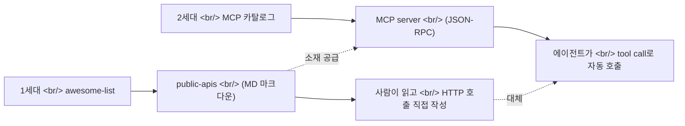

## 개요

[public-apis/public-apis](https://github.com/public-apis/public-apis)는 2016-03-20에 시작해 지금까지 **별 433,177개**, MIT 라이선스로 유지되는 무료 공개 API 큐레이션 리포지토리다. 운영 주체는 [APILayer](https://apilayer.com/), 어제(2026-05-07)에도 push가 있을 만큼 살아있다. 클래식 리소스가 채팅방에 다시 뜬 맥락이 묘하다 — 직전 메시지가 [tilnote](https://tilnote.io) MCP 서버 업데이트 발표였기 때문. **awesome list 1세대 큐레이션이 MCP 카탈로그 시대에 어떻게 재해석되는지** 의 단면이다.

<!--more-->

## 무엇

카테고리별로 정리된 무료 공개 API 마크다운 리스트. Animals, Anime, Authentication, Blockchain, Books, Business, Calendar, Cloud Storage, Cryptocurrency, Currency Exchange, Data Validation, Development, Dictionaries, Email, Entertainment, Environment, Events, Finance, Food, Games, Geocoding, Government, Health, Jobs, **Machine Learning**, Music, News … 카테고리만 30+개.

각 항목은 `Auth` (None / API key / OAuth), `HTTPS`, `CORS` 컬럼을 같이 적는다 — 브라우저에서 바로 쓸 수 있는지 한눈에 본다.

## 왜 지금 다시 — 직전 메시지 흐름

같은 채팅방의 직전 발언:

> "여러분 [tilnote](https://tilnote.io) MCP가 업데이트됐습니다. 이제 클로드 코드나 코덱스에서 tilnote에 책을 만들고 페이지를 넣을 수 있습니다."

→ MCP 서버를 만들거나 활용하려는 사람에게 **"무엇을 데이터 소스로 감싸지?"** 가 즉각 떠오르는 질문이다. 그 답을 가장 빠르게 찾는 출발점이 여전히 public-apis 같은 awesome list다. [MCP](https://modelcontextprotocol.io/)의 정의를 그대로 옮기면 *"AI 애플리케이션이 외부 시스템에 연결되는 USB-C 같은 표준"* — 그 USB-C에 꽂을 외부 시스템 후보 리스트가 public-apis 한 페이지에 정리돼 있다.

## 1세대 → 2세대 전환

[awesome lists 운동](https://github.com/sindresorhus/awesome) (2014, sindresorhus 시작)이 만든 것은 **사람이 카테고리별로 외부 자원을 빠르게 찾는 인덱스**였다. 2025-2026년 [MCP](https://modelcontextprotocol.io/) 붐 이후, 같은 인덱스가 **에이전트가 tool로 호출할 후보 카탈로그**로 의미가 옮겨갔다.

| 차원 | 1세대 awesome-list | 2세대 MCP 카탈로그 |
|---|---|---|
| 형식 | 마크다운 링크 | JSON-RPC + manifest |
| 소비자 | 사람 (개발자) | 에이전트 (LLM) |
| 호출 | 사람이 코드 작성 | tool_call 자동 |
| 인증 | API key 직접 관리 | OAuth/토큰 표준 |
| 발견 | GitHub 검색 | MCP registry |

→ **public-apis는 죽지 않았다.** MCP server를 새로 만들 때 가장 먼저 보는 외부 데이터 인벤토리로 역할이 재정의됐다. APILayer 같은 API aggregator의 가치도 여기서 다시 뜬다 — 이미 정규화된 endpoint를 MCP로 감싸기 쉽다.

## LLM 프롬프트에 넣을 때 주의

awesome list를 그대로 LLM 컨텍스트에 박는 패턴이 흔한데, public-apis 전체는 토큰이 무겁다. 카테고리 단위로 잘라서 [tool catalog manifest](https://modelcontextprotocol.io/docs/learn/architecture)와 비슷하게 압축해 넣는 편이 맞는다. 또는 카테고리별로 MCP server를 따로 만들어 에이전트가 필요할 때만 로드하는 패턴.

## 인사이트

awesome list가 죽었다는 말이 한때 돌았지만, MCP 시대가 오히려 그 가치를 두 배로 끌어올렸다. 에이전트 시대에 가장 비싼 자원은 토큰이 아니라 **"무엇이 존재하는지"의 인덱스** 다 — 이게 없으면 에이전트는 자기 학습 시점에 봤던 도구만 안다. public-apis가 10년째 살아있는 건 우연이 아니다 — 무료 API라는 아주 명확한 axis로 잘려 있고, 매주 push가 들어와서 inventory가 신선하다. APILayer가 운영하는 것도 의미가 크다. **API aggregator가 awesome list를 들고 있다는 건 곧 MCP server 카탈로그를 들고 있다는 뜻** 이고, 이는 다음 분기 LLM 도구 마켓플레이스의 직접 진입로가 된다. tilnote MCP 같은 도메인 특화 MCP가 늘어날수록, **"어떤 MCP를 깔지" 의 인덱스가 새 awesome list가 될 것** 이다 — 그리고 그 자리는 이미 [github.com/modelcontextprotocol](https://github.com/modelcontextprotocol)과 sindresorhus 스타일 awesome-mcp 같은 후속 리포가 노린다. 1세대가 사라지는 게 아니라, 같은 물건이 한 단계 위에서 다시 나타나는 패턴이다.

## 참고

**Repo**
- [public-apis/public-apis](https://github.com/public-apis/public-apis) — 별 433,177, MIT, 2016-03-20 시작, 마지막 push 2026-05-07
- [Awesome lists 본가 (sindresorhus/awesome)](https://github.com/sindresorhus/awesome)

**Maintainer / sponsor**
- [APILayer](https://apilayer.com/) — public-apis 운영, API aggregator

**MCP 생태계**
- [Model Context Protocol 공식 사이트](https://modelcontextprotocol.io/) (Anthropic)
- [MCP 아키텍처 문서](https://modelcontextprotocol.io/docs/learn/architecture)
- [github.com/modelcontextprotocol](https://github.com/modelcontextprotocol) — 공식 SDK 및 reference servers
- [tilnote MCP](https://tilnote.io) — 같은 채팅방의 직전 맥락, 도메인 특화 MCP 사례
