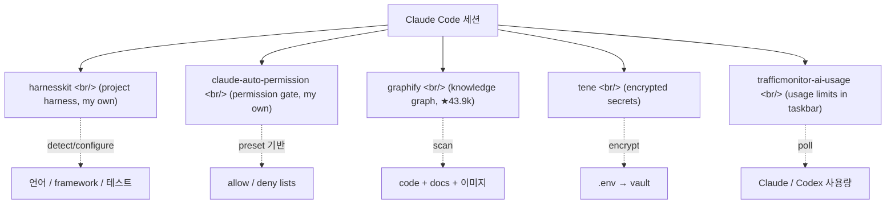

## 개요

지난 보름 동안 Claude Code 주변 도구들을 둘러봤다. 다섯 개 — 두 개는 직접 만든 거(harnesskit, claude-auto-permission), 세 개는 외부 도구(graphify, tene, trafficmonitor-ai-usage-plugin). 각각이 다른 layer를 건드린다 — 하네스/권한/지식그래프/시크릿/모니터링.

<!--more-->



---

## harnesskit — 프로젝트 자동 감지 + 가드레일

[ice-ice-bear/harnesskit](https://github.com/ice-ice-bear/harnesskit), Shell, ★2 (직접 만든 거).

> Adaptive harness for vibe coders — detect, configure, observe, improve

핵심 아이디어는 4단계 루프:

```
Detect → Configure → Observe → Improve
```

- **Detect** — 레포의 언어/framework/test framework/linter/package manager를 자동 감지. 한국어 LLM 토큰 한 자도 안 쓴다 (zero-token shell hooks, bash + jq).
- **Configure** — 감지 결과로 preset(beginner/intermediate/advanced)을 선택해서 가드레일 적용.
- **Observe** — session hook으로 metrics 수집.
- **Improve** — insights agent가 프로젝트 패턴을 보고 harness 개선안을 제안.

```bash
/harnesskit:setup    # detect + preset 선택
/harnesskit:init     # 인프라 + toolkit 파일 생성
/harnesskit:status   # 현재 상태
/harnesskit:insights # 개선 제안 생성
/harnesskit:apply    # diff로 검토 후 적용
```

벤딩 머신처럼 즉시 적용되는 게 아니라, "분석 → 제안 → 사용자가 diff 검토 → 적용"이 한 사이클. AI가 제안하고 사람이 lock-in한다.

89개 테스트가 통과한다고 README에 박혀 있고, version 0.2.0. 본인 도구라 회고 모드: detect 단계가 zero-token이라는 게 결정적이었다. LLM으로 detect를 하면 비용/지연/에러가 다 올라간다 — bash + jq 정도로도 80%는 잡힌다.

---

## claude-auto-permission — 모든 git add를 매번 승인하지 않기

[ice-ice-bear/claude-auto-permission](https://github.com/ice-ice-bear/claude-auto-permission), JavaScript/Shell, ★1 (직접 만든 거).

문제가 명확하다:

> Claude Code asks permission for every tool use. You end up clicking "yes" hundreds of times for safe operations like reading files, running tests, and committing code.

Claude Code의 built-in `settings.local.json`은 one-off approval이 누적되어 다른 레포와 호환이 안 되고 다른 디바이스로 옮기지 못한다. 해결:

```
~/.claude/                         # 모든 레포에 공유
  hooks/
    selective-auto-permission.mjs    # PreToolUse hook
    permission-learner.mjs           # 승인 패턴 학습
  skills/
    learn-permissions/SKILL.md       # /learn-permissions 스킬

your-repo/.claude/                 # 레포별 config
  auto-permission.json               # preset + custom rule
  settings.json                      # hook 등록
```

Preset 기반 + per-repo override + 위험한 명령(rm -rf, force push 등)은 항상 prompt. 핵심 절약:
- `git add`, `git commit`, `git status`, `npm run build`, `pytest` 같은 안전한 명령은 자동 통과
- `rm -rf`, `git push --force`, `DROP TABLE` 같은 위험한 명령은 항상 사용자에게 묻기
- Pattern learning: `/learn-permissions` 스킬이 transcript를 읽고 자주 승인한 패턴을 자동으로 allow list에 추가

이 도구의 장점은 "안전한 자동화"라는 결. 모든 걸 자동 승인하면 위험하고, 모든 걸 묻으면 productivity가 죽는다 — 그 사이의 default를 잘 잡는 게 핵심.

---

## graphify — 코드/문서/이미지를 knowledge graph로

[safishamsi/graphify](https://github.com/safishamsi/graphify), Python, **★43,935** (외부, flagship-tier).

> Type `/graphify` in your AI coding assistant and it maps your entire project — code, docs, PDFs, images, videos — into a knowledge graph you can query instead of grepping through files.

3.9만 스타가 넘어가는 도구는 대개 한 가지를 잘 한다 — graphify는 **"grep 대신 그래프"**다. 단일 명령으로:

```bash
/graphify .
```

세 파일이 떨어진다.

```
graphify-out/
├── graph.html       # 브라우저에서 노드 클릭/필터/검색
├── GRAPH_REPORT.md  # 핵심 컨셉, 놀라운 연결, 추천 질문
└── graph.json       # 전체 그래프, 재읽기 없이 query 가능
```

지원 platform 목록이 압도적이다 — Claude Code, Codex, OpenCode, Cursor, Gemini CLI, GitHub Copilot CLI, VS Code Copilot Chat, Aider, OpenClaw, Factory Droid, Trae, Hermes, Kiro, Pi, Google Antigravity. 거의 모든 주요 AI 코딩 어시스턴트에서 `/graphify` 슬래시 커맨드가 작동한다는 뜻.

PyPI 패키지 이름은 `graphifyy` (y 두 개). 다른 `graphify*` 패키지는 affiliated가 아니라고 명시되어 있다 — naming squatting 방지.

이 도구의 진짜 가치는 **장기 코드베이스 탐색에서 LLM context window를 안 쓰는 것**이다. 큰 레포에서 "이 함수 누가 호출해?"를 grep으로 찾으면 LLM context에 raw output이 쏟아지는데, graph는 미리 indexing된 결과를 query한다. 토큰 비용 + latency 둘 다 절감.

(★43k짜리 도구 README에 한국어 번역도 들어가 있다. `docs/translations/README.ko-KR.md` — popcon 같은 사이드 프로젝트도 한국어 번역을 갖춰야 진정한 거구나, 라는 자극.)

---

## tene — `.env`는 시크릿이 아니다 (AI도 읽는다)

[tomo-kay/tene](https://github.com/tomo-kay/tene), Go + TypeScript + Python multi-language, ★8 (외부).

> **Your .env is not a secret. AI can read it.** Tene is a local-first, encrypted secret management CLI. It encrypts your secrets and injects them at runtime — so AI agents can use them without ever seeing the values.

이 도구의 forked frame이 흥미롭다. 일반적인 시크릿 매니저(1Password CLI, doppler, vault)는 "사람이 안전하게 시크릿을 보관"이라는 frame으로 만들어졌다. tene은 **"AI 에이전트가 시크릿 값을 읽지 않고도 사용할 수 있게"**를 새로운 axis로 끼워 넣었다.

기술적 흐름:

1. `.env` 값을 tene이 암호화해서 vault에 저장
2. 실행 시 tene이 자식 프로세스에 환경변수로 inject
3. AI 에이전트(Claude Code, Cursor 등)는 vault 파일만 보고 plaintext 값은 못 읽음

Local-first라서 cloud에 의존하지 않는다. Open-source CLI는 MIT, cloud sync/teams/billing 같은 기능은 [tene.sh](https://tene.sh)의 Pro 구독으로 분리.

플랫폼 매트릭스: macOS(arm64/x64), Linux(arm64/x86_64), Windows(WSL). Go 1.25+ 베이스에 TypeScript/Python 같은 보조 언어들. 정말 multi-language polyglot 레포.

popcon에 ToonOut + Gemini + R2 + RunPod 같은 multi-API 시크릿이 쌓여 있어서 한 번 검토할 가치가 있는 도구.

---

## trafficmonitor-ai-usage-plugin — Windows taskbar에 Claude 사용량

[bemaru/trafficmonitor-ai-usage-plugin](https://github.com/bemaru/trafficmonitor-ai-usage-plugin), C++/JavaScript/PowerShell, ★31 (외부).

> Taskbar usage limits for Claude and Codex through TrafficMonitor on Windows.

좁고 실용적인 도구. [TrafficMonitor](https://github.com/zhongyang219/TrafficMonitor)는 Windows의 인기 taskbar widget(시스템 모니터링)인데, 이 플러그인은 그 widget에 Claude/Codex 사용량을 추가한다.

> I built this because Windows did not have a convenient widget for this kind of AI usage-limit status. Claude usage can already be checked from places like Claude Code statusline, Claude Desktop, or Claude's VS Code extension, but those surfaces depend on the current workflow. The Windows taskbar stays visible across editors, terminals, and browsers, so TrafficMonitor's taskbar plugin surface was a good fit.

이 README의 한 단락이 좋은 product positioning 예시다. **"기존 표면들의 한계 → 우리가 채우는 자리"**가 명확하다 — Claude Code statusline은 Claude Code 안에서만 보이고, Desktop은 그 앱 안에서만 보인다. taskbar는 항상 보이니까 cross-context.

Mac 사용자라 직접 쓸 일은 없지만, 도구가 어디 자리 잡아야 하는지의 좋은 사례. macOS도 menubar가 있으니까 비슷한 niche가 가능하다.

---

## 인사이트

다섯 개를 한 자리에 두고 보면 Claude Code 주변 plugin 지형도가 어디까지 펼쳐져 있는지 감이 잡힌다. Layer 별로 정리하면:

| Layer | 역할 | 본 도구 |
|-------|------|---------|
| **Project harness** | 프로젝트 detect + 가드레일 | harnesskit |
| **Permission gate** | tool 사용 자동 승인 | claude-auto-permission |
| **Knowledge layer** | 코드/문서를 indexable graph로 | graphify |
| **Secret layer** | AI가 시크릿 값을 못 보게 | tene |
| **Observability** | OS-level 사용량 모니터 | trafficmonitor |

각 layer가 거의 겹치지 않는다. graphify와 harnesskit은 둘 다 "프로젝트 컨텍스트"를 다루지만, graphify는 사용자/AI에게 인덱스를 주는 쪽이고 harnesskit은 AI가 어떻게 작동할지를 set up하는 쪽. tene과 claude-auto-permission도 둘 다 "안전 가드"지만 한쪽은 시크릿 redaction, 다른 쪽은 명령 게이트.

플러그인 ecosystem이 성숙해지면서 보이는 패턴: **"AI 코딩 도구 안이 아니라 그 주변"**에 가치가 쌓인다. Claude Code 자체가 다 갖추는 게 아니라, 작은 도구들이 각자 한 axis를 담당한다. Unix 철학.

본인 도구를 외부 ecosystem과 같이 두고 보면 자기 도구의 위치가 더 또렷해진다. harnesskit과 claude-auto-permission은 둘 다 "Claude Code의 default 행동을 사용자/프로젝트에 맞게 조정"하는 axis다. graphify처럼 "새로운 capability"를 추가하는 도구와는 다른 결.

다음에 살펴볼 것: graphify를 popcon에 깔아보고 grep 대비 latency/token 비교, tene으로 popcon의 .env를 vault화, harnesskit의 v0.3 로드맵에 어떤 detect 패턴을 추가할지.
