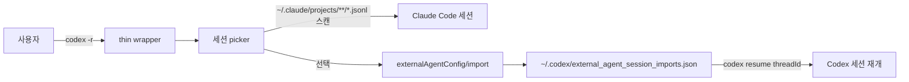
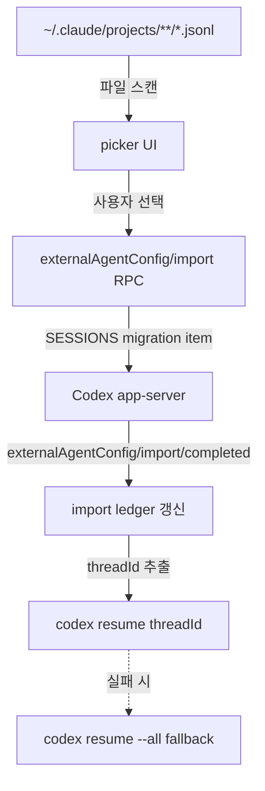

## 개요

[`thedalbee/codex-r`](https://github.com/thedalbee/codex-r)은 2026-05-01에 만들어진 별 3개짜리 MIT 라이선스 마이크로 도구다. 한 줄로 요약하면 **[OpenAI Codex CLI](https://openai.com/codex/)에 `codex -r` 한 명령으로 [Claude Code](https://www.anthropic.com/claude-code) 세션을 picker로 골라 import하는 워크플로를 이식한 Markdown 전용 스킬**이다. 코드는 거의 없고 [agent-skills](https://github.com/anthropics/skills) 패턴을 그대로 차용한 SKILL.md 한 장이 본체다. 별 개수보다 흥미로운 건 **누가 왜 이걸 만들었는가** 라는 질문 쪽이다.

<!--more-->



## 풀려는 문제

Codex CLI 0.128.0이 `Added external agent session import`를 넣었지만, 이 기능은 트리거가 까다롭다.

- TUI 프롬프트는 `external_migration` feature flag가 켜지고 trust onboarding flow에 진입할 때만 뜬다.
- 이미 trusted된 프로젝트에서는 평생 그 프롬프트를 못 본다.
- `~/.claude/projects` 폴더가 크면 home-wide 탐지가 느려진다.
- 셸 alias가 `codex -r`을 진짜 Codex 바이너리로 보내면 `unexpected argument '-r'` 에러가 난다.

결과적으로 **기능은 있지만 사용 경로가 보물찾기**다. CODEX-R는 이 보물찾기를 picker 한 번에 끝내는 thin wrapper로 바꾼다.

## CODEX-R가 하는 것

스킬 본체는 SKILL.md 한 장이다. Codex 세션에서 `$codex-r`을 부르면 다음 동작을 가르친다.

1. `codex` thin wrapper 셋업
2. Claude Code 세션 picker
3. 안전 검증 커맨드

```bash
codex -r                    # picker 열고 선택하면 import
codex -r daybreak           # ~/ws/daybreak 세션만 보기
codex -r --cwd ~/ws/kb      # 특정 디렉토리 세션
codex -r --recursive        # 자식 디렉토리 포함
codex -r --all daybreak     # 전 세션 텍스트 검색
codex -r --list --limit 5   # 보기만, import 안 함
codex -r --dry-run --limit 1
```

## 안전 컨트랙트

저자가 강조한 **딱 하나의 규칙: setup verification은 절대 import 하지 않는다.**

- `--list`와 `--dry-run`은 절대 import 안 함
- import는 사용자가 명시적으로 세션을 선택했을 때만
- 기본값은 현재 cwd와 정확히 일치하는 Claude 세션만 노출
- Codex가 나중에 official `-r` 지원을 내면 wrapper는 양보하고 물러남

CODEX-R는 Claude의 settings, [MCP](https://modelcontextprotocol.io/) 서버, 플러그인, 스킬은 복사하지 않는다. **순수하게 세션 JSONL만 Codex의 app-server migration API로 import한다.**

## 동작 원리 (Codex 내부 API)



- Feature flag — `external_migration`
- Claude session source — `~/.claude/projects/**/*.jsonl`
- Import RPC — `externalAgentConfig/import`
- Completion event — `externalAgentConfig/import/completed`
- Import ledger — `~/.codex/external_agent_session_imports.json`

세션 1개를 SESSIONS migration item으로 import하고, ledger에서 threadId를 읽어 `codex resume <threadId>`를 실행하는 흐름이다.

## 설치

```bash
git clone https://github.com/thedalbee/codex-r.git ~/ws/codex-r
ln -sfn ~/ws/codex-r ~/.codex/skills/codex-r
# Codex 새 세션에서:
$codex-r
```

설치 스크립트 없음. 심볼릭 링크 한 줄과 스킬 호출만으로 끝난다.

## 의미

- **공식이 만든 기능을 사용자가 ergonomic 셸로 감싸는 패턴**의 깨끗한 사례. 0.128.0의 import RPC는 이미 있는데 노출이 부족했고, 사용자가 직접 30줄짜리 thin wrapper로 풀어버렸다.
- Markdown 전용 스킬이라는 형태가 중요하다. [Anthropic agent-skills](https://github.com/anthropics/skills) 패턴을 Codex가 그대로 받아들이고 있다는 신호이며, 이 호환성 덕분에 한 사람이 하루 만에 도구를 만들 수 있었다.
- 별 3개짜리 마이크로 도구지만, **에이전트 세션 휴대성이 중요해지는 시대의 신호**다. Claude Code와 Codex 사이의 세션 호환성 문제를 사용자가 직접 풀고 있다는 점에서, 같은 시기에 공유된 [agentmemory](https://github.com/AutonomousResearchGroup/agentmemory) 같은 메모리 표준화 시도와 같은 맥락에 있다.
- 에이전트 인프라 레이어가 빠르게 표준화 중이다. 모델 회사들이 official 도구를 내기 전에 사용자가 먼저 글루를 짠다.

## 인사이트

이 도구의 의미는 30줄짜리 wrapper에 있지 않고, **그 wrapper가 만들어졌다는 사실 자체**에 있다. Codex가 import RPC를 추가한 시점과 거의 동시에 사용자가 picker를 직접 만들어 SKILL.md로 묶은 것은, 에이전트 도구 시장이 더 이상 단일 vendor에 묶이지 않는다는 신호다. Claude Code 세션 JSONL이 사실상 휴대 가능한 포맷이 됐고, Codex는 이를 import하는 표준 RPC를 노출했다. 같은 패턴이 메모리, 스킬, MCP 서버에서도 일어나고 있고, agent-skills 같은 표준 덕에 한 사람이 하루 만에 호환 레이어를 짤 수 있게 됐다. 이런 마이크로 도구는 별이 안 늘어도 OK다 — 모델 회사가 official 명령을 내면 wrapper는 조용히 양보하면 그만이다. **결국 진짜 자산은 도구가 아니라 패턴이다.** 사용자가 만든 thin wrapper가 official 기능보다 먼저 ergonomic을 정의하면, 다음 official 기능은 그 ergonomic을 따라가게 된다.

## 참고

**Repo**
- [thedalbee/codex-r](https://github.com/thedalbee/codex-r) — MIT, 별 3개, 2026-05-01 생성
- [SKILL.md / README.md](https://github.com/thedalbee/codex-r/blob/main/README.md)

**Related tools**
- [OpenAI Codex CLI](https://openai.com/codex/) — Codex 0.128.0의 external agent session import가 본 스킬의 토대
- [Claude Code](https://www.anthropic.com/claude-code) — `~/.claude/projects/**/*.jsonl`이 import 소스
- [Anthropic agent-skills](https://github.com/anthropics/skills) — Markdown-only 스킬 패턴의 출처
- [MCP (Model Context Protocol)](https://modelcontextprotocol.io/) — 에이전트 표준 레이어

**Background**
- [agentmemory](https://github.com/AutonomousResearchGroup/agentmemory) — 같은 시기 공유된 에이전트 메모리 표준화 시도 (관련 포스트의 다른 항목)
- [Claude Code 세션 포맷 문서](https://docs.claude.com/en/docs/claude-code) — JSONL 트랜스크립트 구조
