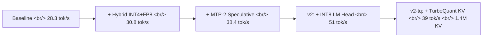

## 개요

[albond/DGX_Spark_Qwen3.5-122B-A10B-AR-INT4](https://github.com/albond/DGX_Spark_Qwen3.5-122B-A10B-AR-INT4)는 [NVIDIA DGX Spark](https://www.nvidia.com/en-us/products/workstations/dgx-spark/) 단일 박스에서 [Qwen3.5-122B-A10B](https://huggingface.co/Qwen/Qwen3.5-122B-A10B)를 28.3에서 51 tok/s까지 80퍼센트 끌어올린 레시피다. INT4 양자화, FP8 dense layer hybrid, MTP-2 speculative decoding, INT8 LM head, TurboQuant KV cache까지 다섯 가지 기법을 차례로 쌓았고 256K context도 유지된다. Apache 2.0, GitHub 별 171개. "단일 워크스테이션에서 100B급 MoE 모델을 production 수준으로 돌릴 수 있는가" 라는 질문에 대한 강한 긍정 답이다.

<!--more-->

## 결과 표

| 구성 | tok/s | 향상 | 빌드 |
|---|---|---|---|
| Baseline (vLLM 0.19 + AutoRound INT4 + FlashInfer) | 28.3 | — | — |
| + Hybrid INT4+FP8 dense layers | 30.8 | +8.8% | step 1 |
| + MTP-2 Speculative Decoding | 38.4 | +35.7% | step 2 |
| **v2** (+ INT8 LM Head v2) | **51** | **+80%** | `Dockerfile.v2` |
| v2-tq (+ TurboQuant KV Cache) | 39 | +38% | `Dockerfile.v2-tq` |

같은 최적화로 Qwen3.5-35B-A3B (작은 형제) 는 112 tok/s까지 올라간다.

### 256K Context

| 설정 | KV Cache | 256K 동시 사용자 |
|---|---|---|
| v2 (standard) | 355K tokens | 1 |
| v2-tq (TurboQuant) | **1.4M tokens** | **5** |

## 모델 한 줄

[Qwen3.5-122B-A10B](https://huggingface.co/Qwen/Qwen3.5-122B-A10B)는 122B 총 파라미터 중 10B만 활성화하는 hybrid MoE다. 256개 expert 중 8 routed + 1 shared, Gated DeltaNet과 Gated Attention이 12:1 비율로 교차하는 48 레이어 구조에 native 262K context (YaRN 확장 시 1M)까지 지원한다. Apache 2.0. 이 모델을 [Intel AutoRound](https://github.com/intel/auto-round)로 INT4 양자화한 [Intel/Qwen3.5-122B-A10B-int4-AutoRound](https://huggingface.co/Intel/Qwen3.5-122B-A10B-int4-AutoRound) (group size 128, shared_expert는 ignore) 가 출발점이다.

## 핵심 기법

### 1. Hybrid INT4 + FP8 Dense Layers (+9%)

AutoRound INT4 모델의 BF16 shared expert weights를 official Qwen 체크포인트의 FP8 weights로 교체한다. 즉 expert 레이어만 INT4, dense는 FP8. 정확도를 보존하면서 메모리와 연산량을 동시에 줄인다.

### 2. MTP-2 Speculative Decoding (+36%)

[Multi-Token Prediction](https://arxiv.org/abs/2404.19737) 방식으로 한 번에 2 토큰을 예측한다. accept rate가 약 80퍼센트로 매우 높아 디코드 throughput이 가장 크게 점프하는 단계다. 작은 draft 모델을 따로 돌리지 않고 메인 모델 자체가 multi-head 예측을 한다는 점이 주목할 만하다.

### 3. INT8 LM Head v2 (Triton 커널)

LM head, 즉 최종 token vocabulary projection 레이어를 INT8로 양자화한다. Triton 커스텀 커널로 구현되며 v2 빌드에서 가장 큰 점프 (38.4 → 51 tok/s) 를 만든다. LM head는 보통 양자화 대상에서 빠지지만 vocabulary가 큰 모델일수록 영향력이 크다는 게 다시 확인됐다.

### 4. TurboQuant KV Cache (선택)

[TurboQuant](https://github.com/microsoft/turbo-quant)로 KV cache를 4배 압축한다. 절대 throughput은 v2 대비 약간 떨어지지만 256K context 동시 사용자가 1명에서 5명으로 늘어난다. Long-context multi-tenant 시나리오에서 의미 있는 트레이드오프다.

## 환경

- vLLM 0.19.1, CUDA 13.0, Docker 기반
- 추론 엔진: [vLLM 0.19](https://github.com/vllm-project/vllm) + [FlashInfer](https://github.com/flashinfer-ai/flashinfer)
- 모델: `Intel/Qwen3.5-122B-A10B-int4-AutoRound`
- `./install.sh` 한 번으로 Step 0~4 자동 (idempotent)

## 인사이트

100B급 모델을 단일 워크스테이션에서 51 tok/s로 돌린다는 건 production 응답 속도 (60 tok/s 근처) 에 거의 닿았다는 뜻이다. 별 171개 짜리 레시피 치고는 짜임새가 단단해서 벤치 표, 단계별 Docker, install.sh, vLLM/CUDA 버전 호환성까지 모두 갖췄고 그대로 따라 돌릴 수 있다. 흥미로운 건 다섯 기법이 직교한다는 점이다. Hybrid quant은 메모리/정확도, MTP는 디코딩 병렬성, INT8 LM head는 컴퓨트, TurboQuant은 KV 메모리를 각각 친다. 한 곳을 짠 게 아니라 병목을 차례로 옮기면서 합산한 결과가 80퍼센트다. 그리고 v2-tq에서 보이듯 throughput과 동시 사용자 수는 다른 축이라 워크로드에 따라 다른 빌드를 골라야 한다. 다음 분기쯤이면 이런 hybrid quant + speculative + custom kernel 스택이 vLLM/SGLang에 표준으로 들어올 가능성이 높고, "100B 모델을 한 박스에서" 가 점점 demo가 아니라 default로 바뀐다.

## 참고

### Repo and model cards

- [albond/DGX_Spark_Qwen3.5-122B-A10B-AR-INT4](https://github.com/albond/DGX_Spark_Qwen3.5-122B-A10B-AR-INT4) — 별 171, Apache 2.0
- [Qwen/Qwen3.5-122B-A10B](https://huggingface.co/Qwen/Qwen3.5-122B-A10B) — 122B/10B hybrid MoE, 262K context
- [Intel/Qwen3.5-122B-A10B-int4-AutoRound](https://huggingface.co/Intel/Qwen3.5-122B-A10B-int4-AutoRound) — INT4 group128 quantized
- [NVIDIA DGX Spark](https://www.nvidia.com/en-us/products/workstations/dgx-spark/)

### Inference frameworks

- [vLLM](https://github.com/vllm-project/vllm)
- [FlashInfer](https://github.com/flashinfer-ai/flashinfer)

### Optimization techniques

- [Intel AutoRound (arXiv:2309.05516)](https://github.com/intel/auto-round)
- [Multi-Token Prediction (arXiv:2404.19737)](https://arxiv.org/abs/2404.19737)
- [TurboQuant](https://github.com/microsoft/turbo-quant)
