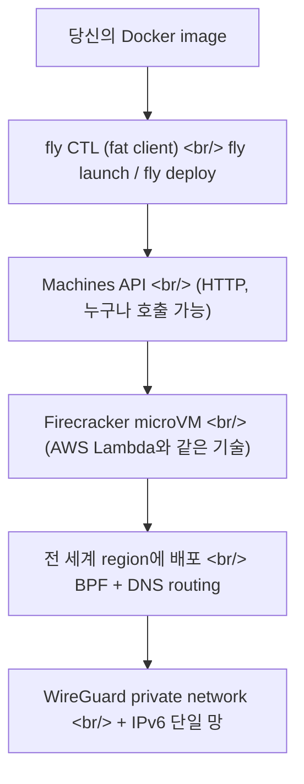

## 개요

Fly.io 공식 채널에서 짧은 영상 두 편을 봤다 — [What is Fly.io, anyway?](https://www.youtube.com/watch?v=O6KpRcJzTxs)와 [Fly Launch — How Fly.io uses Machines as a building block for everything](https://www.youtube.com/watch?v=VOZO7CfwPII). popcon에서 fly.io를 쓰면서 "Machines가 빌딩 블록이다"라는 말을 여러 번 들었는데, 이 영상들이 그 표현이 정확히 무슨 뜻인지 풀어준다.

<!--more-->

요약: Fly.io는 Docker image를 Firecracker microVM으로 변환해 Lambda와 동일한 격리 기술 위에서 돌리고, 전 세계 region에 깔린 머신을 단일 private network로 묶어준다. 이 머신을 만드는 API 자체가 일반 사용자에게도 노출되어 있어서, fly의 CLI도 결국 그 API를 호출하는 fat client일 뿐이다.

---

## Firecracker microVM = AWS Lambda와 같은 격리 기술

Fly의 설명에서 가장 인상 깊은 한 줄.

> Fly is a service that takes Docker images or OCI-compatible images and converts them to real virtual machines — microVMs — and runs them on **Firecracker, which is the same technology that runs AWS Lambda.**

이건 두 가지를 동시에 의미한다.

1. **컨테이너가 아니라 진짜 VM.** `cgroups` 격리가 아니라 KVM 기반 microVM. 보안 경계가 강하고, 다른 테넌트와 커널을 공유하지 않는다.
2. **Lambda 수준의 부팅 속도.** Firecracker microVM은 100ms 안에 부팅한다. 컨테이너 수준의 가벼움 + VM 수준의 격리.

Fly가 이걸 직접 채택한 이유는 명확하다. 모든 region에서 임의 사용자 Docker image를 받아 돌리려면 격리를 약하게 가져갈 수 없다. 컨테이너 escape 한 번이면 같은 호스트의 다른 사용자를 들여다본다. Firecracker는 그 위협 모델을 위해 만들어진 도구다.

부수 효과: 같은 image를 EC2, Lambda, Fly Machine으로 옮길 때 격리 모델이 거의 동일하다. 메모리 footprint와 부팅 시간만 비례 조정.

---

## Region 단일 private network — WireGuard + IPv6

Fly의 두 번째 클레임:

> All of your virtual machines around the world, no matter what region they are in, are in the same private network thanks to a WireGuard private network and IPv6.

**"앱 로직을 region별로 쪼갤 필요가 없다"**가 핵심. 일반적으로 multi-region을 하려면 region별 endpoint를 두고 cross-region replication을 따로 구성한다. Fly는 IPv6 + WireGuard로 모든 머신이 같은 `/64` 네트워크에 들어가서, region 간 호출이 그냥 internal IPv6 호출이다.

[popcon dev #11](/posts/2026-05-07-popcon-dev11/)에서 fly frontend에 warm machine 한 대를 두는 결정을 했는데, 이 모델 덕에 가능했다. 한 region(NRT) frontend 머신이 있고, GPU 워커는 RunPod에 있다. fly + RunPod 사이는 단일 fly 네트워크로 연결되니까 라우팅을 따로 신경 안 써도 된다.

라우팅은 BPF + DNS로 처리된다. Anycast IP를 발급받으면, 사용자의 요청이 자동으로 가장 가까운 region의 머신으로 라우팅된다. 사용자 입장에서는 단일 IP만 알면 되고, fly가 backend에서 가장 가까운 머신을 찾아준다.

---

## fly CTL이 fat client인 이유

영상 #2의 핵심 메시지.

> fly CTL is a fat client — it's not a thin client wrapping around API calls to the server of fly.io. It is actually a fat client where it does a lot of the work to use fly's API.

이게 무슨 뜻이냐면:

- `fly launch`는 Dockerfile을 자동 detect/생성, IP 할당, SSL 인증서 발급, `fly.toml` 생성 등 **여러 API 호출을 클라이언트에서 오케스트레이션**한다.
- 같은 작업을 사용자가 Machines API를 직접 호출해서 처리할 수도 있다 — `fly launch`는 그걸 한 줄로 묶어주는 편의 도구일 뿐.
- 배포 전략(blue/green, rolling, canary)도 클라이언트가 health check + machine 교체를 순차적으로 부른다.

이 패턴의 실용적 의미: **CLI가 막히는 일을 만나도, Machines API로 직접 우회 가능하다.** popcon에서 RunPod ID를 fly secret에 동기화하는 `sync-pod-id` 스크립트를 짤 때도 이 모델이 작동했다. fly CTL이 안 해주는 작업이 있으면 직접 API로.

`fly machine status <id> --json` 명령은 머신 단위 metadata를 직접 보여준다. fly CTL이 만든 머신에는 deploy version, version label 같은 metadata가 박혀 있어서, "이 머신이 fly CTL로 만들어졌나, 직접 API로 만들어졌나"를 구분할 수 있다.

---

## fly.toml과 Nomad 흔적

영상에서 잠깐 언급된 디테일:

> Machines platform — which is not to be confused with the older platform called Nomad that used to run on HashiCorp Nomad. That was the scheduler used. Now we have our own thing going on, we call that the machines platform.

Fly의 초기 아키텍처는 HashiCorp Nomad를 스케줄러로 썼다. v2부터는 자체 Machines 플랫폼으로 갈아탔다. `fly.toml`에 가끔 보이는 `[experimental]` 같은 섹션은 Nomad 시절 호환성 유산일 가능성이 있다.

이 결정은 회고적으로 좋아 보인다. Nomad는 범용 스케줄러라서 microVM 전용 워크로드의 특수성(빠른 콜드 스타트, image push, region affinity)을 직접 표현하기 어렵다. 자체 빌드한 Machines 플랫폼은 이 모든 걸 first-class로 다룬다.

---

## 인사이트

"Machines가 빌딩 블록"이라는 표현은 흔한 마케팅 카피로 들리지만, 영상을 보고 나니 두 가지 구체적 의미로 읽힌다.

1. **`fly launch`도 결국 Machines API의 클라이언트다.** 즉, fly가 우리에게 노출하는 추상화 모두가 같은 API 위에 있고, 우리가 같은 API를 직접 호출해서 새 추상화를 만들 수 있다. 자체 deploy orchestrator가 필요하면 짤 수 있다.
2. **격리 모델이 강하다는 게 multi-tenant 가격 책정을 가능하게 한다.** 컨테이너 호스트가 아니라 microVM 호스트라서, 사용자가 신뢰할 수 없는 image를 올려도 안전하다.

popcon에서 fly + RunPod hybrid 구조를 쓰는데, fly는 reliable한 스테이트풀 부분(API, frontend, DB, R2 클라이언트)을 맡고 RunPod은 GPU-heavy 워커를 맡는다. 두 클러스터 사이의 통신이 fly의 IPv6 private network 위에서 깨끗하게 흐르는 게 운영 관점에서 큰 이점이다.

다음에 살펴볼 것: fly의 Anycast IP가 실제로 어떻게 작동하는지(BPF로 어떻게 라우팅이 결정되는지), Machines API를 직접 호출해서 deploy를 짠 사례들, fly의 region pricing.
