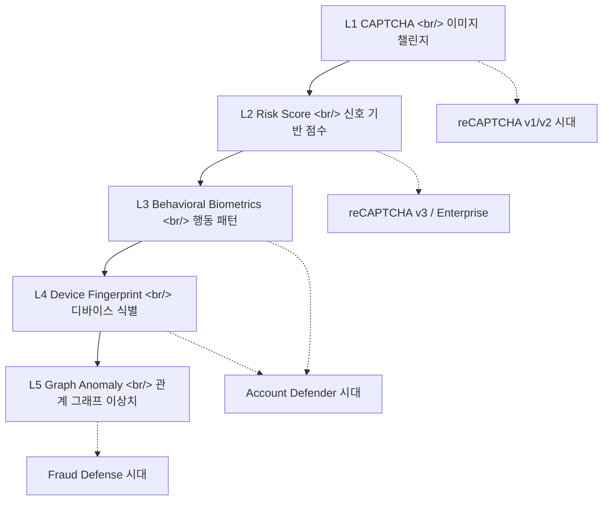
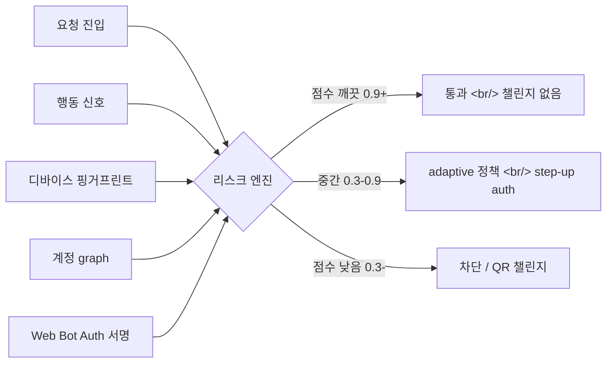
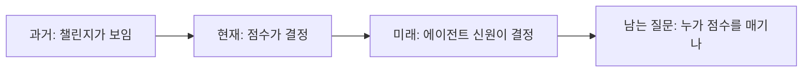

## 개요

2026-04-23 [Google Cloud Next '26](https://cloud.withgoogle.com/next)에서 [Google Cloud Fraud Defense](https://cloud.google.com/blog/products/identity-security/introducing-google-cloud-fraud-defense-the-next-evolution-of-recaptcha/)가 공개됐다. 공식 문구는 "the next evolution of [reCAPTCHA](https://cloud.google.com/security/products/recaptcha)". 핵심 변화는 한 줄 — **"이 사용자가 인간인가?"에서 "이 세션이 학습된 공격 패턴과 일치하는가?"** 로 질문이 바뀌었다.

<!--more-->

## 1. reCAPTCHA 18년 진화의 끝점

[reCAPTCHA](https://en.wikipedia.org/wiki/ReCAPTCHA)는 [카네기 멜런 대학](https://www.cmu.edu/)에서 2007년 시작됐다. 2009년 [Google이 인수](https://googleblog.blogspot.com/2009/09/teaching-computers-to-read-google.html), 책 디지털화 부산물로 시작한 프로젝트가 18년이 지나 봇 경제의 최전선 인프라가 됐다.

| 시기 | 버전 | 핵심 메커니즘 | 무너뜨린 기술 |
|---|---|---|---|
| 2007–2017 | v1 | 왜곡 텍스트 OCR | OCR 정확도 99% 돌파 |
| 2014–현재 | v2 | "I'm not a robot" + 이미지 그리드 | 이미지 인식 + 머신비전 |
| 2018–현재 | [v3](https://developers.google.com/recaptcha/docs/v3) | 백그라운드 risk score (0.0–1.0) | 화이트박스 우회 |
| 2020–현재 | [reCAPTCHA Enterprise](https://docs.cloud.google.com/recaptcha/docs/compare-tiers) | Cloud 통합 + Account Defender | 자동화 봇 클러스터링 |
| 2026– | **Fraud Defense** | Agentic policy + 신뢰 그래프 | AI 에이전트 위장 |

[v1 deprecate 공지는 2017-10-18](https://developers.google.com/recaptcha/docs/changelog)였고 2018-04-01 셧다운. v3가 같은 해 2018-10-29 등장한 건 우연이 아니다. **챌린지 기반 → 점수 기반** 전환의 시작이다.

[reCAPTCHA Enterprise](https://cloud.google.com/security/products/recaptcha)로 넘어오면서 [Account Defender](https://cloud.google.com/blog/products/identity-security/use-account-defender-in-recaptcha-enterprise-to-protect-accounts)와 [Password Leak Detection](https://docs.cloud.google.com/recaptcha/docs/passwords-leaked-detection)이 붙었다. 후자는 Google이 보유한 **40억 건 이상의 유출 자격증명 데이터베이스**에 패스워드를 해시 비교하는 기능이다. 이미 여기서 단순 봇 차단을 넘어 자격증명 stuffing 방어로 영역이 넘어왔다.

## 2. Fraud Defense가 실제로 무엇인가

[공식 블로그](https://cloud.google.com/blog/products/identity-security/introducing-google-cloud-fraud-defense-the-next-evolution-of-recaptcha/)와 [제품 페이지](https://cloud.google.com/security/products/fraud-defense)를 종합하면 세 축으로 정리된다.

### 축 1 — Agentic Activity Measurement

[Web Bot Auth](https://developers.cloudflare.com/bots/reference/bot-verification/web-bot-auth/)와 [SPIFFE](https://spiffe.io/) 같은 표준을 통한 에이전트 신원 측정. Web Bot Auth는 [IETF에서 2026년 초 워킹그룹 차터](https://www.ietf.org/archive/id/draft-meunier-webbotauth-registry-01.html)가 통과된 신생 표준으로, AI 에이전트가 HTTP 요청에 **개인키로 서명**을 붙이고 사이트가 공개키 디렉터리에서 검증하는 방식이다. [Cloudflare](https://blog.cloudflare.com/web-bot-auth/), [DataDome](https://datadome.co/changelog/web-bot-auth-verifying-user-identity-ensuring-agent-trust/)도 같은 표준을 채택. [Visa TAP](https://corporate.visa.com/en/products/visa-trusted-agent-protocol.html)와 [Mastercard Agent Pay](https://www.mastercard.com/news/press/2025/april/mastercard-unveils-agent-pay-pioneering-agentic-payments-technology/)도 이 위에서 동작한다.

### 축 2 — Agentic Policy Engine

리스크 점수, 자동화 유형, 에이전트 identity에 따라 단계별 허용/차단을 거는 정책 엔진. 기존 [reCAPTCHA Enterprise Action](https://docs.cloud.google.com/recaptcha/docs/actions-website)의 확장판이다 — 로그인/회원가입/결제/체크아웃을 lifecycle 전체로 묶어서 한 번에 본다.

### 축 3 — AI-Resistant Challenge

폰으로 스캔하는 **QR 코드 챌린지**. 자동화의 경제성을 깨려는 시도다. 그러나 같은 패턴이 이미 [Web Environment Integrity](https://en.wikipedia.org/wiki/Web_Environment_Integrity)에서 [거센 반발](https://www.theregister.com/2023/07/25/google_web_environment_integrity/)을 받았고, [Private Captcha의 비판 글](https://privatecaptcha.com/blog/google-cloud-fraud-defence-wei/)은 "Fraud Defense는 WEI를 다시 포장한 것"이라는 주장도 한다. [EFF](https://www.eff.org/deeplinks/2023/08/your-computer-should-say-what-you-tell-it-say-1)는 WEI를 "웹의 DRM화"라고 불렀다.

## 3. 마찰 레이어 vs 리스크 엔진 레이어

가장 정확한 표현은 이렇다:

> **reCAPTCHA는 마찰(friction) 레이어였다. Fraud Defense는 리스크 엔진 레이어다.**

마찰 레이어의 일은 **사용자 앞에 챌린지를 박는 것**이었다. 리스크 엔진 레이어의 일은 **세션을 보고 학습된 공격 패턴과 비교해 점수를 내는 것**이다. 점수가 깨끗하면 사용자는 챌린지를 아예 보지 않는다. Google이 인용하는 [2025 Shopify Retail Report](https://www.shopify.com/retail/the-future-of-retail) 기준 AI 쇼핑 어시스턴트가 평균 주문 금액을 **25% 끌어올린다**는 데이터가 있다 — UX 마찰을 제거할 만큼의 비즈니스 동력이 생긴 셈이다.

Google이 공개한 효과 수치는 **계정 탈취(ATO) 평균 51% 감소**. 이건 챌린지 통과율이 아니라 **결과 지표** — 마찰 레이어에서 리스크 엔진 레이어로 넘어왔을 때 의미가 생기는 숫자다.

## 4. 경쟁 지형 — Turnstile / WAF Bot Control / Akamai / Arkose

Fraud Defense는 진공 상태에서 나온 게 아니다. 봇/사기 방어 시장은 이미 layered다.

| 벤더 | 제품 | 포지셔닝 |
|---|---|---|
| Cloudflare | [Turnstile](https://www.cloudflare.com/products/turnstile/) + [Bot Management](https://www.cloudflare.com/application-services/products/bot-management/) | edge CDN과 통합된 invisible challenge |
| AWS | [WAF Bot Control](https://aws.amazon.com/waf/features/bot-control/) | rule 기반, AWS 생태계 native |
| Akamai | [Bot Manager](https://www.akamai.com/products/bot-manager) | 엔터프라이즈 머신러닝, [Shape Security](https://www.f5.com/products/security/shape-ai-fraud-engine) 인수 영향 |
| F5 | [Distributed Cloud Bot Defense](https://www.f5.com/cloud/products/bot-defense) | Shape 기반, 금융사 강세 |
| Imperva | [Advanced Bot Protection](https://www.imperva.com/products/bot-management/) | WAF 일체형 |
| Arkose Labs | [Arkose Bot Manager](https://www.arkoselabs.com/arkose-bot-manager/) | 챌린지 기반, 게이밍/소셜 강세 |
| Sardine | [Sardine](https://www.sardine.ai/) | 행동 바이오메트릭스 중심 |
| BioCatch | [BioCatch](https://www.biocatch.com/) | 마우스/타이핑 패턴 |
| DataDome | [DataDome](https://datadome.co/) | API-first, Web Bot Auth 조기 채택 |

Google의 차별점은 **데이터 풋프린트의 규모**다. 공식 자료에 따르면 fraud intelligence graph는 [Fortune 100](https://fortune.com/ranking/fortune500/)의 50% + 전 세계 **1400만+ 도메인**을 커버한다. 마찰 자체가 사라지는 방향이라면 — **신호의 풍부함이 결정적 차별점**이 된다. 신호가 많을수록 점수가 정확해지고, 점수가 정확할수록 마찰 없이 가도 된다.

## 5. 규제 백드롭 — PSD2 SCA, FTC 봇 룰메이킹

빌더가 잊으면 안 되는 맥락: 이런 제품은 **규제 환경의 산물**이다.

- [PSD2 SCA](https://en.wikipedia.org/wiki/Strong_customer_authentication)는 EU에서 2019-09-14 발효. 전자결제에 multi-factor authentication 강제. [Stripe SCA 가이드](https://stripe.com/guides/strong-customer-authentication) 기준 knowledge / possession / inherence 중 최소 2개 요구. SCA는 챌린지를 강제하지만, **TRA(Transaction Risk Analysis) 면제** 조항이 있어 리스크 점수가 충분히 낮으면 SCA를 skip할 수 있다. → 리스크 엔진의 정확도가 그대로 결제 전환율로 환산된다.
- [FTC의 봇 룰메이킹](https://www.ftc.gov/policy/advocacy-research/tech-at-ftc/2023/06/keeping-fake-reviews-out-shopping-results)은 가짜 리뷰/가짜 계정에 대해 강도를 높여왔고, [FCC AI robocall 결정](https://www.fcc.gov/document/fcc-makes-ai-generated-voices-robocalls-illegal)은 음성 채널을 좁혔다.
- [GDPR](https://gdpr.eu/)와 [한국 개인정보보호법](https://www.law.go.kr/법령/개인정보보호법) 기준 행동 바이오메트릭스 데이터는 민감정보에 가까워 — Fraud Defense가 수집·공유하는 신호의 법적 지위는 여전히 회색이다.

## 6. AI-on-AI 방어 — 같은 무기, 다른 표적

가장 솔직한 표현은 이거다 — **공격자도 방어자도 같은 LLM에 접근한다.** [Anthropic의 위협 인텔리전스 리포트](https://www.anthropic.com/news/threat-intelligence-report-2026)는 2026년 들어 LLM 보조 자격증명 stuffing/피싱이 산업화됐음을 기록했다. [OpenAI의 Trusted Access for Cyber](https://openai.com/index/scaling-trusted-access-for-cyber-defense/)는 검증된 방어자만 풀어주는 비대칭 정책이다. Fraud Defense의 agentic policy engine은 같은 비대칭을 봇 트래픽 측에서 만든다 — **선한 에이전트는 인증해서 통과, 악의적 에이전트는 점수로 거른다.**

문제는 "선한 에이전트"의 정의를 누가 정하느냐다. [OpenAI](https://openai.com/), [Anthropic](https://www.anthropic.com/), [Perplexity](https://www.perplexity.ai/) 같은 1티어 벤더는 Web Bot Auth에 쉽게 합류한다. 자체 모델을 돌리는 소규모 빌더는? [Hugging Face Spaces](https://huggingface.co/spaces)에서 띄운 에이전트는? 표준이 합의되기 전까지는 점수에 의해 결정된다 — 그리고 점수는 **Google이 학습한 모델**이 매긴다.

## 7. 앱 빌더가 신경 써야 할 것

기존 [reCAPTCHA Enterprise](https://docs.cloud.google.com/recaptcha/docs/compare-tiers) 사용자는 마이그레이션 없음, 가격 변화 없음, 사이트 키 그대로. 그럼에도 실무에서 챙겨야 할 게 있다.

1. **계정 식별자(hashedAccountId)를 반드시 전달.** [Account Defender 어세스먼트](https://docs.cloud.google.com/recaptcha/docs/samples/recaptcha-enterprise-account-defender-assessment)는 stable account id 없으면 활동 모델을 못 만든다.
2. **lifecycle 전체에 Action 박기.** 로그인/회원가입은 기본, **결제와 체크아웃에도 박을 것**. Fraud Defense는 lifecycle 상관관계 분석으로 정확도가 올라간다.
3. **false-positive 구제 경로 설계.** 점수가 깨끗하지 않다고 즉시 차단하지 말 것. step-up auth([WebAuthn](https://webauthn.io/) / [passkey](https://passkeys.dev/) / OTP)로 단계화. [Cloud Armor](https://cloud.google.com/armor)와 [reCAPTCHA Enterprise for WAF](https://codelabs.developers.google.com/codelabs/cloud-armor-recaptcha-bot-management) 통합 시 edge에서도 같은 정책을 박을 것.
4. **에이전트 트래픽 분리 관측.** "사용자가 에이전트를 통해 들어오는 케이스"는 곧 일반 트래픽이 된다. agentic activity dashboard로 인간/봇/에이전트 비율을 본다.
5. **데이터 공유 위치 점검.** Fraud Defense는 글로벌 graph에 기여한다. **민감 도메인(헬스케어/금융)**은 [데이터 레지던시](https://cloud.google.com/security-and-identity/data-residency) 옵션과 어떤 신호가 graph로 흘러나가는지 명시적으로 확인 필요.

## 8. 묶어서

reCAPTCHA가 18년 동안 한 일은 "이 사용자가 인간이냐"를 묻는 것이었다. Fraud Defense가 시작한 일은 "이 세션이 위험하냐"를 묻는 것이다. **마찰 레이어에서 리스크 엔진 레이어로의 이동**은 사용자 경험을 개선하지만 — **Google의 risk score에 대한 의존성**을 거꾸로 키운다. 점수가 잘못 나오면? false-positive 구제 경로는 빌더가 직접 설계해야 한다. agentic web 시대의 신뢰는 무료로 오지 않는다.

## 인사이트

가장 흥미로운 신호는 **챌린지 UI가 사라지는 방향**이다. Google이 [Cloudflare Turnstile](https://www.cloudflare.com/products/turnstile/)처럼 invisible verification으로 가는 동시에 — **AI-resistant QR 챌린지를 안전판으로 깔았다**는 점이다. 점수가 충분히 깨끗할 때는 마찰이 없고, 점수가 의심스러울 때만 폰을 꺼낸다. 이건 사실상 [WEI가 못 한 일을 우회로 달성](https://privatecaptcha.com/blog/google-cloud-fraud-defence-wei/)하는 시나리오 — 브라우저 attestation을 강제하지 않고도, **휴대폰이라는 신뢰 디바이스**를 challenge에 끌고 들어와 같은 효과를 낸다. 다음 분기 가장 빠르게 변할 영역은 **결제 시점의 SCA 면제율**이다. Fraud Defense의 score를 결제 PSP가 TRA 면제 근거로 받아주기 시작하면, 전환율 측면에서 압도적인 경쟁우위가 된다. 빌더에게 실용적 결론: **lifecycle 전체에 Action 박고, hashedAccountId 흘리고, false-positive 구제 경로(WebAuthn step-up)를 미리 설계**. 점수의 정확도가 곧 매출 곡선이 되는 시대다.

## 참고

**Google Cloud 공식 자료**
- [Introducing Google Cloud Fraud Defense (Cloud Blog)](https://cloud.google.com/blog/products/identity-security/introducing-google-cloud-fraud-defense-the-next-evolution-of-recaptcha/)
- [Fraud Defense 제품 페이지](https://cloud.google.com/security/products/fraud-defense)
- [reCAPTCHA 제품 페이지](https://cloud.google.com/security/products/recaptcha)
- [Account Defender 문서](https://docs.cloud.google.com/recaptcha/docs/account-defender)
- [reCAPTCHA Enterprise + Cloud Armor codelab](https://codelabs.developers.google.com/codelabs/cloud-armor-recaptcha-bot-management)
- [Next '26 Security Keynote 정리](https://cloud.google.com/blog/products/identity-security/next26-redefining-security-for-the-ai-era-with-google-cloud-and-wiz)

**표준 / 프로토콜**
- [Web Bot Auth (Cloudflare docs)](https://developers.cloudflare.com/bots/reference/bot-verification/web-bot-auth/)
- [Web Bot Auth IETF draft](https://www.ietf.org/archive/id/draft-meunier-webbotauth-registry-01.html)
- [SPIFFE](https://spiffe.io/) · [WebAuthn](https://webauthn.io/) · [Passkeys](https://passkeys.dev/)
- [Web Environment Integrity 위키](https://en.wikipedia.org/wiki/Web_Environment_Integrity)

**경쟁 / 비교**
- [Cloudflare Turnstile](https://www.cloudflare.com/products/turnstile/) · [AWS WAF Bot Control](https://aws.amazon.com/waf/features/bot-control/) · [Akamai Bot Manager](https://www.akamai.com/products/bot-manager)
- [Arkose Bot Manager](https://www.arkoselabs.com/arkose-bot-manager/) · [DataDome](https://datadome.co/) · [BioCatch](https://www.biocatch.com/) · [Sardine](https://www.sardine.ai/)
- [Private Captcha — Fraud Defense WEI 비판](https://privatecaptcha.com/blog/google-cloud-fraud-defence-wei/)

**규제 / 배경**
- [PSD2 Strong Customer Authentication](https://en.wikipedia.org/wiki/Strong_customer_authentication) · [Stripe SCA 가이드](https://stripe.com/guides/strong-customer-authentication)
- [EFF — WEI 비판](https://www.eff.org/deeplinks/2023/08/your-computer-should-say-what-you-tell-it-say-1)
- [Visa Trusted Agent Protocol](https://corporate.visa.com/en/products/visa-trusted-agent-protocol.html) · [Mastercard Agent Pay](https://www.mastercard.com/news/press/2025/april/mastercard-unveils-agent-pay-pioneering-agentic-payments-technology/)
