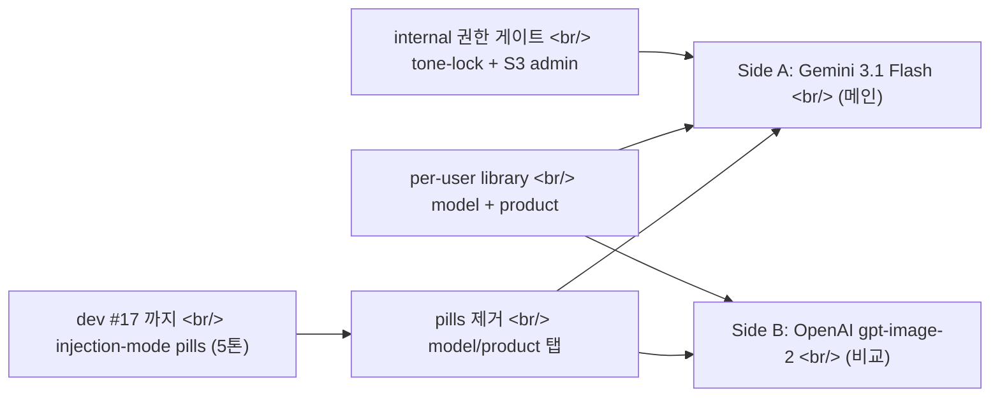
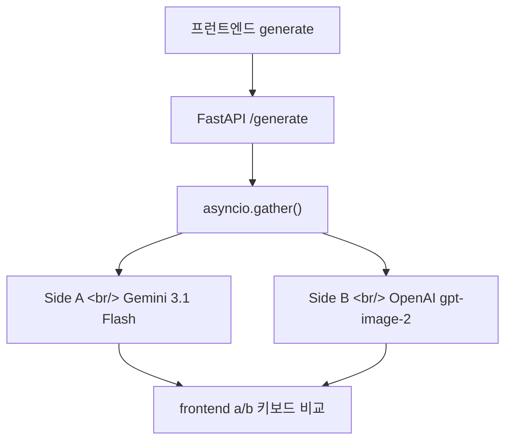
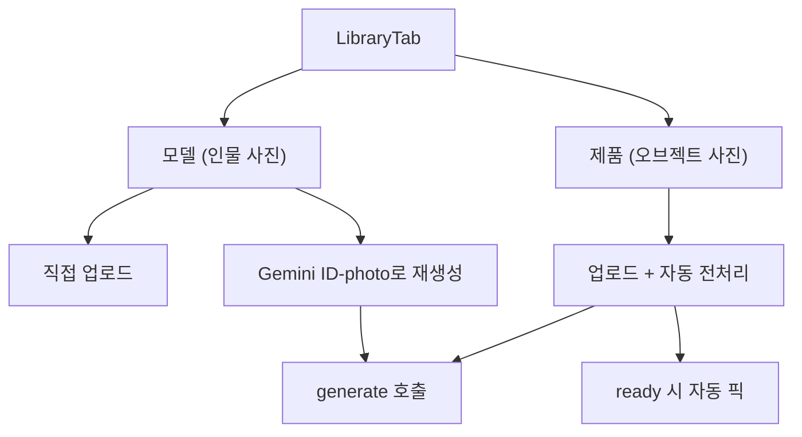
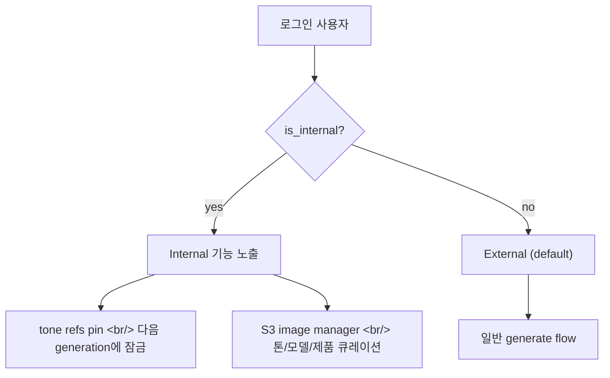

## 개요

[이전 글: #17 — 톤 풀 swap, 모델 인젝션 prompt v2](/posts/2026-04-22-hybrid-search-dev17/)을 쓴 이래 73개 커밋이 들어갔다. 가장 큰 변화는 **인젝션 모드 자체를 버린 것** — 한 화면에 여러 톤 모드를 펼쳐놓던 UX를 모델/제품 탭 두 개로 단순화했다. 동시에 비교용 사이드 B를 OpenAI gpt-image-2로 라우팅하기 시작했다.

<!--more-->

73개 커밋을 다섯 흐름으로 묶었다.

---

## OpenAI gpt-image-2를 사이드 B로 합류

지금까지 hybrid는 Gemini 단일 백엔드였다. dev #18에서는 비교 평가를 위해 사이드 B를 OpenAI `gpt-image-2`로 라우팅하기 시작했다.

핵심 커밋:

- **`AsyncOpenAI` 클라이언트와 OpenAI image-gen config 와이어링** (`052d42f`) — 환경 변수, 타임아웃, retry 정책을 backend config에 추가.
- **공유 image IO helper와 OpenAI image service** (`1fb9b43`) — Gemini와 OpenAI 응답을 공통 포맷으로 변환하는 어댑터.
- **5톤 → side A/B 의미론으로 리팩터링** (`d91067e`, `ec38fa8`) — `tone3`, `tone5` 같은 필드명을 `side_a`, `side_b`로 교체. 더 이상 톤 종류가 아니라 비교용 측면이라는 의미.
- **gather에서 cancellation 차단 + unsupported quality 파라미터 제거** (`8759a78`) — `asyncio.gather`는 한쪽 task가 raise하면 다른 쪽이 cancel될 수 있다. 둘 다 살리려면 `return_exceptions=True`로 shield하고 따로 처리.

코너 케이스 두 개:
- **aspect ratio 매핑** — gpt-image-2는 `1024x1024`, `1024x1792`, `1792x1024`만 지원 (`97f7204`). UI에서 입력한 임의 비율을 가장 가까운 지원 사이즈로 매핑.
- **B 실패 메시지 surface** (`7d31f62`) — 비교용 사이드라도 실패하면 UI에 알려줘야 한다. 조용히 빠지면 비교 결과가 한쪽만 나와서 혼란.

---

## 인젝션 모드 폐기, 모델/제품 라이브러리 도입

dev #17까지는 "tone injection mode"라는 추상화가 있었다. 5톤 × 사용자 업로드 모델 × 옵션 매트릭스가 화면에 펼쳐져서 학습 비용이 높았다. dev #18에서 정면으로 갈아치웠다 — **모델 탭과 제품 탭 두 개**.

흐름:

1. **사용자별 자산 라이브러리** (`b933191`) — 업로드한 모델/제품을 사용자 계정에 저장. 다른 톤 만들 때 재사용 가능.
2. **인젝션 모드 pill을 모델/제품 탭으로 교체** (`1450767`) — UI 단순화. "어떤 모드를 쓸지" 정하는 단계가 사라졌다.
3. **모델 ID-photo 재생성** (`db64b05`) — 업로드한 인물 사진을 Gemini로 ID 사진 스타일로 정제. 일관성 있는 모델 슬롯을 만들기 위함.
4. **role-aware prompt directives** (`ffb8ccf`) — 모델/제품 레퍼런스가 프롬프트에 들어갈 때 역할이 명시된다. "이 사람을 모델로", "이 오브젝트를 제품으로".
5. **제품 업로드 자동 전처리 + ready 시 자동 픽** (`69db8c2`) — 업로드 → 백그라운드 전처리 → 끝나면 자동으로 활성화. 사용자가 한 단계 덜 누른다.
6. **processing state surfacing + toast** (`f3ff587`) — 전처리 중인 자산은 별도 상태로 표시. 어색한 silent wait 제거.

중간에 한 번 후퇴가 있었다. **모델 자동 인젝션을 켰다 껐다 다시 켰다**:
- `bdf0aae` — auto model injection 끄고 직접 업로드만 (label wrap 버그도 같이 픽스)
- `394f91f` — auto model injection 다시 복원, generated-image drop도 받게

직접 업로드 only일 때 사용자가 이미지를 한 장씩 올려야 해서 마찰이 컸다. 결국 자동 인젝션이 default가 되고, 직접 업로드는 옵션으로 남았다.

---

## 톤 풀 큐레이션: 0428 → 0429 → 0504

생성 품질의 8할은 톤 레퍼런스 풀에서 나온다. 풀이 너무 다양하면 결과가 뒤죽박죽되고, 너무 좁으면 모든 결과가 비슷해진다.

이번 사이클의 큐레이션 작업:

- **0428 모델 셀렉션 풀로 model_image_ref 스왑** (`c1e5d39`) — 0428 셋이 더 일관된 lighting을 보여줘서 메인 모델 풀 교체.
- **two-category tones + person-aware model slot** (`cb3a260`) — 톤을 2개 카테고리(natural/film, studio/clean)로 나누고, 인물이 있는 톤일 때만 모델 슬롯 활성화.
- **0429 subfolder로 auto-pick 스코프 제한** (`27d335d`) — 자동으로 톤을 고를 때 0429 큐레이션 셋만 후보로 둠. 노이즈 컷.
- **slug-named tone refs를 generation_logs에 rewrite** (`76a1a64`) — S3 corpus를 swap하면서 path naming이 바뀌어서 기존 로그를 다시 매핑.
- **a(natural,film) 톤 풀 0429 → 0504 reseed** (`c43214e`, 마지막 커밋) — 가장 자주 쓰이는 톤 카테고리를 최신 셋으로 교체.

`scripts/`에 S3 corpus swap 유틸리티들을 기록으로 남겼다 (`f169dd4`). 다음 큐레이션 사이클에서 같은 작업을 반복할 때 쓸 수 있게.

`nginx` 한 줄 픽스도 의외로 컸다 (`9f252ff`). 백엔드 타임아웃과 nginx의 `/api/` 타임아웃이 어긋나서, OpenAI 응답이 느릴 때 nginx가 먼저 502를 던지고 백엔드의 retry까지 trigger하는 이상한 상황이 있었다. 정렬 + upstream retry 비활성화로 해결.

---

## Internal vs External: 권한 분리

이 사이클에서 처음으로 **internal 사용자**(팀 내부) 개념이 들어왔다. 데모 데이/외부 베타에서는 보여주면 안 되는 기능들이 있었기 때문.

세 PR로 분리해서 머지:
- **PR #16 — internal-vs-external user tiers + UI gating** (`f33e9d0`) — DB에 `is_internal` 컬럼 추가, UI에서 internal-only 컴포넌트는 plain `<></>`로 단락.
- **PR #17 — internal-only tone-lock** (`199a405`) — 같은 톤 레퍼런스를 여러 generation에 고정해서 비교 evaluation을 깨끗하게.
- **PR #18 — internal-only S3 image manager** (`8096425`) — 웹 UI에서 톤/모델/제품 corpus를 직접 관리. 이전엔 S3 콘솔로 직접 들어가야 했다.

`feat/admin-s3-manager` 브랜치는 main을 두 번 머지해야 했다 (`9d5fa1e`, `a35bf53`). 다른 흐름들이 동시에 들어가서 conflict가 누적됐다 — 큰 흐름 머지 직후에 admin 브랜치를 sync해두는 게 좋다는 교훈.

---

## 카메라/렌즈 피커 UX 다듬기

카메라/렌즈 선택 UX를 한 사이클 동안 한 줄씩 다듬었다.

| 커밋 | 내용 |
|------|------|
| `2439c98` | angle picker dropdown에 thumbnail 표시 (선택 전 미리보기) |
| `4f615a7` | 레퍼런스 이미지 hover 시 zoom 버튼 노출 |
| `5be9daa` | "카메라 & 렌즈"로 이름 변경, 렌즈 random default, 모델 creator 추가 |
| `b4aeed3` | None 옵션 명시 표시 + LensPicker에 None 선택지 |
| `228ff9f` | LensPicker가 선택 후 자동 닫힘 |
| `024253e` | angle/lens default가 none일 때도 picker 클릭 가능 |
| `bb13dd3` | 하단 바 정리 — General + Edit 우측 + 활성 상태 강화 |
| `020c509` | generation prompt 입력창에 여백 추가 (multiline 친화) |
| `8208a11` | library tab + prompt area zoom + transparent overlay |
| `349d142` | preview 모달에서 auto-pick 필터 re-roll, dead label 제거 |
| `a-z 단축키` | A/B 비교용 화살표 + 'a','b' 키보드 비교 (`fad542e`) |

마지막 키보드 비교 단축키가 의외로 좋았다. 마우스로 두 결과 사이를 왔다갔다 하다가 'a'/'b' 키만 누르면 토글 — 비교 평가 속도가 체감 2배.

---

## 인사이트

dev #17에서 #18로 오면서 **추상화를 줄이는 게 진보였다.** "tone injection mode"라는 5축짜리 추상화는 사용자에게 코드 모델을 강요하는 거였고, 실제 mental model은 "사람을 넣을지 / 물건을 넣을지" 둘 중 하나다. 모델/제품 두 탭으로 줄인 게 정답.

OpenAI 사이드 B 라우팅도 같은 결의 결정. 단일 모델로 evaluation을 추측하는 것보다 두 모델 응답을 나란히 보고 키보드로 토글하는 게 빠르다. `asyncio.gather` shield 같은 디테일이 신경 쓰이지만, 한쪽이 죽었을 때 어떻게 처리할지 명시적으로 정해두면 같은 패턴을 재사용할 수 있다.

권한 게이트는 의외로 작은 변화로 큰 효과를 본 케이스. `is_internal` 컬럼 하나 + UI에서 conditional rendering, 그러면 internal-only S3 admin이나 tone-lock 같은 기능을 메인 코드베이스에 두면서도 외부 사용자에게는 안 보이게 할 수 있다. 별도 admin 앱으로 빼지 않은 게 비용을 크게 아꼈다.

다음 dev #19에서 다룰 것: gpt-image-2의 quality A/B 결과 정리, 모델 라이브러리에 group 개념(여러 사람 한 번에) 추가, internal tone-lock을 external로 풀어줄 조건.
