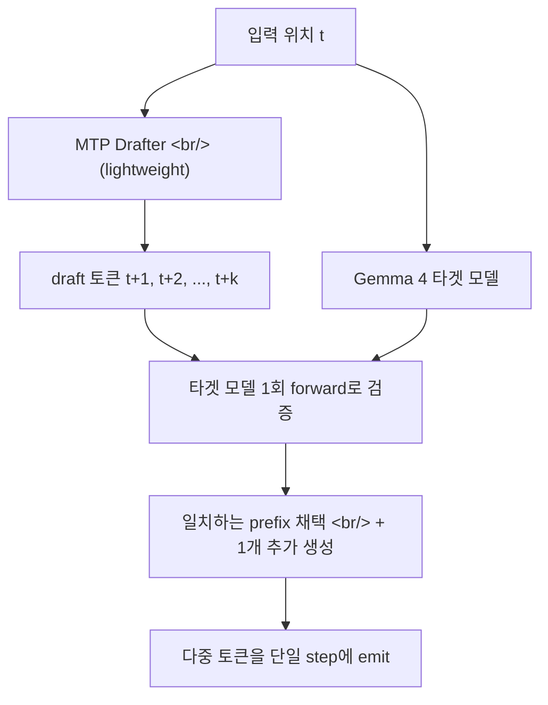

## 개요

Google의 온디바이스 LLM 런타임 [LiteRT-LM](https://ai.google.dev/edge/litert-lm)이 [v0.11.0](https://github.com/google-ai-edge/LiteRT-LM/releases/tag/v0.11.0)을 풀었다. 핵심 두 가지: Gemma 4를 위한 **Single Position Multi-token Prediction (MTP)** 으로 모바일 GPU 디코드 속도가 2배 이상 빨라졌고, **Windows 네이티브**(CPU + GPU)가 처음으로 정식 지원된다. 같은 시기 워크스테이션 진영(DGX Spark + Qwen3.5)에서도 MTP-2가 +36% 속도를 보여준 만큼, MTP가 모바일부터 워크스테이션까지 가로지르는 **공통 디코드 가속 기법**으로 빠르게 표준화되는 흐름이 보인다.

Update 2026-05-11: 커뮤니티에서 Unity 래퍼가 공개됐다 — 본문 후반부에서 다룬다.

<!--more-->



## 1. Gemma 4 Multi-token Prediction 지원

[릴리스 노트](https://github.com/google-ai-edge/LiteRT-LM/releases/tag/v0.11.0)의 첫 줄: **"모바일 GPU에서 디코드 속도 2배 이상, 품질 저하 zero"**. 그 뒤 메커니즘은 [Gemma 4용 MTP를 다룬 Google 블로그](https://blog.google/innovation-and-ai/technology/developers-tools/multi-token-prediction-gemma-4/)와 [공식 문서](https://ai.google.dev/edge/litert-lm/models/gemma-4)에 정리돼 있다.

핵심은 **speculative decoding의 변형**이다.

- 한 위치(single position)에서 lightweight **drafter**가 미래 여러 토큰을 한 번에 예측
- 큰 **target 모델**(예: Gemma 4 26B/31B)이 한 번의 forward로 draft sequence 전체를 검증
- target이 동의하면 prefix 전체 채택 + 추가 토큰 1개를 자체 생성

표준 LLM 추론이 **memory-bandwidth bound** 라서 대부분의 사이클이 파라미터 전송에 쓰이는데, MTP는 같은 메모리 패스에서 더 많은 토큰을 뽑아내는 식으로 이 병목을 비튼다.

**플랫폼별 가속:**

| 플랫폼 | 백엔드 | 속도 향상 |
|---|---|---|
| 모바일 GPU (Samsung S26 Ultra, iPhone 17 Pro 등) | GPU | 최대 2.2× decode |
| 모바일 CPU | CPU | 최대 1.5× decode |
| Apple Silicon (M4 MacBook Pro) | CPU + SME | 큰 개선 (batch 4–8에서 약 2.2×) |
| NVIDIA RTX PRO 6000 (26B) | GPU | 약 50% latency 감소 |
| NVIDIA RTX 4090 / Linux ARM | GPU | 일관된 가속 |

**중요 디테일** — GPU 워크로드에서는 universally 권장, E4B는 CPU에서도 권장. **E2B는 CPU에서 freeform 생성 시 약간 느려질 수 있음** — rewrite/summarization/coding 같이 input prefix가 긴 태스크에선 여전히 이득.

지원 모델은 [`Gemma-4-E2B`](https://ai.google.dev/edge/litert-lm/models/gemma-4) (2.58 GB) / `Gemma-4-E4B` (3.65 GB)가 우선이고 26B A4B, 31B는 곧.

## 2. Windows 네이티브 지원

[LiteRT-LM CLI](https://ai.google.dev/edge/litert-lm/cli)가 Windows에서 **CPU와 GPU 백엔드 모두** 네이티브로 동작한다. 이전엔 Linux/macOS/Android 위주라 Windows 개발자는 WSL을 거쳐야 했다.

```bash
litert-lm run --from-huggingface-repo=litert-community/gemma-4-E2B-it-litert-lm
```

명시되지 않은 의도가 분명히 보인다 — **워크스테이션/노트북 개발자를 곧장 끌어들이는 이동 경로**다. Android 디바이스 없으면 손대기 어렵던 진입 장벽이 사라진다.

## 3. LiteRT 스택 — TF Lite의 후속

조금 떨어져서 보면 이게 어디 들어맞는지 보인다.

- **TensorFlow Lite**(이전 이름) → [LiteRT](https://ai.google.dev/edge/litert) (Light Runtime, 2024 리브랜드)
- **LiteRT-LM** = LLM에 특화된 LiteRT 변형
- 모델 패밀리: [Gemma](https://ai.google.dev/gemma) — Google의 오픈 가중치 LLM
- 타겟: **온디바이스 추론** — 모바일, 엣지, 임베디드, 데스크톱

Apache 2.0 라이선스. CPU + GPU + (Apple Silicon에서) SME 백엔드. Hugging Face와 직접 연결되는 [`litert-community`](https://huggingface.co/litert-community) 레포.

## 4. MTP가 표준이 되는 중

흥미로운 건 MTP가 한 회사 / 한 모델 패밀리의 트릭이 아니라는 점이다.

- 며칠 전 [albond DGX Spark + Qwen3.5 포스트](#)에서도 **MTP-2** 가 +36% 디코드 속도를 보여줬다 — 워크스테이션 클래스 GPU에서.
- Gemma 4 + LiteRT-LM은 같은 아이디어를 **모바일 GPU에서 2.2×**로 뽑아낸다.
- 두 케이스 모두 **품질 저하 zero** — target 모델이 최종 검증을 하기 때문.

MTP가 자리잡는 위치는 **inference-time 가속의 사실상 표준**이다. transformer attention이 표준이 됐듯, 향후 1년 안에 거의 모든 production decoder에 어떤 형태로든 들어갈 가능성이 높다.

## 5. 클라우드와 엣지의 동시 발전

같은 날 OpenAI는 [Realtime 음성 모델 3종](https://openai.com/index/advancing-voice-intelligence-with-new-models-in-the-api)과 [MRC 슈퍼컴 네트워킹](https://openai.com/index/mrc-supercomputer-networking)을 풀었고, 같은 날 Google은 LiteRT-LM v0.11.0을 풀었다. 한쪽은 **단일 회사가 5사 컨소시엄을 이끌고 슈퍼컴 표준을 만드는** 그림, 다른 한쪽은 **한 손에 들어가는 디바이스에서 LLM이 production-ready로 돌아가게 만드는** 그림. 양쪽 다 production-ready라는 점이 핵심이다 — LLM은 더 이상 "클라우드 vs 엣지" 양자택일이 아니라 **둘 다 동시에 진보**하는 단계에 들어왔다.

## 6. Unity 포팅

런타임이 v0.11.0으로 풀린 지 며칠 만에 [Leuconoe/LiteRT-LM-Unity](https://github.com/Leuconoe/LiteRT-LM-Unity)라는 커뮤니티 Unity 통합 샘플이 올라왔다. Unity `6000.4.6f1` 기준으로 **Windows 에디터**에서는 `litert_lm_main.windows_x86_64.exe`를 PowerShell 래퍼로 호출하는 CLI fallback 경로를, **Android**에서는 Bazel로 빌드한 커스텀 `litertlm-unity-bridge.aar`을 통해 OpenCL GPU 추론을 붙였다. 패치가 LiteRT-LM 커밋 `c8718952`(즉 [v0.11.0 태그](https://github.com/google-ai-edge/LiteRT-LM/releases/tag/v0.11.0))에 정확히 핀(pin)돼 있어, 이번 릴리스에서 들어온 MTP 가속이 그대로 Unity 빌드로 들어간다 — Gemma 4 행은 speculative decoding을 켠 상태로 측정됐다고 명시돼 있다. Qualcomm SM8250(7.52 GiB RAM) 실기기에서 `gemma-4-E2B-it.litertlm` GPU가 prefill 396 tok/s, decode 9.98 tok/s, 첫 채팅 1.561초·두 번째 0.582초로 통과하고, `Qwen2.5-0.5B-Instruct-q8.litertlm`는 CPU에서 decode 26.55 tok/s까지 나온다. C#·IMGUI 기반에 IME-aware 입력 처리까지 들어 있어 한국어 프롬프트도 그대로 들어간다.

게임 엔진 안에서 온디바이스 LLM이 돈다는 게 왜 중요한가. NPC 대사를 [Mistral의 NPC 대화 가이드](https://docs.mistral.ai/guides/use_cases/npc/)나 [NVIDIA ACE](https://developer.nvidia.com/ace) 같은 클라우드 추론으로 돌리면 왕복 지연·요금·오프라인 동작이 다 문제다. 반대로 디바이스에서 직접 토큰을 흘리면 함수 호출(function calling)을 통해 디스플레이·볼륨·날짜 쿼리 같은 게임 내 명령을 LLM이 바로 트리거할 수 있고, 이게 정확히 [Leuconoe/LiteRT-LM-Unity](https://github.com/Leuconoe/LiteRT-LM-Unity)가 측정하는 20개 Unity 커맨드 프롬프트 벤치마크다. 모바일 GPU에서 디코드가 2배로 빨라졌다는 게 추상적 수치가 아니라 **NPC가 반 박자 빨리 대답한다**는 체감으로 이어진다.

비교 좌표를 잡아보면 — Unity에서 로컬 LLM을 굴리려던 기존 시도는 주로 [llama.cpp](https://github.com/ggml-org/llama.cpp)를 [llama.cpp-Unity](https://github.com/eublefar/llama.cpp-Unity)나 [LLMUnity](https://github.com/undreamai/LLMUnity) 같은 바인딩으로 감싸거나, [MLC LLM](https://github.com/mlc-ai/mlc-llm)의 TVM 백엔드를 거치는 식이었다. 이쪽은 GGUF 기반 범용 LLM 런타임을 게임에 맞추는 그림이라 모바일 GPU 가속·MTP·Gemma 4 같은 벤더 사이드 최적화가 들어오는 데 시차가 있다. [Leuconoe/LiteRT-LM-Unity](https://github.com/Leuconoe/LiteRT-LM-Unity)는 거꾸로 **Google 1차 런타임을 그대로 Unity로 가져오는** 접근이다. 라이선스가 명시되지 않았고 별이 0개인 초기 단계지만, 패치가 v0.11.0에 정확히 정렬돼 있어 다음 LiteRT-LM 릴리스에 따라 같이 움직일 가능성이 높다.

## 인사이트

LiteRT-LM v0.11.0은 작은 마이너 릴리스처럼 보이지만 두 가지 시그널을 함께 던진다. 첫째, **MTP가 모바일 GPU까지 내려왔다는 건** speculative decoding 계열 기법이 더 이상 데이터센터의 사치가 아니라 **배터리·발열 예산 안에서 작동하는 표준 가속**이 됐다는 뜻이다. 둘째, **Windows 네이티브 지원**은 단순한 OS 추가가 아니라 LiteRT-LM이 모바일 데모 라이브러리에서 **개발자 진입 첫 화면**으로 위치를 옮겼다는 뜻이다. 같은 주에 Qwen3.5의 MTP-2와 Gemma 4의 MTP가 동시에 나온 건 우연이 아니라, **2026년 하반기에 디코드 속도 향상이 모델 크기 경쟁만큼 중요한 축**이 된다는 신호다. 클라우드 쪽이 GPT-Realtime-2 + MRC로 빠르게 가는 동안 엣지 쪽도 Gemma 4 + LiteRT-LM으로 같이 빠르게 가고 있고, 이는 **양 진영 모두에서 LLM이 production-ready로 동시에 들어가는** 첫 분기다. 그리고 이번 주 Unity 래퍼가 v0.11.0에 핀돼 등장한 건 또 다른 신호다 — 게임 엔진·XR·로봇 같은 **2차 응용 표면**이 런타임 릴리스와 며칠 안에 따라붙기 시작했다는 뜻. 한국 개발자 입장에서 가장 즉시 시도해볼 수 있는 건 Windows에서 `litert-lm run --from-huggingface-repo=litert-community/gemma-4-E2B-it-litert-lm` 한 줄로 시작하는 길이다.

## 참고

**Release**
- [google-ai-edge/LiteRT-LM v0.11.0 릴리스 페이지](https://github.com/google-ai-edge/LiteRT-LM/releases/tag/v0.11.0)
- [google-ai-edge/LiteRT-LM 저장소](https://github.com/google-ai-edge/LiteRT-LM)

**소스 리포지토리**
- [Leuconoe/LiteRT-LM-Unity — 커뮤니티 Unity 통합 (v0.11.0 핀)](https://github.com/Leuconoe/LiteRT-LM-Unity)
- [undreamai/LLMUnity — llama.cpp 기반 Unity 바인딩](https://github.com/undreamai/LLMUnity)
- [mlc-ai/mlc-llm — TVM 기반 다중 백엔드 LLM 런타임](https://github.com/mlc-ai/mlc-llm)
- [ggml-org/llama.cpp — 비교 대상 범용 로컬 LLM 런타임](https://github.com/ggml-org/llama.cpp)

**Model and runtime docs**
- [LiteRT 홈페이지 (ai.google.dev/edge/litert)](https://ai.google.dev/edge/litert)
- [LiteRT-LM 공식 문서](https://ai.google.dev/edge/litert-lm)
- [Gemma 4 with LiteRT-LM](https://ai.google.dev/edge/litert-lm/models/gemma-4)
- [LiteRT-LM CLI 문서](https://ai.google.dev/edge/litert-lm/cli)
- [Gemma 모델 패밀리](https://ai.google.dev/gemma)
- [TensorFlow Lite (LiteRT 전신)](https://www.tensorflow.org/lite)
- [Hugging Face — litert-community](https://huggingface.co/litert-community)

**MTP technique references**
- [Google: Multi-token Prediction for Gemma 4](https://blog.google/innovation-and-ai/technology/developers-tools/multi-token-prediction-gemma-4/)
- [Big Bench Audio / 일반 speculative decoding 배경](https://arxiv.org/abs/2211.17192)
- 워크스테이션 사례 비교: 같은 가족 기법 — DGX Spark에서 Qwen3.5 + MTP-2 +36% 디코드 속도 (이전 포스트)

**게임 엔진 × LLM 배경**
- [Mistral — NPC 대화 가이드](https://docs.mistral.ai/guides/use_cases/npc/)
- [NVIDIA ACE — 클라우드 사이드 NPC AI](https://developer.nvidia.com/ace)
