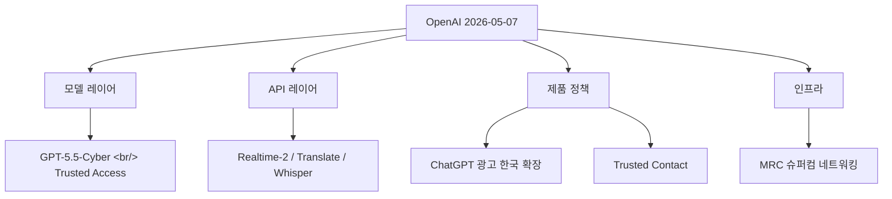
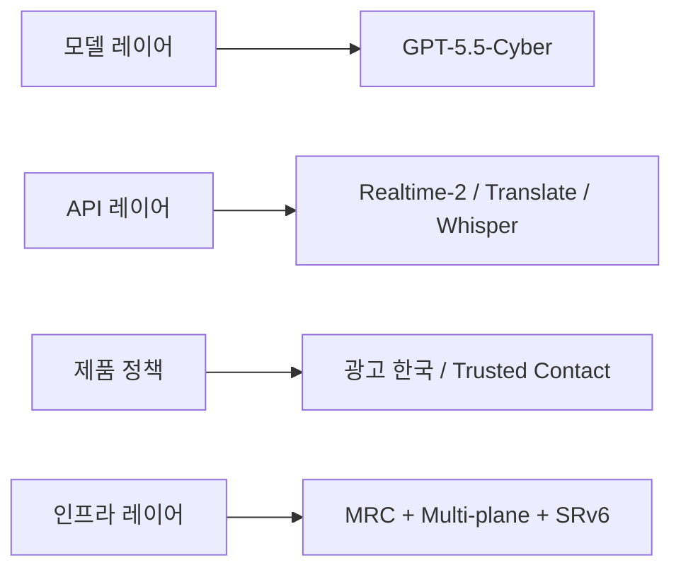

## 개요

OpenAI가 같은 일자에 5건의 공식 발표를 동시에 풀었다. 묶어서 보면 모델·API·제품 정책·인프라 4개 레이어를 한 번에 친 형태다. 각각 따로 읽으면 평범한 발표지만, **묶었을 때 OpenAI가 어디에 자원을 쏟고 있는지** 가 드러난다.

<!--more-->

## 1. GPT-5.5 + GPT-5.5-Cyber — Trusted Access for Cyber

OpenAI는 이미 풀린 [GPT-5.5](https://openai.com/index/gpt-5-5-instant/) 위에 [GPT-5.5-Cyber를 limited preview로 공개](https://openai.com/index/gpt-5-5-with-trusted-access-for-cyber)했다. 핵심 인프라 방어자 대상.

[Trusted Access for Cyber(TAC)](https://openai.com/index/scaling-trusted-access-for-cyber-defense/)는 신원·신뢰 기반 프레임워크다. 검증된 방어자에게는 분류기 거부율을 낮춰 취약점 트리아지·악성코드 분석·바이너리 리버스·탐지 엔지니어링·패치 검증 같은 작업을 풀어준다.

**3단계 액세스:**
- **GPT-5.5 (default)** — 일반 안전장치
- **GPT-5.5 with TAC** — 인증된 방어 작업용 안전장치 완화
- **GPT-5.5-Cyber** — 가장 허용적, 인가된 red teaming/pentest용

2026-06-01부터 TAC 사용자는 [phishing-resistant Advanced Account Security](https://openai.com/index/advanced-account-security/) 의무화. 조직은 SSO 차원에서 attest 가능.

> "AI를 보안 공격에 쓰면 어떡하지" 우려에 대한 OpenAI식 답이다. 원천 차단 대신 **신원 확인된 화이트리스트만 더 풀어주는 방식** 으로 정책을 분화했다.

## 2. ChatGPT 광고 — 한국 확장

[ChatGPT 광고 파일럿](https://openai.com/index/testing-ads-in-chatgpt)이 2026-02-09 미국에서 시작 → 5월부로 **영국·멕시코·브라질·일본·한국**으로 확장된다. 광고주 등록은 [openai.com/advertisers](https://openai.com/advertisers/), 광고 운영 원칙은 [별도 문서](https://openai.com/index/our-approach-to-advertising-and-expanding-access/)에 정리.

| 항목 | 내용 |
|---|---|
| 적용 대상 | 로그인한 성인의 Free / Go 티어 |
| 미적용 | Plus / Pro / Business / Enterprise / Education |
| 광고 영향 | 답변에 영향 없음, 별도 라벨링 |
| 광고주 권한 | 대화·메모리·개인정보 접근 불가, 집계 통계만 수신 |
| 옵트아웃 | Free 티어에서 일일 무료 메시지 수 감소 대가로 가능 |
| 노출 제외 | 18세 미만 추정 계정, 건강/정신건강/정치 토픽 근처 |

**한국이 직접 영향권에 들어왔다.** AI 무료 사용자의 비즈니스 모델이 광고 기반으로 이행하는 첫 큰 전환점이다. 새로운 광고 구매 모델은 [별도 발표](https://openai.com/index/new-ways-to-buy-chatgpt-ads/)로 예고됐다.

## 3. Trusted Contact in ChatGPT

[Trusted Contact](https://openai.com/index/introducing-trusted-contact-in-chatgpt) — 자해/심각한 안전 우려가 감지되면, 사용자가 **미리 지정한 1인의 신뢰할 수 있는 어른**에게 알림이 가는 옵트인 기능. 18+ 글로벌, **한국은 19+** 로 적용된다. 운영 가이드는 [도움말 페이지](https://help.openai.com/en/articles/20001105-trusted-contacts-in-chatgpt)에서 확인 가능.

**흐름:**
1. 자동 모니터링 → 사용자에게 "Trusted Contact에게 알릴 수도 있다" 고지
2. 전담 인간 검토팀이 1시간 이내 검토
3. 이메일/SMS/in-app 알림 발송
4. 알림 내용은 의도적으로 제한적 — 구체 대화 내용·트랜스크립트는 포함하지 않음

기존 [부모 알림 기능](https://chatgpt.com/parent-resources/)(미성년 계정용)을 성인까지 확장한 형태. 미국심리학회([APA](https://www.apa.org/)) 와 [170명+ 정신건강 전문가](https://openai.com/index/strengthening-chatgpt-responses-in-sensitive-conversations/), [OpenAI 글로벌 의사 네트워크](https://openai.com/index/openai-for-healthcare/)와 협력해 설계.

AI가 단순 응답에서 **실세계 인적 안전망과 연결하는 매개**로 역할이 확대된다. 자살 예방 상담은 별도로 [지역별 핫라인 안내](https://openai.com/index/helping-people-when-they-need-it-most/)도 유지.

## 4. Realtime 음성 모델 3종 — GPT-Realtime-2 / Translate / Whisper

[가장 개발자 직접 영향이 큰 발표](https://openai.com/index/advancing-voice-intelligence-with-new-models-in-the-api). 3개 모델이 동시에 [Realtime API](https://platform.openai.com/audio/realtime)로 공개됐다.

### GPT-Realtime-2
- **컨텍스트 32K → 128K** 로 4배 확장 (긴 agentic workflow)
- Preambles ("잠시만요, 확인해볼게요" 같은 짧은 도입어), 병렬 tool call + tool transparency, recovery 동작 강화
- 추론 강도 5단계 선택 (minimal / low / medium / high / xhigh, default = low)
- [Big Bench Audio](https://artificialanalysis.ai/methodology/speech-to-speech-benchmarking) +15.2%, [Audio MultiChallenge](https://labs.scale.com/leaderboard/audiomc-audio) +13.8% 향상
- 도입 사례: [Zillow](https://www.zillow.com/) 의 부동산 음성 어시스턴트, [Priceline](https://www.priceline.com/) 의 여행 트립 매니저

### GPT-Realtime-Translate
- 입력 70+ 언어 / 출력 13개 언어 실시간 번역 + 트랜스크립션
- [BolnaAI](https://www.bolna.ai/) 케이스: 힌디·타밀·텔루구에서 WER −12.5%
- [Deutsche Telekom](https://www.telekom.com/) 다국어 voice support 적용 중

### GPT-Realtime-Whisper
- 저지연 스트리밍 STT — 회의/방송/교실 자막용

### 가격 (Realtime API)
| 모델 | 가격 |
|---|---|
| GPT-Realtime-2 | $32 / 1M audio input, $64 / 1M audio output, cached input $0.40 / 1M |
| GPT-Realtime-Translate | $0.034 / min |
| GPT-Realtime-Whisper | $0.017 / min |

추가 안전장치는 [OpenAI Agents SDK](https://openai.github.io/openai-agents-js/guides/guardrails/)의 guardrails로 확장 가능, [EU 데이터 레지던시](https://platform.openai.com/docs/guides/your-data#data-residency-controls)도 지원. 시작은 [Codex](https://openai.com/codex/)에 prompt 한 줄 박는 식으로도 가능하다.

보이스 에이전트 빌더가 더 빠르고 똑똑한 모델을 즉시 쓸 수 있게 됐다. **128K context와 parallel tool call이 진짜 중요** — 이게 있어야 길고 복잡한 voice agent flow가 끊기지 않는다.

## 5. MRC — OpenAI 슈퍼컴퓨터 네트워킹

가장 깊이 있는 엔지니어링 글이다. **MRC([Multipath Reliable Connection](https://openai.com/index/mrc-supercomputer-networking))** 는 800Gb/s 네트워크 인터페이스에 내장된 새 프로토콜로, RoCE를 SRv6 source routing으로 확장한다. 전체 스펙은 [공동저술 논문](https://cdn.openai.com/pdf/resilient-ai-supercomputer-networking-using-mrc-and-srv6.pdf) 으로 공개.

**핵심 아이디어 3가지:**

1. **Multi-plane 토폴로지** — 800Gb/s 인터페이스를 100Gb/s × 8개로 쪼개 8개 병렬 plane. 64포트 800G 스위치 = 512포트 100G로 사용 → **131K GPU를 2-tier 스위치로** 연결 가능 (기존엔 3-4 tier 필요).

2. **Packet spraying** — 한 transfer를 단일 경로가 아니라 수백 경로에 spray. 패킷이 out-of-order 도착해도 final memory address가 헤더에 있어서 destination에서 정렬.

3. **SRv6 source routing** — BGP 같은 dynamic routing 폐기. 송신자가 IPv6 주소에 경로를 인코딩, 스위치는 자기 ID만 확인하고 다음으로 forward. 정적 라우팅 테이블만 유지.

**결과:** 링크 fail이 분당 여러 번 일어나도 동기 학습에 측정 가능한 영향 없음. tier-1 스위치 4대 reboot도 학습팀과 협의 없이 진행 가능.

이 작업은 **5사 컨소시엄** 협업: [AMD](https://www.amd.com/en/blogs/2026/amd-advances-ai-networking-at-scale-with-mrc.html) · [Broadcom](https://www.broadcom.com/blog/enabling-ai-networking-scale-with-multi-path-reliable-connections-mrc-) · [Microsoft](https://aka.ms/BuildingResilientNetworksForAISupercomputers) · [NVIDIA](https://blogs.nvidia.com/blog/spectrum-x-ethernet-mrc/) · Intel. 스펙은 [Open Compute Project](https://www.opencompute.org/) 에 기여로 풀렸다. 이미 [Stargate (OCI Abilene, Texas)](https://openai.com/index/building-the-compute-infrastructure-for-the-intelligence-age/) 의 NVIDIA GB200 클러스터 + Microsoft Fairwater에 배포 완료. UEC([Ultra Ethernet Consortium](https://ultraethernet.org/)) 와 IBTA([InfiniBand Trade Association](https://www.infinibandta.org/)) 표준을 기반으로 한다.

**AI training의 병목이 GPU에서 네트워크로 옮겨가는 시대의 인프라 표준.** frontier model 학습은 단일 회사 작품이 아니라 **chip + switch + protocol 5사 컨소시엄**의 결과물이 됐다.

## 묶어서 본 패턴

OpenAI 단일 일자 발표 5건이 정확히 4개 레이어를 하나씩 친 형태:

"오늘 OpenAI가 뭐 했어?" 라는 질문에 한 줄로 답한다면: **"보안 모델 풀고, 광고 한국에 풀고, 자해 안전망 풀고, 음성 모델 풀고, 슈퍼컴 네트워크 표준 풀었다."**

## 인사이트

다섯 발표가 같은 시각에 나왔다는 점 자체가 메시지다. OpenAI는 이제 **동시에 4개 레이어를 끌고 가는 풀 스택 회사** — 모델만 잘 만드는 회사가 아니라 모델·API·정책·인프라를 모두 자기 표준으로 시장에 박는 회사다. 한국 시장에는 광고와 Trusted Contact(19+) 두 곳에서 직접 영향이 들어왔고, 개발자에게는 Realtime 음성 3종이 즉시 돈 버는 플레이가 됐다. MRC가 OCP에 기여로 풀린 것은 인프라 표준의 주도권 쟁탈전을 시작했다는 신호 — 단일 회사 작품을 넘어 chip + switch + protocol 컨소시엄을 자기 중심으로 모은다. **다음 분기 가장 빠르게 변할 영역은 보이스 에이전트 빌더 시장**이다. GPT-5.5-Cyber는 진영 분화의 첫 사례이고, 이후 다른 도메인(법무·의료)에서도 유사 trusted-access 패턴이 나올 가능성이 높다.

## 참고

**OpenAI 발표 5건**
- [GPT-5.5 + Trusted Access for Cyber](https://openai.com/index/gpt-5-5-with-trusted-access-for-cyber)
- [Testing ads in ChatGPT](https://openai.com/index/testing-ads-in-chatgpt)
- [Introducing Trusted Contact in ChatGPT](https://openai.com/index/introducing-trusted-contact-in-chatgpt)
- [Advancing voice intelligence with new models in the API](https://openai.com/index/advancing-voice-intelligence-with-new-models-in-the-api)
- [MRC supercomputer networking](https://openai.com/index/mrc-supercomputer-networking)

**MRC 협력사 블로그 / 논문**
- 논문 PDF: [Resilient AI Supercomputer Networking using MRC and SRv6](https://cdn.openai.com/pdf/resilient-ai-supercomputer-networking-using-mrc-and-srv6.pdf)
- [AMD: AI networking at scale with MRC](https://www.amd.com/en/blogs/2026/amd-advances-ai-networking-at-scale-with-mrc.html)
- [Broadcom: Enabling AI networking scale with MRC](https://www.broadcom.com/blog/enabling-ai-networking-scale-with-multi-path-reliable-connections-mrc-)
- [Microsoft: Building Resilient Networks for AI Supercomputers](https://aka.ms/BuildingResilientNetworksForAISupercomputers)
- [NVIDIA: Spectrum-X Ethernet + MRC](https://blogs.nvidia.com/blog/spectrum-x-ethernet-mrc/)
- [Open Compute Project](https://www.opencompute.org/) · [UEC](https://ultraethernet.org/) · [IBTA](https://www.infinibandta.org/)

**음성 모델 벤치마크**
- [Big Bench Audio (Artificial Analysis)](https://artificialanalysis.ai/methodology/speech-to-speech-benchmarking)
- [Audio MultiChallenge (Scale Labs)](https://labs.scale.com/leaderboard/audiomc-audio)

**관련 OpenAI 페이지**
- [Realtime API Playground](https://platform.openai.com/audio/realtime) · [Codex](https://openai.com/codex/) · [Agents SDK guardrails](https://openai.github.io/openai-agents-js/guides/guardrails/)
- [Stargate / Compute Infrastructure](https://openai.com/index/building-the-compute-infrastructure-for-the-intelligence-age/)
- [Advanced Account Security](https://openai.com/index/advanced-account-security/) · [Advertising principles](https://openai.com/index/our-approach-to-advertising-and-expanding-access/)
