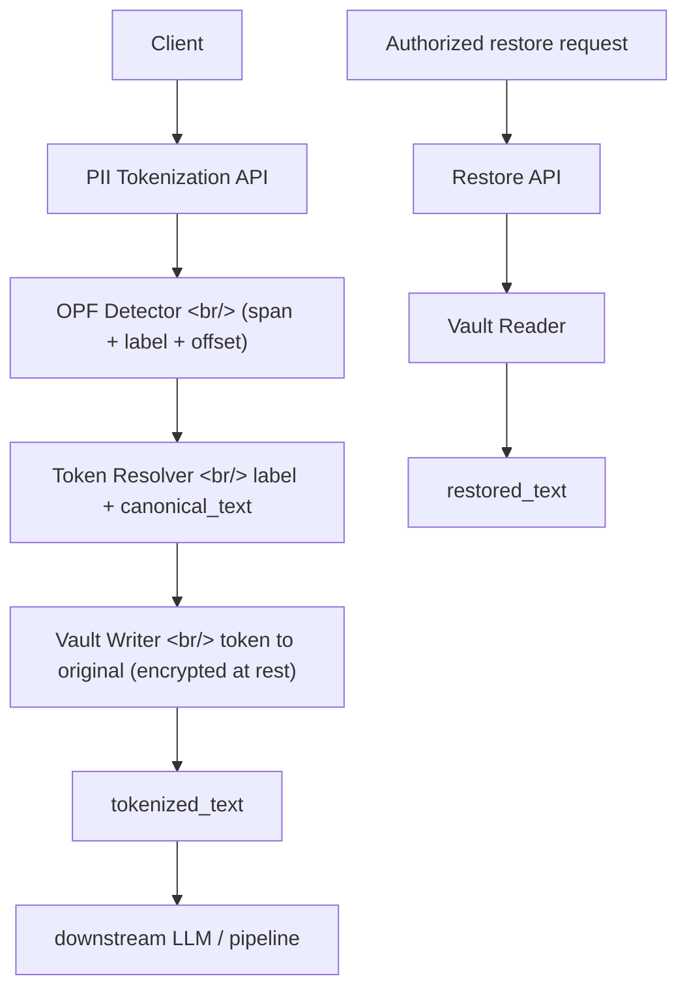

## 개요

OpenAI Privacy Filter(OPF)는 텍스트에서 PII span을 검출해 `<PRIVATE_PERSON>` 같은 typed placeholder로 마스킹하는 도구다. 기본 동작은 **irreversible redaction** — 같은 사람이 여러 번 등장해도 모두 같은 generic placeholder로 뭉개진다. 관계 정보가 다 날아가는 게 단점이다.

[deformatic/OPENAI-Privacy-Filter-Reversible-Tokenization](https://github.com/deformatic/OPENAI-Privacy-Filter-Reversible-Tokenization) 은 그 위에 **reversible tokenization vault** 레이어를 옵트인으로 얹는다. 마스킹은 살리되 같은 entity는 같은 인덱스 토큰(`<PRIVATE_PERSON_1>`)으로 묶고, 원본은 별도 vault에 저장해 인가된 경로에서만 복원한다. **공유 시점 기준 만들어진 지 하루**, Apache 2.0, Python, 별 20개.

<!--more-->



## 기본 OPF vs reversible 레이어

기본 OPF:

```text
Alice emailed Bob.
->
<PRIVATE_PERSON> emailed <PRIVATE_PERSON>.
```

→ 두 person이 같은 사람인지 다른 사람인지 정보가 사라진다.

Reversible 레이어:

```text
Alice emailed Bob. Alice's phone is 555-1111.
->
<PRIVATE_PERSON_1> emailed <PRIVATE_PERSON_2>. <PRIVATE_PERSON_1>'s phone is <PRIVATE_PHONE_1>.
```

별도 vault:

```json
{
  "schema_version": "opf.reversible.v1",
  "vault_id": "7c1d...",
  "entries": {
    "<PRIVATE_PERSON_1>": {
      "label": "private_person",
      "text": "Alice",
      "canonical_text": "Alice",
      "index": 1
    }
  }
}
```

## 핵심 강조

> *"This is **not anonymization**. It is **recoverable pseudonymization**. The tokenized text is useful only if the vault is protected like source PII."* — README

[가명화(pseudonymization)와 익명화(anonymization)는 GDPR에서도 명확히 다른 개념](https://gdpr-info.eu/art-4-gdpr/)이다. 익명화된 데이터는 더이상 personal data가 아니어서 GDPR 적용 대상이 아니지만, **가명화는 여전히 personal data로 취급**된다 ([GDPR Recital 26](https://gdpr-info.eu/recitals/no-26/)). 즉 vault를 분리 보관해 컴플라이언스 면에서 유리하더라도, vault 자체는 원본 PII와 동등한 보안 등급으로 보호해야 한다.

## 풀려는 문제

일반 redaction은 sensitive value를 지우지만 **다운스트림이 필요로 하는 관계 정보까지 파괴**한다.

1. 리뷰어가 같은 사람이 여러 번 등장한 걸 봐야 할 때
2. LLM 다운스트림 task가 일관된 placeholder를 요구할 때 (Alice를 보고 Alice라고 응답해야 함)
3. 데이터 파이프라인이 enrichment / approval 후 원본 복원이 필요할 때
4. 서비스 boundary에서 tokenized text는 enclave 밖으로 나가도 OK이지만 vault는 enclave 안에 머물러야 할 때

## 디자인 원칙

- **하위호환** — 기존 `redact()` 동작 그대로 유지
- **옵트인** — `OPF.tokenize()` / `opf --recoverable` 만 reversible 경로
- **모델 무수정** — checkpoint, decoder, Viterbi, training, eval 경로 손대지 않음
- **value 안정성** — 같은 `label + canonical_text` → 같은 토큰 (vault 내에서)
- **batch 친화** — 한 vault를 여러 입력에 재사용 가능
- **감사 가능** — 토큰 매핑이 명확한 schema(`opf.reversible.v1`)로 직렬화
- **보안 인식** — README와 schema 모두 *"plaintext vault는 development-grade only"* 명시

## 토큰 할당 규칙

한 vault 내부에서:

- 같은 label + 같은 canonical text → 같은 토큰
- 같은 label + 다른 canonical text → 다음 인덱스
- 다른 label + 같은 text → 다른 토큰 family
- source text collision → 다음 빈 인덱스로 skip
- 겹치는 span → `ValueError`

## 의미

- 가명화는 "마스킹 vs 익명화 vs 가명화" 3분법 중 가장 실용적이지만 오픈소스 구현체가 거의 없었다. 이게 한 답.
- vault 분리 보관 → "tokenized text는 LLM provider에 보내도 PII 전송이 아니다"라는 **컴플라이언스 논리 구성**이 가능 (단, vault 보안 보장 시).
- LLM 파이프라인이 점점 enterprise로 들어가면서 자주 마주치는 패턴을 명시적으로 풀이.

## 참고

### Repo
- [deformatic/OPENAI-Privacy-Filter-Reversible-Tokenization](https://github.com/deformatic/OPENAI-Privacy-Filter-Reversible-Tokenization) — Apache 2.0, Python, 별 20개 (작성일 기준)
- 원본 [OpenAI Privacy Filter (OPF)](https://github.com/openai/openai-privacy-filter) — span 검출 + 마스킹 도구

### Privacy 개념
- [GDPR Article 4 — Definitions](https://gdpr-info.eu/art-4-gdpr/) (가명화 / 익명화 정의)
- [GDPR Recital 26 — Not applicable to anonymous data](https://gdpr-info.eu/recitals/no-26/)
- [Apache License 2.0](https://www.apache.org/licenses/LICENSE-2.0)

### 관련 인프라
- [OpenAI Platform — Privacy & Data Use](https://platform.openai.com/docs/guides/your-data)
- [OpenAI Agents SDK — Guardrails](https://openai.github.io/openai-agents-js/guides/guardrails/)

## 인사이트

가명화는 LLM 파이프라인이 컴플라이언스 영역으로 들어가는 과정에서 가장 자주 막히는 지점이다. 완전 redact하면 다운스트림 품질이 망가지고, 그대로 보내면 PII가 boundary를 넘는다. 이 레이어는 정확히 그 사이를 노린다 — 토큰화된 텍스트는 enclave 밖으로 나가도 되고, vault는 안에 머문다. 디자인이 작고 깔끔한 것도 좋다: 모델 경로 무수정, 옵트인, 기존 `redact()` 그대로 유지. 다만 README가 반복해서 강조하듯 **vault 자체는 원본 PII와 같은 보안 등급으로 보호**해야 하고, 평문 vault는 development-grade에 불과하다. 만들어진 지 하루 만에 별 20개가 붙었다는 건 이 패턴이 이미 여러 팀에서 사내 도구로 굴러가고 있었음을 시사한다 — 단지 공개된 구현체가 없었을 뿐. OPF 원본의 모델 경로를 건드리지 않은 점도 PR-able한 깔끔한 확장 디자인이라 fork보다는 upstream merge 가능성도 보인다.
