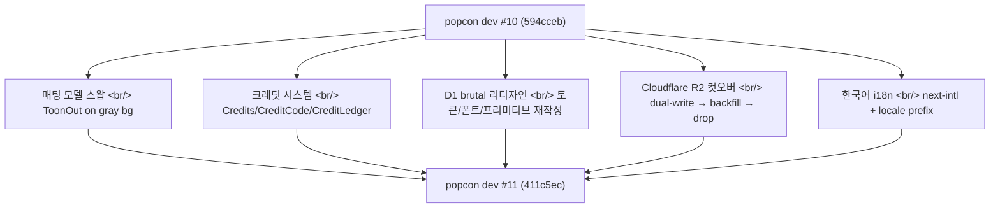
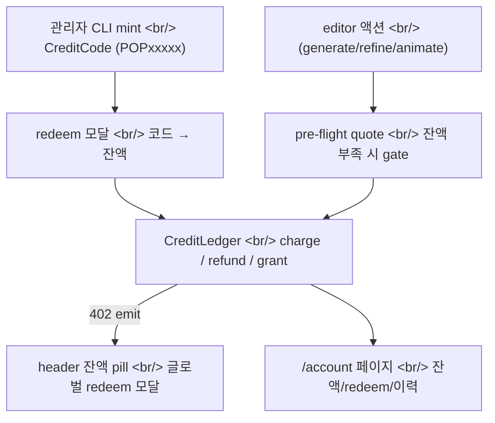
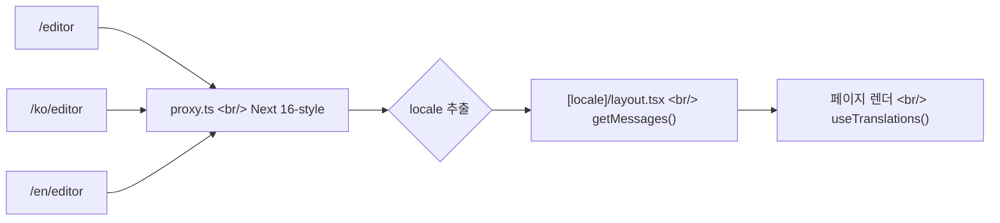

## 개요

[이전 글: #10 — 베타 모집, 풍선 인디케이터, 카운트다운](/posts/2026-04-22-popcon-dev10/)을 쓴 뒤로 보름 동안 popcon에는 dev10 한 편으로 묶기 어려운 변화가 들어갔다. 매팅 모델 교체, 결제 인프라(크레딧), Cloudflare R2 스토리지 컷오버, brutal 리디자인, 한국어 i18n까지 — 156개 커밋이 사실상 다섯 개의 독립 마일스톤이다.

<!--more-->



이번 글은 다섯 개를 한 번에 다루지만, 각 흐름을 따라가면 결국 같은 질문이 반복된다 — **"기존 시스템을 멈추지 않고 어떻게 새 레일로 갈아탈까."**

---

## 매팅 모델: BiRefNet → ToonOut

popcon은 캐릭터 이미지에서 배경을 분리해 12개 이모티콘 액션으로 합성한다. 기존 매팅 모델은 일반 사진 기준이라 애니 캐릭터의 머리카락/투명 영역에서 자주 무너졌다.

[ToonOut](https://github.com/MatteoKartoon/BiRefNet)은 [BiRefNet](https://github.com/zhengpeng7/birefnet)을 1,228장의 애니 이미지로 fine-tuning한 모델이다. 픽셀 정확도가 95.3% → 99.5%로 올라간다.

```python
# gpu_worker — ToonOut에 입력하기 전 회색 배경에 합성
# (ToonOut training-time gray = #808080)
def _swap_bg_to_gray(rgba: np.ndarray) -> np.ndarray:
    """Soft white-key compositor: alpha-blend onto #808080."""
    alpha = rgba[..., 3:4] / 255.0
    rgb = rgba[..., :3]
    gray = np.full_like(rgb, 128)
    return (rgb * alpha + gray * (1 - alpha)).astype(np.uint8)
```

전후 처리에서 두 가지 디테일이 잡혔다.

1. **회색 배경 단일 소스** — `bg_color`를 백엔드 단일 진리원(single source of truth)으로 만들고 `#808080`으로 통일 (commit `430f985`). 이전에는 프런트엔드와 워커가 각자 다른 톤의 회색을 쓰고 있었다.
2. **Pylette로 캐릭터별 회색 픽** — Rec.709 luminance 규칙으로 캐릭터의 평균 밝기에 맞는 회색을 골라준다 (commit `94544df`). [Pylette 글](/posts/2026-04-22-pylette/)에서 다뤘던 라이브러리를 실제로 import해서 쓰게 됐다.

리팩터링 중 동적 indirection을 cargo-cult로 판정해서 걷어냈고, mask-fill threshold도 이름을 줬다 (`081ddd6`).

---

## 크레딧 시스템: 결제 인프라 한 사이클

베타 끝나고 유료화 전환을 위해 크레딧 시스템을 처음부터 깔았다. SQLAlchemy ORM부터 프런트엔드 402 핸들러까지 5일 안에 한 바퀴를 돌렸다.



핵심 결정 셋:

- **Ledger 패턴** — `CreditLedger`에 모든 변동을 append-only로 기록하고, `Credits` 테이블의 `balance` 컬럼은 캐시. 모든 charge/refund는 strict transaction (`e28b100`).
- **402 글로벌 이벤트** — 백엔드가 잔액 부족 시 HTTP 402를 던지면, 프런트엔드 `useCredits()` 훅이 자동으로 잔액을 새로고침하고 글로벌 redeem 모달을 띄운다 (`d25739e`, `1a32900`).
- **실패 단계 환불** — 이모티콘 생성 중간에 에러가 나면 그 단계의 크레딧을 자동 환불 (`6d7cc7f`). 사용자가 환불을 직접 요청하지 않게.

중간에 작은 사고가 있었다. Gemini의 `image_size` 파라미터를 가격 체계와 맞추려고 `"0.5K"`로 보냈는데, 이건 Gemini가 거부하는 값이다 (`b1ac23f` revert → `55eda01`에서 `"512"`로 정정). API 요금 계산용 표기와 API 입력 표기가 다른 케이스 — 둘이 같다고 가정한 게 문제였다.

또 `360115e` 커밋이 흥미롭다. 코드 리팩터링 중에 브랜드 prefix `POP`을 `P0P` (영문 O를 0으로)으로 잘못 바꿨던 걸 되돌렸다. AI가 "스타일 통일"을 너무 적극적으로 한 사례.

---

## D1 brutal 리디자인: 토큰부터 페이지까지

기존 popcon은 generic Tailwind 룩이었다. 플라이어/브랜딩과 맞추기 위해 brutal 스타일로 전면 교체했다 — 두꺼운 검정 보더, 강한 그림자, 5색 톤 시스템, 굵은 산세리프.

새 폰트 스택:
- **Archivo Black** — 영문 헤드라인
- **Black Han Sans** — 한글 헤드라인
- **Jua** — 한글 본문
- **JetBrains Mono** — 코드/숫자
- **Pretendard** — 한글 폴백

```css
/* tokens.css — 5톤 brutal 팔레트 */
:root {
  --paper: #fafaf7;     /* 본문 배경 */
  --ink: #1a1a1a;       /* 본문 텍스트 + border */
  --violet: #7c3aed;    /* 브랜드 (P logo, 액션) */
  --yellow: #fbbf24;    /* 활성 강조 (ZIP 버튼 등) */
  --pink: #ec4899;      /* erase / 경고 */
  --mint: #10b981;      /* success */
}
```

프리미티브를 새로 짰다 — `Card`, `Chip` (5톤×2사이즈), `StatusDot`, `Input`, `Textarea`, `Button` (5 variants × 3 sizes), `StepIndicator`. 모두 brutal 스타일로 다시 작성 (`769df10` ~ `0e013a8`).

페이지를 한 장씩 갈아끼우는 방식으로 진행했다 — landing → editor 패널들 → archive → account → auth 모달 → header. 각 commit이 한 페이지/패널이라 리뷰가 쉬웠다.

가장 까다로웠던 건 **scrim/모달 배경** 처리였다. 기존엔 흰색 베일을 깔았는데 brutal 스타일에선 ink scrim(검정 반투명)이 맞았다. 그런데 SAM2/matte refine 모달에선 ink scrim이 너무 강해서 레퍼런스 이미지가 안 보임 → 모달별로 scrim을 분기 (`99b1908`, `4096ba7`).

WCAG AA 점검도 한 번 돌렸다. 핑크 배경 위 흰색 텍스트가 contrast 미달이어서 ink로 교체 (`4827ed4`).

---

## Cloudflare R2 컷오버: 4단계 phase 분리

popcon은 생성된 이모티콘 zip/APNG/video를 fly.io 머신의 로컬 디스크에 쓰고 있었다. 머신이 늘면 자산이 분산돼서 다운로드 라우팅이 깨진다. R2(Cloudflare의 S3 호환 객체 스토리지)로 옮기기로 결정.

다운타임 없이 옮기려고 4 phase로 쪼갰다:

| Phase | 내용 | PR |
|--------|------|-----|
| **A** | R2 클라이언트 + `blob_key` DB 컬럼 추가 | #5 |
| **B** | Worker dual-write — 로컬 디스크 + R2 둘 다 기록 | #6 |
| **C** | 백필 스크립트 + 프런트엔드가 R2 URL을 absolute로 패스스루 | #7 |
| **D** | 레거시 파일 라우트 제거 + `/download_job` 302 리다이렉트 + scratch GC | #8 |

각 phase 사이에 트래픽이 정상인지 확인하고 다음으로 넘어갔다. dual-write 단계에선 디스크와 R2 둘 다 쓰니까 비용은 잠깐 늘었지만, 컷오버 안전성을 샀다.

후속 정리 두 개:
- **Rehydrate URLs from R2 keys** (`b43e802`) — DB에 R2 URL을 그대로 박지 않고 `blob_key`에서 매번 derive. R2 endpoint가 바뀌어도 마이그레이션 없이 따라간다.
- **레거시 자산 라우트 복구** (`1e08937`) — 이전에 시작한 작업물을 가진 사용자를 위해 file 라우트 일부를 다시 살림. R2 URL을 filesystem path 컬럼에 잘못 미러링한 버그도 같이 잡았다 (`83d62c4`).

---

## 한국어 i18n: next-intl + locale-prefixed routes



next-intl + locale-prefixed routes로 한국어를 추가했다. 핵심 결정 두 개:

1. **page를 `[locale]` 세그먼트 아래로 이동** — `app/page.tsx` → `app/[locale]/page.tsx`. layout도 root layout과 locale layout으로 분리 (`fe1eaa3`).
2. **Next 16 proxy.ts로 locale 라우팅** — middleware 대신 proxy 패턴 (`4f322e2`). 정적 라우팅이 가능해서 캐시가 잘 먹는다.

번역은 namespace별로 dictionary 파일을 쪼갰다 — `home`, `editor`, `archive`, `account`, `redeem`, `actions`, `picker`, ... 각 페이지/패널별 commit이 하나씩 있어서 grep 가능하다.

언어 스위처에서 한 가지 버그가 잡혔다. 언어 전환 시 search params가 사라져서 editor에서 진행 중인 job이 끊기는 문제 — `Link`/`router` 모두 locale-aware 래퍼로 교체해서 search params 보존 (`d644b1b`, PR #12).

또 in-app browser(KakaoTalk, Instagram 등)에서 Google 로그인이 차단되는 문제도 발견했다. `iab=1` 같은 쿼리로 외부 브라우저로 이스케이프하는 가드를 추가 (`29cd743`).

---

## 운영: SKIP_RUNPOD 가드와 sync-pod-id 스크립트

배포는 fly.io(API/프런트엔드) + RunPod(GPU 워커) + GitHub Actions cron 스케줄러 조합이다. 새벽 시간대 RunPod 비용을 줄이려고 스케줄러로 pod를 끄고 켜는데, 수동으로 pod를 띄워두면 스케줄러가 같이 끄는 사고가 났다.

해결: `SKIP_RUNPOD` 환경 변수 가드 (`e3fa9fa`). 이 플래그가 켜져 있으면 스케줄러가 pod를 건드리지 않는다. 수동 운영용 escape hatch.

`sync-pod-id` 스크립트도 추가 (`783238b`) — 새 RunPod ID를 fly secret에 자동으로 동기화한다. 이전엔 수동으로 fly.io 환경변수를 업데이트해서 까먹기 쉬웠다.

`fly(frontend)` 한 줄도 의외로 중요했다 (`edf3d18`, PR #9). frontend 머신을 1대 warm으로 유지하고 메모리 512MB로 고정. 콜드 스타트 1.5초 → 200ms.

---

## 인사이트

156개 커밋을 한 글에 묶고 보니 **흐름이 직렬이 아니라 병렬**이었다. 매팅 모델 교체와 R2 마이그레이션은 백엔드/워커 쪽, brutal 리디자인은 프런트엔드, 크레딧과 i18n은 풀스택. 같은 시간대에 다섯 트랙이 동시에 굴러갔는데 서로 머지 충돌이 거의 없었던 건 모듈 경계가 또렷해서다.

특히 R2 컷오버를 4 phase로 쪼갠 게 회고감이 좋다. dual-write phase에서 비용 잠깐 더 쓰는 대신 롤백 가능성을 샀다 — 만약 phase B에서 문제가 생겼어도 디스크가 truth로 남아 있어서 R2 코드만 끄면 됐다.

크레딧 시스템 ledger 패턴은 다시 써도 같은 선택을 할 것 같다. `Credits.balance`를 캐시로 두고 `CreditLedger`를 append-only로 기록하면, 잔액에 의심이 갈 때 ledger를 재연산해서 검증할 수 있다. Stripe도 이 패턴이다.

리디자인은 토큰/프리미티브를 먼저 새로 짠 뒤에 페이지를 한 장씩 갈아끼운 게 결정적이었다. 페이지를 먼저 손대면 새 토큰이 안 박히는 옛 컴포넌트가 계속 남는다.

다음 dev #12에서 다룰 것: 결제 게이트(KG이니시스/PortOne) 연동, ToonOut 매팅 품질 A/B(전 모델 vs ToonOut), 한국어 i18n에서 빠진 미세 영역(에러 토스트, 관리자 CLI 메시지).
