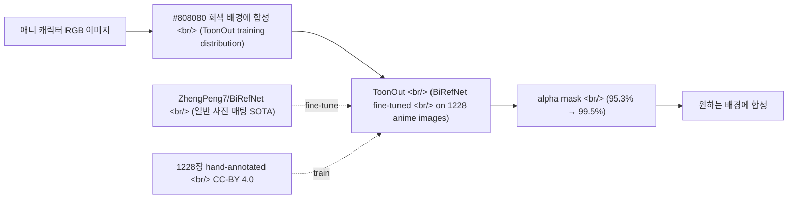

## 개요

[popcon dev #11](/posts/2026-05-07-popcon-dev11/)에서 매팅 모델을 ToonOut으로 갈아탔다. 두 GitHub 레포지토리를 같이 읽으면 흐름이 명확해진다 — [ZhengPeng7/BiRefNet](https://github.com/zhengpeng7/birefnet) (CAAI AIR'24, ★3,397, 일반 매팅의 SOTA 후보)과 [MatteoKartoon/BiRefNet](https://github.com/MatteoKartoon/BiRefNet) (애니 전용 fine-tuning, ★94, arXiv:2509.06839). 베이스 모델 + 도메인 fine-tuning 패턴의 깔끔한 사례다.

<!--more-->



---

## BiRefNet — Bilateral Reference, dichotomous image segmentation

원본 BiRefNet은 2024년 CAAI Artificial Intelligence Research에 실린 논문이다. "Dichotomous image segmentation" — 이미지의 전경(salient)과 배경을 이진 분리하는 작업의 baseline. 일반 매팅 모델 대비 차이점:

- **고해상도 학습** — 1024×1024 입력 + 표준 매팅보다 큰 supervision 신호.
- **Bilateral reference** — 디코더가 forward pass에서 입력 이미지를 두 번 참고한다. 첫 번째는 거친 segmentation, 두 번째는 fine-grained refinement. 머리카락 같은 thin structure에 강하다.
- **Salient object + camouflaged object + DIS 통합** — 한 모델이 세 task를 같이 처리해서 generalization이 좋다.

레포의 News 타임라인을 보면 운영자가 모델을 꾸준히 갱신한다.

| 시점 | 변화 |
|------|------|
| 2025-02-12 | `BiRefNet_HR-matting` — 2048×2048 학습, 고해상도 매팅 전용 |
| 2025-03-31 | `BiRefNet_dynamic` — 256×256 ~ 2304×2304 dynamic resolution 학습. **임의 해상도에서 robust** |
| 2025-05-15 | fine-tuning 튜토리얼 영상 (YouTube/Bilibili) |
| 2025-06-30 | `refine_foreground`를 8x 가속 — 80ms / 5090 |
| 2025-09-23 | swin transformer attention을 PyTorch SDPA로 교체, memory 감소 + flash_attn 호환성 |

특히 `BiRefNet_dynamic`이 흥미롭다. 256~2304 사이 해상도를 dynamic하게 학습한 모델이라, 입력 해상도에 robust하다. 이전엔 입력을 모델 학습 해상도로 resize해야 했는데, dynamic 모델은 그 step을 생략할 수 있다.

GPU 후원이 있었다는 점도 명시되어 있다 — Freepik이 고해상도 학습을 위한 GPU를 지원했다. 학계 모델이 production-grade로 나오는 패턴.

---

## ToonOut — 1228장으로 만든 fine-tuning 데이터셋

ToonOut은 BiRefNet의 fork다. README의 핵심 수치 한 줄.

> ...we collected and annotated a custom dataset of **1,228 high-quality anime images**... The resulting model, **ToonOut**, shows marked improvements in background removal accuracy for anime-style images, achieving an increase in Pixel Accuracy from **95.3% to 99.5%** on our test set.

1228장은 fine-tuning 기준에서 작은 셋이다. 그런데 95.3% → 99.5%로 4.2 포인트 개선이 났다. **base model(BiRefNet)이 이미 충분히 강했고, 도메인 차이만 메우면 됐다는 뜻**. 일반 매팅에서 이미 잘 작동하는 모델을 애니에 fine-tune할 때, "전체 distribution을 새로 배우는" 게 아니라 "edge case 패턴(머리카락, 투명 배경, anime shading)을 추가로 노출"하는 데 1228장이면 충분했다.

### 데이터셋 조직

```
toonout_dataset/
├── train/
│   ├── train_generations_20250318_emotion/
│   │   ├── im/    # raw RGB
│   │   ├── gt/    # ground truth alpha mask
│   │   └── an/    # combined RGBA
```

`im/gt/an` 세 폴더 구조가 표준 매팅 데이터셋 형식. 라이선스는 데이터셋이 CC-BY 4.0, 모델 weights는 MIT — 학습 결과를 production에 쓰는 데 제약이 거의 없다.

### Repo의 fork-specific 변경

Original BiRefNet에서 ToonOut으로 오면서 손본 부분:

- **bfloat16으로 NaN gradient 회피** — 원본의 fp16 학습이 안정성 문제를 보였던 듯. `train_finetuning.sh`에서 `bfloat16`로 통일.
- **Evaluation script 정정** — `eval_existingOnes.py`의 settings를 고친 `evaluations.py` 추가.
- **5개 fundamental scripts** — split / train / test / eval / visualize의 표준 파이프라인이 bash entrypoint로 정리됐다.
- **유틸리티 셋** — baseline prediction 생성, alpha mask 추출, **Photoroom API 비교 통합**.

마지막 항목이 흥미롭다. Photoroom은 상용 background removal API의 강자인데, ToonOut paper에서 baseline 비교 대상으로 명시했다는 건 "academic SOTA + 상용 API + ours" 세 축으로 평가했다는 뜻. 학계 논문이 production 평가 관점을 갖췄다.

GPU 환경 disclaimer도 솔직하다 — "RTX 4090 24GB × 2"로 학습. 4090 두 장이면 cloud 1주 정도 비용에 들어가니, 이 정도 fine-tuning은 개인이 재현 가능한 영역.

---

## popcon에서 ToonOut을 통합한 방식

popcon에서 ToonOut으로 갈아타면서 한 가지 더 배운 것: **ToonOut은 학습 분포에서 회색 배경(#808080)을 가정한다.** RGBA 입력이 흰색이나 다른 배경 위에 있으면 매팅 결과가 흔들린다.

```python
# gpu_worker — ToonOut에 입력하기 전 항상 #808080에 합성
def _swap_bg_to_gray(rgba: np.ndarray) -> np.ndarray:
    """Soft white-key compositor: alpha-blend onto #808080."""
    alpha = rgba[..., 3:4] / 255.0
    rgb = rgba[..., :3]
    gray = np.full_like(rgb, 128)
    return (rgb * alpha + gray * (1 - alpha)).astype(np.uint8)
```

이건 "training distribution alignment"의 작은 사례다. 모델이 학습한 입력 분포에 맞춰서 입력을 정규화하는 게 inference 시점에서 정확도 차이를 만든다. ToonOut의 README는 직접적으로 명시하지 않지만, training script와 dataset의 `an/` 폴더 RGBA 이미지를 보면 학습 시점에 이미 회색 배경에 합성되어 있을 가능성이 높다.

---

## 인사이트

ToonOut은 "도메인 fine-tuning은 이렇게 한다"의 깨끗한 사례다. 핵심 패턴 셋:

1. **베이스 모델 선정이 절반.** 일반 매팅에서 이미 SOTA에 가까운 BiRefNet을 base로 잡았기 때문에 1228장으로 충분했다. 만약 base 모델이 약했다면 1만 장으로도 부족했을 것.
2. **데이터셋 + weights 라이선스 분리.** Dataset CC-BY, weights MIT. 다른 사람이 이 weights를 production에 쓰는 데 제약이 없고, 데이터셋도 academic/commercial 양쪽에 열려 있다.
3. **Inference 시점의 input distribution alignment.** 학습 분포에 맞게 입력을 정규화하는 작은 step(여기선 회색 배경 합성)이 inference 정확도를 결정짓는다.

BiRefNet의 News 타임라인 자체도 학습 자료다. 학계 모델이 어떻게 production-grade로 진화하는지 — dynamic resolution, attention 백엔드 교체, 8x foreground refine 가속 — 한 줄씩 따라가면 1년치 maintenance pattern이 보인다.

다음에 살펴볼 것: ToonOut paper(arXiv:2509.06839)의 evaluation methodology, BiRefNet_dynamic의 dynamic resolution 학습 구현 디테일, 그리고 popcon에서 매팅 결과의 quality A/B 메트릭 (이전 모델 vs ToonOut).
