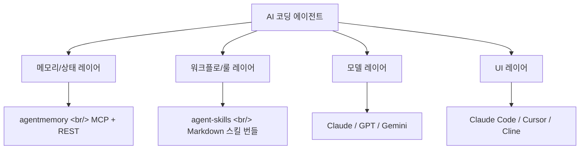
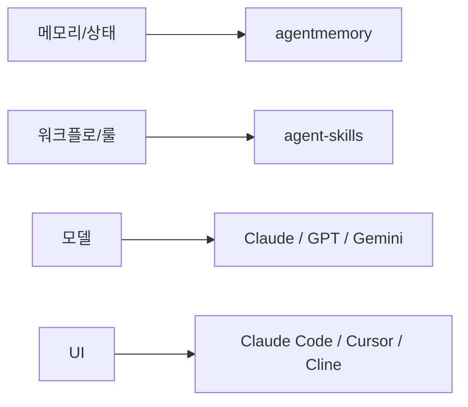

## 개요

같은 오픈 채팅방에서 30초 간격으로 던져진 두 GitHub 링크. 둘 다 "AI 코딩 에이전트의 ergonomic 결함"을 풀려는 도구지만, **노리는 결함이 다르다.** [rohitg00/agentmemory](https://github.com/rohitg00/agentmemory)는 세션 간 메모리 인프라를, [addyosmani/agent-skills](https://github.com/addyosmani/agent-skills)는 시니어 엔지니어의 워크플로 강제력을 푼다. 묶어서 보면 에이전트 시대의 OS 레이어가 모양을 갖추고 있다.

<!--more-->



## 1. agentmemory — 영속 메모리, MCP로 모든 에이전트와 공유

[rohitg00/agentmemory](https://github.com/rohitg00/agentmemory)는 *"#1 Persistent memory for AI coding agents based on real-world benchmarks"* 를 표방한다. 2026-02-25 생성, 약 2,400 stars, Apache 2.0. 홈페이지는 [agent-memory.dev](https://agent-memory.dev).

### 풀려는 문제

- 매 세션마다 아키텍처를 다시 설명해야 함
- 같은 버그를 다시 발견함
- 같은 선호(라이브러리 선택, 코드 스타일)를 다시 가르쳐야 함
- `CLAUDE.md`나 `.cursorrules` 같은 빌트인 메모리는 **200줄 cap에 stale**

### 작동 방식

에이전트가 한 일을 silently capture → 압축 → 검색 가능한 메모리로 저장 → 다음 세션 시작 시 적절한 컨텍스트만 inject. 핵심은 단일 [MCP](https://modelcontextprotocol.io/) 서버 1개만 띄우면 16개 이상 에이전트가 같은 메모리를 공유한다는 것.

지원되는 클라이언트:

- [Claude Code](https://www.anthropic.com/claude-code) · [Cursor](https://cursor.com/) · [Gemini CLI](https://github.com/google-gemini/gemini-cli) · [Codex CLI](https://openai.com/codex/)
- [Cline](https://cline.bot/) · [Goose](https://block.github.io/goose/) · [Windsurf](https://windsurf.com/) · [Roo Code](https://roocode.com/) · [OpenCode](https://opencode.ai/)
- MCP가 안 되는 에이전트도 REST API로 붙음 (104개 endpoint)

임베딩은 로컬 [`all-MiniLM-L6-v2`](https://huggingface.co/sentence-transformers/all-MiniLM-L6-v2)를 사용 → API 키 필요 없음, 무료.

### 벤치마크 — LongMemEval-S

[LongMemEval](https://arxiv.org/abs/2410.10813) (ICLR 2025, 500 questions) 결과:

| 지표 | agentmemory | BM25 fallback |
|---|---|---|
| R@5 | 95.2% | 86.2% |
| R@10 | 98.6% | — |
| MRR | 88.2% | — |

임베딩 + 하이브리드가 단순 키워드 BM25보다 R@5 기준 **9%p 높다.**

### 토큰 절감

| 방식 | 연간 토큰 | 연간 비용 |
|---|---|---|
| 풀 컨텍스트 paste | 19.5M+ | 컨텍스트 window 초과 |
| LLM-summarized | ~650K | ~$500 |
| **agentmemory** | **~170K** | **~$10** |
| agentmemory + local embed | ~170K | **$0** |

### 시작

```bash
npx @agentmemory/agentmemory
```

### 의미

이 도구의 핵심 베팅은 한 줄로 정리된다 — **"메모리는 에이전트가 아니라 인프라 레이어에 있어야 한다."** 에이전트별로 메모리를 짜는 대신 MCP 서버 1개로 모든 에이전트가 공유하면, Claude Code 세션에서 학습한 게 다음 Cursor 세션에 그대로 흘러간다. 50일 전쯤 viral한 GitHub gist(1,050 stars)에서 시작 → 그 디자인 문서를 코드로 구현한 형태. [Karpathy의 LLM Wiki 패턴](https://github.com/karpathy) + confidence scoring + lifecycle + knowledge graph + hybrid search.

## 2. agent-skills — 시니어 엔지니어의 워크플로를 스킬로 패키징

[addyosmani/agent-skills](https://github.com/addyosmani/agent-skills)는 *"Production-grade engineering skills for AI coding agents."* 를 표방한다. 2026-02-15 생성, 약 33,500 stars, MIT. 동일 시점 비교에서 agentmemory보다 14배 많은 stars — 워크플로 표준 후보로 가장 빠르게 모이는 곳이다.

### 풀려는 문제

"에이전트가 코드를 짜기는 짜는데, 시니어가 한 것 같지 않다."

- 스펙 없이 바로 코드 짠다
- 테스트를 안 짠다
- 보안 고려가 없다
- 큰 PR을 한 번에 던진다

### 6단계 라이프사이클

```
DEFINE → PLAN → BUILD → VERIFY → REVIEW → SHIP
/spec   /plan   /build   /test    /review  /ship
```

각 슬래시 커맨드 = 라이프사이클 한 단계 → 필요한 스킬을 자동 활성화.

### 20개 스킬 분류

- **Define**: idea-refine, spec-driven-development
- **Plan**: planning-and-task-breakdown
- **Build**: incremental-implementation, test-driven-development, context-engineering, source-driven-development, frontend-ui-engineering, api-and-interface-design
- **Verify**: browser-testing-with-devtools, debugging-and-error-recovery
- **Review**: code-review-and-quality, code-simplification, security-and-hardening, performance-optimization
- **Ship**: git-workflow-and-versioning, ci-cd-and-automation, deprecation-and-migration, documentation-and-adrs, shipping-and-launch

### 어디서 동작하나

- [Claude Code](https://www.anthropic.com/claude-code) (marketplace 설치, 권장): `/plugin marketplace add addyosmani/agent-skills`
- [Cursor](https://cursor.com/): `.cursor/rules/`에 SKILL.md 복사
- [Gemini CLI](https://github.com/google-gemini/gemini-cli) · [Windsurf](https://windsurf.com/) · [OpenCode](https://opencode.ai/) · [GitHub Copilot](https://github.com/features/copilot) · [Kiro IDE](https://kiro.dev/) · [Codex](https://openai.com/codex/) — **마크다운만 읽으면 다 동작**

### Agent Personas

- `code-reviewer` — Senior Staff Engineer 관점, "would a staff engineer approve this?"
- `test-engineer` — QA, Prove-It 패턴
- `security-auditor` — [OWASP](https://owasp.org/), threat modeling

### 의미

agent-skills의 베팅은 **"에이전트는 LLM 무게가 아니라 워크플로의 강제력에서 차이가 난다."** TDD를 "할 수 있다" 가 아니라 "Red-Green-Refactor를 안 하면 코드가 안 나간다" 같은 강제 흐름으로 만든다. 코드 리뷰도 5축 review, 100줄 단위 size, Nit/Optional/FYI severity 라벨 같은 구체 룰. Markdown만으로 풀어서 **에이전트 종속성 zero** — Claude/Cursor/Gemini 다 같은 스킬을 쓸 수 있다. 33K 스타가 말해주듯 현재 **에이전트 워크플로 표준에 가장 가까운 후보**다.

## 3. 두 도구 비교

| 항목 | agentmemory | agent-skills |
|---|---|---|
| 누가 | rohitg00 | addyosmani |
| 무엇 | TypeScript 라이브러리 + MCP 서버 | Markdown 스킬 번들 |
| 라이선스 | Apache 2.0 | MIT |
| Stars (2026-05) | ~2,400 | ~33,500 |
| 생성 | 2026-02-25 | 2026-02-15 |
| 도메인 | 메모리/상태 인프라 | 엔지니어링 워크플로 |
| 종속성 끊는 방식 | MCP 표준 | Markdown 표준 |

## 4. 묶어서 본 의미 — 에이전트 시대의 OS 레이어



3-4년 전 "어떤 IDE 쓰지?" 가 결정 포인트였다면, 이제는 **"어떤 메모리 + 스킬 셋업?"** 이 결정 포인트가 되고 있다. 둘 다 모델 종속성을 의도적으로 끊어두고 ([MCP](https://modelcontextprotocol.io/)와 Markdown), **모델은 갈아치울 수 있어도 메모리/스킬은 누적되도록** 설계한 게 공통점이다.

## 인사이트

같은 채팅방, 같은 사람, 30초 간격으로 던져진 두 링크가 정확히 에이전트 OS 레이어의 다른 두 슬롯을 메우고 있다는 점이 이 디지스트의 핵심이다. agentmemory는 **상태**를, agent-skills는 **프로세스**를 인프라 레이어로 끌어내려 모델 위에 올라가는 공통 부품으로 만들었다. 두 도구가 모델 종속성을 의도적으로 끊는 방식 — MCP 서버 하나, Markdown 한 더미 — 도 같은 방향이다. 모델은 갈아치워도 메모리와 스킬은 누적된다는 베팅. 33K vs 2.4K stars 차이는 시점 차가 아니라 워크플로 표준 후보가 메모리 인프라보다 한발 앞서 모이고 있다는 신호로 읽힌다. **다음 분기 흥미로운 질문은 두 가지** — 메모리 표준이 MCP 위에서 단일화될지, 그리고 agent-skills 같은 스킬 번들이 IDE 마켓플레이스의 새로운 SaaS 카테고리가 될지. 결정 포인트가 IDE 선택에서 메모리·스킬 셋업으로 옮겨가는 흐름은 이미 시작됐다.

## 참고

**핵심 리포지토리**

- [rohitg00/agentmemory](https://github.com/rohitg00/agentmemory) · 홈페이지 [agent-memory.dev](https://agent-memory.dev)
- [addyosmani/agent-skills](https://github.com/addyosmani/agent-skills)

**관련 에이전트 / 클라이언트**

- [Claude Code](https://www.anthropic.com/claude-code) · [Cursor](https://cursor.com/) · [Cline](https://cline.bot/) · [Windsurf](https://windsurf.com/)
- [Gemini CLI](https://github.com/google-gemini/gemini-cli) · [Codex](https://openai.com/codex/) · [OpenCode](https://opencode.ai/) · [Goose](https://block.github.io/goose/) · [Roo Code](https://roocode.com/)
- [GitHub Copilot](https://github.com/features/copilot) · [Kiro IDE](https://kiro.dev/)

**프로토콜과 표준**

- [Model Context Protocol (MCP)](https://modelcontextprotocol.io/)
- [OWASP](https://owasp.org/) — security-auditor 페르소나의 기준

**벤치마크 / 임베딩**

- 논문: [LongMemEval (arXiv:2410.10813, ICLR 2025)](https://arxiv.org/abs/2410.10813)
- [`sentence-transformers/all-MiniLM-L6-v2`](https://huggingface.co/sentence-transformers/all-MiniLM-L6-v2) — agentmemory의 로컬 임베딩 모델
