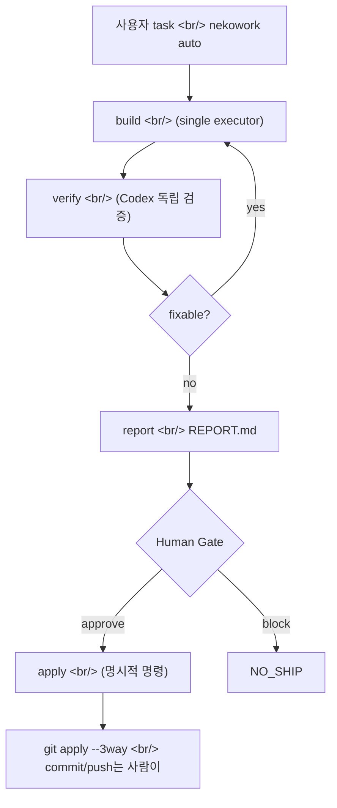

## 개요

[Ps-Neko/NEKOWORK](https://github.com/Ps-Neko/NEKOWORK)는 2026-04-29에 처음 푸시되고 2026-05-08에 `0.1.0-alpha.8`까지 올라온, 1인 개발자가 만든 [npm 패키지](https://www.npmjs.com/package/@ps-neko/nekowork)다. 이름은 귀엽지만 표방하는 자리는 진지하다 — **"Verified Autopilot for AI code changes"**. [Claude Code](https://www.anthropic.com/claude-code), [Codex CLI](https://github.com/openai/codex), [Cursor](https://cursor.com), [Gemini CLI](https://github.com/google-gemini/gemini-cli), [OpenCode](https://opencode.ai) 위에 얹는 한 겹의 런타임으로, AI가 짠 코드가 사람의 레포에 들어가기 전까지 **evidence를 만들고 독립 검증을 거치고 사람의 승인을 받는** 흐름을 강제한다. 100개짜리 에이전트 카탈로그가 아니라 **검증 루프 자체를 제품으로 삼는다**는 포지셔닝이 특이하다.

<!--more-->



## 1. NEKOWORK가 가장 먼저 거부하는 것

[README](https://github.com/Ps-Neko/NEKOWORK#readme)의 첫 화면이 곧 제품 설명이다.

```text
No auto-commit. No auto-push. No surprise deploy.
```

[Cursor의 Composer 자동 모드](https://docs.cursor.com/composer/overview), [Aider의 auto-commit 기본값](https://aider.chat/docs/usage/commands.html), 또는 [Devin](https://devin.ai) 같은 풀 오토 에이전트가 모두 "사람이 마우스 한 번도 안 누르고 PR이 올라간다"를 자랑할 때, NEKOWORK는 정확히 그 자리를 거부한다. `apply`는 **항상 별도 명령**이고, `auto` 명령은 `--apply` 플래그를 **명시적으로 거절한다**.

대신 NEKOWORK가 만드는 건 evidence다 — `work-summary.json`, `verify-summary.json`, `ship-summary.json`, `gate-summary.json`, 그리고 사람이 읽는 첫 화면인 `REPORT.md`.

## 2. 하나의 매니페스트, 다섯 개의 표면

[`agent.yaml`](https://github.com/Ps-Neko/NEKOWORK/blob/main/agent.yaml)이 진실 원본이다. 거기엔 에이전트, 스킬, 훅, 프로필, 모듈, MCP 핀이 한 곳에 적혀 있고, 빌더 스크립트가 그것을 다섯 개의 하네스 디렉터리로 투영한다.

| 타겟 | 출력 디렉터리 | 빌더 |
|---|---|---|
| Claude Code | `.claude/` | `scripts/build-claude.js` |
| Codex CLI | `.codex/config.toml` | `scripts/build-codex.js` |
| Cursor | `.cursor/` | `scripts/build-cursor.js` |
| Gemini CLI | `.gemini/` | `scripts/build-gemini.js` |
| OpenCode | `.opencode/` | `scripts/build-opencode.js` |

이 패턴은 [gitagent 스펙](https://github.com/Ps-Neko/NEKOWORK/blob/main/agent.yaml#L1) (`spec_version: gitagent/0.1.0`)을 따른다. 같은 발상은 [continue.dev의 hub](https://hub.continue.dev), [Anthropic의 Skill](https://docs.anthropic.com/en/docs/build-with-claude/skills)에서도 보이지만, NEKOWORK는 한 단계 더 나아가서 **"카탈로그는 빌드 산출물"**이라는 입장을 분명히 한다. 하네스가 사라져도 매니페스트는 살아남는다.

[SOUL.md](https://github.com/Ps-Neko/NEKOWORK/blob/main/SOUL.md)에 한 줄로 정리돼 있다 — "Claude Code 가 사라져도 Codex · Cursor · Gemini · OpenCode · 사내 LLM 위에서 동일한 카탈로그가 동작해야 한다."

## 3. 핵심 invariant — executor 한 명, verifier 한 명

[ARCHITECTURE.md](https://github.com/Ps-Neko/NEKOWORK/blob/main/docs/ARCHITECTURE.md#product-invariants)에 못박혀 있다.

- 다중 워커 단계는 **기본 read-only**
- 한 work 사이클에 **한 명의 executor**만 프로젝트 파일을 수정
- Codex 리뷰가 **기본 독립 검증 경로**
- 민감한 변경은 [Codex challenge](https://github.com/Ps-Neko/NEKOWORK/blob/main/agents) 또는 Human Gate 필수
- 프로필은 기능을 추가할 수 있지만 안전 게이트는 못 약화시킨다

`team` 명령으로 여러 워커가 동시에 생각해도 산출물은 **read-only handoff**다. 실제 수정은 `work` 단계에서 단 하나의 executor가 한다. 이게 NEKOWORK가 "100개 에이전트 팩"이 되지 않는 이유다 — 카탈로그 크기가 아니라 **mutation 단일화**가 제품의 약속이다.

이 발상은 [git의 single-writer index](https://git-scm.com/docs/index-format), [데이터베이스의 single-leader replication](https://martin.kleppmann.com/2017/03/27/designing-data-intensive-applications.html) 같은 시스템 디자인 패턴을 AI 에이전트 레이어로 가져온 것이다. 여러 에이전트가 같은 파일을 동시에 만지는 [멀티 에이전트 시나리오](https://github.com/microsoft/autogen)에서 충돌과 race condition을 보면 이 결정이 이해가 간다.

## 4. CLI surface — 의도적으로 작다

`nekowork --help`에서 보이는 [공개 명령](https://github.com/Ps-Neko/NEKOWORK/blob/main/docs/ARCHITECTURE.md#public-flow):

```text
check   — 로컬 readiness 검사
ask     — provider 없이 목표/범위/위험 명확화
plan    — planning handoff
team    — 여러 워커의 read-only handoff
work    — single executor 구현 + isolated diff
verify  — Codex 전용 검증
gate    — Human Gate approve/block
ship    — ship/no-ship readiness
report  — REPORT.md 생성 (프로젝트 mutation 없음)
apply   — 검증된 SHIP_READY diff를 명시적으로 적용
run     — work -> verify -> ship 묶음
build   — 한 명령 빌더 wrapper (fast/safe/team/tdd/release)
auto    — apply 경계 전까지 bounded autonomy
```

[Aider](https://aider.chat)나 [Claude Code](https://www.anthropic.com/claude-code)의 명령 표면과 비교하면 흥미롭다. Aider는 인터랙티브 채팅에 가깝고, Claude Code는 슬래시 명령 + 스킬 조합인데, NEKOWORK는 **파이프라인의 각 단계가 명시적인 CLI 명령**이다. `work`는 `verify`를 안 돌리고, `verify`는 `ship`을 안 돌리고, `ship`은 절대 `apply`를 안 한다. **각 단계가 자기 일만 한다**는 Unix 철학을 AI 에이전트 워크플로에 적용한 셈이다.

## 5. Risk classifier와 mode safety

[manifests/build-modes.json](https://github.com/Ps-Neko/NEKOWORK)에 `fast`, `safe`, `team`, `tdd`, `release` 다섯 모드의 안전 순서가 적혀 있고, `build` 명령은 task를 분류해서 적절한 모드를 자동으로 고른다. 그리고 **명시적 downgrade를 거부**한다 — README에 박힌 예시:

```bash
build "change OAuth token validation" --mode fast
# Blocked: auto routing recommends `safe`
```

`--force-mode`로 우회할 수는 있지만, 그건 "내가 이 downgrade를 의도적으로 받아들인다"는 명시 선언이고 evidence에 기록된다. [npm semver의 strict mode](https://docs.npmjs.com/cli/v10/configuring-npm/package-json#engines), [Kubernetes admission controller](https://kubernetes.io/docs/reference/access-authn-authz/admission-controllers/)와 같은 발상 — 기본은 안전, 우회는 명시적, 우회는 감사 가능.

## 6. Provider auth — 장기 API key는 기본 차단

흥미로운 디테일. NEKOWORK는 [delegated CLI auth](https://github.com/Ps-Neko/NEKOWORK/blob/main/docs/AUTH-MIGRATION.md)를 기본으로 둔다. `claude auth status`, `codex login`, `gemini` 같은 로컬 CLI 세션을 사용하고, `ANTHROPIC_API_KEY` / `OPENAI_API_KEY` / `GEMINI_API_KEY` 같은 **장기 환경변수는 provider 호출 전에 차단**한다.

```text
Risk: provider-auth / long-lived-secret
Codex verdict: request_changes
Human Gate: required
```

명시 opt-in이 필요하다 — `HARNESS_AUTH_ALLOW_ENV_OVERRIDE=1`. 이건 [Anthropic의 권장 보안 패턴](https://docs.anthropic.com/en/api/getting-started#authentication), [GitGuardian의 secret hygiene 보고서](https://www.gitguardian.com/state-of-secrets-sprawl-report-2024)와 같은 흐름이다. 솔로 개발자가 처음부터 이걸 기본값으로 깔아둔 건 드물다.

## 7. 1인 개발자의 깊이 — 평가

NEKOWORK는 별 0개, fork 0개의 알파다. 그런데 레포 구조를 보면 1인 사이드 프로젝트치고는 **깊이가 비정상적이다**.

- `293 tests / 0 moderate+ npm audit issues` — alpha 단계인데 풀 CI
- `docs/` 35+ 파일 — ARCHITECTURE / SAFETY-GUARANTEES / TRUST-MODEL / WHY-NOT-AUTOPILOT까지
- [CODE_OF_CONDUCT.md](https://www.contributor-covenant.org), [SECURITY.md](https://github.com/Ps-Neko/NEKOWORK/blob/main/SECURITY.md), [CONTRIBUTING.md](https://github.com/Ps-Neko/NEKOWORK/blob/main/CONTRIBUTING.md) — OSS 위생 완비
- `.mcp.json`, `bridge/mcp-server.js` — [MCP gateway](https://modelcontextprotocol.io) 내장
- `8 case-study flows / 5 starter packs` — 실제 외부 run evidence 수집 중

비교군을 보면 위치가 더 또렷해진다.

- [Cline](https://github.com/cline/cline) — 백만 다운로드, 인터랙티브 에이전트 IDE 통합 중심
- [Aider](https://aider.chat) — 30k stars, git-native AI 페어 프로그래밍
- [Devin](https://devin.ai) — 풀 오토 에이전트, 클로즈드 소스
- [continue.dev](https://www.continue.dev) — IDE 확장 + hub 카탈로그
- [Block의 Goose](https://github.com/block/goose) — 로컬 에이전트 프레임워크

이 모든 도구가 "AI가 얼마나 빨리/잘 짜는가"를 경쟁하는데, NEKOWORK만 **"AI가 짠 걸 어떻게 검증하고 멈추는가"**를 경쟁한다. 시장 포지셔닝으로는 [Chef InSpec](https://www.chef.io/products/chef-inspec)이나 [Open Policy Agent](https://www.openpolicyagent.org)에 가깝다 — compliance 레이어로서의 AI 에이전트 런타임.

## 8. 솔로 개발자 사이드 프로젝트의 좋은 형태

NEKOWORK는 별이 0개고 외부 검증이 거의 없는 알파 단계 도구다. 솔직하게 말하면, 이 도구가 6개월 안에 사라질 가능성도 충분히 있다. 그런데도 이 레포가 흥미로운 이유는 **1인 개발자가 스스로 정한 invariant를 코드로 강제한 방식** 때문이다.

- **카탈로그를 키우는 유혹을 거부** — "100개 에이전트 팩이 아니다"라고 README 첫 화면에 박았다.
- **Human Gate를 회피할 수 없게 만듦** — `auto` 명령이 `--apply`를 받지 않는 건 코드 레벨의 결정이지 문서 권고가 아니다.
- **하나의 매니페스트가 다섯 표면을 만든다** — 특정 벤더 도구가 사라지는 시나리오를 처음부터 가정.
- **장기 API key를 기본 차단** — solo dev가 첫날부터 secret hygiene를 기본값으로.

이건 [Linus Torvalds의 "talk is cheap, show me the code"](https://lkml.org/lkml/2000/8/25/132)의 작은 버전이다. AI 에이전트 안전성에 대해 글을 쓰는 사람은 많지만, **자기 워크플로의 invariant를 CLI 동작으로 박아넣은 사람**은 드물다.

## 인사이트

NEKOWORK가 시장에서 살아남을지는 모른다. [`@ps-neko/nekowork@alpha`](https://www.npmjs.com/package/@ps-neko/nekowork) 패키지가 6개월 뒤에도 active일지, 아니면 1인 개발자의 또 다른 archived 레포가 될지는 시간이 답한다. 하지만 이 레포에서 가져갈 수 있는 건 명확하다 — **AI 코딩 도구의 다음 경쟁은 "얼마나 빨리 짜는가"가 아니라 "어떻게 멈추고 어떻게 증명하는가"가 될 가능성**. [Cursor의 Composer](https://docs.cursor.com/composer/overview), [Anthropic의 Claude Code](https://www.anthropic.com/claude-code), [GitHub Copilot Workspace](https://github.com/features/copilot), [Devin](https://devin.ai)이 자동화 폭을 늘리는 동안, NEKOWORK는 정반대 방향으로 evidence/Human Gate/explicit apply에 베팅한다. 이 베팅은 엔터프라이즈/금융/의료 도메인에선 결국 표준이 될 가능성이 높다 — [SOC 2](https://www.aicpa-cima.com/topic/audit-assurance/audit-and-assurance-greater-than-soc-2), [ISO 27001](https://www.iso.org/standard/27001), [EU AI Act](https://artificialintelligenceact.eu)의 audit 요구가 AI 에이전트 워크플로에도 그대로 내려올 것이기 때문이다. 솔로 개발자 한 명이 이 자리를 먼저 잡았다는 것 자체가 흥미롭고, 한국 개발자 입장에서 가장 빨리 시도해볼 수 있는 건 `npx -y @ps-neko/nekowork@alpha check` 한 줄로 자기 레포에 한 번 돌려보는 것이다.

## 참고

**Repository**
- [Ps-Neko/NEKOWORK GitHub 저장소](https://github.com/Ps-Neko/NEKOWORK)
- [NEKOWORK Korean README](https://github.com/Ps-Neko/NEKOWORK/blob/main/README.ko.md)
- [@ps-neko/nekowork on npm](https://www.npmjs.com/package/@ps-neko/nekowork)
- [agent.yaml manifest](https://github.com/Ps-Neko/NEKOWORK/blob/main/agent.yaml)

**Core docs**
- [ARCHITECTURE.md](https://github.com/Ps-Neko/NEKOWORK/blob/main/docs/ARCHITECTURE.md)
- [WHY-NEKOWORK.md](https://github.com/Ps-Neko/NEKOWORK/blob/main/docs/WHY-NEKOWORK.md)
- [SAFETY-GUARANTEES.md](https://github.com/Ps-Neko/NEKOWORK/blob/main/docs/SAFETY-GUARANTEES.md)
- [TRUST-MODEL.md](https://github.com/Ps-Neko/NEKOWORK/blob/main/docs/TRUST-MODEL.md)
- [WHY-NOT-AUTOPILOT.md](https://github.com/Ps-Neko/NEKOWORK/blob/main/docs/WHY-NOT-AUTOPILOT.md)

**Comparable AI coding tools**
- [Aider](https://aider.chat)
- [Cline](https://github.com/cline/cline)
- [Cursor](https://cursor.com)
- [Devin](https://devin.ai)
- [continue.dev](https://www.continue.dev)
- [Block Goose](https://github.com/block/goose)

**Related ecosystem**
- [Anthropic Claude Code](https://www.anthropic.com/claude-code)
- [OpenAI Codex CLI](https://github.com/openai/codex)
- [Google Gemini CLI](https://github.com/google-gemini/gemini-cli)
- [OpenCode](https://opencode.ai)
- [Model Context Protocol](https://modelcontextprotocol.io)
