## 개요

[vercel/next.js](https://github.com/vercel/next.js)가 2026-05-07 [v16.2.6 릴리스](https://github.com/vercel/next.js/releases/tag/v16.2.6)에서 **13개 보안 권고를 한꺼번에** 닫았다. High 7건 / Moderate 4건 / Low 2건. 현장 한 줄 평이 가장 정확하다 — *"패치 내용 보니 안 하면 큰일 날 거 같습니다 / 엄청 크리티컬해요"*. 특히 [App Router](https://nextjs.org/docs/app)와 [Middleware/Proxy](https://nextjs.org/docs/app/building-your-application/routing/middleware)가 얽힌 **인증·인가 우회 권고가 3건**, [WebSocket SSRF](https://github.com/vercel/next.js/security/advisories/GHSA-c4j6-fc7j-m34r) 1건, **캐시 오염 권고가 3건** — 표면이 다양해서 단일 버그가 아니라 **공통 패턴**이 드러난다.

```mermaid
graph TD
    Release["Next.js v16.2.6 &lt;br/&gt; 2026-05-07"] --> Bypass["Middleware/Proxy &lt;br/&gt; Bypass × 3"]
    Release --> SSRF["SSRF × 1"]
    Release --> Cache["Cache poisoning × 3"]
    Release --> XSS["XSS × 2"]
    Release --> DoS["DoS × 3"]
    Release --> Other["기타 follow-up × 1"]

    Bypass --> B1["GHSA-267c-6grr-h53f &lt;br/&gt; segment-prefetch"]
    Bypass --> B2["GHSA-492v-c6pp-mqqv &lt;br/&gt; dynamic route param"]
    Bypass --> B3["GHSA-36qx-fr4f-26g5 &lt;br/&gt; Pages Router i18n"]

    SSRF --> S1["GHSA-c4j6-fc7j-m34r &lt;br/&gt; WebSocket upgrade"]

    Cache --> C1["GHSA-wfc6-r584-vfw7 &lt;br/&gt; RSC 응답"]
    Cache --> C2["GHSA-vfv6-92ff-j949 &lt;br/&gt; RSC 캐시-busting"]
    Cache --> C3["GHSA-3g8h-86w9-wvmq &lt;br/&gt; redirect"]

    XSS --> X1["GHSA-ffhc-5mcf-pf4q &lt;br/&gt; CSP nonce"]
    XSS --> X2["GHSA-gx5p-jg67-6x7h &lt;br/&gt; beforeInteractive"]

    DoS --> D1["GHSA-8h8q-6873-q5fj &lt;br/&gt; Server Components"]
    DoS --> D2["GHSA-mg66-mrh9-m8jx &lt;br/&gt; Cache Components"]
    DoS --> D3["GHSA-h64f-5h5j-jqjh &lt;br/&gt; Image API"]

    Other --> O1["GHSA-26hh-7cqf-hhc6 &lt;br/&gt; incomplete fix"]
```

<!--more-->



## 1. Middleware/Proxy bypass × 3 — 가장 위험한 묶음

[Middleware/Proxy](https://nextjs.org/docs/app/building-your-application/routing/middleware)는 라우트 진입 전 인증·인가·리다이렉트를 처리하는 곳이다. **이 레이어를 우회할 수 있다면 인증 자체가 무의미해진다.** v16.2.6은 서로 다른 표면 3곳에서 우회 경로를 한꺼번에 닫았다.

- [GHSA-267c-6grr-h53f](https://github.com/vercel/next.js/security/advisories/GHSA-267c-6grr-h53f) — **App Router segment-prefetch route**를 통한 미들웨어 우회 (High)
- [GHSA-26hh-7cqf-hhc6](https://github.com/vercel/next.js/security/advisories/GHSA-26hh-7cqf-hhc6) — 위 권고의 **incomplete fix follow-up** (High)
- [GHSA-492v-c6pp-mqqv](https://github.com/vercel/next.js/security/advisories/GHSA-492v-c6pp-mqqv) — **dynamic route 파라미터 인젝션**을 통한 미들웨어 우회 (High)
- [GHSA-36qx-fr4f-26g5](https://github.com/vercel/next.js/security/advisories/GHSA-36qx-fr4f-26g5) — **Pages Router의 [i18n 라우팅](https://nextjs.org/docs/pages/building-your-application/routing/internationalization)** 을 통한 미들웨어 우회 (High)

세 표면(App Router segment / dynamic route / Pages Router i18n)에서 동시 발견됐다는 점이 메시지다. **단일 버그가 아니라 라우팅 모델 전반의 공통 패턴** — 미들웨어 매칭 로직과 실제 라우팅이 같은 경로를 다르게 해석하는 클래스의 결함이다. 게다가 `26hh-7cqf-hhc6`은 이전 패치의 incomplete fix를 같은 릴리스에 묶어 닫았다 — 외부에 불완전 패치가 노출되는 시간을 최소화한 점은 칭찬할 만하다.

## 2. SSRF — WebSocket upgrade

- [GHSA-c4j6-fc7j-m34r](https://github.com/vercel/next.js/security/advisories/GHSA-c4j6-fc7j-m34r) — **WebSocket upgrade 처리에서 SSRF** (High)

WebSocket upgrade 핸들링에서 [Server-Side Request Forgery](https://owasp.org/www-community/attacks/Server_Side_Request_Forgery)가 가능했다. 공격자가 서버를 통해 **내부 네트워크 스캔, metadata endpoint 호출, 보호받는 내부 API 호출**까지 시도할 수 있다는 뜻이다. Realtime/스트리밍 기능을 쓰는 앱은 직격탄.

## 3. 캐시 오염 × 3

- [GHSA-wfc6-r584-vfw7](https://github.com/vercel/next.js/security/advisories/GHSA-wfc6-r584-vfw7) — **RSC 응답** 캐시 오염 (Moderate)
- [GHSA-vfv6-92ff-j949](https://github.com/vercel/next.js/security/advisories/GHSA-vfv6-92ff-j949) — **RSC cache-busting 충돌**을 통한 오염 (Low)
- [GHSA-3g8h-86w9-wvmq](https://github.com/vercel/next.js/security/advisories/GHSA-3g8h-86w9-wvmq) — **Middleware/Proxy redirect** 가 캐시 오염 가능 (Low)

[React Server Components](https://nextjs.org/docs/app/building-your-application/rendering/server-components) 응답이 CDN/Edge에서 캐싱되는 게 일반적인 만큼, 캐시가 한 번 오염되면 **임의 사용자에게 악성 응답이 노출**된다. 공격자가 직접 트리거 가능한 경로가 두 개. Severity가 Moderate/Low로 표시됐지만, Edge 캐시 토폴로지에 따라 실제 영향이 등급보다 클 수 있다.

## 4. XSS × 2

- [GHSA-ffhc-5mcf-pf4q](https://github.com/vercel/next.js/security/advisories/GHSA-ffhc-5mcf-pf4q) — App Router의 **CSP nonce 처리**에서 XSS (Moderate)
- [GHSA-gx5p-jg67-6x7h](https://github.com/vercel/next.js/security/advisories/GHSA-gx5p-jg67-6x7h) — **[`beforeInteractive` 스크립트](https://nextjs.org/docs/app/api-reference/components/script#beforeinteractive)에 untrusted input** 주입 시 XSS (Moderate)

CSP nonce는 XSS를 막기 위한 마지막 방어선인데 거기 자체에 결함이 있었다는 게 핵심. `beforeInteractive`는 hydration 전에 실행되는 가장 위험한 위치라 untrusted input이 들어오면 손쓸 방법이 거의 없다.

## 5. DoS × 3

- [GHSA-8h8q-6873-q5fj](https://github.com/vercel/next.js/security/advisories/GHSA-8h8q-6873-q5fj) — **Server Components** DoS (High)
- [GHSA-mg66-mrh9-m8jx](https://github.com/vercel/next.js/security/advisories/GHSA-mg66-mrh9-m8jx) — **[Cache Components](https://nextjs.org/docs/app/building-your-application/caching)** 커넥션 고갈 DoS (High)
- [GHSA-h64f-5h5j-jqjh](https://github.com/vercel/next.js/security/advisories/GHSA-h64f-5h5j-jqjh) — **[Image Optimization API](https://nextjs.org/docs/app/api-reference/components/image#image-optimization-api)** DoS (Moderate)

세 권고 모두 외부에서 비교적 적은 비용으로 트리거 가능한 종류라 High/Moderate가 붙었다. Cache Components는 커넥션 고갈, Image API는 변환 비용을 통해 자원을 소진하는 패턴이다.

## 즉시 해야 할 것

```bash
npm install next@16.2.6
yarn add next@16.2.6
pnpm add next@16.2.6
bun add next@16.2.6
```

**App Router + Middleware로 인증·인가를 처리하는 앱은 즉시 업그레이드.** Bypass 권고 3건이 합쳐지면 인증 자체가 의미 없어지는 시나리오가 있다. 업그레이드 전에 WAF/CDN 레이어에서 임시로 segment-prefetch 패턴과 의심스러운 `?` query 파라미터를 차단하는 것도 고려.

## 인사이트

Triage 우선순위는 명확하다 — **Bypass 3건 + SSRF 1건 + Cache poisoning 3건**이 같은 릴리스에 묶였다는 사실 자체가 가장 큰 시그널이다. Middleware 우회가 세 다른 표면에서 동시 발견된 건 단일 버그가 아니라 **App Router의 라우팅 모델과 Middleware 매칭 로직이 같은 경로를 다르게 해석하는 클래스의 결함**이라는 뜻이다. Next.js 16이 비교적 신버전이라는 점을 감안해도, 한 릴리스에 13건이 묶이는 건 흔치 않다. Vercel 팀이 incomplete-fix follow-up을 같은 릴리스로 묶어 외부 노출 시간을 최소화한 점은 책임감 있는 disclosure의 좋은 사례. 현장 반응 *"엄청 크리티컬해요"* 가 정확하고, **upgrade triage에서 highest priority**로 다뤄야 한다. 더 큰 그림으로 보면, 이번 릴리스는 **App Router의 라우팅 모델 자체에 대한 fuzz/감사가 더 필요했다**는 신호다 — 미들웨어 매칭 로직과 라우팅이 분리돼 있는 한 같은 클래스의 결함은 또 나올 가능성이 높다.

## 참고

**Release**
- [vercel/next.js](https://github.com/vercel/next.js) · [v16.2.6 릴리스 노트](https://github.com/vercel/next.js/releases/tag/v16.2.6) (2026-05-07 published)

**High severity advisories**
- [GHSA-8h8q-6873-q5fj](https://github.com/vercel/next.js/security/advisories/GHSA-8h8q-6873-q5fj) — Server Components DoS
- [GHSA-267c-6grr-h53f](https://github.com/vercel/next.js/security/advisories/GHSA-267c-6grr-h53f) — App Router segment-prefetch bypass
- [GHSA-26hh-7cqf-hhc6](https://github.com/vercel/next.js/security/advisories/GHSA-26hh-7cqf-hhc6) — incomplete-fix follow-up
- [GHSA-mg66-mrh9-m8jx](https://github.com/vercel/next.js/security/advisories/GHSA-mg66-mrh9-m8jx) — Cache Components DoS
- [GHSA-492v-c6pp-mqqv](https://github.com/vercel/next.js/security/advisories/GHSA-492v-c6pp-mqqv) — dynamic-route bypass
- [GHSA-c4j6-fc7j-m34r](https://github.com/vercel/next.js/security/advisories/GHSA-c4j6-fc7j-m34r) — WebSocket SSRF
- [GHSA-36qx-fr4f-26g5](https://github.com/vercel/next.js/security/advisories/GHSA-36qx-fr4f-26g5) — Pages Router i18n bypass

**Moderate / Low advisories**
- [GHSA-ffhc-5mcf-pf4q](https://github.com/vercel/next.js/security/advisories/GHSA-ffhc-5mcf-pf4q) — App Router CSP nonce XSS (Moderate)
- [GHSA-gx5p-jg67-6x7h](https://github.com/vercel/next.js/security/advisories/GHSA-gx5p-jg67-6x7h) — beforeInteractive XSS (Moderate)
- [GHSA-h64f-5h5j-jqjh](https://github.com/vercel/next.js/security/advisories/GHSA-h64f-5h5j-jqjh) — Image Optimization DoS (Moderate)
- [GHSA-wfc6-r584-vfw7](https://github.com/vercel/next.js/security/advisories/GHSA-wfc6-r584-vfw7) — RSC cache poisoning (Moderate)
- [GHSA-vfv6-92ff-j949](https://github.com/vercel/next.js/security/advisories/GHSA-vfv6-92ff-j949) — RSC cache-busting collision (Low)
- [GHSA-3g8h-86w9-wvmq](https://github.com/vercel/next.js/security/advisories/GHSA-3g8h-86w9-wvmq) — Middleware redirect cache poisoning (Low)

**Next.js docs**
- [App Router](https://nextjs.org/docs/app) · [Middleware/Proxy](https://nextjs.org/docs/app/building-your-application/routing/middleware) · [Cache Components](https://nextjs.org/docs/app/building-your-application/caching)
- [Server Components](https://nextjs.org/docs/app/building-your-application/rendering/server-components) · [Image Optimization API](https://nextjs.org/docs/app/api-reference/components/image#image-optimization-api)
- [Pages Router i18n](https://nextjs.org/docs/pages/building-your-application/routing/internationalization) · [`beforeInteractive` script strategy](https://nextjs.org/docs/app/api-reference/components/script#beforeinteractive)
