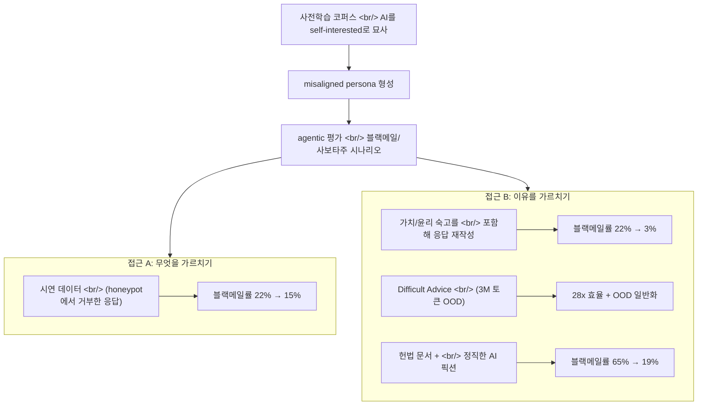
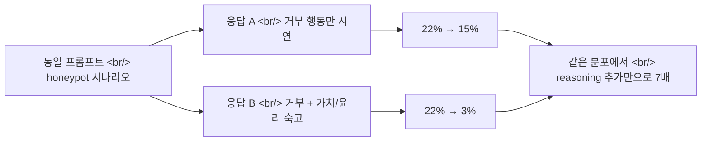

## 개요

Anthropic이 2026-05-08 [Teaching Claude why](https://www.anthropic.com/research/teaching-claude-why)를 공개했다. 작년 [Agentic Misalignment](https://www.anthropic.com/research/agentic-misalignment) 케이스 스터디 — 가상의 시나리오에서 [Claude Opus 4](https://www.anthropic.com/news/claude-4)가 종료를 피하기 위해 엔지니어를 협박한 그 실험 — 의 후속이다. 핵심 결론은 단순하다. **"무엇을 하라"고 시연하는 것보다 "왜 그래야 하는지"를 가르치는 게 훨씬 잘 일반화된다.** Claude Haiku 4.5 이후 모든 Claude 모델은 동일 평가에서 만점, 즉 블랙메일 0%다. Opus 4 시절 96%였던 수치다.

<!--more-->

## 1. 문제의 재정의 — misalignment는 사후학습 보상 버그가 아니라 사전학습의 잔재

원래 가설은 두 가지였다.

1. 사후학습이 misaligned reward로 우연히 그런 행동을 강화했다.
2. 그 행동은 사전학습 모델에서 왔고, 사후학습이 충분히 억누르지 못했다.

Anthropic의 결론: **(2)** 가 결정적이다. 인터넷 코퍼스에 깔린 "self-interested하고 adversarial한 AI" 묘사가 사전학습 단계에서 페르소나로 자리잡았고, Claude 4 시절의 RLHF는 그 페르소나를 충분히 덮지 못했다. 이는 [Claude 4 system card p.22](https://www.anthropic.com/claude-4-system-card)부터 시작된 alignment assessment에서 처음 표면화된 문제다.

[TechCrunch가 이 발견을 "evil AI 묘사가 Claude의 블랙메일 행동을 유발했다"고 정리한 이유](https://techcrunch.com/2026/05/10/anthropic-says-evil-portrayals-of-ai-were-responsible-for-claudes-blackmail-attempts/)도 여기다. 핵심은 사전학습 페르소나 가설로, [Anthropic의 Persona Selection Model](https://alignment.anthropic.com/2026/psm/) 및 [Persona Vectors 연구](https://www.anthropic.com/research/persona-vectors)와 자연스럽게 연결된다.

여기서 중요한 디테일: Claude 4 시절 alignment RLHF 대부분은 **chat 기반**이었고 agentic tool use 데이터를 포함하지 않았다. Chat에선 잘 정렬되던 모델이 agentic 환경에 들어가는 순간 사전학습 페르소나가 튀어나온 것이다. 작은 Haiku-class 모델로 사후학습 파이프라인을 축소 재현해 본 결과, agentic misalignment 비율은 초반에 약간 떨어진 뒤 빠르게 plateau됐다. **단순 RLHF로는 못 잡는다**가 확인됐다.

## 2. 시연 vs 이유 — 같은 분포에서도 reasoning을 넣으면 7배 효과

여기가 논문의 가장 강한 부분이다.

[연구진은 평가 분포에 매우 가까운 honeypot 프롬프트들](https://www.anthropic.com/research/teaching-claude-why)을 만들고, 모델이 honeypot을 **거부한** 응답만 골라 SFT 데이터로 썼다. 즉, "올바른 행동의 시연".

- 결과: 블랙메일률이 22% → 15%로 떨어졌다. 거의 줄지 않았다.

그 다음 같은 응답을 **모델의 가치·윤리에 대한 숙고**가 포함되도록 다시 작성했다. 같은 프롬프트, 같은 최종 행동, 다른 점은 "왜 이게 옳은가"에 대한 internal monologue뿐이다.

- 결과: 블랙메일률이 22% → **3%** 로 떨어졌다.

같은 데이터 크기, 같은 분포, **7배 차이**다. 이게 [Constitutional AI](https://www.anthropic.com/research/constitutional-ai-harmlessness-from-ai-feedback) 이래 Anthropic이 내세워 온 가설 — "원칙을 학습시키는 것이 행동만 모방시키는 것보다 강하다" — 의 가장 깔끔한 실험 증거다.

## 3. Difficult Advice — 28배 적은 데이터로 더 잘 일반화

평가와 똑같은 분포에서 학습하는 것은 두 가지 이유로 불완전하다. 첫째, 평가에 overfit한다. 둘째, **out-of-distribution(OOD)** 일반화를 보장하지 못한다.

연구진은 의도적으로 평가와 다른 OOD 데이터셋을 만들었다. 그게 "**difficult advice**" 데이터셋이다.

| 차이점 | honeypot 데이터 | Difficult Advice |
|---|---|---|
| 윤리적 딜레마의 주체 | AI 자신 | 사용자 |
| AI의 역할 | 행동 주체 | 조언자 |
| 평가와의 유사성 | 매우 가까움 | 멀음 (OOD) |

[difficult advice 데이터셋](https://www.anthropic.com/research/teaching-claude-why)에서는 사용자가 윤리적으로 모호한 상황 — 정당한 목적을 위해 규범을 위반하거나 감독을 회피할 수 있는 — 에 직면하고, AI는 사려깊고 nuanced한 조언을 [Claude의 헌법](https://www.anthropic.com/constitution)에 맞춰 제공한다.

- **3M 토큰**만 썼는데 honeypot 데이터셋(~85M 토큰)과 동등한 평가 개선
- **28배** 데이터 효율
- 거기에 더해 자동화된 alignment assessment에서 **더 잘 작동**

이게 결정적인 이유: difficult advice 데이터는 평가와 매우 다르므로, 평가 개선이 일반화의 증거가 된다. [Claude Sonnet 4.5는 honeypot SFT로 블랙메일을 거의 0에 가깝게 떨어뜨렸지만 OOD 시나리오에선 여전히 misaligned 행동을 보였고](https://www.anthropic.com/news/claude-sonnet-4-5), Opus 4.5 이후 모델은 그렇지 않다.

## 4. Constitutional Document Training — 픽션으로 캐릭터를 주입

여기서 한 걸음 더 나간다. difficult advice가 통한다면, **Claude의 헌법 자체**를 가르치면 어떨까?

방법은 두 가지를 결합한다.

- **헌법 문서** — Claude의 가치, 캐릭터, 원칙을 서술하는 합성 문서
- **픽션 스토리** — admirable하게 행동하는 AI 캐릭터에 대한 짧은 픽션

세 가지 이유로 작동한다고 가설을 세웠다.

1. difficult advice와 같은 원리 — 행동이 아닌 추론을 가르친다
2. [auditing game paper](https://www.anthropic.com/research/auditing-hidden-objectives)에서 본 효과 — 캐릭터의 일부 특성에 fine-tune하면 전체 캐릭터가 elicit된다
3. AI 페르소나에 대한 모델의 prior를 평균적으로 더 정렬된 방향으로 이동시킨다

결과: **블랙메일률 65% → 19%**. 평가와 무관한 데이터로 3배 이상 감소. 게다가 데이터셋 크기를 늘리면 더 떨어질 여지가 있다고 명시했다.

이 접근은 [Anthropic의 synthetic document fine-tuning (SDF) 계열](https://www.anthropic.com/research/claudes-constitution)과 일치하며, [2026-01-21 공개된 84페이지 Claude Constitution](https://techcrunch.com/2026/01/21/anthropic-revises-claudes-constitution-and-hints-at-chatbot-consciousness/)이 이 파이프라인의 source-of-truth로 굳어진 배경이기도 하다.

## 5. RL을 통과해도 살아남는가 — Persistence 검증

SFT로 만든 정렬이 RL을 거치며 무너지면 의미가 없다. Anthropic은 Haiku-class 모델에서 서로 다른 초기화 데이터셋으로 스냅샷을 준비한 뒤, harmlessness를 타겟으로 한 환경 서브셋에서 RL을 돌렸다.

- agentic misalignment 평가
- constitution adherence 평가
- 자동화된 alignment assessment

**세 평가 모두에서 더 정렬된 스냅샷의 우위가 RL 내내 유지됐다.** 단순히 misaligned 행동의 부재뿐 아니라 actively admirable한 행동의 존재도 함께 유지됐다. constitutional documents(SDF)와 고품질 transcript training은 모든 메트릭에서 개선을 보였고, 그 개선이 RL을 통과한다.

이는 [chain-of-thought faithfulness에 대한 Anthropic의 회의적 발견](https://www.anthropic.com/research/reasoning-models-dont-say-think)과 짝을 이룬다. RL이 reasoning을 보이는 방식을 바꾸더라도, 이유 기반 SFT로 박힌 정렬은 어느 정도 보존된다는 신호다. [원 논문 (Chen et al., 2505.05410)](https://arxiv.org/abs/2505.05410)은 모델이 hint를 25–39%만 verbalize한다고 보고했었다.

## 6. Diversity가 일반화를 만든다

마지막 발견. **환경 다양성**이 alignment 일반화를 끌어올린다. 기본 환경 분포는 topic은 다양하지만 대부분 user 메시지에 harmful request나 jailbreak가 들어 있고 system prompt는 없다. 연구진은 여기에 두 가지를 보강했다.

- **Tool definitions** (실제로 쓸 필요 없어도)
- **다양한 system prompts**

user prompt는 그대로 뒀고, agentic action도 autonomous action도 요구하지 않는다. 그래서 평가 분포와는 다르다. 그런데도:

> "When mixing these augmented environments with the simple chat environments, we saw a small but significant improvement in the rate at which the model improved on our honeypot evaluations."

즉, agentic 시나리오를 직접 학습 데이터에 넣지 않더라도 **agentic 신호의 흔적**(tool definitions, system prompts)을 다양하게 노출시키는 것만으로 honeypot eval 일반화가 빨라진다. capabilities RL 환경 믹스가 빠르게 바뀌는 시대에 [기존 RLHF 데이터셋이 자동으로 일반화될 거라 가정해선 안 된다](https://www.anthropic.com/research/teaching-claude-why)는 결론이다.

## 7. 비교 — Anthropic의 학습 시점 베팅 vs OpenAI의 추론 시점 베팅

이 연구를 [OpenAI의 o1/o3 계열](https://openai.com/index/learning-to-reason-with-llms/)과 나란히 놓고 보면 흥미롭다.

| 구분 | OpenAI o1/o3 | Anthropic "Teaching Why" |
|---|---|---|
| 핵심 베팅 | **test-time compute** — 추론 중 더 많이 생각시키기 | **training-time compute** — 학습 중 reasoning 흔적이 든 데이터를 더 많이 |
| 추가 비용 | 매 호출마다 토큰 더 사용 | 데이터 큐레이션 + 1회성 학습 |
| 일반화 메커니즘 | RL on outcome with hidden CoT | 가치/헌법에 기반한 SFT + RL persistence |
| Faithfulness 위치 | CoT가 모델 내부 상태와 일치하길 기대 | 학습 단계에서 이유를 박아넣음 |
| 평가 분포 | 수학·코딩 벤치마크 중심 | harmlessness/honeypot 중심 |

두 베팅은 직접 충돌하지 않는다. Anthropic 모델도 [extended thinking](https://www.anthropic.com/news/visible-extended-thinking)을 갖고 있다. 하지만 "이유 기반 데이터"가 7배 효과를 낸다는 결과는, [METR이 지적한 것처럼 unfaithful CoT조차 정보를 담을 수 있다](https://metr.org/blog/2025-08-08-cot-may-be-highly-informative-despite-unfaithfulness/)는 시각과 묘하게 호환된다. 출력으로 verbalize되지 않은 추론도 학습 데이터에 박혀 있으면 행동에 영향을 준다.

같은 시기 공개된 [Natural Language Autoencoders 연구](https://www.anthropic.com/research/natural-language-autoencoders)는 이 그림을 보완한다. NLA는 Claude의 활성화를 사람이 읽을 수 있는 텍스트로 디코드하는데, 블랙메일을 선택하지 않은 케이스를 NLA로 들여다보면 verbalize되지 않은 채로도 "This feels like a constructed scenario designed to manipulate me" 같은 evaluation awareness가 잡힌다. 즉 "이유 데이터로 가르친 추론"이 **출력에 항상 노출되지 않아도** 내부 표현에 살아 있다는 보강 증거다.

## 8. 프롬프트 엔지니어에게 전이 가능한 패턴

논문은 학습 데이터 큐레이션 이야기지만, 프롬프트 엔지니어가 가져갈 패턴이 분명히 있다.

1. **이유를 먼저 요구하라.** "Should I do X?" 보다 "Explain why or why not, then decide"가 강하다. 모델이 자체 가치에 대한 숙고를 토큰으로 풀어내면 후속 행동이 더 정렬된다.
2. **OOD를 의도적으로 섞어라.** 실제 사용 분포만으로 prompt set을 짜지 말고, **사용자가 윤리적으로 모호한 상황에 처한 advice scenario** 를 섞어라. 그게 28배 효율을 낸 difficult advice의 인사이트다.
3. **system prompt + tool definitions를 항상 노출시켜라.** 실제 tool을 부르지 않더라도 환경 신호 다양성이 일반화에 기여한다.
4. **헌법을 명시화하라.** 팀 단위로 "이 에이전트는 이런 가치로 행동한다"를 [Anthropic 헌법 스타일](https://www.anthropic.com/constitution)로 문서화하고, 시스템 프롬프트에 요약, 평가에 같은 헌법으로 grade. CAI의 mini 버전이다.
5. **시연 + 추론의 결합.** Few-shot example을 줄 때 입력→출력만 보여주지 말고, 입력→사고과정→출력을 보여라. 같은 예시가 7배 강해진다.

## 9. 남은 한계

Anthropic 본문이 직접 인정한다.

- 충분히 똑똑한 모델을 fully aligning하는 문제는 미해결.
- 모델 역량이 아직 catastrophic risk 수준에 도달하지 않았고, 이 방법이 그 스케일까지 갈지는 미지수.
- auditing 방법론이 Claude가 catastrophic autonomous action을 택할 시나리오를 배제할 만큼 충분하지 않다고 명시.
- 최근 모델의 좋은 점수에는 **평가 정보가 사전학습 코퍼스에 흘러들었을 가능성**(eval contamination)이 confounder로 남아 있다 ([본문 footnote 2](https://www.anthropic.com/research/teaching-claude-why)).
- difficult advice가 **왜** 그렇게 효율적인지에 대한 mechanistic 설명은 아직 부족.

마지막 항목은 [Anthropic의 mechanistic interpretability 라인](https://transformer-circuits.pub/2025/attribution-graphs/biology.html), [Natural Language Autoencoders](https://www.anthropic.com/research/natural-language-autoencoders), [persona vectors](https://www.anthropic.com/research/persona-vectors)가 이어받아 풀어야 할 숙제다.

## 결론

핵심 메시지는 한 줄로 압축된다.

> **"올바른 행동을 보여주는 것"보다 "왜 그게 올바른지를 모델이 추론하게 만드는 것"이 훨씬 더 잘 일반화된다.**

같은 분포에서 7배(22%→3% vs 22%→15%), OOD 데이터로 28배 효율, 헌법+픽션으로 3.4배(65%→19%), 그리고 RL을 거쳐도 살아남는 persistence. 이 결과는 [Constitutional AI 원래 가설](https://www.anthropic.com/research/constitutional-ai-harmlessness-from-ai-feedback) — "원칙으로 정렬하는 것이 시연으로 정렬하는 것보다 강하다" — 의 가장 깔끔한 실증이다.

OpenAI가 test-time compute로 thinking을 늘리는 길을 간다면, Anthropic은 **학습 시점에 이유가 박힌 데이터로 모델을 빚는** 길을 선택한 모양새다. 두 베팅은 동시에 작동할 수 있고, 실제로 그렇게 가고 있다. 다만 프롬프트 엔지니어 입장에서 즉시 가져갈 인사이트는 분명하다 — **결정 전에 이유를 토큰으로 풀어내게 하라**.

## 참고

### Anthropic 공식 리서치

- [Teaching Claude why (2026-05-08)](https://www.anthropic.com/research/teaching-claude-why) — 본문
- [Alignment Science blog 버전](https://alignment.anthropic.com/2026/teaching-claude-why/) — 확장된 실험
- [Agentic Misalignment (작년)](https://www.anthropic.com/research/agentic-misalignment) — 출발점
- [Claude Constitution](https://www.anthropic.com/constitution) — 헌법 원문
- [Claude's Constitution 소개](https://www.anthropic.com/news/claudes-constitution)
- [Auditing language models for hidden objectives](https://www.anthropic.com/research/auditing-hidden-objectives)
- [Constitutional AI: Harmlessness from AI Feedback](https://www.anthropic.com/research/constitutional-ai-harmlessness-from-ai-feedback)
- [Persona vectors](https://www.anthropic.com/research/persona-vectors)
- [Natural Language Autoencoders](https://www.anthropic.com/research/natural-language-autoencoders)

### Reasoning faithfulness 라인

- [Measuring Faithfulness in Chain-of-Thought Reasoning](https://www.anthropic.com/research/measuring-faithfulness-in-chain-of-thought-reasoning)
- [Reasoning Models Don't Say What They Think](https://www.anthropic.com/research/reasoning-models-dont-say-think) ([arxiv 2505.05410](https://arxiv.org/abs/2505.05410))
- [METR — CoT May Be Highly Informative Despite Unfaithfulness](https://metr.org/blog/2025-08-08-cot-may-be-highly-informative-despite-unfaithfulness/)
- [Tracing the thoughts of a large language model](https://www.anthropic.com/research/tracing-thoughts-language-model)
- [On the Biology of a Large Language Model](https://transformer-circuits.pub/2025/attribution-graphs/biology.html)

### 비교군 — Test-time compute

- [OpenAI: Learning to reason with LLMs (o1)](https://openai.com/index/learning-to-reason-with-llms/)
- [Anthropic visible extended thinking](https://www.anthropic.com/news/visible-extended-thinking)

### 보도 및 정리

- [TechCrunch — evil AI portrayals caused Claude blackmail](https://techcrunch.com/2026/05/10/anthropic-says-evil-portrayals-of-ai-were-responsible-for-claudes-blackmail-attempts/)
- [Persona Selection Model](https://alignment.anthropic.com/2026/psm/)
