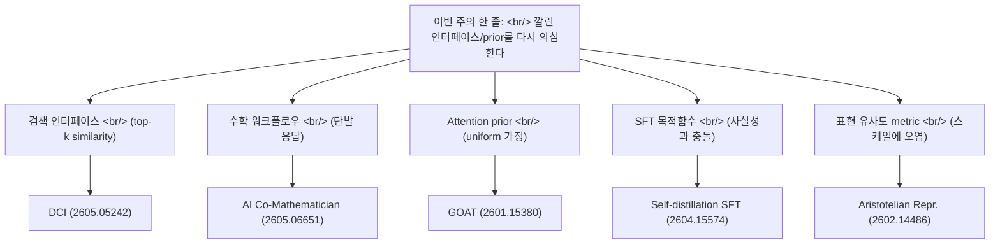
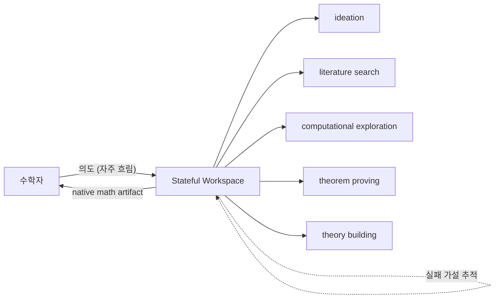
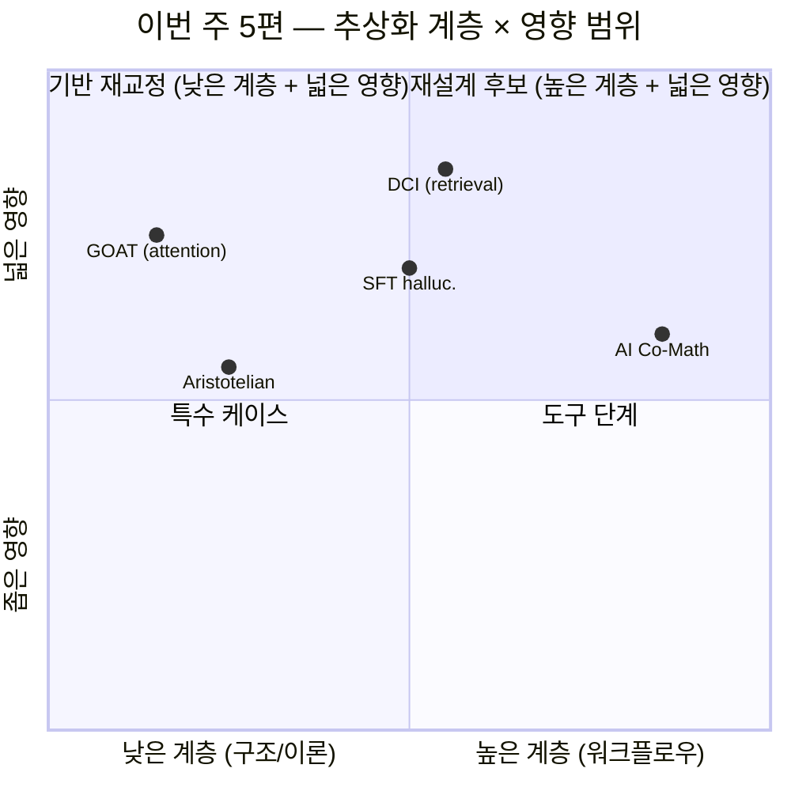

## 개요

지난 며칠 사이 [arxiv](https://arxiv.org/)에서 눈에 들어온 논문 5편. 분야는 [정보 검색](https://en.wikipedia.org/wiki/Information_retrieval), 수학 보조 에이전트, [attention](https://en.wikipedia.org/wiki/Attention_(machine_learning)) 구조, [SFT](https://en.wikipedia.org/wiki/Fine-tuning_(deep_learning))로 인한 [할루시네이션](https://en.wikipedia.org/wiki/Hallucination_(artificial_intelligence)), [표현 학습](https://en.wikipedia.org/wiki/Feature_learning) 이론으로 다 다른데, 묶어 읽으면 한 가지 의문이 반복된다 — **"우리가 당연하게 받아들이던 인터페이스와 prior가, 사실 모델의 진짜 능력을 가로막고 있는 건 아닌가?"** [지난 디지스트](/ko/p/2026-05-06-arxiv-papers-pick-multiagent-debate-mia-husserl/)가 협력·영속성·구조라는 세 축으로 추론 향상의 출처를 봤다면, 이번 주는 그 한 단계 아래 — **이미 깔린 추상화 계층을 다시 의심하는 흐름**이다.

<!--more-->

| # | 논문 | 분야 | 한 줄 요약 |
|---|---|---|---|
| 1 | [Direct Corpus Interaction (2605.05242)](https://arxiv.org/abs/2605.05242) | cs.IR | 임베딩 없이 `grep`·셸 도구로 corpus를 직접 뒤지는 에이전트가 강한 retriever를 이긴다 |
| 2 | [AI Co-Mathematician (2605.06651)](https://arxiv.org/abs/2605.06651) | cs.AI | 수학자용 비동기·상태 보존 워크벤치, [FrontierMath Tier 4](https://epoch.ai/frontiermath) 48% |
| 3 | [GOAT — You Need Better Attention Priors (2601.15380)](https://arxiv.org/abs/2601.15380) | cs.LG | [Entropic Optimal Transport](https://optimaltransport.github.io/) 관점에서 attention prior를 학습 가능하게 |
| 4 | [Why Fine-Tuning Encourages Hallucinations (2604.15574)](https://arxiv.org/abs/2604.15574) | cs.CL | [SFT](https://en.wikipedia.org/wiki/Fine-tuning_(deep_learning))가 만드는 할루시네이션을 [self-distillation](https://en.wikipedia.org/wiki/Knowledge_distillation)으로 줄인다 |
| 5 | [Aristotelian Representation Hypothesis (2602.14486)](https://arxiv.org/abs/2602.14486) | cs.LG | [Platonic Representation](https://phillipi.github.io/prh/) 수렴은 metric 결함; 진짜 수렴은 local neighborhood |

## 1. Direct Corpus Interaction — 2605.05242

[Zhuofeng Li](https://arxiv.org/a/li_z_1), Haoxiang Zhang, [Pan Lu](https://lupantech.github.io/), [Shangbin Feng](https://bunsenfeng.github.io/), [Ming Zhong](https://maszhongming.github.io/), [Yejin Choi](https://homes.cs.washington.edu/~yejin/), [James Zou](https://www.james-zou.com/), [Jiawei Han](https://hanj.cs.illinois.edu/), [Wenhu Chen](https://wenhuchen.github.io/), [Jimmy Lin](https://cs.uwaterloo.ca/~jimmylin/) 외 (2026-05-03, [cs.IR](https://arxiv.org/list/cs.IR/new)).

### 핵심
현대 [retrieval](https://en.wikipedia.org/wiki/Information_retrieval) 시스템은 lexical이든 semantic이든 corpus를 **고정된 similarity 인터페이스로 압축한다**. top-k라는 단발 step 이후에야 추론이 시작되는 구조. 에이전트가 강해질수록 이 압축이 병목이 된다. 정확한 lexical 제약, 희박한 단서들의 결합, local context 체크, 다단계 가설 수정 — 모두 기존 retriever 호출로는 표현하기 어렵다. 한 번 걸러 나간 증거는 더 강한 downstream 추론으로도 되돌릴 수 없다.

저자들의 제안은 **Direct Corpus Interaction (DCI)** — 임베딩 모델도, [vector index](https://en.wikipedia.org/wiki/Vector_database)도, retrieval API도 없이, 에이전트가 [grep](https://en.wikipedia.org/wiki/Grep)·파일 읽기·셸 명령·경량 스크립트 같은 범용 터미널 도구로 raw corpus를 직접 뒤지게 한다.

### Contribution
- 오프라인 인덱싱 불필요, 진화하는 local corpus에 자연스럽게 적응
- [BRIGHT](https://brightbenchmark.github.io/)·[BEIR](https://github.com/beir-cellar/beir) 여러 데이터셋에서 sparse·dense·reranking 강 baseline 모두 능가
- [BrowseComp-Plus](https://browsecomp.github.io/)·multi-hop QA에서 기존 semantic retriever 없이도 강한 정확도
- 결론: 에이전트가 강해질수록 retrieval 품질은 추론력만이 아니라 **모델이 corpus와 상호작용하는 인터페이스의 해상도**에 의존한다

### 왜 지금 의미가 큰가
이건 그냥 "RAG보다 더 잘하는 방법"이 아니다. **검색 = top-k similarity** 라는 [지난 10년의 디폴트](https://en.wikipedia.org/wiki/Dense_passage_retrieval)를 의심하는 논문이다. [Claude Code](https://www.anthropic.com/claude-code)가 `grep`·`find`로 코드베이스를 뒤지는 방식이 사실은 일반화 가능한 인터페이스라는 얘기이기도 하다. 검색 인덱스 산업이 가정해 온 추상화 계층 자체가 다음 라운드에선 옵션 중 하나로 격하될 수 있다.

## 2. AI Co-Mathematician — 2605.06651

[Daniel Zheng](https://arxiv.org/a/zheng_d_3), [Ingrid von Glehn](https://research.google/people/ingrid-von-glehn/), Yori Zwols, Lars Buesing, [Daniel M. Roy](http://danroy.org/), [Martin Wattenberg](https://www.bewitched.com/), [Fernanda Viégas](https://www.fernandaviegas.com/), [Alex Davies](https://research.google/people/alex-davies/), [Pushmeet Kohli](https://research.google/people/PushmeetKohli/) 외 ([Google DeepMind](https://deepmind.google/), 2026-05-07, [cs.AI](https://arxiv.org/list/cs.AI/new)).

### 핵심
수학자가 [AI 에이전트](https://en.wikipedia.org/wiki/Intelligent_agent)와 **상호작용적으로 열린 연구를 수행**하는 워크벤치. 핵심 디자인 결정은 단발 응답이 아니라 **비동기·상태 보존 워크스페이스(asynchronous, stateful workspace)**라는 점.

### Contribution
- 불확실성 관리, 사용자 의도 정제, 실패한 가설 추적, native 수학 산출물 출력 — 이 네 가지를 한 시스템에 묶음
- 초기 테스트에서 연구자들이 **미해결 문제 해결**, 새로운 연구 방향 식별, 간과된 [literature](https://en.wikipedia.org/wiki/Literature_review) 참조 발견
- [FrontierMath](https://epoch.ai/frontiermath) Tier 4에서 **48%** — 평가된 모든 AI 시스템 중 최고점

### 왜 지금 의미가 큰가
이건 [AlphaProof](https://deepmind.google/discover/blog/ai-solves-imo-problems-at-silver-medal-level/) 류의 자동 정리 증명과 결이 다르다. **수학자를 대체하는 시스템이 아니라, 수학자의 사고 흐름 — 흐릿한 의도 → 탐색 → 막다른 길 → 재시도 — 을 그대로 인터페이스화한 시스템**이다. [Claude Skills](https://www.anthropic.com/news/skills) 같은 비동기 워크플로우 인프라가 일반 도메인에서 시도하는 것을, 수학이라는 verifiable 영역에서 먼저 검증한 셈. 다음 라운드 "에이전트 워크벤치"의 reference design이 될 수 있다.

## 3. GOAT — You Need Better Attention Priors — 2601.15380

[Elon Litman](https://arxiv.org/a/litman_e_1), [Gabe Guo](https://gabe-guo.github.io/) (2026-01-21, [cs.LG](https://arxiv.org/list/cs.LG/new)).

### 핵심
[Attention](https://en.wikipedia.org/wiki/Attention_(machine_learning))을 [Entropic Optimal Transport](https://optimaltransport.github.io/) 렌즈로 보면, 표준 [softmax attention](https://en.wikipedia.org/wiki/Softmax_function)은 **암묵적 uniform prior로 정규화된 transport 문제**다. 저자들은 이 "naive assumption"을 **학습 가능한 연속 prior**로 대체하는 **GOAT (Generalized Optimal transport Attention with Trainable priors)**를 제안한다.

### Contribution
- [FlashAttention](https://github.com/Dao-AILab/flash-attention) 같은 최적화 커널과 **완전 호환**
- [attention sink](https://arxiv.org/abs/2309.17453) 현상의 EOT 기반 설명 및 해소 — 표준 attention의 representational trade-off 회피
- 공간 정보를 core attention 계산에 흡수, **extrapolatable prior** 학습 — 학습된 [positional embedding](https://en.wikipedia.org/wiki/Transformer_(deep_learning_architecture)#Positional_encoding)의 유연성 + 고정 encoding의 length generalization

### 왜 지금 의미가 큰가
[2017년 Transformer](https://arxiv.org/abs/1706.03762) 이후 attention의 prior가 uniform이라는 사실은 거의 한 번도 의심받지 않았다. GOAT는 attention sink 같은 **현장 엔지니어들이 patch로 메우던 현상**이 사실 prior 설계 문제였음을 보여준다. [Mamba](https://arxiv.org/abs/2312.00752)·[RWKV](https://arxiv.org/abs/2305.13048) 같은 [non-attention 아키텍처](https://en.wikipedia.org/wiki/Mamba_(deep_learning_architecture))가 등장한 시점에 attention을 더 일반화하는 방향이 어디까지 가능한가에 대한 흥미로운 답.

## 4. Why Fine-Tuning Encourages Hallucinations — 2604.15574

[Guy Kaplan](https://arxiv.org/a/kaplan_g_1), [Zorik Gekhman](https://zorikg.github.io/), Zhen Zhu, Lotem Rozner, Yuval Reif, [Swabha Swayamdipta](https://swabhs.com/), [Derek Hoiem](https://dhoiem.cs.illinois.edu/), [Roy Schwartz](https://schwartz-lab-huji.github.io/) (2026-04-16, [cs.CL](https://arxiv.org/list/cs.CL/new)).

### 핵심
[LLM](https://en.wikipedia.org/wiki/Large_language_model)이 [할루시네이션](https://en.wikipedia.org/wiki/Hallucination_(artificial_intelligence))을 일으키는 주요 원인 중 하나는 **[supervised fine-tuning](https://en.wikipedia.org/wiki/Fine-tuning_(deep_learning))(SFT) 동안 새로운 사실 정보에 노출되는 것**. 사전학습으로 획득한 지식 대비 할루시네이션이 늘어난다. 저자들은 이걸 **[continual learning](https://en.wikipedia.org/wiki/Continual_learning) 문헌의 지식 열화(knowledge degradation) 문제**로 재정의하고, 그 도구로 해결한다.

### Contribution
- **self-distillation 기반 SFT 방법** 제안 — 출력 분포 drift를 정규화하여 효과적 사실 학습과 할루시네이션 최소화 동시 달성
- 새 지식 습득이 불필요한 상황: parameter group을 **freeze**하여 사실적 plasticity를 억제, task 성능 유지하면서 할루시네이션 감소
- SFT 유발 할루시네이션의 메커니즘을 3가지 가설로 조사: capacity 한계, [behavior cloning](https://en.wikipedia.org/wiki/Imitation_learning#Behavioral_cloning), localized interference
- 주된 원인: **겹치는 의미적 표현 간 간섭 (interference among overlapping semantic representations)**. self-distillation이 이 간섭을 완화함으로써 성공

### 왜 지금 의미가 큰가
"SFT가 할루시네이션을 만든다"는 관찰은 [Gekhman 외 2024](https://arxiv.org/abs/2405.05904)에서도 나왔다. 이번 논문은 그 **메커니즘을 표현 간섭으로 특정하고 self-distillation으로 푼다**는 점에서 한 단계 나간다. [RLHF](https://en.wikipedia.org/wiki/Reinforcement_learning_from_human_feedback) 이전 단계인 SFT 그 자체가 안전·사실성의 결함 지점이라는 통찰은 [alignment](https://en.wikipedia.org/wiki/AI_alignment) 파이프라인 전체 재설계를 시사한다. instruction tuning을 무지성으로 돌리던 시기는 끝.

## 5. Aristotelian Representation Hypothesis — 2602.14486

[Fabian Gröger](https://fabian-groeger.com/), Shuo Wen, [Maria Brbić](https://people.epfl.ch/maria.brbic) ([EPFL](https://www.epfl.ch/), 2026-02-16, [cs.LG](https://arxiv.org/list/cs.LG/new)).

### 핵심
[Platonic Representation Hypothesis](https://phillipi.github.io/prh/) (Huh, Cheung, Wang, [Isola](http://web.mit.edu/phillipi/), 2024)는 **신경망 표현이 현실의 공통 통계 모델로 수렴 중**이라는 주장. 이 논문은 그 주장의 측정 도구 자체를 의심한다.

### Contribution
- 기존 representational similarity metric이 **network scale에 confound** — 모델 depth/width 증가만으로 유사도 점수가 체계적으로 부풀려짐
- **permutation 기반 null-calibration 프레임워크** — 어떤 representational similarity metric이든 통계적 보장이 있는 calibrated score로 변환
- 보정 후 결과: 전역 [spectral measure](https://en.wikipedia.org/wiki/Spectral_theory)가 보고한 수렴은 **대부분 사라진다**. 하지만 **local neighborhood similarity** (단, local distance가 아님)는 modality를 가로질러 유의미한 일치 유지
- **Aristotelian Representation Hypothesis** 제안: 신경망 표현은 **공유된 local neighborhood 관계**로 수렴한다 — 거리(Platonic 절대 형상)가 아니라 이웃 구조(Aristotelian 관계 카테고리)

### 왜 지금 의미가 큰가
이건 메타 논문이다. **결과가 아니라 측정의 결함을 지적한다.** [Platonic Representation](https://phillipi.github.io/prh/) 가설은 2024년 이후 [멀티모달 정렬](https://en.wikipedia.org/wiki/Multimodal_learning)의 이론적 근거로 자주 인용됐다. 이 calibration framework가 표준으로 자리잡으면, 지난 2년간의 "표현 수렴" 주장들은 다시 검사받아야 한다. 그리고 새로 남는 결론 — local neighborhood만 수렴한다 — 은 [contrastive learning](https://en.wikipedia.org/wiki/Self-supervised_learning#Contrastive_self-supervised_learning) 류 [embedding](https://en.wikipedia.org/wiki/Word_embedding) 학습이 왜 잘 작동하는지에 대한 더 깔끔한 설명이기도 하다.

## 묶어서 본 흐름

다섯 논문이 향하는 곳: **이미 깔린 추상화 계층을 다시 의심한다.**

| 의심받는 계층 | 무엇을 가정했나 | 무엇이 더 나은가 | 논문 |
|---|---|---|---|
| 검색 인터페이스 | top-k similarity가 충분 | 에이전트가 raw corpus 직접 탐색 | DCI |
| 수학 워크플로우 | 단발 질의응답 | 비동기·상태 보존 워크벤치 | AI Co-Mathematician |
| Attention prior | uniform 분포 | 학습 가능한 prior + EOT | GOAT |
| SFT 목적함수 | 새 지식 = 좋은 것 | self-distillation으로 간섭 완화 | Why FT Hallucinates |
| 표현 유사도 metric | spectral이 충분 | scale에 robust한 calibration | Aristotelian |

[지난 디지스트](/ko/p/2026-05-06-arxiv-papers-pick-multiagent-debate-mia-husserl/)는 "추론 향상은 어디서 오는가"를 협력·영속성·구조로 풀었다. 이번 주는 한 층 더 들어간다 — **그 추론을 받쳐주는 인터페이스/prior가 옳게 깔려 있는가**라는 질문이다. 둘은 충돌하지 않는다. 오히려 같은 흐름의 다음 단계로 보인다: 모델 크기를 키우는 라운드는 끝났고, 다음 라운드의 차별화는 **에이전트 협력 토폴로지(지난 주) + 추상화 계층 재교정(이번 주)** 에서 나온다.

## 인사이트

이번 주 다섯 편을 묶으면 한 가지 공통 자세가 드러난다 — **"당연하다고 받아들이던 디폴트를 한 번만 더 의심해 보자."** DCI는 검색 = top-k라는 디폴트를, AI Co-Mathematician은 응답 = 단발 텍스트라는 디폴트를, GOAT는 attention prior = uniform이라는 디폴트를, SFT 할루시네이션 논문은 SFT가 [knowledge injection](https://en.wikipedia.org/wiki/Knowledge_injection)을 무료로 해 준다는 디폴트를, Aristotelian 논문은 표현 유사도 metric이 신뢰할 만하다는 디폴트를 의심한다. 이 다섯 디폴트는 각각 산업 전체가 한 번도 진지하게 의심하지 않은 채 그 위에 stack을 쌓아 올린 가정들이다.

스케일이 새로운 능력을 만들어내는 라운드 — [2020-2024년](https://en.wikipedia.org/wiki/GPT-4) — 가 일단락된 후, 차세대 차별화는 모델 파라미터 수가 아니라 **모델이 세계와 만나는 인터페이스 해상도**에서 나온다. DCI의 raw corpus 인터페이스, AI Co-Mathematician의 stateful workspace, GOAT의 학습된 prior, self-distillation SFT, neighborhood 기반 표현 calibration — 다섯 다 같은 메타-원칙의 다른 응용이다: **abstraction layer는 비용 없는 단순화가 아니라 정보 손실이 일어나는 지점이다. 손실을 줄이려면 layer를 다시 설계하라.**

[지난 주 픽](/ko/p/2026-05-06-arxiv-papers-pick-multiagent-debate-mia-husserl/)이 에이전트 협력의 위쪽 — 어떻게 협력하고 누적하고 구조화하는가 — 을 봤다면, 이번 주는 아래쪽 — 그 아래 깔린 검색·표현·prior가 옳게 깔려 있는가 — 를 본다. 두 흐름이 같은 시점에 모이고 있다는 것 자체가, 다음 라운드의 키워드가 모델 크기가 아니라 **stack 전체 재교정**임을 보여준다.

## 참고

**Papers (이번 주 5편)**
- [Beyond Semantic Similarity: Rethinking Retrieval for Agentic Search via Direct Corpus Interaction (2605.05242)](https://arxiv.org/abs/2605.05242) — Li, Zhang, Lu, Feng, Choi, Zou, Han, Chen, Lin 외 (2026-05-03, [cs.IR](https://arxiv.org/list/cs.IR/new))
- [AI Co-Mathematician: Accelerating Mathematicians with Agentic AI (2605.06651)](https://arxiv.org/abs/2605.06651) — Zheng, von Glehn, Buesing, Roy, Wattenberg, Viégas, Davies, Kohli 외 ([Google DeepMind](https://deepmind.google/), 2026-05-07, [cs.AI](https://arxiv.org/list/cs.AI/new))
- [You Need Better Attention Priors — GOAT (2601.15380)](https://arxiv.org/abs/2601.15380) — Litman, Guo (2026-01-21, [cs.LG](https://arxiv.org/list/cs.LG/new))
- [Why Fine-Tuning Encourages Hallucinations and How to Fix It (2604.15574)](https://arxiv.org/abs/2604.15574) — Kaplan, Gekhman, Zhu, Rozner, Reif, Swayamdipta, Hoiem, Schwartz (2026-04-16, [cs.CL](https://arxiv.org/list/cs.CL/new))
- [Revisiting the Platonic Representation Hypothesis: An Aristotelian View (2602.14486)](https://arxiv.org/abs/2602.14486) — Gröger, Wen, Brbić ([EPFL](https://www.epfl.ch/), 2026-02-16, [cs.LG](https://arxiv.org/list/cs.LG/new))

**Background**
- [The Platonic Representation Hypothesis](https://phillipi.github.io/prh/) — Huh, Cheung, Wang, [Isola](http://web.mit.edu/phillipi/) (2024) — 이번 주 5번 논문이 도전하는 원전
- [Attention Is All You Need](https://arxiv.org/abs/1706.03762) — Vaswani 외 (2017) — GOAT가 일반화 대상으로 삼는 baseline
- [FlashAttention](https://github.com/Dao-AILab/flash-attention) — [Tri Dao](https://tridao.me/) — GOAT가 호환을 강조하는 커널
- [Does Fine-Tuning LLMs on New Knowledge Encourage Hallucinations? (2405.05904)](https://arxiv.org/abs/2405.05904) — Gekhman 외 (2024) — 이번 주 4번 논문의 선행 연구
- [Entropic Optimal Transport](https://optimaltransport.github.io/) — GOAT의 수학적 프레임워크
- [BRIGHT benchmark](https://brightbenchmark.github.io/) · [BEIR](https://github.com/beir-cellar/beir) · [BrowseComp](https://browsecomp.github.io/) · [FrontierMath](https://epoch.ai/frontiermath)
- [Continual Learning (survey)](https://arxiv.org/abs/2302.00487) — SFT 할루시네이션 논문의 도구 기원
- [Attention Sink (Streaming LLM)](https://arxiv.org/abs/2309.17453) — Xiao 외 (2023)
- [Society of Mind](https://en.wikipedia.org/wiki/Society_of_Mind) · [Active Inference](https://en.wikipedia.org/wiki/Free_energy_principle) — 지난 주 디지스트에서 다룬 인지 프레임워크

**Related blog posts**
- [이번 주 arxiv 논문 3편 디지스트 — 멀티에이전트 토론, MIA, 후설 현상학](/ko/p/2026-05-06-arxiv-papers-pick-multiagent-debate-mia-husserl/) — 이 시리즈의 직전 회차 (협력·영속성·구조)
- [arxiv.org](https://arxiv.org/) — 프리프린트 서버
