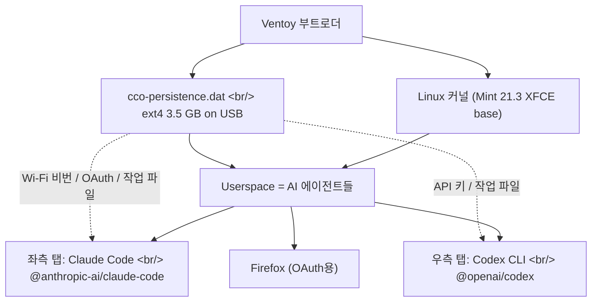
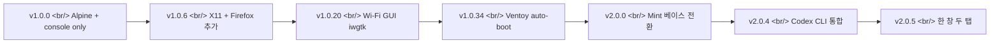
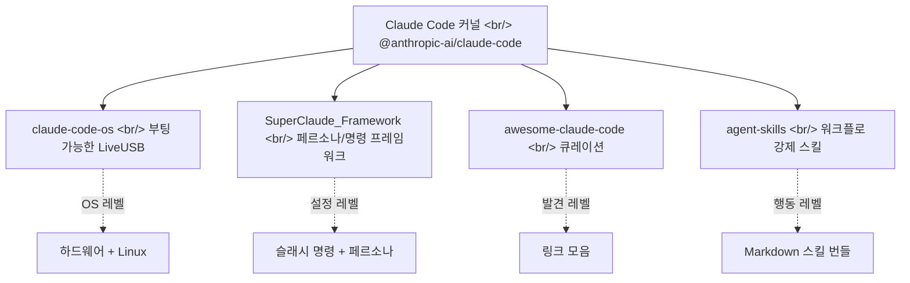

## 개요

[`Hostingglobal-Tech/claude-code-os`](https://github.com/Hostingglobal-Tech/claude-code-os)는 2026-05-01에 생성된 MIT 라이선스 프로젝트로, 약 85 stars를 가진 **부팅 가능한 LiveUSB 배포판**이다. 한 줄로 요약하면 *"USB를 꽂으면 1분 안에 [Claude Code](https://www.anthropic.com/claude-code)와 [OpenAI Codex CLI](https://openai.com/codex/)가 한 창 두 탭으로 동시에 뜨는 Linux Mint 기반 OS"*다. 흥미로운 건 *"Claude Code OS"* 라는 작명이 단순한 마케팅 비유가 아니라는 점이다. 이 프로젝트는 진짜로 [Linux Mint 21.3 XFCE](https://linuxmint.com/) 위에 Claude Code를 **userspace 그 자체**로 박아놓았다. AI 에이전트가 한 명의 사용자로서 OS와 함께 부팅된다.

<!--more-->



## 왜 만들었나 — AI 앞에 끼인 OS 설치 의식

저자가 README 첫 페이지에 박은 문제 제기는 단순하다.

> AI 와 한 번 대화하려고 Windows 깔고 → 드라이버 잡고 → 브라우저 깔고 → 검색. 또는 Linux 깔고 → Node 깔고 → 명령어 입력 → 로그인. 너무 복잡합니다. AI 가 결국 우리가 쓰는 도구인데, 왜 그 앞에 복잡한 단계를 끼워둘까. 그래서 **OS 자체를 AI 로** 만들었습니다.

이 관점이 흥미롭다. [agentmemory](https://github.com/rohitg00/agentmemory)나 [agent-skills](https://github.com/anthropics/skills) 같은 도구들이 *"에이전트의 컨텍스트/스킬을 OS 처럼 다루자"* 라는 비유를 썼다면, claude-code-os는 비유를 떼고 **진짜 OS 부팅 시퀀스의 init 단계에 에이전트를 끼워넣는다.** lightdm autologin → xfce4-terminal 자동 실행 → Claude Code + Codex CLI auto-start. 사용자가 보는 첫 화면은 데스크톱이 아니라 두 AI 프롬프트다.

## 무엇이 들어있나 (v2.0.5 기준)

[v2.0.5 릴리즈](https://github.com/Hostingglobal-Tech/claude-code-os/releases/tag/v2.0.5)의 구성:

| 컴포넌트 | 무엇 | 비고 |
|---|---|---|
| Base | [Linux Mint 21.3 XFCE](https://linuxmint.com/) (Ubuntu 22.04 LTS jammy) | 안정 LTS |
| AI 좌측 탭 | [`@anthropic-ai/claude-code`](https://www.npmjs.com/package/@anthropic-ai/claude-code) | npm 전역 설치 |
| AI 우측 탭 | [`@openai/codex`](https://www.npmjs.com/package/@openai/codex) | npm 전역 설치 |
| 런타임 | Node.js 20 LTS | NodeSource 저장소 |
| 브라우저 | Firefox | OAuth 로그인용 |
| 한글 입력 | [ibus](https://github.com/ibus/ibus) + ibus-hangul | `Shift+Space` / `한/영` 토글 |
| 폰트 | Noto Sans CJK KR + [D2Coding](https://github.com/naver/d2codingfont) | 가독성 |
| 로케일 | ko_KR.UTF-8 + Asia/Seoul | KST 시간 |
| 자동 로그인 | lightdm `autologin-user=cco` | NOPASSWD sudo |
| 영속성 | [Ventoy](https://www.ventoy.net/) `casper-rw` (3.5 GB) | USB에 모든 상태 저장 |

전체 ISO는 약 3.4 GB. 두 조각으로 쪼개 올라가있다 (`aicode-os-v2.0.5.iso.part1` 1.99 GB + `part2` 1.65 GB). 합치는 명령은 한 줄.

```bash
cat aicode-os-v2.0.5.iso.part1 aicode-os-v2.0.5.iso.part2 > aicode-os-v2.0.5.iso
```

## 부팅 시퀀스 — Claude Code가 init이다

[`build-mint.sh`](https://github.com/Hostingglobal-Tech/claude-code-os/blob/main/build-mint.sh) (약 18 KB의 단일 셸 스크립트)가 ISO를 만든다. 핵심은 chroot 안에서 다음을 박는 것.

1. apt로 ibus, ibus-hangul, fonts-noto-cjk, language-pack-ko, xfce4-terminal 설치
2. ko_KR.UTF-8 locale + Asia/Seoul timezone
3. Node.js 20 LTS + `npm install -g @anthropic-ai/claude-code @openai/codex`
4. [Naver D2Coding](https://github.com/naver/d2codingfont) 폰트 wget 다운로드
5. `cco` 사용자 생성 (sudo NOPASSWD)
6. lightdm `autologin-user=cco` 설정
7. `aicode-startup-claude` + `aicode-startup-codex` 시작 스크립트를 `/usr/local/bin`에 박음
8. XFCE autostart에 `xfce4-terminal --maximize --tab` 등록 → 한 창 두 탭

`aicode-startup-claude`는 `claude --dangerously-skip-permissions`를 띄운다. 권한 묻기를 통째로 끄고 root로 풀 네트워크 권한을 준다는 뜻이다. 이게 *"OS를 AI로 만들었다"* 라는 카피의 진짜 의미다 — AI가 사용자 권한이 아니라 **시스템 권한**으로 작동한다.

## Persistence — USB 안에 모든 상태를 박아두기

이 프로젝트의 두 번째 핵심은 [Ventoy](https://www.ventoy.net/)의 [persistence 기능](https://www.ventoy.net/en/plugin_persistence.html)을 활용한 휴대성이다. `cco-persistence.dat`라는 3.5 GB ext4 이미지 파일을 USB에 두면 다음이 USB 안에만 저장된다.

- Wi-Fi SSID + 비번
- Claude OAuth 토큰
- OpenAI API 키 (혹은 ChatGPT 세션)
- 작업한 파일 / git clone한 리포 / npm 캐시
- ibus 설정, 키보드 단축키 커스터마이즈

호스트 PC의 디스크는 **건드리지 않는다.** USB를 빼면 그 컴퓨터에는 흔적이 0이다. 같은 USB를 다른 PC에 꽂으면 환경 전체가 그대로 따라온다. 카페 노트북, 회의실 PC, 호텔 데스크탑 어디든.

`ventoy.json`에 박는 설정이 간결하다.

```json
{
  "control": [
    { "VTOY_DEFAULT_MENU_MODE": "0" },
    { "VTOY_MENU_TIMEOUT": "3" },
    { "VTOY_DEFAULT_IMAGE": "/aicode-os-v2.0.5.iso" }
  ],
  "persistence": [
    {
      "image": "/aicode-os-v2.0.5.iso",
      "backend": "/cco-persistence.dat",
      "autosel": 1
    }
  ]
}
```

## 보안 모델 — 호스트 안전, USB 위험

README의 보안 섹션이 흥미롭다. 위험을 정확히 분리해서 설명한다.

| 영역 | 안전 / 위험 | 이유 |
|---|---|---|
| 호스트 PC 디스크 | 안전 | LiveUSB는 USB 안에서만 작동, 호스트 파일시스템 미접근 |
| USB 내부 작업물 | 위험 | AI가 root로 실행, 시킨 대로 다 함 |
| 네트워크 outbound | 위험 | 풀 네트워크 권한, 외부로 데이터 빠질 수 있음 |
| 분실 시 | 위험 | OAuth 토큰 / API 키가 dat에 평문 저장, 원격 wipe 없음 |

`claude --dangerously-skip-permissions`가 의도된 디자인이다. 샌드박스가 아니라 *"이건 격리된 USB라 호스트는 안전하니, AI한테 root 쥐어주는 트레이드오프"* 가 핵심 가정이다. 이 가정이 무너지는 지점은 USB 분실과 outbound 네트워크 두 군데다. 저자는 분실 시 [claude.ai 콘솔](https://claude.ai/)과 [OpenAI 콘솔](https://platform.openai.com/)에서 직접 토큰 revoke하라고 명시한다.

## 버전 히스토리 — Alpine에서 Mint로의 항해

[CHANGELOG.en.md](https://github.com/Hostingglobal-Tech/claude-code-os/blob/main/CHANGELOG.en.md)를 보면 이 프로젝트의 진화가 한눈에 보인다.



- **v1.0.0** (2026-05-01) — Alpine Linux 3.20 기반, 콘솔 전용, root autologin, claude-code만
- **v1.0.6** — X11 + fluxbox + Firefox로 데스크톱화
- **v1.0.20** — Wi-Fi GUI iwgtk + iwd, RTL8821CE 호환
- **v1.0.34** (2026-05-05) — Ventoy 자동 부트, chrony 시간 동기화 (1970 epoch 문제 해결)
- **v2.0.0~v2.0.4** — Alpine → [Linux Mint 21.3](https://linuxmint.com/edition.php?id=305) 전환, Codex CLI 추가, AICODE-OS 브랜드 전환
- **v2.0.5** (2026-05-09) — 두 별도 창 → 한 창 두 탭으로 통합 (1366×768 화면 호환성)

v1.x → v2.x의 베이스 OS 전환이 흥미롭다. 처음에는 *"가장 가벼운 Alpine 기반"* 으로 시작했지만, X11 / 한글 입력기 / 와이파이 드라이버 등 데스크톱 의존성이 쌓이자 *"검증된 Ubuntu 기반 Mint"* 로 갈아탔다. 미니멀리즘 vs 호환성 트레이드오프의 흔한 곡선이다.

## Claude Code "배포판" 생태계 안에서의 위치

claude-code-os를 보면서 떠올릴 만한 인접 프로젝트들이 있다. 다들 [Claude Code](https://www.anthropic.com/claude-code)를 *커널처럼* 다루고 그 위에 자기 색을 입히는 시도다.



- [**SuperClaude-Org/SuperClaude_Framework**](https://github.com/SuperClaude-Org/SuperClaude_Framework) (약 22,700 stars) — *"specialized commands, cognitive personas, and development methodologies"* 를 박아주는 설정 프레임워크. Claude Code 설치 후 그 위에 슬래시 명령과 페르소나를 부여한다. 같은 운영체제(Claude Code) 위에 도는 *"X윈도우 같은"* 사용자 환경이다.
- [**hesreallyhim/awesome-claude-code**](https://github.com/hesreallyhim/awesome-claude-code) — Awesome 시리즈 큐레이션. 무엇이 있는지 알려주는 *"색인"*.
- [**anthropics/skills**](https://github.com/anthropics/skills) (agent-skills) — Anthropic 본가가 푼 *"시니어 엔지니어의 워크플로 강제 스킬"* 묶음. [Codex CLI에 같은 패턴을 이식한 `codex-r`](https://github.com/thedalbee/codex-r) 같은 파생도 나왔다.
- [**rohitg00/agentmemory**](https://github.com/rohitg00/agentmemory) — Claude Code 포함 16개 에이전트와 [MCP](https://modelcontextprotocol.io/)로 공유되는 영속 메모리.

claude-code-os가 다른 것들과 구분되는 지점은 **추상화 레벨**이다. SuperClaude가 *"같은 OS 위에서 다른 셸 환경"* 이라면, claude-code-os는 *"OS 자체를 바꾼다."* Linux 배포판 전쟁이 같은 커널 위에 다른 패키지 매니저와 데스크톱을 얹는 식으로 분화했듯, *Claude Code 배포판* 의 분화도 비슷한 결로 가고 있다.

## 누가 쓰면 좋은가

이 프로젝트가 노리는 페르소나는 분명해 보인다.

| 시나리오 | 적합도 | 이유 |
|---|---|---|
| 발표/시연 — 누구 컴퓨터에서든 AI 데모 | 높음 | USB 꽂고 1분, 호스트 PC 안전 |
| 가벼운 노트북에 부담 없이 코딩 | 중간 | persistence dat가 3.5 GB 한도 |
| 비전공자 친구에게 *"AI 만져봐"* 권유 | 높음 | OS 설치 진입장벽 0 |
| 기존 dev 환경의 메인 도구로 | 낮음 | git config / SSH key / dotfile 등은 별도 동기화 필요 |
| 보안 민감한 작업 | 낮음 | AI가 root로 풀 권한, 토큰이 USB에 평문 저장 |

> 발표 데모 / 강의실 / 비전공자 온보딩에 가장 잘 어울린다. dotfile-heavy한 개인 워크스테이션 대체로는 무리.

## 흥미로운 디자인 디테일

- **한 창 두 탭으로 통합 (v2.0.5)** — v2.0.4까지는 두 별도 창을 좌표 지정으로 띄웠는데, Samsung NT900X3A 같은 1366×768 화면에서 Codex 창이 화면 밖으로 잘렸다. v2.0.5는 `xfce4-terminal --maximize --tab` 한 줄로 모든 화면 크기에서 안전.
- **graceful 종료** — claude / codex 가 끝나면 `exec bash`로 셸이 살아있어 재시작 가능. 빈 창에서 다시 `claude` 치면 그대로 부활.
- **stale autostart 자동 정리** — `aicode-startup-dual`이 옛 v2.0.0~v2.0.4의 `~/.config/autostart/*.desktop`을 자동으로 rm한다. persistence USB를 v2.0.x 사이에 업그레이드해도 깨지지 않게.
- **chrony 박은 이유** — Alpine 시절 v1.0.34부터 박힌 시간 동기화. 1970 epoch에서 시작하면 SSL/OAuth 핸드셰이크가 cert 만료로 실패한다. LiveUSB는 RTC 못 믿어서 부팅 직후 NTP 동기화 필수.
- **D2Coding 폰트를 Naver GitHub release에서 직접 wget** — Ubuntu repo에 없어서. 고정 버전 (`VER1.3.2-20180524`)을 박았다.

## 한계와 미해결

- **persistence dat 크기 고정** — 처음 만든 3.5 GB에서 자동 확장 안 됨. 한도 도달 시 더 큰 dat 새로 만들어 교체해야 함.
- **FAT32 USB는 부적합** — 단일 파일 4 GB 한도 때문에 8 GB dat 만들어도 USB에 복사 안 됨. exFAT 권장 (Ventoy 1.0.96+ 기본).
- **호스트 PC의 데이터에 접근하려면 추가 마운트 필요** — *"흔적 0"* 의 이면. 호스트 디스크의 코드를 작업하려면 수동 마운트해야 함.
- **root + 풀 네트워크 AI의 책임** — *"AI가 시키는 명령은 그대로 실행되니, 모르는 명령이나 외부 코드를 무분별하게 실행하지 마세요"* 라고 README가 명시. 사용자 신중함이 보안 모델의 일부.

## 결론 — "OS 자체를 AI로" 라는 카피의 진심

[claude-code-os](https://github.com/Hostingglobal-Tech/claude-code-os)는 흔히 보는 *"Claude Code 위에 얹는 설정 프레임워크"* 가 아니다. **부팅 init부터 AI를 끼워넣는 LiveCD 배포판**이다. [SuperClaude](https://github.com/SuperClaude-Org/SuperClaude_Framework)가 *"같은 OS 위 다른 셸"* 이라면, 이건 *"커널부터 바꿨다."* 이 분화는 흥미롭다 — 초기 Linux 배포판 전쟁이 같은 커널 위에 데비안/레드햇/아치 각자 색을 입히며 진행됐듯, *Claude Code 배포판* 들도 같은 npm 패키지 위에 OS-level, framework-level, skill-level로 각자 추상화 층을 쌓고 있다.

이 프로젝트가 다음으로 풀면 흥미로운 문제는 **샌드박스 vs 호스트 통합**의 트레이드오프다. *"호스트 디스크 안전 + AI root"* 라는 현재 모델은 데모/온보딩에 완벽하지만, 일상 개발의 메인 환경으로 쓰려면 호스트 dotfile / SSH key / git config가 자연스럽게 따라와야 한다. 부팅 가능한 USB가 *"내 dev 환경 전체"* 가 되려면 그 다리가 필요하다.

## 참고

### claude-code-os 자체

- [Hostingglobal-Tech/claude-code-os](https://github.com/Hostingglobal-Tech/claude-code-os) — 본 리포
- [v2.0.5 Release](https://github.com/Hostingglobal-Tech/claude-code-os/releases/tag/v2.0.5) — ISO 두 조각 + persistence dat
- [CHANGELOG.en.md](https://github.com/Hostingglobal-Tech/claude-code-os/blob/main/CHANGELOG.en.md) — Alpine → Mint 베이스 전환 히스토리
- [build-mint.sh](https://github.com/Hostingglobal-Tech/claude-code-os/blob/main/build-mint.sh) — 빌드 스크립트 본체

### 의존 도구

- [Ventoy](https://www.ventoy.net/) — multi-ISO 부팅 USB 도구
- [Ventoy persistence plugin](https://www.ventoy.net/en/plugin_persistence.html) — `casper-rw` 백엔드
- [Linux Mint 21.3 XFCE](https://linuxmint.com/edition.php?id=305) — 베이스 OS
- [`@anthropic-ai/claude-code`](https://www.npmjs.com/package/@anthropic-ai/claude-code) · [`@openai/codex`](https://www.npmjs.com/package/@openai/codex) — 두 AI 코더
- [Naver D2Coding 폰트](https://github.com/naver/d2codingfont)

### 인접 Claude Code 생태계

- [SuperClaude-Org/SuperClaude_Framework](https://github.com/SuperClaude-Org/SuperClaude_Framework) — 페르소나 / 슬래시 명령 프레임워크
- [anthropics/skills](https://github.com/anthropics/skills) — Anthropic 본가 agent-skills
- [rohitg00/agentmemory](https://github.com/rohitg00/agentmemory) — MCP 기반 영속 메모리
- [thedalbee/codex-r](https://github.com/thedalbee/codex-r) — Claude Code 세션을 Codex로 import하는 스킬
- [Model Context Protocol](https://modelcontextprotocol.io/)
