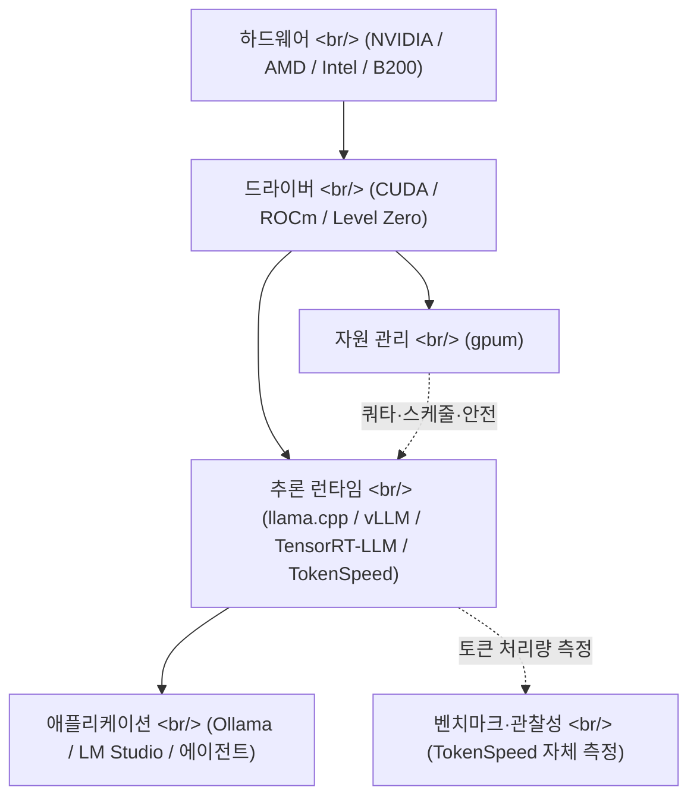

## 개요

추론(inference) 스택의 운영 도구는 오랫동안 양 극단으로 갈렸다. 클라우드 쪽은 [Langsmith](https://www.langchain.com/langsmith), [OpenLLMetry](https://github.com/traceloop/openllmetry), [Helicone](https://www.helicone.ai/) 같이 API 위에서 추적·로그·비용을 관통하는 관찰성 도구가 자리잡았지만, 로컬·온프레미스 추론 — 즉 [Ollama](https://ollama.com), [llama.cpp](https://github.com/ggml-org/llama.cpp), [LM Studio](https://lmstudio.ai), [vLLM](https://github.com/vllm-project/vllm) 같은 런타임 위에 GPU를 직접 얹어 쓰는 환경 — 은 여전히 `nvidia-smi`와 셸 스크립트로 버틴다. 2026-05-09 같은 날 두 도구가 공개됐다. [drewdrew0414/AIGPUManager의 `gpum` v1.1.0](https://github.com/drewdrew0414/AIGPUManager/releases/tag/v1.1.0)은 GPU **자원·배분·안전 가드**를, [lightseekorg/tokenspeed](https://github.com/lightseekorg/tokenspeed)는 LLM **추론 엔진의 처리량(token/s)** 자체를 겨냥한다. 둘 다 NVIDIA/Anthropic 같은 벤더가 아니라 개인 또는 신생 조직에서 나왔다는 점이 흥미롭다 — 클라우드 LLM 관찰성이 그랬듯, 로컬·온프레미스 추론 관찰성·관리 도구도 **첫 세대**가 도착하기 시작한 신호다.

<!--more-->



## 1. gpum v1.1.0 — 공유 GPU 서버용 자원 매니저

[gpum](https://github.com/drewdrew0414/AIGPUManager)은 Java 21 기반의 CLI다. 단일 사용자가 `nvidia-smi`로 충분한 환경이 아니라, **여러 사용자가 같은 GPU 서버를 공유하는** 시나리오를 정조준한다. 이전 버전이 인벤토리(어떤 GPU가 어디 있는가)와 단순 할당에 머물렀다면, [v1.1.0](https://github.com/drewdrew0414/AIGPUManager/releases/tag/v1.1.0)은 운영(operations) 계층을 본격적으로 추가한다.

### 1.1 컴퓨트 정책과 RBAC

v1.1.0에서 새로 들어온 명령어 그룹 중 가장 인상적인 부분은 **승인 워크플로우(approval workflow)** 다.

```bash
gpum gpu reset --id node1:0 --soft --apply
gpum rbac approval list --status pending
gpum rbac approval approve --id <approval-id> --reason "maintenance window"
gpum gpu reset --id node1:0 --soft --apply --approval-id <approval-id>
```

high-risk 작업(전력 한도 변경, ECC 토글, GPU 리셋)은 즉시 실행되지 않고 **approval 레코드**로 빠진다. 또한 실제 하드웨어 쓰기는 환경 변수 `GPUM_ENABLE_HARDWARE_WRITE=1`이 설정된 셸에서만 동작한다 — dry-run이 디폴트다. [Slurm](https://slurm.schedmd.com/)이나 [Kubernetes Device Plugin](https://kubernetes.io/docs/concepts/extend-kubernetes/compute-storage-net/device-plugins/)처럼 무거운 클러스터 매니저를 끌어오기엔 과한 환경 — 즉 GPU 서버 한두 대를 팀 단위로 공유하는 환경 — 에서 **딱 그 사이를 메우려는 포지셔닝**이 보인다.

### 1.2 멀티벤더 인벤토리

`gpum`이 [NVIDIA NVML](https://developer.nvidia.com/management-library-nvml)뿐 아니라 AMD ROCm-SMI와 [Intel Level Zero](https://spec.oneapi.io/level-zero/latest/index.html)도 함께 다룬다는 점은 흔치 않다. JNA(Java Native Access)로 NVML을, Level Zero loader는 별도 discovery로 잡는데, 라이브러리가 설치돼 있지 않으면 `unavailable` 행으로 명시한다. 모바일·임베디드용 도구가 아니라 **이종 GPU가 한 서버에 섞여 있는 워크스테이션·소형 클러스터**를 가정한 설계다.

### 1.3 토폴로지 인식 스케줄링

```bash
gpum alloc estimate --model llama3-70b --params-b 70 --precision fp16 --context 8192 --batch 4
gpum schedule reserve create --gpus 4 --start 2026-05-10T22:00:00 --end 2026-05-11T06:00:00
gpum schedule gang --nodes 2 --gpus-per-node 8
```

[NVLink](https://www.nvidia.com/en-us/data-center/nvlink/), AMD XGMI, Intel Xe Link 같은 GPU-GPU 인터커넥트를 인지해서 packed/spread 배치 힌트를 적용한다. 분산 학습에서 모든 노드가 동시에 준비돼야 시작하는 **gang scheduling**, 짧은 idle 윈도우를 채우는 **backfill**, 과거 GPU-시간으로 가중치를 매기는 **fair-share** — 모두 클러스터 매니저의 정석 기능들인데, CLI 하나로 압축해 넣었다.

### 1.4 안전 가드(safety guardrail)

`v1.1.0`이 강조하는 핵심은 사고를 운영 단계에서 막는 것이다.

| 가드 | 동작 |
|---|---|
| 최대 GPU/요청 | 정책 초과 요청을 영구 차단 |
| 최대 리스 시간 | 만료 리스 자동 강제 회수 대상 |
| 발열 임계치 | thermal critical GPU 사전 감지 |
| 전력 캡 | 전력 포화 GPU 사전 감지 |
| stale heartbeat | 죽은 워커 정리 |
| min free VRAM | 메모리 한계 초과 작업 거부 |

여기에 incident 레코드로 **GPU 격리(quarantine)** 와 노드 drain까지 묶인다. 클라우드의 [SRE 플레이북](https://sre.google/sre-book/table-of-contents/)을 단일 머신 단위로 압축한 듯한 인상이다.

### 1.5 AI 도구 통합

가장 실용적인 부분은 `gpum integration ai`다. 할당된 리스를 그대로 [torchrun](https://docs.pytorch.org/docs/stable/elastic/run.html), [accelerate](https://huggingface.co/docs/accelerate/index), [DeepSpeed](https://github.com/deepspeedai/DeepSpeed), [vLLM](https://github.com/vllm-project/vllm)의 런치 커맨드로 변환한다.

```bash
gpum integration ai launch --allocation-id alloc-001 --tool torchrun --arg train.py
gpum integration ai launch --allocation-id alloc-001 --tool vllm --from-file vllm-serve.yaml
```

`CUDA_VISIBLE_DEVICES`, `MASTER_ADDR`, `GPUM_RDZV_ENDPOINT` 같은 표준 변수가 자동 주입된다. AMD용 `ROCR_VISIBLE_DEVICES`, Intel용 `ZE_AFFINITY_MASK`까지 챙긴다. 즉 **자원 할당 → 환경 변수 → 런치 커맨드**가 한 흐름이다.

## 2. TokenSpeed — 추론 엔진의 처리량 자체에 손대다

같은 날 공개된 [TokenSpeed](https://github.com/lightseekorg/tokenspeed)는 다른 계층에 있다. `gpum`이 GPU 자원의 **관리·관찰** 도구라면, TokenSpeed는 **추론 엔진 그 자체**다. README의 표현은 직설적이다 — "TensorRT-LLM 수준의 성능과 vLLM 수준의 사용성"을 동시에 노린다. [lightseek 블로그 글](https://lightseek.org/blog/lightseek-tokenspeed.html)에 따르면 [NVIDIA B200](https://www.nvidia.com/en-us/data-center/b200/) 위에서 [Kimi K2.5](https://moonshotai.com)를 돌리는 시나리오로 [TensorRT-LLM](https://github.com/NVIDIA/TensorRT-LLM) 대비 Pareto front를 갱신했다는 결과를 내건다.

### 2.1 설계 핵심 네 가지

리포 README가 정리한 컴포넌트 구분:

| 계층 | 역할 |
|---|---|
| Modeling | local-SPMD + 정적 컴파일러로 collective communication을 모듈 경계에서 자동 생성 |
| Scheduler | C++ control plane / Python execution plane, FSM 기반 요청 라이프사이클 |
| Kernels | 플러그형 커널, Blackwell 타깃 [MLA(Multi-head Latent Attention)](https://arxiv.org/abs/2405.04434) 최적화 |
| Entrypoint | SMG 통합 AsyncLLM — CPU 측 요청 처리 오버헤드 축소 |

[MLA는 DeepSeek-V2](https://arxiv.org/abs/2405.04434)에서 처음 대중화된 attention 변형으로, KV cache를 latent로 압축해 메모리 대역폭 부담을 크게 줄인다. TokenSpeed는 이걸 [Blackwell 아키텍처](https://www.nvidia.com/en-us/data-center/technologies/blackwell-architecture/)에 맞춘 커널로 다시 구현했다고 주장한다. KV cache 소유권을 컴파일 타임 타입 시스템으로 강제한다는 부분은 vLLM의 [PagedAttention](https://arxiv.org/abs/2309.06180)이 런타임에서 푸는 문제를 컴파일 타임으로 옮긴 시도로 읽힌다.

### 2.2 에이전틱 워크로드 타깃팅

README가 반복해 강조하는 단어는 **agentic workloads**다. 보통의 챗봇 워크로드(긴 단일 응답)와 달리, 에이전트 워크로드는 **짧은 응답을 수천 번**, 도구 호출 사이에 끼어드는 패턴이다. 이 경우 CPU 측 request 핸들링 오버헤드, KV cache의 재사용·재할당이 throughput을 좌우한다. TokenSpeed가 FSM·타입 시스템·AsyncLLM에 힘을 준 이유가 여기에 있다.

### 2.3 현재 상태와 한계

리포는 명시적으로 preview임을 밝힌다.

- 현재 재현 가능: B200 위 Kimi K2.5 + TokenSpeed MLA
- 진행 중: [Qwen 3.6](https://qwenlm.github.io), DeepSeek V4, MiniMax M2.7 모델 커버리지
- 진행 중: PD(prefill-decode separation), EPLB, KV store, Mamba cache, VLM, metrics
- 진행 중: Hopper / MI350 최적화

즉 지금 시점에 **production 배포용이 아니라 새 런타임 설계를 공개하는 demonstration** 성격이다. 그래도 출시 며칠 만에 GitHub star 900+를 모은 사실은 inference engine 카테고리의 비어 있는 자리(즉, "vLLM보다 빠르고 TensorRT-LLM보다 쉬운" 슬롯)를 시장이 기다리고 있었다는 신호로 읽힌다.

## 3. 두 도구가 만나는 지점

추론 스택을 계층으로 보면 둘은 다른 위치에 있다.


`gpum`은 **하드웨어와 드라이버를 추상화해 추론 엔진에게 안전히 넘기는 역할**, TokenSpeed는 **추론 엔진 그 자체의 처리량**. 둘은 서로를 대체하지 않고 보완한다. 실제로 `gpum integration ai launch --tool vllm`처럼 `gpum`이 런처를 만들면, 그 안에서 도는 추론 엔진이 vLLM이든 TokenSpeed든 상관이 없다.

## 4. 클라우드 관찰성 도구와의 비교

클라우드 LLM 스택에서 [Langsmith](https://docs.smith.langchain.com), [OpenLLMetry](https://github.com/traceloop/openllmetry), [Helicone](https://www.helicone.ai), [Langfuse](https://langfuse.com)가 했던 일을 정리하면 두 축이다.

| 축 | 클라우드 LLM | 로컬·온프레미스 추론 |
|---|---|---|
| 추적·로그 | Langsmith, Langfuse | (공백 — gpum의 audit log가 일부) |
| 토큰·비용 | Helicone, OpenLLMetry | (공백 — gpum의 cost report, TokenSpeed의 token/s 측정) |
| 모델 게이트웨이 | [OpenRouter](https://openrouter.ai), [Portkey](https://portkey.ai) | [LiteLLM](https://github.com/BerriAI/litellm) (cloud/local hybrid) |
| 자원·할당 | (관리형) | gpum |
| 런타임 처리량 | (관리형) | TokenSpeed, [vLLM](https://github.com/vllm-project/vllm), [SGLang](https://github.com/sgl-project/sglang) |

클라우드 진영은 1세대(2023–2024)를 지나 이미 2세대 통합 단계인데 반해, 로컬 추론 진영은 이제 막 **1세대 — 개인 또는 신생 조직이 만드는 시점**에 있다. `gpum`이 1인 메인테이너 프로젝트로 보이는 점, TokenSpeed가 `lightseekorg`라는 신생 조직 단독 작품인 점이 이 단계를 정확히 보여준다.

## 5. 한국 개발자 입장에서

두 도구는 즉시 손에 잡히는 시나리오가 다르다.

- **GPU 서버 1–2대를 팀이 공유하는 환경**: `gpum`이 곧장 들어맞는다. `gpum scan --refresh`로 인벤토리부터 시작해서, `gpum submit`으로 batch 작업을 컨테이너로 묶고, `gpum gpu health --score --quarantine-threshold` 같은 헬스 스코어링으로 죽어가는 GPU를 사전 격리한다. 더 무거운 [Slurm](https://slurm.schedmd.com/)이나 [Run:ai](https://www.run.ai/)를 깔기엔 작고, 그냥 SSH로만 쓰기엔 큰 환경에 맞다.
- **추론 엔진 자체를 평가하고 싶은 환경**: TokenSpeed는 아직 preview지만 [Kimi K2.5](https://moonshotai.com) 같은 최신 오픈웨이트 모델로 B200 위 throughput을 직접 재현해보는 실험으로 의미가 있다. 한국 내 [클라우드 GPU](https://www.nhncloud.com/kr/service/ai/ncs)에서 B200을 쓸 수 있게 되는 시점이 멀지 않으니, 미리 런타임 선택지를 비교해두는 것이 좋다.

## 인사이트

같은 날 같은 카테고리에서 다른 계층을 노린 두 도구가 동시에 나온 건 **로컬·온프레미스 추론 스택이 운영 도구를 필요로 하는 단계에 들어섰다는 시장 신호**다. 클라우드 LLM이 2023년에 LangChain의 운영 부담을 [Langsmith](https://www.langchain.com/langsmith)로 외부화하면서 한 단계 성숙했다면, 로컬 추론은 2026년 봄에 `gpum` 같은 자원 관리 도구와 TokenSpeed 같은 차세대 추론 엔진을 동시에 손에 넣고 있는 셈이다. 둘 다 1세대 도구의 한계 — gpum은 1인 메인테이너 + Java 의존, TokenSpeed는 preview·B200 한정·non-production — 를 가지고 있지만, 이 단계의 도구가 보통 그렇듯 **카테고리를 정의하는 역할**을 한다. 한국 내에서 가장 즉시 효용이 있는 건 `gpum`을 작은 팀 GPU 서버에 깔아 운영 가시성을 즉시 얻는 길이고, 중장기적으로는 [Kimi K2.5](https://moonshotai.com)나 [DeepSeek V4](https://github.com/deepseek-ai) 같은 모델을 직접 서빙해야 할 때 vLLM·SGLang·TokenSpeed 사이의 선택지가 진짜로 의미를 갖는 시점이 온다. 클라우드 관찰성 도구가 그랬듯 — 처음에 만들어진 1세대 도구의 거의 대부분은 살아남고, 일부는 표준이 된다.

## 참고

**Release & repo**

- [drewdrew0414/AIGPUManager v1.1.0 릴리스](https://github.com/drewdrew0414/AIGPUManager/releases/tag/v1.1.0)
- [drewdrew0414/AIGPUManager 저장소](https://github.com/drewdrew0414/AIGPUManager)
- [lightseekorg/tokenspeed 저장소](https://github.com/lightseekorg/tokenspeed)
- [TokenSpeed 발표 블로그](https://lightseek.org/blog/lightseek-tokenspeed.html)

**Local inference runtimes**

- [llama.cpp](https://github.com/ggml-org/llama.cpp)
- [Ollama](https://ollama.com)
- [LM Studio](https://lmstudio.ai)
- [vLLM](https://github.com/vllm-project/vllm)
- [SGLang](https://github.com/sgl-project/sglang)
- [NVIDIA TensorRT-LLM](https://github.com/NVIDIA/TensorRT-LLM)

**Techniques and standards**

- [MLA — Multi-head Latent Attention (DeepSeek-V2 논문)](https://arxiv.org/abs/2405.04434)
- [PagedAttention — vLLM 논문](https://arxiv.org/abs/2309.06180)
- [NVIDIA NVML](https://developer.nvidia.com/management-library-nvml)
- [Intel Level Zero](https://spec.oneapi.io/level-zero/latest/index.html)
- [NVIDIA Blackwell 아키텍처](https://www.nvidia.com/en-us/data-center/technologies/blackwell-architecture/)

**Cloud LLM observability — for comparison**

- [Langsmith](https://www.langchain.com/langsmith)
- [Langfuse](https://langfuse.com)
- [OpenLLMetry](https://github.com/traceloop/openllmetry)
- [Helicone](https://www.helicone.ai/)
- [LiteLLM](https://github.com/BerriAI/litellm)
