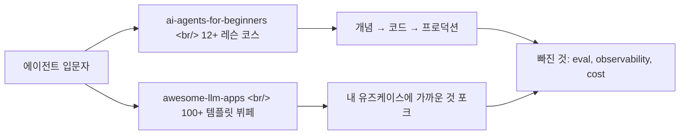

## 개요

같은 시기에 회자된 두 학습 자료가 흥미로운 대조를 이룬다. 한쪽은 Microsoft의 [ai-agents-for-beginners](https://github.com/microsoft/ai-agents-for-beginners) — 12+개 레슨으로 짜인 정식 커리큘럼이고, 다른 한쪽은 Shubham Saboo의 [awesome-llm-apps](https://github.com/Shubhamsaboo/awesome-llm-apps) — 클론해서 바로 돌릴 수 있는 100+개 예제 카탈로그다. 둘 다 별 6만/10만 개를 넘긴 거대 레포지만 접근 방식은 정반대다.

<!--more-->

## 두 레포의 정체성

### Microsoft AI Agents for Beginners — 코스 형태

[microsoft/ai-agents-for-beginners](https://github.com/microsoft/ai-agents-for-beginners)는 GitHub 별 61k에 도달한 공식 학습 코스다. MIT 라이선스, Jupyter Notebook 기반, 2024년 11월부터 시작해 [Microsoft Agent Framework](https://aka.ms/ai-agents-beginners/agent-framework)와 [Azure AI Foundry Agent Service V2](https://aka.ms/ai-agents-beginners/ai-agent-service)를 축으로 빌드한다. 레슨 트리는 다음과 같다.

- 01 [Intro to AI Agents and Agent Use Cases](https://github.com/microsoft/ai-agents-for-beginners/blob/main/01-intro-to-ai-agents/README.md) — 에이전트 정의와 유즈케이스
- 02 [Exploring Agentic Frameworks](https://github.com/microsoft/ai-agents-for-beginners/blob/main/02-explore-agentic-frameworks/README.md) — 프레임워크 비교
- 03 [Agentic Design Patterns](https://github.com/microsoft/ai-agents-for-beginners/blob/main/03-agentic-design-patterns/README.md) — UX 원칙(Space/Time/Core)
- 04 [Tool Use Design Pattern](https://github.com/microsoft/ai-agents-for-beginners/blob/main/04-tool-use/README.md)
- 05 [Agentic RAG](https://github.com/microsoft/ai-agents-for-beginners/blob/main/05-agentic-rag/README.md)
- 06 [Building Trustworthy AI Agents](https://github.com/microsoft/ai-agents-for-beginners/blob/main/06-building-trustworthy-agents/README.md)
- 07 [Planning Design Pattern](https://github.com/microsoft/ai-agents-for-beginners/blob/main/07-planning-design/README.md)
- 08 [Multi-Agent Design Pattern](https://github.com/microsoft/ai-agents-for-beginners/blob/main/08-multi-agent/README.md)
- 09 [Metacognition Design Pattern](https://github.com/microsoft/ai-agents-for-beginners/blob/main/09-metacognition/README.md)
- 10 [AI Agents in Production](https://github.com/microsoft/ai-agents-for-beginners/blob/main/10-ai-agents-production/README.md) — observability + evaluation
- 11 [Agentic Protocols (MCP, A2A, NLWeb)](https://github.com/microsoft/ai-agents-for-beginners/blob/main/11-agentic-protocols/README.md)
- 12 [Context Engineering for AI Agents](https://github.com/microsoft/ai-agents-for-beginners/blob/main/12-context-engineering/README.md)
- 13 [Managing Agentic Memory](https://github.com/microsoft/ai-agents-for-beginners/blob/main/13-agent-memory/README.md)
- 14~18 Microsoft Agent Framework, [Browser-Use](https://docs.browser-use.com/examples/templates/playwright-integration) 기반 Computer Use Agents, Securing AI Agents 등

각 레슨은 텍스트 + 짧은 동영상 + Jupyter 노트북 코드 샘플로 구성되어 있다. 또한 [co-op-translator](https://github.com/Azure/co-op-translator)로 50+개 언어로 자동 번역되어 [Korean](https://github.com/microsoft/ai-agents-for-beginners/blob/main/translations/ko/README.md) 트랜슬레이션도 제공된다(번역 누락이 신경 쓰이면 sparse checkout으로 영어판만 받을 수도 있다).

### Awesome LLM Apps — 카탈로그 형태

반대편의 [Shubhamsaboo/awesome-llm-apps](https://github.com/Shubhamsaboo/awesome-llm-apps)는 별 109k의 거대한 템플릿 모음집이다. Apache-2.0 라이선스이고 README 첫 줄부터 "100+ AI Agent & RAG apps you can actually run — clone, customize, ship"이라고 못 박는다. 본인 표현에 따르면 "큐레이션이 아니라 손으로 직접 빌드한 템플릿 카탈로그"이고 13개 카테고리로 분류되어 있다.

- 🌱 [Starter AI Agents](https://github.com/Shubhamsaboo/awesome-llm-apps/tree/main/starter_ai_agents) — API 키 하나로 도는 단일 파일 에이전트
- 🚀 [Advanced AI Agents](https://github.com/Shubhamsaboo/awesome-llm-apps/tree/main/advanced_ai_agents) — 메모리/툴/멀티스텝 reasoning
- 🤝 [Multi-agent Teams](https://github.com/Shubhamsaboo/awesome-llm-apps/tree/main/advanced_ai_agents/multi_agent_apps/agent_teams) — [CrewAI](https://github.com/joaomdmoura/crewAI) 기반 서비스 에이전시 등
- 🗣️ [Voice AI Agents](https://github.com/Shubhamsaboo/awesome-llm-apps/tree/main/voice_ai_agents) — 실시간 음성 인터페이스
- ♾️ [MCP AI Agents](https://github.com/Shubhamsaboo/awesome-llm-apps/tree/main/mcp_ai_agents) — [Model Context Protocol](https://modelcontextprotocol.io/) 통합
- 📀 [RAG Tutorials](https://github.com/Shubhamsaboo/awesome-llm-apps/tree/main/rag_tutorials) — Agentic RAG, Corrective RAG, Vision RAG 등 21+개
- 🧩 [Awesome Agent Skills](https://github.com/Shubhamsaboo/awesome-llm-apps/tree/main/awesome_agent_skills) — Claude Code/ADK용 스킬 파일 19개
- 🔧 LLM 파인튜닝 ([Gemma 3](https://github.com/Shubhamsaboo/awesome-llm-apps/tree/main/advanced_llm_apps/llm_finetuning_tutorials/gemma3_finetuning), [Llama 3.2](https://github.com/Shubhamsaboo/awesome-llm-apps/tree/main/advanced_llm_apps/llm_finetuning_tutorials/llama3.2_finetuning))
- 🧑‍🏫 [Google ADK Crash Course](https://github.com/Shubhamsaboo/awesome-llm-apps/tree/main/ai_agent_framework_crash_course/google_adk_crash_course) & [OpenAI Agents SDK Crash Course](https://github.com/Shubhamsaboo/awesome-llm-apps/tree/main/ai_agent_framework_crash_course/openai_sdk_crash_course)

각 템플릿은 자체 README + `requirements.txt` + 보통 `streamlit run`으로 끝나는 실행 명령으로 구성된다. 30초 안에 첫 에이전트를 돌리는 게 목표라고 명시되어 있다.

## 같은 주제, 다른 깊이 — 레슨 03 vs 카탈로그 03

같은 "에이전트 설계 원칙"을 어떻게 다루는지 비교하면 두 자료의 성격이 드러난다.

| 차원 | MS 03-agentic-design-patterns | Awesome LLM Apps Starter |
|---|---|---|
| 출발점 | "Connecting not collapsing", "Embrace uncertainty" 같은 [UX 원칙](https://github.com/microsoft/ai-agents-for-beginners/blob/main/03-agentic-design-patterns/README.md) | [AI Travel Agent](https://github.com/Shubhamsaboo/awesome-llm-apps/tree/main/starter_ai_agents/ai_travel_agent) 같은 실행 가능한 코드 |
| 설명 길이 | 수천 단어, 다이어그램, Travel Agent 케이스 스터디 | 짧은 README + 실행 가이드 |
| 도출 방식 | 원칙 → 가이드라인(Transparency/Control/Consistency) → 적용 | 동작하는 코드 → 직접 만져보며 이해 |
| 다음 행동 | 다음 레슨(04 Tool Use)으로 진행 | 다른 30개 템플릿으로 분기 |

전자는 "왜 이렇게 설계해야 하는가"를 가르치고, 후자는 "이미 누가 이렇게 설계했으니 포크해서 고쳐 써라"고 말한다. 둘 다 정답이지만 학습자의 상황이 다르다.

## 누구에게 무엇이 맞는가

### 코스가 맞는 학습자

- **에이전트가 처음**이고 기본기를 잡아야 하는 사람 — UX 원칙, 디자인 패턴, 멀티에이전트, 메모리, 컨텍스트 엔지니어링까지 체계적으로 다룬다
- **회사에서 Azure를 쓰고 있는** 팀 — [Azure AI Foundry](https://learn.microsoft.com/en-us/azure/ai-foundry/what-is-azure-ai-foundry) + Microsoft Agent Framework 라인업이 그대로 매핑된다
- **번역본이 필요한** 비영어권 학습자 — [한국어](https://github.com/microsoft/ai-agents-for-beginners/blob/main/translations/ko/README.md), [일본어](https://github.com/microsoft/ai-agents-for-beginners/blob/main/translations/ja/README.md), [중국어](https://github.com/microsoft/ai-agents-for-beginners/blob/main/translations/zh-CN/README.md) 등 50+개 언어 자동 번역
- **CIO 보고용 슬라이드**가 필요한 사람 — "[MCP](https://modelcontextprotocol.io/), [A2A](https://google.github.io/A2A/), NLWeb 프로토콜 비교"처럼 깔끔한 챕터 구조가 그대로 자료가 된다

### 카탈로그가 맞는 학습자

- **이미 LLM 호출은 할 줄 알고** 패턴을 빠르게 훑고 싶은 엔지니어 — RAG 21종을 비교해보고 자기 케이스에 가까운 것을 고를 수 있다
- **유즈케이스가 명확한** 사람 — "내 도메인이 보험/투자/리서치/음성"이라면 [Insurance Claim Live Agent](https://github.com/Shubhamsaboo/awesome-llm-apps/tree/main/voice_ai_agents/insurance_claim_live_agent_team), [AI VC Due Diligence](https://github.com/Shubhamsaboo/awesome-llm-apps/tree/main/advanced_ai_agents/multi_agent_apps/agent_teams/ai_vc_due_diligence_agent_team) 같은 직접적인 출발점이 있다
- **사이드 프로젝트 영감**이 필요한 사람 — [AI 3D Pygame Agent](https://github.com/Shubhamsaboo/awesome-llm-apps/tree/main/advanced_ai_agents/autonomous_game_playing_agent_apps/ai_3dpygame_r1), [AI Meme Generator](https://github.com/Shubhamsaboo/awesome-llm-apps/tree/main/starter_ai_agents/ai_meme_generator_agent_browseruse)처럼 가볍게 시작할 거리가 많다
- **MCP/[CrewAI](https://github.com/joaomdmoura/crewAI)/[ADK](https://google.github.io/adk-docs/) 같은 특정 스택 예제**를 빨리 보고 싶은 사람

대략 코스는 "지도가 필요한 사람"용, 카탈로그는 "재료가 필요한 사람"용이다. 실제로 두 자료를 같이 쓰면 가장 강력하다 — MS 코스의 [05 Agentic RAG](https://github.com/microsoft/ai-agents-for-beginners/blob/main/05-agentic-rag/README.md) 챕터를 읽은 다음 awesome-llm-apps의 [Agentic RAG with Reasoning](https://github.com/Shubhamsaboo/awesome-llm-apps/tree/main/rag_tutorials/agentic_rag_with_reasoning)을 클론해서 돌려보면, 이론과 코드가 한 번에 잡힌다.

## 입문 자료가 공통으로 놓치는 것

두 자료를 비교해 봐도 — 그리고 시장에 있는 다른 "agent 101" 자료를 봐도 — 입문 콘텐츠가 시스템적으로 약한 영역이 보인다.

**1. Evaluation을 충분히 안 다룬다.** MS 코스는 [Lesson 10 - AI Agents in Production](https://github.com/microsoft/ai-agents-for-beginners/blob/main/10-ai-agents-production/README.md)에서 trace/span, offline/online eval, [RAGAS](https://docs.ragas.io/), [LLM Guard](https://llm-guard.com/)를 언급하긴 하는데 그게 1개 레슨이고 코스 끝부분이다. awesome-llm-apps에는 [RAG Failure Diagnostics Clinic](https://github.com/Shubhamsaboo/awesome-llm-apps/tree/main/rag_tutorials/rag_failure_diagnostics_clinic) 같은 게 있지만 평가는 카테고리가 아니다. 그러나 현장에서는 "에이전트를 빌드하는 시간"보다 "왜 회귀했는지 파악하는 시간"이 훨씬 길다.

**2. Observability를 비싼 옵션처럼 다룬다.** [OpenTelemetry](https://opentelemetry.io/), [Langfuse](https://langfuse.com/), [Microsoft Foundry](https://learn.microsoft.com/en-us/azure/ai-foundry/what-is-azure-ai-foundry) 같은 도구가 언급되긴 하지만 "프로덕션 단계의 무거운 도구"로 그려진다. 실제로는 첫 멀티스텝 에이전트 코드를 짤 때부터 trace를 켜놔야 디버깅이 가능하다. trace 없이 멀티에이전트 시스템을 디버깅하는 건 print 없이 멀티스레드 코드 디버깅하는 것과 비슷하다.

**3. 비용 시뮬레이션이 없다.** awesome-llm-apps의 [Toonify Token Optimization](https://github.com/Shubhamsaboo/awesome-llm-apps/tree/main/advanced_llm_apps/llm_optimization_tools/toonify_token_optimization)이나 [Headroom Context Optimization](https://github.com/Shubhamsaboo/awesome-llm-apps/tree/main/advanced_llm_apps/llm_optimization_tools/headroom_context_optimization) 같은 시도가 있지만, 멀티에이전트 한 번 돌리면 토큰을 5~50배 쓸 수 있다는 감각이 입문자에게는 전혀 전달되지 않는다. 첫 레슨에서 "이 데모를 100번 돌리면 얼마"인지 계산기를 줘야 한다.

**4. Failure mode 카탈로그가 없다.** "이게 동작합니다"는 보여주는데 "이렇게 망가집니다"는 거의 없다. 프롬프트 인젝션, 무한 툴 호출, 메모리 누수, 잘못된 RAG 결과를 곧이곧대로 믿는 에이전트 같은 패턴은 실제 운영하면 매주 만난다. 현장 한 줄 평으로는 "에이전트 빌드는 쉽고, 망가지는 패턴을 외우는 게 본업"이라는 얘기가 가장 정확하다.

## 인사이트

에이전트 학습 시장은 지난 1년 사이 "프레임워크 비교"에서 "교육과정"으로 한 단계 올라갔다. MS의 코스가 12+개 레슨으로 디자인 패턴과 프로토콜까지 다룬다는 것 자체가 시장 성숙도의 지표다. 동시에 awesome-llm-apps의 100+ 템플릿이 [ADK](https://google.github.io/adk-docs/), [OpenAI Agents SDK](https://platform.openai.com/docs/guides/agents), CrewAI, MCP를 모두 커버하면서도 일관되게 `streamlit run` 한 줄로 도는 것은 "에이전트 빌드 비용"이 충분히 떨어졌다는 신호다. 입문자가 두 자료를 같이 쓰면 "원리는 코스에서, 첫 동작은 카탈로그에서"라는 깔끔한 학습 루프가 만들어진다. 하지만 두 자료 모두 — 그리고 사실상 시장 전체가 — 평가/관측/비용/실패 패턴에는 여전히 인색하다. 이 갭이 다음 1년의 콘텐츠 기회다. "AI Agents Eval for Beginners", "Agent Observability for Beginners" 같은 코스가 나올 때 시장은 또 한 단계 성숙할 것이다.

## 참고

### Microsoft 코스

- [microsoft/ai-agents-for-beginners](https://github.com/microsoft/ai-agents-for-beginners) — 본 레포
- [Microsoft Agent Framework](https://aka.ms/ai-agents-beginners/agent-framework)
- [Azure AI Foundry Agent Service V2](https://aka.ms/ai-agents-beginners/ai-agent-service)
- [Lesson 10 - Production observability & evaluation](https://github.com/microsoft/ai-agents-for-beginners/blob/main/10-ai-agents-production/README.md)

### Awesome LLM Apps

- [Shubhamsaboo/awesome-llm-apps](https://github.com/Shubhamsaboo/awesome-llm-apps) — 본 레포
- [Unwind AI](https://www.theunwindai.com) — 저자의 튜토리얼 사이트
- [Google ADK Crash Course](https://github.com/Shubhamsaboo/awesome-llm-apps/tree/main/ai_agent_framework_crash_course/google_adk_crash_course)
- [OpenAI Agents SDK Crash Course](https://github.com/Shubhamsaboo/awesome-llm-apps/tree/main/ai_agent_framework_crash_course/openai_sdk_crash_course)

### 평가와 관측 도구

- [OpenTelemetry](https://opentelemetry.io/)
- [Langfuse](https://langfuse.com/)
- [RAGAS](https://docs.ragas.io/)
- [LLM Guard](https://llm-guard.com/)

### 관련 프로토콜과 프레임워크

- [Model Context Protocol](https://modelcontextprotocol.io/)
- [Google A2A](https://google.github.io/A2A/)
- [CrewAI](https://github.com/joaomdmoura/crewAI)
- [Browser-Use](https://docs.browser-use.com/examples/templates/playwright-integration)
