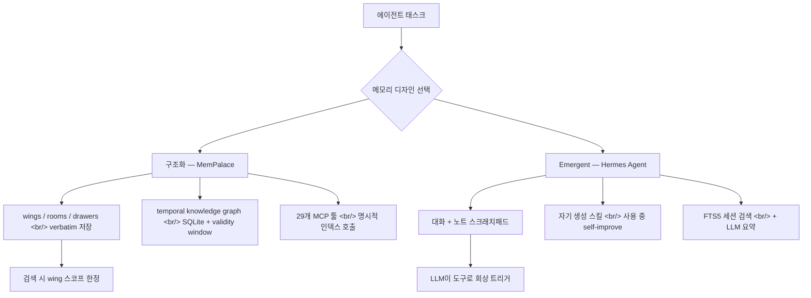
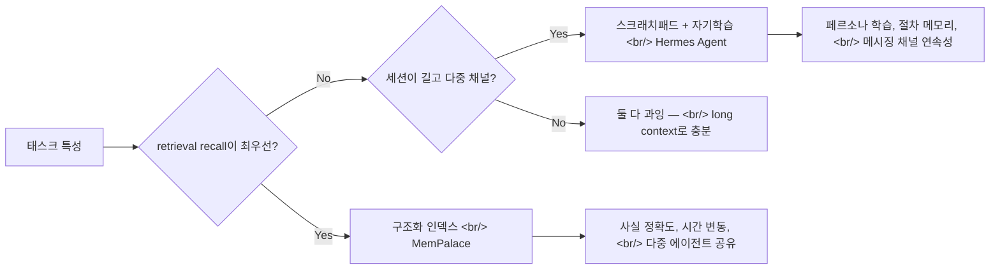

## 개요

2026-05-10 같은 시기에 회자된 두 리포 — [MemPalace/mempalace](https://github.com/MemPalace/mempalace)와 [NousResearch/hermes-agent](https://github.com/NousResearch/hermes-agent) — 가 에이전트 메모리의 서로 다른 두 프리미티브를 정면 충돌시킨다. 한쪽은 **구조화된 인덱스**(wings/rooms/drawers + 시간 윈도가 있는 지식 그래프), 반대쪽은 **emergent 스크래치패드 + 자기학습 스킬 + FTS5 회상**. [이전 글의 OS 레이어 논의](https://ice-ice-bear.github.io/ko/posts/2026-05-08-agent-os-layer-memory-skills/)에서 메모리/워크플로 슬롯이 어떻게 자리 잡는지 봤다면, 이번 글은 **그 메모리 슬롯 내부에서 갈라지는 두 디자인 철학**을 본다.

<!--more-->



## 1. MemPalace — 구조화된 인덱스의 끝을 본다

[MemPalace/mempalace](https://github.com/MemPalace/mempalace)는 *"The best-benchmarked open-source AI memory system"* 을 표방하는 2026-04-05 생성 MIT 프로젝트로, [2026-05-11 푸시 시점](https://github.com/MemPalace/mempalace/commits/main) 51,879 stars. 핵심 베팅은 한 줄로 — **원문을 압축·요약 없이 그대로 저장하고, 의미 검색은 사전 구조로 좁혀라.**

### 자리 구조

- **wings** — 사람·프로젝트 단위. 검색 시 스코프를 한정한다.
- **rooms** — 토픽 단위. wing 안에서 다시 좁힌다.
- **drawers** — 원문 본문이 들어가는 가장 작은 단위. **요약/추출/패러프레이즈 없음.**
- **knowledge graph** — 로컬 [SQLite](https://www.sqlite.org/)에 entity·relationship + validity window. 시간이 흐르며 fact가 더 이상 유효하지 않게 되는 걸 명시적으로 마크 가능.
- **agent diaries** — 스페셜리스트 에이전트마다 자기 wing 안의 일기. 런타임에 [`mempalace_list_agents`](https://mempalaceofficial.com/concepts/agents.html)로 발견 가능 → 시스템 프롬프트가 부풀지 않는다.

### 벤치마크

[LongMemEval](https://arxiv.org/abs/2410.10813) 500 questions 기준:

| 모드 | R@5 | LLM 필요 |
|---|---|---|
| Raw 의미 검색 (휴리스틱·LLM 없음) | **96.6%** | 없음 |
| Hybrid v4, 450q held-out | **98.4%** | 없음 |
| Hybrid v4 + LLM rerank, 500q | ≥99% | 임의의 capable 모델 |

추가로 [LoCoMo](https://arxiv.org/abs/2402.17753) R@10 88.9% (hybrid v5, 1,986 questions), ConvoMem 250 items 평균 회상 92.9%, [MemBench](https://aclanthology.org/2025.acl-long.0/) (ACL 2025) 8,500 items R@5 80.3%. 같은 시기에 회자된 [agentmemory](https://github.com/rohitg00/agentmemory)가 보인 LongMemEval R@5 95.2%와 비교하면 raw 모드만으로 +1.4%p — **임베딩 위 사전 구조화의 효과가 가장 크게 드러나는 영역이 retrieval recall**이라는 신호다.

### 셋업

```bash
uv tool install mempalace
mempalace init ~/projects/myapp

# 마이닝
mempalace mine ~/projects/myapp                  # 프로젝트 파일
mempalace mine ~/.claude/projects/ --mode convos # Claude Code 세션

# 검색·로드
mempalace search "왜 GraphQL로 바꿨더라"
mempalace wake-up
```

API 키 없음, 클라우드 호출 없음, ChromaDB 디폴트, [`mempalace/backends/base.py`](https://github.com/MemPalace/mempalace/blob/main/mempalace/backends/base.py) 인터페이스를 따르는 다른 백엔드로 교체 가능. 29개 [MCP](https://modelcontextprotocol.io/) 툴이 palace 읽기·쓰기, 그래프 연산, cross-wing 네비게이션, drawer 관리, 에이전트 다이어리를 커버.

### 의미

MemPalace의 베팅은 **"메모리 품질 = 인덱스 품질"** 이다. 압축·요약은 손실을 만든다 → verbatim 보존 + retrieval 시 wing/room으로 스코프를 좁히면 LLM이 길어진 쓰레기 컨텍스트를 헤집을 필요가 없다. [knowledge graph](https://mempalaceofficial.com/concepts/knowledge-graph.html)의 validity window는 **시간 흐름에 따른 사실 변동**을 LLM의 추론에 떠넘기지 않고 인덱스 레이어에서 명시한다는 점에서 특히 큰 차이다.

## 2. Hermes Agent — emergent 스크래치패드의 끝을 본다

[NousResearch/hermes-agent](https://github.com/NousResearch/hermes-agent)는 *"The agent that grows with you"* 를 표방하는 [Nous Research](https://nousresearch.com)의 MIT 프로젝트로, [2025-07-22 생성](https://github.com/NousResearch/hermes-agent), 2026-05-11 시점 142,575 stars — 같은 메모리 비교군에서 가장 큰 모집단이다. 베팅은 정반대 — **메모리는 별도 인덱스가 아니라 에이전트가 자기 운영 중에 만들어내는 emergent 산출물**이다.

### 메모리를 구성하는 네 가지 흐름

1. **agent-curated memory + periodic nudges** — 에이전트가 스스로 "이건 기억할 가치가 있다"고 판단해 메모리에 적는다. 주기적 nudge가 persistence를 강제.
2. **자기 생성 스킬** — 복잡한 태스크 이후 [Skills Hub](https://agentskills.io)에 등록 가능한 스킬을 자율적으로 만든다. 사용 중 self-improve. [agentskills.io](https://agentskills.io) 오픈 표준 호환.
3. **FTS5 세션 검색 + LLM 요약** — 과거 대화를 [SQLite FTS5](https://www.sqlite.org/fts5.html)로 full-text 검색 후 LLM 요약으로 cross-session 회상.
4. **사용자 모델링** — [plastic-labs/honcho](https://github.com/plastic-labs/honcho) dialectic user modeling으로 "당신이 누구인지"의 모델을 세션을 가로질러 깊게 쌓는다.

### 어디서 실행되는가

[Telegram](https://telegram.org/) · [Discord](https://discord.com/) · [Slack](https://slack.com/) · [WhatsApp](https://www.whatsapp.com/) · [Signal](https://signal.org/) · Email · CLI — 게이트웨이 한 프로세스로 다 받는다. 일곱 개 터미널 백엔드 — 로컬, [Docker](https://www.docker.com/), SSH, [Singularity](https://sylabs.io/singularity/), [Modal](https://modal.com/), [Daytona](https://www.daytona.io/), [Vercel Sandbox](https://vercel.com/docs/vercel-sandbox) — 중 Daytona·Modal은 idle 시 hibernate, 깨어날 때만 비용. 노트북에 묶이지 않은 에이전트.

### 모델 자유

`hermes model` 한 줄로 [Nous Portal](https://portal.nousresearch.com), [OpenRouter](https://openrouter.ai), [NVIDIA NIM](https://build.nvidia.com), [Xiaomi MiMo](https://platform.xiaomimimo.com), [z.ai/GLM](https://z.ai), [Kimi/Moonshot](https://platform.moonshot.ai), [MiniMax](https://www.minimax.io), [Hugging Face](https://huggingface.co), OpenAI, 자체 엔드포인트 사이 전환. 메모리는 모델과 분리된 emergent 산출물이므로 모델을 갈아치워도 그대로 따라간다.

### 의미

Hermes의 베팅은 **"메모리는 호출되어야 한다 — LLM이 직접"** 이다. 사전 인덱스가 retrieval 정확도를 책임지는 게 아니라, LLM이 자기 turn 중에 "지금 과거의 무엇이 필요한가"를 결정해 [FTS5 검색](https://www.sqlite.org/fts5.html) 도구를 호출하고, 요약을 만들어 자기 컨텍스트에 끼워 넣는다. 스킬은 작성 시점 한 번이 아니라 **사용하면서 스스로 고쳐 쓰는** 살아 있는 절차 메모리.

## 3. 정면 비교

| 항목 | MemPalace | Hermes Agent |
|---|---|---|
| 만든 곳 | [MemPalace](https://github.com/MemPalace) | [Nous Research](https://nousresearch.com) |
| 라이선스 | MIT | MIT |
| 생성 | 2026-04-05 | 2025-07-22 |
| 5/11 stars | 51,879 | 142,575 |
| 메모리 모델 | 구조화 인덱스 + 지식 그래프 | 스크래치패드 + emergent 스킬 + FTS |
| 저장 방식 | verbatim drawer | 대화·노트·스킬, 필요 시 요약 |
| 시간 처리 | 그래프 validity window | LLM이 요약하며 재구성 |
| Retrieval 책임 | 인덱스 (R@5 96.6% raw) | LLM이 도구로 호출 |
| 모델 종속 | 모델 무관 (raw는 LLM 0회) | 모델 무관 (10+ 프로바이더) |
| 인터페이스 | 29개 MCP 툴 + CLI | TUI + 6개 메시징 게이트웨이 |
| 단일 실행 단위 | `mempalace search` | `hermes` 세션 |

## 4. 어떤 태스크에 어느 쪽이 스케일하는가



- **사실 회상이 KPI인 곳** — 고객 히스토리, 코드베이스 결정 기록, "X를 언제 왜 바꿨더라" 같은 질문이 중요하면 **MemPalace가 더 맞는다.** R@5 96.6%는 다른 누구도 raw 모드로 내지 못한 숫자다.
- **운영이 길어지고 모달리티가 다양한 곳** — Telegram에서 시작해 Slack에서 이어지고 cron으로 매일 새벽 보고서를 받는 워크플로라면 **Hermes의 메시징·스케줄·스킬 쪽이 더 맞는다.** 메모리 정확도는 적당히 양보하고 운영 연속성을 사는 트레이드.
- **단일 세션 단발성 태스크** — 둘 다 과잉이다. Claude나 GPT의 현재 컨텍스트 윈도(수십만~100만 토큰)면 충분히 처리된다. 이게 핵심 — **현재 컨텍스트 윈도가 1인 1세션 수준에서는 둘 다 필요 없다.** 매기는 가격은 *에이전트 팀 규모*에서 나온다.

### 에이전트 팀 스케일에서 갈리는 지점

- N명의 스페셜리스트가 같은 사실 풀을 공유해야 한다 → MemPalace의 wings + cross-wing 네비게이션이 직접 답이다.
- N개 채널을 가로질러 같은 페르소나가 유지돼야 한다 → Hermes의 [Honcho](https://github.com/plastic-labs/honcho) dialectic 모델링이 직접 답이다.
- N일 동안 자기 절차를 진화시켜야 한다 → Hermes의 self-improving 스킬이 직접 답이다.
- N년 동안 사실의 유효 기간이 바뀐다 → MemPalace의 temporal knowledge graph가 직접 답이다.

현장 한 줄 평으로 정리하면, **MemPalace는 "정확도 인프라"이고 Hermes는 "운영 인프라"** 다. 같은 메모리라는 단어를 쓰지만 책임 영역이 거의 겹치지 않는다.

## 인사이트

같은 시기 51K와 142K stars를 동시에 모은 두 프로젝트가 메모리라는 단어를 정반대 방향으로 정의했다는 점이 이 디지스트의 핵심이다. MemPalace는 **메모리를 검색 가능한 사실 인덱스**로 보고, retrieval 정확도(96.6% raw R@5)와 시간 그래프(validity window)에 디자인 예산을 다 썼다. Hermes는 **메모리를 LLM이 호출하는 운영 흐름**으로 보고, 스크래치패드·자기 진화 스킬·다중 채널 연속성에 같은 예산을 썼다. 둘 다 모델 종속을 의도적으로 끊은 것까지는 동일한 방향이지만, 메모리의 "어디까지가 인덱스이고 어디부터가 에이전트인가" 라는 경계선이 정반대다. [이전 글](https://ice-ice-bear.github.io/ko/posts/2026-05-08-agent-os-layer-memory-skills/)이 메모리/워크플로 두 슬롯이 OS 레이어로 모이는 풍경이었다면, 이번 흐름은 **메모리 슬롯 안에서 다시 인덱스파와 스크래치패드파로 갈라지는 두 번째 분기**다. 현재 컨텍스트 윈도가 단일 세션을 거의 다 흡수해버리는 시점에서 보면 둘 중 누구도 시급해 보이지 않지만, 에이전트가 *팀* 단위로 운영되기 시작하면 두 디자인 차이는 곧장 비용·정확도·운영 안정성으로 환산된다. 다음 분기 흥미로운 질문은 둘 — **인덱스 진영이 emergent 스크래치패드를 인덱스에 흡수할지, 스크래치패드 진영이 명시적 그래프를 자기 도구로 끌어들일지** 다. 한쪽이 다른 쪽을 흡수하는 방향으로 수렴할 가능성이 더 높아 보인다.

## 참고

**핵심 리포지토리**

- [MemPalace/mempalace](https://github.com/MemPalace/mempalace) · 공식 사이트 [mempalaceofficial.com](https://mempalaceofficial.com) · [palace concepts](https://mempalaceofficial.com/concepts/the-palace.html) · [knowledge graph](https://mempalaceofficial.com/concepts/knowledge-graph.html) · [MCP 툴 레퍼런스](https://mempalaceofficial.com/reference/mcp-tools.html)
- [NousResearch/hermes-agent](https://github.com/NousResearch/hermes-agent) · 문서 [hermes-agent.nousresearch.com/docs](https://hermes-agent.nousresearch.com/docs/) · [메모리 가이드](https://hermes-agent.nousresearch.com/docs/user-guide/features/memory) · [스킬 시스템](https://hermes-agent.nousresearch.com/docs/user-guide/features/skills)

**관련 메모리 도구 / 비교군**

- [rohitg00/agentmemory](https://github.com/rohitg00/agentmemory) — 같은 LongMemEval 평가군의 직전 디자인
- [plastic-labs/honcho](https://github.com/plastic-labs/honcho) — Hermes가 쓰는 dialectic 사용자 모델링
- [agentskills.io](https://agentskills.io) — Hermes·OpenClaw가 공통으로 따르는 오픈 스킬 표준

**프로토콜·런타임**

- [Model Context Protocol (MCP)](https://modelcontextprotocol.io/)
- [SQLite FTS5](https://www.sqlite.org/fts5.html) — Hermes의 세션 검색 백엔드
- [ChromaDB](https://www.trychroma.com/) — MemPalace 디폴트 벡터 백엔드
- 런타임: [Modal](https://modal.com/) · [Daytona](https://www.daytona.io/) · [Vercel Sandbox](https://vercel.com/docs/vercel-sandbox)

**벤치마크·논문**

- [LongMemEval (arXiv:2410.10813, ICLR 2025)](https://arxiv.org/abs/2410.10813)
- [LoCoMo (arXiv:2402.17753)](https://arxiv.org/abs/2402.17753)
- [MemBench (ACL 2025)](https://aclanthology.org/2025.acl-long.0/)
