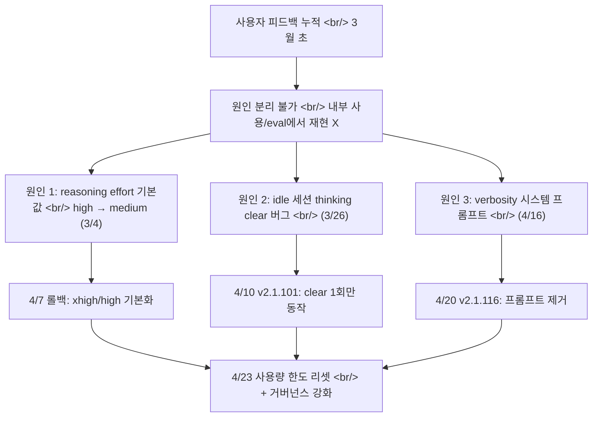

## 개요

[Anthropic이 4월 23일 공개한 포스트모템](https://www.anthropic.com/engineering/april-23-postmortem)은 한 달여간 누적된 Claude Code 품질 저하의 원인을 **세 갈래 독립 변경**으로 분리해 인정한 글이다. API 추론 레이어가 아니라 **제품 레이어**(기본 reasoning effort, 컨텍스트 관리, 시스템 프롬프트)에서 발생한 일이라는 점이 핵심이다. 인프라 사고는 아니지만, **공유 추론 위에서 돌아가는 LLM 제품 어디서나 재현될 수 있는 운영 실패** 라서 SRE/플랫폼 엔지니어가 챙겨야 할 교훈이 많다.

<!--more-->

세 변경 모두 [Claude Code](https://docs.claude.com/en/docs/claude-code/overview), [Claude Agent SDK](https://docs.claude.com/en/docs/agent-sdk), Claude Cowork에 영향을 줬고 [Messages API](https://docs.claude.com/en/api/messages)는 영향받지 않았다. 6주 가까이 신호가 묻혔다는 사실이 더 큰 이야기다.

## 1. 기본 reasoning effort: high → medium 다운그레이드 (3/4)

[Opus 4.6 출시 직후 high가 기본값](https://www.anthropic.com/news/claude-opus-4-6)이었는데, "UI가 멈춘 것처럼 보이는" 꼬리 지연(tail latency)이 누적 보고됐다. Anthropic은 내부 평가에서 medium이 **"약간 낮은 지능 vs 유의미하게 짧은 지연"** 트레이드오프 곡선에서 더 나은 운영점이라고 판단해 기본값을 내렸다.

> "In our internal evals and testing, medium effort achieved slightly lower intelligence with significantly less latency for the majority of tasks."

사용자 피드백은 정반대였다. 대부분이 기본값을 그대로 썼고 — UX 디자인 원칙대로 — `/effort`로 직접 올리지 않았다. 결국 4월 7일 롤백, [Opus 4.7](https://www.anthropic.com/news/claude-opus-4-7)은 `xhigh`, 나머지는 `high`로 다시 올렸다.

**시사점.** 모델 효율 곡선 위 운영점을 옮기는 일은 **silent quality regression** 의 가장 흔한 형태다. 내부 evals 점수가 약간 떨어져도 라우팅을 바꾸면 **퍼블릭한 인지된 품질** 은 더 크게 흔들린다. [test-time compute scaling](https://arxiv.org/abs/2408.03314)이 늘어나는 시대일수록 "기본값 = 제품 약속" 이라는 점을 잊으면 안 된다.

## 2. 캐싱 최적화가 추론 히스토리를 매 턴 날린 버그 (3/26)

가장 기술적으로 풍부한 케이스다. Anthropic은 [prompt caching](https://docs.anthropic.com/en/docs/build-with-claude/prompt-caching)을 적극 활용해 연속 호출의 비용/지연을 줄여왔다 — Claude 팀이 직접 ["Prompt caching is everything"](https://claude.com/blog/lessons-from-building-claude-code-prompt-caching-is-everything) 라고 쓸 정도.

설계 의도는 단순했다. **1시간 이상 idle했던 세션** 을 재개할 때 어차피 캐시 미스이므로, 오래된 thinking 블록을 한 번 정리해서 uncached 토큰 수를 줄이자. 이를 위해 [`clear_thinking_20251015` 컨텍스트 편집 전략](https://docs.claude.com/en/docs/build-with-claude/context-editing)을 `keep:1`로 호출.

**버그.** "세션당 1회"가 아니라 **세션 내 모든 후속 턴마다** 같은 헤더가 붙어서, 매 요청마다 직전 한 블록만 남기고 모든 reasoning이 폐기됐다. 도구 사용 중 follow-up 메시지가 들어오면 **현재 턴의 reasoning까지** 함께 날아갔다. Claude는 그대로 실행을 이어가지만, 자기가 왜 그 편집/도구 호출을 했는지 모르는 상태로 진행 — 사용자가 보고한 "건망증, 반복, 이상한 도구 선택" 이 여기서 나왔다.

부수 효과로 매 요청이 캐시 미스라서 **사용량 한도가 더 빨리 소진된다** 는 별도 신고도 같은 뿌리였다.

### 왜 잡지 못했나

> "The changes it introduced made it past multiple human and automated code reviews, as well as unit tests, end-to-end tests, automated verification, and dogfooding."

세 가지 우연이 결합:
1. **내부 전용 message queuing 실험** 이 동시에 돌고 있어서 신호 분리가 어려웠다
2. **thinking 표시 방식의 직교 변경** 이 CLI에서 버그를 숨겨버렸다
3. 트리거가 **stale session** 이라는 corner case라서 dogfooding에서 재현 안 됐다

Anthropic은 사후에 [Claude Code Review](https://code.claude.com/docs/en/code-review)로 해당 PR을 백테스트했는데 — **Opus 4.7은 충분한 레포 컨텍스트가 주어졌을 때 버그를 찾았고 Opus 4.6은 못 찾았다**. 후속 조치 중 하나가 "코드 리뷰에 추가 레포 컨텍스트 지원" 이다.

**시사점.** Cache hit rate는 비용 메트릭으로만 보지 말 것. **갑작스러운 캐시 미스 비율 상승** 은 컨텍스트 관리 버그의 1차 신호다. 메모리/추론 보존 메커니즘은 unit test 커버리지가 쉽게 거짓 안심을 준다 — multi-turn integration test에서 **턴 수에 따라 컨텍스트가 어떻게 변하는지** 를 명시적으로 assert 하자.

## 3. Verbosity 줄이는 시스템 프롬프트 한 줄 (4/16)

[Opus 4.7 출시 노트](https://www.anthropic.com/news/claude-opus-4-7)는 모델이 "verbose해진" 행동 특성을 언급했다. 더 똑똑해지지만 출력 토큰이 더 많이 나온다. Anthropic은 모델 학습·프롬프팅·UX 개선 세 갈래를 다 썼는데, 그중 시스템 프롬프트 한 줄이 결정적이었다.

> _"Length limits: keep text between tool calls to ≤25 words. Keep final responses to ≤100 words unless the task requires more detail."_

내부 eval 세트에서는 regression이 없어 4월 16일 출시. 사후 조사에서 더 넓은 eval 세트로 ablation을 돌리니 Opus 4.6과 4.7 모두에서 **3% 드롭**. 4월 20일 즉시 revert.

**시사점.** 시스템 프롬프트 한 줄은 [통제된 변수](https://martinfowler.com/articles/feature-toggles.html)처럼 보이지만 사실은 **모든 트래픽에 즉시 적용되는 글로벌 컨피그 변경** 이다. 같은 줄이 모델마다 다르게 작동한다는 점도 핵심 — Anthropic이 추가한 거버넌스 중 "model-specific changes are gated to the specific model" 가이드라인이 여기서 나왔다.

## 왜 한 달이나 걸렸나 — 신호 분리 실패의 해부

세 가지 변경이 **다른 일정, 다른 트래픽 슬라이스** 에 적용됐다는 점이 진단을 망쳤다.

| 변경 | 영향 모델 | 트래픽 슬라이스 | 발견 지연 |
|---|---|---|---|
| effort 기본값 | Sonnet 4.6, Opus 4.6 | 기본 모드 사용자 (대다수) | ~5주 |
| thinking clear 버그 | Sonnet 4.6, Opus 4.6 | 1시간 idle 후 재개 세션 | ~2주 |
| verbosity 프롬프트 | Sonnet 4.6, Opus 4.6, Opus 4.7 | Opus 4.7 출시일 이후 전체 | ~4일 |

각 슬라이스의 사용자가 다른 경로로 신음했고, 집계된 모습은 **"넓고 일관성 없는 품질 저하"** 였다 — 인시던트 책임자가 가장 분리하기 어려운 패턴이다. 같은 시기에 회자된 [Stella Laurenzo의 6,852개 세션, 234,000개 tool call 감사](https://news.ycombinator.com/) 같은 외부 분석이 결정적 신호가 됐다.

[Google SRE의 incident response 원칙](https://sre.google/sre-book/managing-incidents/)에서 말하는 **"distinguish signal from noise"** 가 LLM 제품에서는 한층 어려워진다. 사용자 만족도는 본질적으로 분포이고, 변경 직후의 "체감 저하" 보고는 [confirmation bias](https://en.wikipedia.org/wiki/Confirmation_bias) 와 진짜 regression이 섞여 들어오기 때문.

## Anthropic이 약속한 후속 조치

원문 "Going forward" 섹션에서 발췌:

- **내부 직원이 공개 빌드를 그대로 쓰도록** — 신기능 테스트용 내부 빌드와 분리. dogfooding의 "거리 좁히기"
- **내부용 Code Review 개선분을 고객에게도 출시** — 추가 레포 컨텍스트 지원이 핵심
- **시스템 프롬프트 변경에 broad per-model eval 강제** — 매 변경마다 모델별 ablation
- **시스템 프롬프트 변경 리뷰/감사 도구 신규 구축**
- **CLAUDE.md에 model-specific gating 가이드 추가**
- **지능에 트레이드오프가 있는 변경에는 soak period + 점진 롤아웃**
- **[@ClaudeDevs](https://twitter.com/ClaudeDevs)와 GitHub 중심 커뮤니케이션 채널**

[OpenAI의 공개 인시던트 패턴](https://status.openai.com/history)과 비교하면 — OpenAI는 주로 가용성/지연 위주 status 페이지를, Anthropic은 **품질 regression** 까지 책임 범위에 포함시키는 색다른 자세다.

## Claude API 위에서 빌딩하는 엔지니어가 가져갈 운영 원칙

이 사건은 [shared infrastructure의 blast radius](https://en.wikipedia.org/wiki/Blast_radius_(software)) 가 **모델 가중치뿐 아니라 harness/시스템 프롬프트** 까지 포함한다는 점을 확인시켰다. 다운스트림으로 빌딩하는 입장에서:

- **모델 출력 분포를 회귀 테스트** — 단순 latency/error rate가 아니라 **토큰 분포·도구 호출 패턴·응답 길이** 까지 베이스라인을 잡고 일일 ablation으로 비교. [LangSmith](https://docs.smith.langchain.com/)·[Braintrust](https://www.braintrust.dev/) 같은 LLM eval 플랫폼이 이런 목적이다.
- **시스템 프롬프트 변경에 자체 [feature flag](https://martinfowler.com/articles/feature-toggles.html)** — Anthropic 변경에 자기 변경이 겹치면 신호 분리가 거의 불가능해진다.
- **Multi-provider routing 준비** — [LiteLLM](https://docs.litellm.ai/), [OpenRouter](https://openrouter.ai/), [Bedrock](https://aws.amazon.com/bedrock/) 등을 통해 모델 fallback 경로를 미리 가져갈 것. 단일 벤더 의존이 이런 식의 "전체 사용자 동시 저하" 를 만든다.
- **Cache hit rate를 SLI로 승격** — 갑작스러운 미스율 상승은 비용 신호이자 **컨텍스트 관리 회귀 신호**.
- **Idempotent retry + circuit breaker** — [Polly](https://github.com/App-vNext/Polly)/[resilience4j](https://github.com/resilience4j/resilience4j) 패턴은 LLM에도 그대로 유효. 다만 retry가 토큰 한도를 두 배로 소비할 수 있다는 점을 budget에 반영.
- **사용자 피드백을 정량 채널과 합칠 것** — 현장 한 줄 평이 "분리되지 않은 품질 저하" 의 1차 신호가 되는 시대다.

## 인사이트

세 가지 원인 모두 **고전적 운영 실패 패턴** 의 LLM 버전이다. (1) 기본값 변경이 사용자 행동 가정을 깼고, (2) "1회 정리" 가 매 턴 실행되는 [off-by-N 버그](https://en.wikipedia.org/wiki/Off-by-one_error)가 캐싱 최적화 코드 깊은 곳에 박혔고, (3) eval 세트 커버리지가 충분히 넓지 않아 시스템 프롬프트 한 줄이 3% 회귀를 통과시켰다. **새롭지 않다.** 새로운 건 진단 난이도다. 모델·하니스·프롬프트가 한 묶음으로 사용자에게 전달되는 순간, 슬라이스가 겹쳐서 발생한 회귀는 status 페이지에 빨간 점으로 찍히지 않는다. Anthropic이 추가한 통제 — per-model eval 강제, ablation 자동화, soak period, dogfooding 거리 좁히기 — 는 모두 **"모델 가중치 외 모든 변경" 에도 인프라급 변경 관리 규율을 적용** 하겠다는 약속이다. 다운스트림 엔지니어가 같은 결론을 내면 된다. Claude/GPT/Gemini API 위에서 돌아가는 제품이라면, 모델 자체는 외부 변수지만 **프롬프트·라우팅·리트라이 정책** 은 우리 변수다. 우리 쪽 변수의 변경 관리에 SRE급 규율을 붙이지 않으면, 똑같은 6주를 우리 사용자에게도 강요하게 된다.

## 참고

### Anthropic 1차 자료

- [An update on recent Claude Code quality reports](https://www.anthropic.com/engineering/april-23-postmortem) — 본 포스트모템 원문
- [Lessons from building Claude Code — prompt caching is everything](https://claude.com/blog/lessons-from-building-claude-code-prompt-caching-is-everything)
- [Claude Opus 4.7 출시 공지](https://www.anthropic.com/news/claude-opus-4-7)
- [Engineering at Anthropic 인덱스](https://www.anthropic.com/engineering)

### Anthropic API 문서

- [Extended thinking 가이드](https://platform.claude.com/docs/en/build-with-claude/extended-thinking)
- [Context editing — `clear_thinking_20251015`](https://platform.claude.com/docs/en/build-with-claude/context-editing)
- [Prompt caching 문서](https://docs.anthropic.com/en/docs/build-with-claude/prompt-caching)
- [Messages API 레퍼런스](https://docs.claude.com/en/api/messages)
- [Claude Code 문서](https://docs.claude.com/en/docs/claude-code/overview)

### SRE / 인시던트 관리 배경

- [Google SRE Book — Managing Incidents](https://sre.google/sre-book/managing-incidents/)
- [Feature Toggles (Martin Fowler)](https://martinfowler.com/articles/feature-toggles.html)
- [Scaling Test-Time Compute (Snell et al., 2024)](https://arxiv.org/abs/2408.03314)

### 외부 분석 / 비교

- [VentureBeat: Anthropic reveals harness changes likely caused degradation](https://venturebeat.com/technology/mystery-solved-anthropic-reveals-changes-to-claudes-harnesses-and-operating-instructions-likely-caused-degradation)
- [OpenAI 가용성 상태 페이지 히스토리](https://status.openai.com/history) — 비교 대조
- [LiteLLM 멀티 프로바이더 라우팅](https://docs.litellm.ai/)
