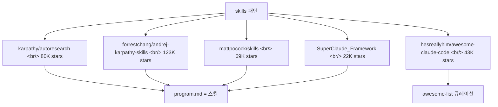

## 개요

2026-05-10 하루에 [Claude Code](https://www.anthropic.com/claude-code) 스킬·에이전트 컬렉션 레포 5개가 같은 시기에 회자됐다. 어떤 건 [Karpathy](https://x.com/karpathy) 본인의 자율 연구 에이전트, 어떤 건 [Matt Pocock](https://x.com/mattpocockuk)의 실전 엔지니어링 스킬, 어떤 건 SuperClaude 같은 풀스택 프레임워크다. 우연이 아니다. **스킬(skill)이 에이전트 엔지니어링의 1차 프리미티브로 굳어지고 있다**는 신호다.

<!--more-->



## 왜 스킬이 모이는가

스킬은 [Anthropic이 2025년 가을 공식화한 패턴](https://www.anthropic.com/news/skills)이다. 형식은 단순하다 — 폴더 하나, `SKILL.md` 파일 하나, 필요하면 보조 스크립트. Claude Code는 사용자의 작업 맥락을 보고 어떤 스킬을 발동할지 스스로 정한다.

이 단순함이 폭발의 원인이다.

- **버전 관리 가능** — 그냥 텍스트 파일. `git diff`로 리뷰하고, PR 받을 수 있다.
- **합성 가능** — 한 스킬이 다른 스킬을 호출할 수 있다. `/grill-me` → `/to-prd` → `/to-issues` → `/tdd` 가 자연스러운 파이프라인이 된다.
- **모델 중립적인 정신** — Claude Code가 1차 무대지만, 형식 자체는 마크다운이라 다른 에이전트로 옮기기 쉽다. 실제로 [SuperGemini](https://github.com/SuperClaude-Org/SuperGemini_Framework)와 [SuperQwen](https://github.com/SuperClaude-Org/SuperQwen_Framework) 포크가 이미 존재한다.
- **공유 가능** — 한 레포를 `/plugin marketplace add`로 통째로 가져올 수 있다.

이 5개 레포는 그 패턴이 결정화되는 과정에서 나온 5개의 단면이다.

## 1. karpathy/autoresearch — 스킬이 곧 연구 에이전트의 program.md

[karpathy/autoresearch](https://github.com/karpathy/autoresearch)는 80,223 stars. 2026-03-06 생성, *"AI agents running research on single-GPU nanochat training automatically"*.

아이디어는 단순하다. AI 에이전트에게 작지만 진짜 LLM 학습 셋업을 주고 밤새 자율적으로 실험하게 한다. 코드 수정 → 5분 학습 → 결과 비교 → 채택 또는 폐기 → 반복. 아침에 일어나면 실험 로그와 (운 좋으면) 더 나은 모델이 있다.

핵심은 파일 구조다.

```
prepare.py   — 상수, 데이터 준비 (수정 금지)
train.py     — 모델/옵티마이저/학습 루프 (에이전트가 수정)
program.md   — 에이전트 지시사항 (사람이 수정)
```

[Karpathy 본인이 README에 명시](https://github.com/karpathy/autoresearch#running-the-agent)한다.

> The `program.md` file is essentially a super lightweight "skill".

이게 핵심이다. Karpathy는 "스킬"이라는 용어를 채택했다. nanochat 학습 코드 위에 자율 연구 오케스트레이션을 얹은 1만 줄짜리 프레임워크가 아니라, **마크다운 한 장**이다. 사람은 `program.md`를 진화시키고, 에이전트는 `train.py`를 진화시킨다. 메타 진화 루프 두 개가 분리돼 있다.

이 패턴이 영향력 있는 이유 — Karpathy는 학습 셋업에서 가장 안 빌릴 사람이다. 그가 마크다운 한 장으로 끝낸다면, 다른 사람들은 더더욱 단순화할 명분이 생긴다.

## 2. forrestchang/andrej-karpathy-skills — 스킬을 통한 행동 교정

[forrestchang/andrej-karpathy-skills](https://github.com/forrestchang/andrej-karpathy-skills)는 123,691 stars. *"A single `CLAUDE.md` file to improve Claude Code behavior, derived from Andrej Karpathy's observations on LLM coding pitfalls."*

[Karpathy가 X에 적은 LLM 코딩 함정 관찰](https://x.com/karpathy/status/2015883857489522876)에서 네 가지 원칙을 뽑아냈다.

| 원칙 | 해결하는 문제 |
|------|---------------|
| **Think Before Coding** | 잘못된 가정, 숨겨진 혼란, 트레이드오프 누락 |
| **Simplicity First** | 과잉설계, 부풀린 추상화 |
| **Surgical Changes** | 무관한 코드 건드림, 건드려선 안 될 곳 수정 |
| **Goal-Driven Execution** | 검증 가능한 성공 기준으로 루프 |

설치는 두 가지 — [`/plugin marketplace add forrestchang/andrej-karpathy-skills`](https://docs.anthropic.com/en/docs/claude-code/plugins)로 Claude Code 플러그인으로 박거나, `CLAUDE.md`에 curl로 append한다. 같은 룰셋이 [Cursor용 `.cursor/rules/karpathy-guidelines.mdc`](https://github.com/forrestchang/andrej-karpathy-skills/blob/main/.cursor/rules/karpathy-guidelines.mdc)로도 커밋돼 있다.

핵심 인용:

> "LLMs are exceptionally good at looping until they meet specific goals... Don't tell it what to do, give it success criteria and watch it go." — Karpathy

이건 스킬을 **모델 행동을 교정하는 룰셋**으로 쓰는 사례다. 능력을 추가하는 게 아니라 결함을 빼는 스킬.

## 3. mattpocock/skills — Skills For Real Engineers

[mattpocock/skills](https://github.com/mattpocock/skills)는 69,128 stars, MIT. *"Skills for Real Engineers. Straight from my .claude directory."* 2026-05-10에 마지막 푸시.

이 레포는 명백히 [GSD](https://github.com/agentic-pm/gsd)·[BMAD](https://github.com/bmad-org/bmad)·[Spec-Kit](https://github.com/github/spec-kit) 같은 풀프로세스 프레임워크의 반대편에 선다. README가 못박는다.

> Approaches like GSD, BMAD, and Spec-Kit try to help by owning the process. But while doing so, they take away your control and make bugs in the process hard to resolve.
>
> These skills are designed to be small, easy to adapt, and composable. They work with any model.

Matt이 정의한 4대 실패 모드와 각각의 스킬:

| 실패 모드 | 스킬 |
|-----------|------|
| #1 The Agent Didn't Do What I Want | [`/grill-me`](https://github.com/mattpocock/skills/blob/main/skills/productivity/grill-me/SKILL.md), [`/grill-with-docs`](https://github.com/mattpocock/skills/blob/main/skills/engineering/grill-with-docs/SKILL.md) |
| #2 The Agent Is Way Too Verbose | `CONTEXT.md` 공유 언어 (grill-with-docs 안에 빌트인) |
| #3 The Code Doesn't Work | [`/tdd`](https://github.com/mattpocock/skills/blob/main/skills/engineering/tdd/SKILL.md), [`/diagnose`](https://github.com/mattpocock/skills/blob/main/skills/engineering/diagnose/SKILL.md) |
| #4 We Built A Ball Of Mud | [`/to-prd`](https://github.com/mattpocock/skills/blob/main/skills/engineering/to-prd/SKILL.md), [`/zoom-out`](https://github.com/mattpocock/skills/blob/main/skills/engineering/zoom-out/SKILL.md), [`/improve-codebase-architecture`](https://github.com/mattpocock/skills/blob/main/skills/engineering/improve-codebase-architecture/SKILL.md) |

설치는 [skills.sh](https://skills.sh/) 인스톨러로:

```bash
npx skills@latest add mattpocock/skills
```

설치하면 `/setup-matt-pocock-skills`가 이슈 트래커(GitHub / Linear / 로컬 파일), 트리아지 레이블 어휘, 도큐먼트 저장 경로를 셋업한다. 그 뒤로 `to-issues`, `to-prd`, `triage`, `diagnose`, `tdd`, `improve-codebase-architecture`, `zoom-out`이 일관된 컨벤션으로 연결된다.

Pocock이 인용하는 책들 — [Pragmatic Programmer](https://www.amazon.co.uk/Pragmatic-Programmer-Anniversary-Journey-Mastery/dp/B0833F1T3V), [Domain-Driven Design](https://www.amazon.co.uk/Domain-Driven-Design-Tackling-Complexity-Software/dp/0321125215), [Extreme Programming Explained](https://www.amazon.co.uk/Extreme-Programming-Explained-Embrace-Change/dp/0321278658), [A Philosophy of Software Design](https://www.amazon.co.uk/Philosophy-Software-Design-2nd/dp/173210221X) — 가 자체로 신호다. **스킬은 새로운 패러다임이 아니라 30년 된 소프트웨어 공학 원칙의 LLM 인터페이스**라는 입장.

## 4. SuperClaude_Framework — 스킬 위의 메타프로그래밍 레이어

[SuperClaude-Org/SuperClaude_Framework](https://github.com/SuperClaude-Org/SuperClaude_Framework)는 22,726 stars, MIT, [superclaude.netlify.app](https://superclaude.netlify.app/). 2025-06-22 생성.

스킬 미니멀리즘의 반대 극단에 있다.

| 메트릭 | 수 |
|--------|------|
| Slash Commands | 30 |
| Specialized AI Agents | 20 |
| Behavioral Modes | 7 |
| MCP Servers | 8 |

자칭 *"meta-programming configuration framework that transforms Claude Code into a structured development platform through behavioral instruction injection and component orchestration."*

설치는 PyPI:

```bash
pipx install superclaude
superclaude install
```

대표 명령어 — `/sc:research` (Tavily MCP 연동 딥 리서치), `/sc:brainstorm`, `/sc:implement`, `/sc:test`, `/sc:pm`. 선택적으로 [Serena](https://github.com/oraios/serena) (코드 이해 2-3배 가속), [Sequential](https://github.com/sequentialdev/sequential) (토큰 30-50% 절감), [Tavily](https://tavily.com), [Context7](https://context7.com) MCP 서버를 [airis-mcp-gateway](https://github.com/agiletec-inc/airis-mcp-gateway)로 묶어 띄울 수 있다.

v5.0에는 TypeScript 플러그인 시스템이 예고돼 있다([이슈 #419](https://github.com/SuperClaude-Org/SuperClaude_Framework/issues/419)). 그러면 설치가 `/plugin marketplace add SuperClaude-Org/superclaude-plugin-marketplace`로 단순화된다.

SuperClaude의 의의 — **스킬이 충분히 안정적이라 그 위에 메타프레임워크를 얹어도 무너지지 않는다**는 것. 그리고 같은 형식을 [Gemini](https://github.com/SuperClaude-Org/SuperGemini_Framework)와 [Qwen](https://github.com/SuperClaude-Org/SuperQwen_Framework)에도 옮겼다는 것 — 스킬 정신의 모델 중립성을 실증한다.

## 5. hesreallyhim/awesome-claude-code — 큐레이션 레이어

[hesreallyhim/awesome-claude-code](https://github.com/hesreallyhim/awesome-claude-code)는 43,273 stars. 2025-04-19 생성으로, 이 묶음에서 가장 오래됐다. *"A curated list of awesome skills, hooks, slash-commands, agent orchestrators, applications, and plugins for Claude Code by Anthropic."*

[awesome-list 컨벤션](https://github.com/sindresorhus/awesome)을 따른다. 토픽 태그가 흥미롭다 — `agentic-coding`, `agent-skills`, `ai-workflow-optimization`, `coding-agents`. README 자체는 *"the previous Table of Contents was no longer fit for purpose"*라며 재정비 중이지만, 그 사실 자체가 메시지다 — **Claude Code 생태계가 awesome-list 한 장으로 정리될 수준을 넘어섰다**.

이 레포가 5개 묶음에 들어가는 이유는 단순하다. 다른 4개가 *"새로운 스킬을 제공"*한다면, 이 레포는 *"어디에 가야 스킬을 찾을 수 있는지"*를 푼다. 큐레이션 자체가 메타-스킬이다.

## 인사이트

**1. 스킬은 합의된 프리미티브가 됐다.** 같은 시기에 5개의 다른 사람이 다른 각도에서 같은 단어를 쓰고 있다 — Karpathy의 `program.md`도, Matt Pocock의 `SKILL.md`도, SuperClaude의 슬래시 명령도, 모두 "스킬"로 자기를 설명한다. 이전 세대 용어("프롬프트 템플릿", "에이전트 룰", "시스템 메시지")는 단일 단어로 합쳐졌다.

**2. 풀프로세스 프레임워크 vs. 마이크로스킬의 분기.** SuperClaude(30개 명령)와 Matt Pocock(작고 합성 가능)이 같은 날 노출된 건 우연이지만 의미심장하다. *"프로세스를 소유하는 프레임워크"*와 *"각자 골라 끼는 마이크로스킬"* 둘 다 살아남는다. Pocock이 GSD/BMAD/Spec-Kit를 명시적으로 반대편에 세우는 게 흥미롭다.

**3. 스킬은 능력 추가가 아니라 결함 제거 도구로도 쓴다.** Forrest Chang의 Karpathy 가이드라인은 새 기능을 주지 않는다. 모델이 "안 했으면 하는 행동"을 막는다. Anthropic이 [Constitutional AI](https://www.anthropic.com/research/constitutional-ai)에서 모델 정렬에 했던 일을 사용자가 자기 워크플로에 한다.

**4. 스킬은 모델 중립성의 베이스다 — Claude Code는 1차 무대일 뿐.** SuperClaude가 SuperGemini와 SuperQwen 포크를 유지하고, Forrest Chang이 Cursor용 `.mdc` 파일을 같은 레포에 커밋하고, Matt Pocock이 *"They work with any model"*을 README 셀링 포인트로 적는다. 형식이 표준화되면 IDE/모델 락인이 약해진다.

**5. `program.md` 패턴이 학습 코드까지 침투했다.** Karpathy autoresearch에서 *사람이 만지는 파일*과 *에이전트가 만지는 파일*이 명시적으로 분리됐다. 이 분리가 일반화되면 모든 자동화 코드베이스가 `human.md` + `agent-modifiable/` 구조로 갈 가능성이 있다.

**6. 다음에 올 것 — 스킬 마켓플레이스, 스킬 SDK, 스킬 평가.** [`/plugin marketplace`](https://docs.anthropic.com/en/docs/claude-code/plugins)가 이미 있고, SuperClaude가 [Smithery](https://smithery.ai)에 등록돼 있고, [skills.sh](https://skills.sh)가 별도 인스톨러로 등장했다. 다음은 스킬 품질 평가(어떤 스킬이 실제로 모델 출력을 개선하나)와 스킬 SDK(스킬을 코드처럼 빌드/테스트)다.

**7. 큐레이션 자체가 스킬이 된다.** awesome-claude-code가 43K stars를 받은 건 *"어디서 시작할지 모르겠다"*는 신호다. 스킬 수가 한 사람이 다 못 읽을 만큼 늘었다는 뜻이고, 메타 레이어가 필요하다는 뜻이다.

## 참고

**소스 레포 5개**
- [karpathy/autoresearch](https://github.com/karpathy/autoresearch) — 단일 GPU nanochat 자율 연구 에이전트. `program.md`를 "lightweight skill"이라고 명시.
- [forrestchang/andrej-karpathy-skills](https://github.com/forrestchang/andrej-karpathy-skills) — Karpathy의 LLM 코딩 함정 관찰에서 추출한 4대 원칙 `CLAUDE.md`.
- [mattpocock/skills](https://github.com/mattpocock/skills) — 실전 엔지니어링용 소형 합성 가능 스킬 모음. GSD/BMAD/Spec-Kit 반대편.
- [SuperClaude-Org/SuperClaude_Framework](https://github.com/SuperClaude-Org/SuperClaude_Framework) — 30개 슬래시 명령 + 20개 에이전트 + 8개 MCP 서버 메타프레임워크.
- [hesreallyhim/awesome-claude-code](https://github.com/hesreallyhim/awesome-claude-code) — Claude Code 리소스 awesome-list.

**배경**
- [Anthropic: Introducing Skills](https://www.anthropic.com/news/skills) — 스킬 포맷 공식화.
- [Claude Code 공식 문서: Plugins](https://docs.anthropic.com/en/docs/claude-code/plugins) — `/plugin marketplace` 시스템.
- [Karpathy의 LLM 코딩 함정 트윗](https://x.com/karpathy/status/2015883857489522876) — Forrest Chang 가이드라인의 원전.

**관련**
- [awesome-list 컨벤션](https://github.com/sindresorhus/awesome) — `hesreallyhim/awesome-claude-code`가 따르는 형식.
- [skills.sh](https://skills.sh) — Matt Pocock 스킬 인스톨러.
- [Smithery](https://smithery.ai) — MCP/스킬 마켓플레이스.
