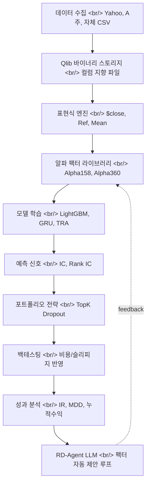

## 개요

[Microsoft qlib](https://github.com/microsoft/qlib)은 2020년 8월에 처음 공개된 AI 지향 퀀트 투자 플랫폼이다. 별 4.2만 개를 넘긴 이 레포는 새 프로젝트가 아니지만, 2026년 들어 다시 부각된다. 이유는 단순하다. **LLM 기반 금융 에이전트**(특히 [microsoft/RD-Agent](https://github.com/microsoft/RD-Agent)의 [R&D-Agent-Quant](https://arxiv.org/abs/2505.15155))가 자동으로 **알파 팩터를 캐고 모델을 최적화**하는 시점이 오자, 그 결과를 재현 가능하게 검증해줄 **퀀트 워크플로 백본**이 필요해졌고, 그 자리에 살아남아 있는 가장 활발한 오픈소스가 qlib이기 때문이다. 즉 qlib은 더 이상 "또 하나의 백테스팅 라이브러리"가 아니라, LLM 에이전트가 그 위를 달릴 **레일**로 위치가 바뀌었다.

<!--more-->

## 1. qlib이 실제로 하는 일

[qlib README](https://github.com/microsoft/qlib/blob/main/README.md)는 "exploring ideas to implementing productions"라고 쓰지만, 분해하면 네 개의 레이어다.

**Layer 1 — 데이터 인프라.** qlib은 자체 [컬럼 지향 바이너리 포맷](https://qlib.readthedocs.io/en/latest/component/data.html)으로 시계열 데이터를 저장한다. pandas DataFrame에 그대로 올리면 거대해지는 일봉/분봉 데이터를 **빠른 슬라이싱**이 가능한 형태로 압축한다. 데이터 수집 스크립트는 [Yahoo Finance 콜렉터](https://github.com/microsoft/qlib/tree/main/scripts/data_collector/yahoo)와 [중국 A주 콜렉터](https://github.com/microsoft/qlib/tree/main/scripts/data_collector) 모두 포함하고, 커뮤니티가 관리하는 [chenditc/investment_data](https://github.com/chenditc/investment_data) 미러도 표준 경로로 자리잡았다.

**Layer 2 — 표현식 엔진.** `$close`, `Ref($close, 1)`, `Mean($close, 3)`, `$high-$low` 같은 도메인 특화 문법으로 팩터를 선언한다. 이게 단순해 보여도 핵심이다 — 팩터를 **데이터 형태가 아니라 함수 형태로 선언**하기 때문에, LLM이 자연어 → qlib expression 변환을 학습하기 쉽다. 이 부분이 RD-Agent와 맞물리는 첫 번째 접점이다.

**Layer 3 — 모델 동물원.** [examples/benchmarks](https://github.com/microsoft/qlib/tree/main/examples/benchmarks)를 보면 [LightGBM](https://lightgbm.readthedocs.io/), [XGBoost](https://xgboost.readthedocs.io/), [MLP](https://qlib.readthedocs.io/en/latest/component/model.html), [GRU](https://qlib.readthedocs.io/en/latest/component/model.html), [Transformer](https://github.com/microsoft/qlib/pull/508), [Localformer](https://github.com/microsoft/qlib/pull/508), [TabNet](https://github.com/microsoft/qlib/pull/205), [DoubleEnsemble](https://github.com/microsoft/qlib/pull/286), [HIST](https://github.com/microsoft/qlib/pull/1040), [IGMTF](https://github.com/microsoft/qlib/pull/1040), [TRA (Temporal Routing Adaptor)](https://github.com/microsoft/qlib/pull/531), [TCTS](https://github.com/microsoft/qlib/pull/491), [ADARNN](https://github.com/microsoft/qlib/pull/689), [ADD](https://github.com/microsoft/qlib/pull/704), [KRNN, Sandwich](https://github.com/microsoft/qlib/pull/1414)까지 — 학계에서 나온 시계열 SOTA 모델 대부분이 동일한 인터페이스 뒤에 깔려 있다.

**Layer 4 — 백테스팅과 실행.** [Nested Decision Framework](https://qlib.readthedocs.io/en/latest/component/highfreq.html)로 일봉 전략과 분봉 실행을 같은 트리에 묶고, [Online serving](https://github.com/microsoft/qlib/pull/290)으로 모델 롤링을 자동화한다. [RL 학습 프레임워크](https://qlib.readthedocs.io/en/latest/component/rl.html)는 주문 실행을 연속 의사결정 문제로 모델링한다.

## 2. 왜 Microsoft가 이걸 풀었나

원 [qlib 논문](https://arxiv.org/abs/2009.11189)을 쓴 그룹은 [MSRA(Microsoft Research Asia)](https://www.microsoft.com/en-us/research/lab/microsoft-research-asia/)의 시계열·금융 팀이다. 표면상 이유는 "open research". 그러나 실제 동인은 세 가지가 겹친다.

**리서치 신뢰 자본.** 시계열 ML 논문 — [HIST](https://arxiv.org/abs/2110.13716), [DDG-DA](https://arxiv.org/abs/2201.04038), [ADARNN](https://arxiv.org/abs/2108.04443), [TRA](https://arxiv.org/abs/2106.12950) — 가 모두 같은 플랫폼 위에서 재현 가능하다. 논문 그래프가 그 자리에서 돌아가는 코드와 매칭되니까, MSRA의 시계열 페이퍼는 "구현이 진짜냐"는 의심에서 자유롭다.

**탤런트 파이프라인.** [Jiang Bian 그룹](https://www.microsoft.com/en-us/research/people/jiabia/)의 학생/인턴이 qlib 위에서 논문을 쓰고, 졸업 후 Microsoft / 헤지펀드 / 빅테크로 흩어진다. 오픈소스가 곧 채용 깔때기다.

**Azure ML 결합 가능성.** qlib의 워크플로 매니저는 [MLflow](https://mlflow.org/) experiment 추적과 직접 연결된다. Azure ML이 MLflow 호환을 표준으로 채택한 시점부터, qlib은 Azure 위에서 가장 자연스럽게 도는 도메인 특화 ML 스택이 된다.

## 3. pyfolio / zipline / vectorbt와의 차이

기존 오픈소스 퀀트 스택은 ML 시대 이전 설계다.

- [zipline](https://github.com/quantopian/zipline) — Quantopian의 백테스팅 엔진. 2020년 Quantopian 폐업 이후 [zipline-reloaded](https://github.com/stefan-jansen/zipline-reloaded) 포크가 유지되고 있지만, **이벤트 드리븐 백테스트**가 중심이고 ML 워크플로는 외부에서 따로 묶어야 한다.
- [pyfolio](https://github.com/quantopian/pyfolio) — 백테스트 결과의 **사후 분석**. IR, drawdown, factor exposure 같은 리포트 도구. 모델 학습 단계는 다루지 않는다.
- [vectorbt](https://vectorbt.dev/) — 벡터화 백테스트로 **빠른 파라미터 스윕**에 강점. 단일 전략을 빠르게 시뮬레이션하는 도구이지 ML-퍼스트 설계는 아니다.
- [backtrader](https://www.backtrader.com/) — 이벤트 드리븐, 개인 개발자에게 친숙. 같은 한계.

qlib이 다른 지점은 **시계열 ML 파이프라인 전체**를 단일 인터페이스에 묶었다는 것이다. 데이터 수집 → 팩터 표현 → 모델 학습 → 신호 평가 → 백테스트 → 분석 → 온라인 서빙이 모두 하나의 `qrun` 명령으로 실행되는 [YAML 워크플로](https://github.com/microsoft/qlib/blob/main/examples/benchmarks/LightGBM/workflow_config_lightgbm_Alpha158.yaml)다. 이 형태가 **LLM 에이전트가 호출하기 좋다** — 자연어 명령 하나가 YAML 한 장으로 매핑되고, 결과 메트릭(IC, Rank IC, IR, MDD)이 단일 JSON으로 떨어진다.

## 4. LLM-만나는-퀀트 — RD-Agent의 등장

[RD-Agent](https://github.com/microsoft/RD-Agent) (R&D-Agent)는 Microsoft가 2024년 8월 8일에 풀어 [R&D-Agent-Quant 논문](https://arxiv.org/abs/2505.15155)으로 정식화한 **LLM 기반 자율 진화 에이전트** 프레임워크다. 이름은 일반적이지만 첫 사용처가 정확히 qlib 위의 **알파 팩터 자동 마이닝**이다.

흐름은 이렇다.

1. LLM이 금융 도메인 텍스트(논문, 리포트, 뉴스)를 읽고 **팩터 가설**을 자연어로 제안
2. 그 가설을 [qlib 표현식](https://qlib.readthedocs.io/en/latest/component/data.html#feature-engineering)으로 컴파일
3. qlib이 그 팩터를 데이터에 적용해 **IC / Rank IC**를 계산
4. 성과가 좋은 팩터만 살아남고, 나머지는 LLM에게 피드백 → 다음 라운드
5. 모델 단에서도 비슷한 루프 — 하이퍼파라미터/아키텍처 탐색

이 구조가 흥미로운 건 LLM이 **사람을 흉내내는 게 아니라 사람보다 무한히 많이 시도하는 자리**에 들어간다는 점이다. 인간 퀀트가 1주에 팩터 5–10개를 만들고 검증한다면, LLM 에이전트는 같은 시간에 수백 개를 돌린다. 백테스트의 **bias-variance**를 인간이 머리로 추적하기 어려운 규모로 밀어붙인다.

세 가지 [RD-Agent 데모 영상](https://www.youtube.com/watch?v=X4DK2QZKaKY)이 공식적으로 공개돼 있다 — Quant Factor Mining, Factor Mining from Reports, Quant Model Optimization. 세 시나리오 모두 같은 패턴 — LLM이 가설을 생성하고, qlib이 검증하고, 평가 신호가 다시 LLM에 들어간다.

## 5. 그래서 지금 qlib을 봐야 하는 이유

세 가지 시그널이 겹친다.

**첫째, 활동성이 살아 있다.** [v0.9.7](https://github.com/microsoft/qlib/releases/tag/v0.9.7)이 2025년 8월에 풀렸고, 메인 브랜치는 2026년 4월에도 푸시가 들어왔다. 같은 시기에 [pyfolio](https://github.com/quantopian/pyfolio)와 원본 [zipline](https://github.com/quantopian/zipline)은 사실상 동결 상태다. 활발한 오픈소스 퀀트 스택은 손에 꼽는다.

**둘째, BPQP**(End-to-end learning) 같은 [under-review PR](https://github.com/microsoft/qlib/pull/1863)이 곧 들어온다. 포트폴리오 최적화의 **2차 계획법 단계까지 미분 가능하게 만들어** 알파-투-포지션을 한 그래프로 학습할 수 있게 된다. 이건 그냥 라이브러리 업데이트가 아니라 **포트폴리오 구성 자체가 학습 가능한 레이어**가 된다는 뜻이다.

**셋째, LLM 도구화 경로가 명확하다.** RD-Agent는 qlib을 도구로 호출하고, 결과를 JSON으로 받고, 다음 가설을 만든다. 이 패턴은 [Anthropic의 tool use](https://docs.claude.com/en/docs/agents-and-tools/tool-use/overview)나 [OpenAI Responses API](https://platform.openai.com/docs/api-reference/responses)에 그대로 매핑된다. 즉, **qlib YAML 워크플로 한 장 = LLM 함수 호출 한 번**이라는 단순한 등식이 성립한다.

## 6. 한계 — 데이터, 그리고 데이터

[README 상단의 ⚠️](https://github.com/microsoft/qlib#data-preparation) — "Due to more restrict data security policy. The official dataset is disabled temporarily." 공식 데이터셋이 일시 중단됐고, 커뮤니티 미러로 대체된다. 이게 qlib의 가장 큰 구조적 약점이다 — **양질의 시계열 데이터는 공짜가 아니다**. Yahoo Finance는 분봉/실시간이 약하고, 중국 A주 데이터는 거래소 정책에 종속된다.

상용 데이터로 가면 [Bloomberg](https://www.bloomberg.com/professional/products/bloomberg-terminal/), [Refinitiv](https://www.lseg.com/en/data-analytics), [WRDS](https://wrds-www.wharton.upenn.edu/)가 표준이지만 라이선스 비용이 만만치 않다. qlib의 [Arctic backend](https://github.com/microsoft/qlib/pull/744)나 [Point-in-Time database](https://github.com/microsoft/qlib/pull/343) 같은 모듈은 **상용 데이터 파이프라인을 붙일 수 있도록** 설계됐지만, 그건 사용자가 해결해야 할 일이다. 오픈소스가 줄 수 있는 건 **레일**까지다.

## 인사이트

qlib을 단독으로 보면 "잘 만든 시계열 ML 라이브러리" 정도지만, RD-Agent와 묶어서 보면 그림이 달라진다. LLM이 자연어로 팩터 가설을 만들고, qlib이 백테스트로 채점하고, 결과가 다시 LLM에 들어가는 **자동 알파 마이닝 루프**가 production-grade 오픈소스로 처음 닿은 자리가 여기다. 이게 의미하는 건 두 가지다. 첫째, **개인 퀀트의 진입 장벽이 다시 내려간다** — 박사급 시계열 ML 지식 없이도 LLM에게 "최근 3개월간 어닝 콜 텍스트에서 모멘텀 팩터를 만들어줘"라고 시키고 IC가 0.05 이상인 것만 통과시키는 워크플로를 짤 수 있다. 둘째, **헤지펀드의 차별화 축이 다시 한 단계 위로 이동한다** — 팩터 발굴 자체가 자동화되면 차별화는 **데이터(독점 대안 데이터셋)**, **컴퓨트(에이전트 병렬화 규모)**, **거버넌스(과적합 방지 메타-시스템)** 로 옮겨간다. qlib은 그 이동의 베이스라인이다. 2026년 한 해 동안 알파 마이닝 LLM 에이전트 + qlib 조합이 헤지펀드/리서치 그룹의 표준 셋업으로 빠르게 자리잡을 가능성이 높고, 한국 개인 개발자 입장에서 가장 빠른 시작점은 `pip install pyqlib` → [chenditc/investment_data](https://github.com/chenditc/investment_data/releases)에서 데이터 받고 → [LightGBM Alpha158 워크플로](https://github.com/microsoft/qlib/blob/main/examples/benchmarks/LightGBM/workflow_config_lightgbm_Alpha158.yaml)를 `qrun`으로 한 번 돌려보는 길이다. 한 줄짜리 명령으로 정보비(IR) 약 2.0 수준의 베이스라인이 나오는 게 출발점이다.

## 참고

**Repository and docs**
- [microsoft/qlib GitHub 저장소](https://github.com/microsoft/qlib)
- [qlib 공식 문서 (Read the Docs)](https://qlib.readthedocs.io/en/latest/)
- [PyPI — pyqlib](https://pypi.org/project/pyqlib/)
- [Qlib 데이터 모듈 문서](https://qlib.readthedocs.io/en/latest/component/data.html)
- [Qlib 워크플로 문서](https://qlib.readthedocs.io/en/latest/component/workflow.html)
- [Qlib RL 컴포넌트](https://qlib.readthedocs.io/en/latest/component/rl.html)
- [Qlib v0.9.7 릴리스 노트](https://github.com/microsoft/qlib/releases/tag/v0.9.7)

**Papers and related research**
- [Qlib: An AI-oriented Quantitative Investment Platform (arXiv:2009.11189)](https://arxiv.org/abs/2009.11189)
- [R&D-Agent-Quant 논문 (arXiv:2505.15155)](https://arxiv.org/abs/2505.15155)
- [HIST 시계열 모델 논문 (arXiv:2110.13716)](https://arxiv.org/abs/2110.13716)
- [DDG-DA 논문 (arXiv:2201.04038)](https://arxiv.org/abs/2201.04038)
- [TRA 시계열 라우팅 논문 (arXiv:2106.12950)](https://arxiv.org/abs/2106.12950)
- [ADARNN 논문 (arXiv:2108.04443)](https://arxiv.org/abs/2108.04443)

**LLM-meets-quant ecosystem**
- [microsoft/RD-Agent GitHub](https://github.com/microsoft/RD-Agent)
- [RD-Agent Quant Factor Mining 데모](https://www.youtube.com/watch?v=X4DK2QZKaKY)
- [Anthropic tool use 가이드](https://docs.claude.com/en/docs/agents-and-tools/tool-use/overview)
- [OpenAI Responses API](https://platform.openai.com/docs/api-reference/responses)

**Comparable open-source stacks**
- [zipline-reloaded](https://github.com/stefan-jansen/zipline-reloaded)
- [pyfolio](https://github.com/quantopian/pyfolio)
- [vectorbt](https://vectorbt.dev/)
- [backtrader](https://www.backtrader.com/)
- [chenditc/investment_data 미러](https://github.com/chenditc/investment_data)
