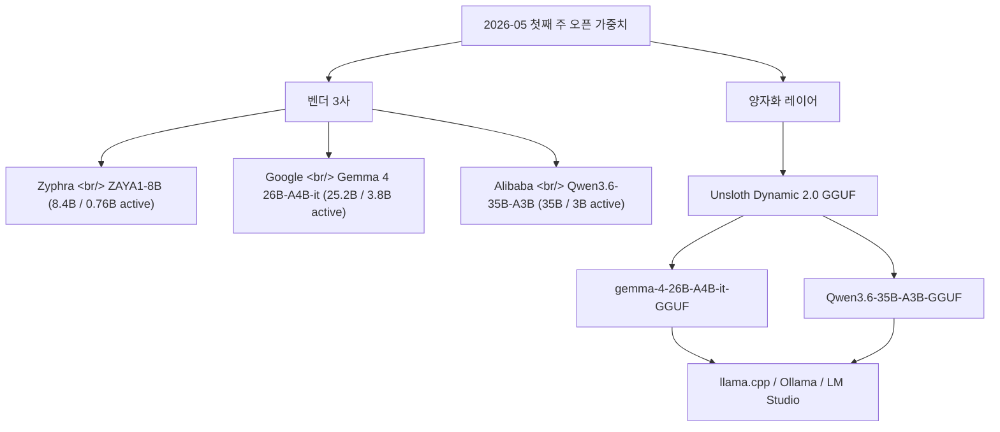
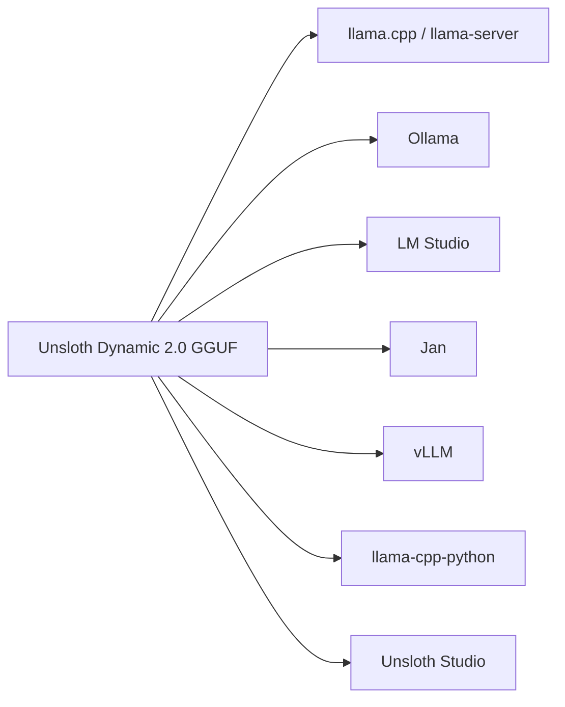

## 개요

2026년 5월 첫째 주는 오픈 가중치 진영에서 의외로 큰 한 주였다. [Zyphra](https://www.zyphra.com/)가 [ZAYA1-8B](https://huggingface.co/Zyphra/ZAYA1-8B)로 760M 활성 파라미터만으로 8B급 추론을 끌어냈고, [Google](https://blog.google/innovation-and-ai/technology/developers-tools/gemma-4/)이 [Gemma 4 26B-A4B-it](https://huggingface.co/google/gemma-4-26B-A4B-it)로 25.2B/3.8B 활성 MoE 멀티모달을 풀었으며, 같은 시기 [Qwen 3.6 35B-A3B](https://huggingface.co/Qwen)가 35B/3B 활성으로 등장했다. 그리고 그 위에 [Unsloth](https://unsloth.ai/)가 며칠 안에 [Gemma 4 GGUF](https://huggingface.co/unsloth/gemma-4-26B-A4B-it-GGUF)와 [Qwen 3.6 GGUF](https://huggingface.co/unsloth/Qwen3.6-35B-A3B-GGUF)를 얹어 [llama.cpp](https://github.com/ggerganov/llama.cpp)·[Ollama](https://ollama.com/)에서 바로 돌아가는 상태로 만들었다. 한 주를 묶어 보면 **"8B–35B급 = MoE, 활성 1–4B, 양자화 동시 출시"** 라는 새 표준이 굳어지는 그림이다.

<!--more-->



## 1. Zyphra ZAYA1-8B — 활성 760M, AMD-네이티브 스택의 첫 결과물

[Zyphra](https://www.zyphra.com/)는 [Zamba-7B](https://www.marktechpost.com/2024/04/17/meet-zamba-7b-zyphras-novel-ai-model-thats-small-in-size-and-big-on-performance/)·[BlackMamba](https://github.com/Zyphra/BlackMamba) 계보를 거쳐, 2024년부터 SSM-attention 하이브리드를 밀어온 회사다. 2025년 6월 [$110M Series A](https://www.zyphra.com/)로 유니콘 라인업에 진입했고, 2026-05-06에 [ZAYA1-8B](https://huggingface.co/Zyphra/ZAYA1-8B)를 풀었다. 베이스 모델은 [ZAYA1-reasoning-base](https://huggingface.co/Zyphra/ZAYA1-reasoning-base)에 별도 공개돼 있다.

핵심 숫자:

| 항목 | 값 |
|---|---|
| 총 파라미터 | 8.4B |
| 활성 파라미터 | **760M** |
| 라이선스 | [Apache 2.0](https://www.apache.org/licenses/LICENSE-2.0) |
| 학습 인프라 | [AMD Instinct MI300X](https://www.amd.com/en/products/accelerators/instinct/mi300/mi300x.html) × 1,024장 + [AMD Pensando Pollara](https://www.amd.com/en/products/networking.html) 네트워킹, [IBM Cloud](https://www.ibm.com/cloud) |
| 기술 보고서 | [arXiv:2605.05365](https://arxiv.org/abs/2605.05365) / [Zyphra 블로그](https://www.zyphra.com/post/zaya1-8b) |

ZAYA1-8B는 [HMMT Feb 2026](https://www.hmmt.org/)에서 71.6, [AIME 2026](https://artofproblemsolving.com/wiki/index.php/AIME_Problems_and_Solutions)에서 89.1을 찍었다. 같은 그래프에서 [Qwen3-4B](https://huggingface.co/Qwen/Qwen3-4B)는 77.5, [Gemma-4-E4B](https://huggingface.co/google/gemma-4-E4B-it)는 50.3이다. **활성 1B 미만 모델이 4B급을 이긴다는 게 ZAYA1의 주장이고, 이것이 가능한 이유는 추론 후처리(post-training reasoning)와 SSM-MoE 하이브리드의 결합**이다. 배포는 [Zyphra 포크 vLLM](https://github.com/Zyphra/vllm) 한 줄로 끝나도록 패키징돼 있다.

```bash
pip install "vllm @ git+https://github.com/Zyphra/vllm.git@zaya1-pr"
vllm serve Zyphra/ZAYA1-8B --port 8010 \
   --mamba-cache-dtype float32 --dtype bfloat16 \
   --reasoning-parser qwen3 --enable-auto-tool-choice --tool-call-parser zaya_xml
```

AMD 진영에서 처음으로 "[NVIDIA H100](https://www.nvidia.com/en-us/data-center/h100/) 없이 end-to-end로 학습된 reasoning SOTA급 모델"을 내놓았다는 게 가장 큰 산업적 의미다. [VentureBeat 보도](https://venturebeat.com/technology/meet-zaya1-8b-a-super-efficient-open-reasoning-model-trained-on-amd-instinct-mi300-gpus/)와 [HPCWire 기사](https://www.hpcwire.com/aiwire/2026/05/07/zyphra-releases-zaya1-8b-reasoning-model/) 모두 이 점을 강조한다.

## 2. Gemma 4 26B-A4B-it — Google의 MoE 멀티모달

[Google DeepMind](https://deepmind.google/)의 [Gemma](https://ai.google.dev/gemma) 시리즈는 [Gemma 1](https://blog.google/technology/developers/gemma-open-models/) (2024-02) → [Gemma 2](https://blog.google/technology/developers/google-gemma-2/) → [Gemma 3](https://blog.google/technology/developers/gemma-3/) → [Gemma 4](https://blog.google/innovation-and-ai/technology/developers-tools/gemma-4/)로 빠르게 세대를 갈아왔다. [Gemma 4 26B-A4B-it](https://huggingface.co/google/gemma-4-26B-A4B-it)는 이번 세대에서 **첫 공식 MoE 라인업**이다.

| 항목 | 값 |
|---|---|
| 총 파라미터 | 25.2B |
| 활성 파라미터 | **3.8B** |
| 전문가 | 128개 중 8 활성 + 1 공유 |
| 레이어 | 30 |
| 컨텍스트 | 256K 토큰 |
| 어휘 | 262K |
| 모달리티 | 텍스트 + 이미지 (가변 해상도) |
| 학습 데이터 컷오프 | 2025-01 |
| 다국어 | 140+ 학습, 35+ 지원 |
| 라이선스 | [Apache 2.0](https://www.apache.org/licenses/LICENSE-2.0) |

아키텍처 디테일이 흥미롭다. **local sliding window attention(1024) + 마지막 레이어 global attention**, 글로벌 레이어에선 KV를 unify, 그리고 [p-RoPE](https://arxiv.org/abs/2306.15595) 변형으로 256K 컨텍스트를 끌어 올렸다. 멀티모달 인코더는 약 550M, 비전 토큰 예산을 70/140/280/560/1120 중에 골라서 latency-quality 트레이드오프를 노출한다.

벤치마크 (instruct):

| 벤치 | 점수 |
|---|---|
| [MMLU Pro](https://github.com/TIGER-AI-Lab/MMLU-Pro) | 82.6 |
| [AIME 2026](https://artofproblemsolving.com/wiki/index.php/AIME_Problems_and_Solutions) (no tools) | 88.3 |
| [LiveCodeBench v6](https://livecodebench.github.io/) | 77.1 |
| [GPQA Diamond](https://github.com/idavidrein/gpqa) | 82.3 |
| [MMMU Pro](https://mmmu-benchmark.github.io/) | 73.8 |
| [Codeforces ELO](https://codeforces.com/) | 1718 |

[Gemma 4 도큐먼트](https://ai.google.dev/gemma/docs/core)는 `enable_thinking=True` 옵션과 multi-turn에서 thinking 블록 제외 권장을 명시한다. 같은 주에 풀린 [LiteRT-LM v0.11.0](https://github.com/google-ai-edge/LiteRT-LM/releases/tag/v0.11.0)이 Gemma 4용 [MTP(Multi-token Prediction)](https://blog.google/innovation-and-ai/technology/developers-tools/multi-token-prediction-gemma-4/)를 모바일 GPU에서 2× 가속한다는 점까지 묶어서 보면, Google은 **클라우드 가중치 + 엣지 런타임 + 디코드 가속**을 한 분기에 다 챙긴 그림이다.

## 3. Qwen 3.6 35B-A3B — 256개 전문가, 1M 컨텍스트

[Alibaba Qwen 팀](https://huggingface.co/Qwen)은 [Qwen2](https://qwenlm.github.io/blog/qwen2/) → [Qwen2.5](https://qwenlm.github.io/blog/qwen2.5/) → [Qwen3](https://qwenlm.github.io/blog/qwen3/) → Qwen3.5 → Qwen3.6으로 6개월 단위 릴리스를 유지하는 중이다. [Qwen 3.6 35B-A3B](https://huggingface.co/unsloth/Qwen3.6-35B-A3B-GGUF) 카드를 보면 MoE 설계가 이번 세대에서 가장 공격적이다.

| 항목 | 값 |
|---|---|
| 총 파라미터 | 35B |
| 활성 파라미터 | **3B** |
| 전문가 수 | **256개** (Routed 8 + Shared 1) |
| 레이어 | 40 |
| 히든 차원 | 2048 |
| 컨텍스트 | 262K 네이티브 / **[YaRN](https://arxiv.org/abs/2309.00071)으로 1,010K** |

어텐션 레이아웃이 독특하다 — `10 × (3 × (Gated DeltaNet → MoE) → 1 × (Gated Attention → MoE))` 구조다. [Gated DeltaNet](https://arxiv.org/abs/2412.06464)이 32 V-head / 16 QK-head / 128 head-dim, gated attention이 16 Q-head / 2 KV-head / 256 head-dim. **Mamba/DeltaNet 계열 linear-time mixer를 3:1로 attention과 섞은 하이브리드** — 컨텍스트가 길수록 비용 우위가 커지는 설계다.

벤치마크:
- [SWE-bench Verified](https://www.swebench.com/) 73.4
- [MMLU-Pro](https://github.com/TIGER-AI-Lab/MMLU-Pro) 85.2
- [LiveCodeBench v6](https://livecodebench.github.io/) 80.4
- [MMMU](https://mmmu-benchmark.github.io/) 81.7 (비전)

권장 추론 엔진은 [SGLang ≥0.5.10](https://github.com/sgl-project/sglang) / [vLLM ≥0.19.0](https://github.com/vllm-project/vllm) / [KTransformers](https://github.com/kvcache-ai/ktransformers)다.

## 4. 같은 클래스 묶어 보기

세 모델을 같은 표에 놓으면 "8B–35B 클래스 = MoE" 가 더 또렷해진다.

| 모델 | 총 / 활성 | 전문가 | 컨텍스트 | 멀티모달 | 학습 인프라 |
|---|---|---|---|---|---|
| [ZAYA1-8B](https://huggingface.co/Zyphra/ZAYA1-8B) | 8.4B / 0.76B | — (SSM-MoE) | 미공개 | 텍스트 | AMD MI300X × 1,024 |
| [Gemma 4 26B-A4B-it](https://huggingface.co/google/gemma-4-26B-A4B-it) | 25.2B / 3.8B | 128 (8+1) | 256K | 텍스트+이미지 | [TPU](https://cloud.google.com/tpu) (Google 내부) |
| [Qwen 3.6 35B-A3B](https://huggingface.co/unsloth/Qwen3.6-35B-A3B-GGUF) | 35B / 3B | 256 (8+1) | 262K → 1M | 텍스트+이미지 | Alibaba 내부 |

활성 파라미터가 모두 **0.76B / 3B / 3.8B**로 압축돼 있다는 점이 핵심이다. 추론 시 메모리 대역폭과 연산 둘 다 4B급에 맞춰져 있어서, **VRAM 24GB 한 장에서 35B급 가중치를 4-bit로 굴리는 시나리오가 일반 워크플로**가 된다.

## 5. Unsloth의 양자화 동시 출시

[Unsloth](https://unsloth.ai/)가 [Dynamic 2.0 GGUF](https://unsloth.ai/blog/dynamic-v2) 방식으로 베이스 모델 공개 며칠 안에 양자화를 푼다. 핵심 아이디어는 **레이어마다 다른 양자화 타입을 동적으로 선택**해서, 같은 파일 크기(Q4_K_M)에서 Q5_K_M에 더 가까운 정확도를 뽑아내는 것. KL Divergence가 [imatrix](https://github.com/ggml-org/llama.cpp/pull/4861)·[QAT](https://arxiv.org/abs/1712.05877) 대비 낮다는 게 [Unsloth 벤치마크](https://unsloth.ai/docs/basics/unsloth-dynamic-2.0-ggufs)의 주장이다.

[gemma-4-26B-A4B-it-GGUF](https://huggingface.co/unsloth/gemma-4-26B-A4B-it-GGUF)의 양자화 라인업:

| 타깃 VRAM | 추천 양자화 | 파일 크기 |
|---|---|---|
| 12GB 클래스 | UD-IQ2_M / UD-Q2_K_XL | 10.0–10.5 GB |
| 16GB 클래스 | UD-IQ3_XXS / UD-Q3_K_M | 11.4–12.7 GB |
| 24GB 클래스 | UD-Q4_K_M / MXFP4_MOE | 16.6–16.9 GB |
| 32GB 클래스 | UD-Q5_K_M | 21.2 GB |
| 48GB+ 워크스테이션 | UD-Q8_K_XL / BF16 | 27.6–50.5 GB |

[Qwen3.6-35B-A3B-GGUF](https://huggingface.co/unsloth/Qwen3.6-35B-A3B-GGUF)도 동일한 사다리를 따라간다 — 1-bit `UD-IQ1_M`(10 GB)부터 BF16(69.4 GB)까지. **35B 모델이 10 GB에 들어간다**는 게 인상적이다.

런타임 매트릭스:



```bash
# llama.cpp
brew install llama.cpp
llama-server -hf unsloth/gemma-4-26B-A4B-it-GGUF:UD-Q4_K_M

# Ollama
ollama run hf.co/unsloth/gemma-4-26B-A4B-it-GGUF:UD-Q4_K_M
```

## 6. 앱 개발자 관점에서 — FP16 레퍼런스가 아니라 양자화 티어를 타깃하라

이 한 주의 진짜 시사점은 모델 사양이 아니라 **배포 경로**다.

1. **MoE는 더 이상 옵션이 아니다.** 8B–35B 클래스의 새 모델은 사실상 전부 MoE다. 추론 스택이 MoE-aware 커널 (sparse expert dispatch, batched MoE GEMM)을 지원하지 않으면 활성 파라미터의 이점을 못 살린다. [vLLM](https://github.com/vllm-project/vllm)·[SGLang](https://github.com/sgl-project/sglang)·[llama.cpp](https://github.com/ggerganov/llama.cpp) 모두 이미 MoE 경로를 갖췄으니, 직접 짠 추론 코드라면 갈아탈 시점이다.

2. **FP16/BF16 레퍼런스를 타깃하지 마라.** 실제 사용 환경의 90%는 [Q4_K_M](https://huggingface.co/docs/hub/gguf) 또는 [MXFP4](https://www.microsoft.com/en-us/research/blog/mxfp4-bringing-fp4-precision-to-deep-learning/)다. 평가는 양자화 후 가중치로 다시 돌려야 의미가 있다. [Unsloth Dynamic 2.0](https://unsloth.ai/docs/basics/unsloth-dynamic-2.0-ggufs) 같은 selective quantization 덕에 양자화 손실은 줄었지만 0은 아니다.

3. **컨텍스트 256K–1M가 기본값이 됐다.** [YaRN](https://arxiv.org/abs/2309.00071) 같은 확장을 적용해도 KV cache 메모리가 폭증한다 — 24GB 카드에서 Qwen 3.6 35B-A3B를 1M 컨텍스트로 굴리면 가중치보다 KV cache가 더 무겁다. [paged attention](https://blog.vllm.ai/2023/06/20/vllm.html)·[prefix caching](https://docs.vllm.ai/en/latest/automatic_prefix_caching/apc.html)·context pruning을 디폴트로 깔고 가야 한다.

4. **벤더 락-인이 사라지는 중.** AMD MI300X에서 학습한 ZAYA1, Google TPU에서 학습한 Gemma 4, Alibaba 내부 클러스터의 Qwen 3.6 — 모두 같은 HF 카드 포맷으로 풀린다. 학습 인프라는 점점 다양해지는데 추론 인프라(llama.cpp + Ollama + vLLM)는 한 줄로 통일된다.

## 인사이트

2026년 5월 첫째 주는 작은 분기점이다. **활성 파라미터 1B–4B / 총 8B–35B / MoE / 양자화 동시 출시** 라는 네 항목이 동시에 표준으로 굳어졌다. ZAYA1-8B는 AMD-네이티브 스택이 NVIDIA 없이도 reasoning SOTA를 만들 수 있음을, Gemma 4 26B-A4B-it는 멀티모달 + 256K 컨텍스트가 26B급 MoE로 내려왔음을, Qwen 3.6 35B-A3B는 256개 전문가 + DeltaNet 하이브리드 + 1M 컨텍스트가 가능함을 보였다. Unsloth가 며칠 안에 GGUF를 올린 덕에 한국 개발자도 24GB VRAM 한 장 또는 32GB 통합 메모리 노트북 한 대로 세 모델을 모두 굴려볼 수 있다. **앱 개발자 입장에서 진짜 행동 항목은 단순하다 — 양자화 티어(UD-Q4_K_M)를 평가 기준으로 박고, 추론 스택은 MoE-aware로 맞추고, 컨텍스트 예산은 256K가 아니라 KV cache로 다시 계산하라.** 6월에 새 모델이 또 나와도 같은 형판이 계속 굴러갈 가능성이 높다.

## 참고

**모델 카드**
- [Zyphra/ZAYA1-8B](https://huggingface.co/Zyphra/ZAYA1-8B) · [ZAYA1-reasoning-base](https://huggingface.co/Zyphra/ZAYA1-reasoning-base) · [Zyphra 컬렉션](https://huggingface.co/Zyphra)
- [google/gemma-4-26B-A4B-it](https://huggingface.co/google/gemma-4-26B-A4B-it) · [Gemma 4 docs](https://ai.google.dev/gemma/docs/core) · [Gemma 4 launch blog](https://blog.google/innovation-and-ai/technology/developers-tools/gemma-4/)
- [unsloth/gemma-4-26B-A4B-it-GGUF](https://huggingface.co/unsloth/gemma-4-26B-A4B-it-GGUF) · [unsloth/Qwen3.6-35B-A3B-GGUF](https://huggingface.co/unsloth/Qwen3.6-35B-A3B-GGUF) · [Unsloth Dynamic 2.0 Quants 컬렉션](https://huggingface.co/collections/unsloth/unsloth-dynamic-20-quants)

**기술 보고서 / 블로그**
- [Zyphra: ZAYA1-8B 블로그](https://www.zyphra.com/post/zaya1-8b) · [ZAYA1 arXiv](https://arxiv.org/abs/2605.05365)
- [Google: Multi-token Prediction for Gemma 4](https://blog.google/innovation-and-ai/technology/developers-tools/multi-token-prediction-gemma-4/)
- [Unsloth: Dynamic v2.0 GGUFs](https://unsloth.ai/blog/dynamic-v2) · [Dynamic 2.0 문서](https://unsloth.ai/docs/basics/unsloth-dynamic-2.0-ggufs)
- [VentureBeat: ZAYA1-8B on MI300X](https://venturebeat.com/technology/meet-zaya1-8b-a-super-efficient-open-reasoning-model-trained-on-amd-instinct-mi300-gpus/) · [HPCWire: Zyphra Releases ZAYA1-8B](https://www.hpcwire.com/aiwire/2026/05/07/zyphra-releases-zaya1-8b-reasoning-model/) · [HotHardware: AMD Zyphra GPU Cluster](https://hothardware.com/news/amd-zyphra-gpu-cluster-gives-birth-zaya-1-moe-ai-model)

**런타임 / 추론 스택**
- [llama.cpp](https://github.com/ggerganov/llama.cpp) · [Ollama](https://ollama.com/) · [LM Studio](https://lmstudio.ai/) · [Jan](https://jan.ai/) · [Unsloth Studio](https://unsloth.ai/)
- [vLLM](https://github.com/vllm-project/vllm) · [SGLang](https://github.com/sgl-project/sglang) · [KTransformers](https://github.com/kvcache-ai/ktransformers)
- [Zyphra vLLM fork](https://github.com/Zyphra/vllm)

**관련 배경**
- [YaRN paper](https://arxiv.org/abs/2309.00071) · [Gated DeltaNet paper](https://arxiv.org/abs/2412.06464) · [Speculative decoding](https://arxiv.org/abs/2211.17192)
- [Zamba-7B (Zyphra 이전 모델)](https://www.marktechpost.com/2024/04/17/meet-zamba-7b-zyphras-novel-ai-model-thats-small-in-size-and-big-on-performance/) · [BlackMamba](https://github.com/Zyphra/BlackMamba)
