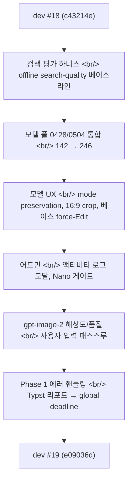
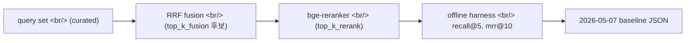
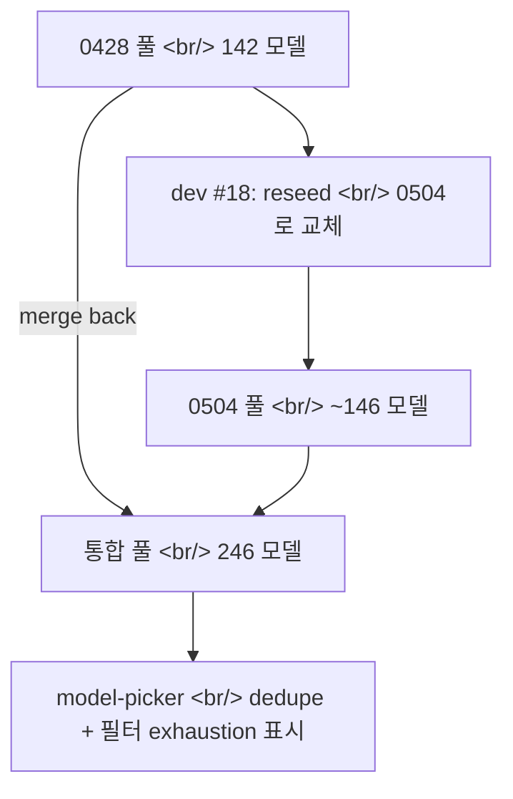
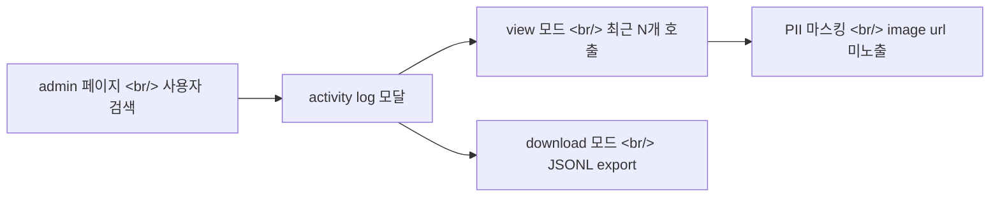
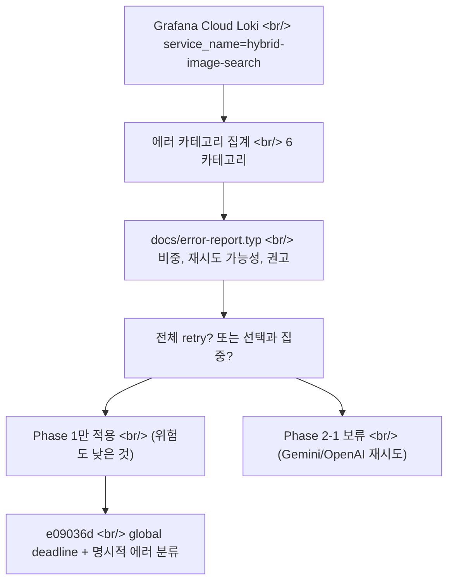

## 개요

[이전 글: #18 — gpt-image-2 합류, 모델/제품 라이브러리, 권한 분리](/posts/2026-05-07-hybrid-search-dev18/)에서 사이드 B로 OpenAI를 라우팅하기 시작했다면, #19는 그 결정의 부작용을 다듬는 사이클이었다. 21개 커밋, 다섯 PR(#20–#24), 그리고 마지막 날에는 Grafana Cloud Loki 로그로 만든 Typst PDF 에러 리포트가 결국 코드 변경을 이끌었다.

<!--more-->



이번 사이클의 핵심 질문은 **"비교 사이드 B가 production에서 실패하기 시작했을 때, 무엇을 재시도하고 무엇을 빠르게 포기할 것인가."** 그 결정은 마지막 커밋에 가장 또렷하게 박혔다.

---

## 검색 평가 하니스: top_k_fusion=64 기각

dev #19의 첫 그룹은 검색 사이드의 평가 인프라였다. 그동안은 reranker 변경이나 fusion 파라미터를 production에서 직접 시험했다 — 정성적 인상은 있지만 정량 지표는 없었다.



핵심 커밋:

- **`feat(eval): offline search-quality harness + 2026-05-07 baseline`** — query set + ground truth + RRF→rerank 파이프라인을 CLI로 묶었다. baseline JSON을 repo에 박아 future 비교의 기준선으로 사용.
- **`docs(search): top_k_fusion=64 evaluated and rejected — eval harness wins`** — 직관적으로 fusion 후보를 더 넓게 보면 좋을 거 같아서 64를 시도했지만 harness 결과 +0.2% gain. 비용(reranker GPU 시간 +30%) 대비 무의미. **하니스가 직관을 이긴 첫 사례**라서 docs에 못 박았다.
- **`feat(search): request-level OTel span attrs + reranker-doc cleanup`** — 트레이싱에 query, fusion candidates, rerank scores를 attrs로 attach. 다음 사이클의 분석 인프라가 되었다.

---

## 모달 portaling: `position:fixed`를 viewport에 박아두기

작은 버그지만 의외로 부수 효과가 컸다. 모달이 부모의 `transform: ...` 컨텍스트 안에 있어서 `position: fixed`가 부모 기준으로 위치를 잡는 문제. CSS spec상 `transform`이 걸린 부모는 fixed의 containing block을 본인 영역으로 만든다.

```tsx
// before — 모달이 ImagePanel 안에서 렌더
function ImagePanel() {
  return (
    <div style={{ transform: "translateZ(0)" }}> {/* GPU 레이어 강제 */}
      {showModal && <Modal />}
    </div>
  );
}

// after — Portal로 body 직접 마운트
import { createPortal } from "react-dom";

function ImagePanel() {
  return (
    <>
      <div style={{ transform: "translateZ(0)" }}>...</div>
      {showModal && createPortal(<Modal />, document.body)}
    </>
  );
}
```

커밋 메시지(`fix: portal modals to body so position:fixed pins to viewport`) 그대로다. 한 줄짜리 버그처럼 보였지만 사이드 이펙트가 두 개 — 모달 z-index 재설정 + `onClose` 클릭 outside 감지 로직 수정.

---

## 모델 풀: 0428과 0504를 한 풀로 합치기 (142 → 246)

dev #18 마지막에 0428 풀을 0504로 reseed했다 (folder-hint 라벨 포함). 4월 28일자 카탈로그를 5월 4일자로 갈아치운 셈. 그런데 사용자 피드백이 빠르게 왔다 — "이전 풀에서 잘 쓰던 모델들이 사라졌어."



두 커밋이 이 흐름을 마무리했다:

- **`feat(models): merge 0428 pool back into 0504 model pool (142 -> 246)`** — 풀을 합쳐서 사용자가 둘 다 접근 가능하게. 중복 제거 후 246개로 안착.
- **`feat(model-picker): dedupe re-picks and surface filter exhaustion`** — 같은 사용자에게 같은 모델을 두 번 추천하지 않도록 dedupe. 필터를 너무 좁히면 후보가 0이 되는데, 그 경우 UI에 "더 이상 후보 없음 — 필터를 풀어보세요" 메시지를 surface.

---

## 모델 UX: mode preservation, 16:9 crop, 베이스 force-Edit

PR #20–#22가 이 묶음이었다. 핵심 결정 세 개:

**(1) 라이브러리 패널을 닫아도 generation mode 유지.** dev #18까지는 라이브러리 패널을 닫으면 mode가 `auto`로 reset되었다. 사용자는 "방금 Edit 모드를 골랐는데 왜 닫으면 풀리지?"라고 했다. 명시적 선택은 명시적 변경으로만 풀어야 한다.

```tsx
// frontend/lib/state.ts
- const closeLibrary = () => {
-   setLibraryPanelCollapsed(false);
-   setActiveLibraryTab(null);
-   resetInjectionMode(); // ← 제거
- };
+ const closeLibrary = () => {
+   setLibraryPanelCollapsed(false);
+   setActiveLibraryTab(null);
+ };
```

그리고 별개 커밋(`fix(generation): reset injection mode to auto when closing library panel`)로 정확히 라이브러리 패널 닫는 경우 한정으로 reset이 명시되었다. 두 커밋이 같은 결정을 양 끝에서 묶었다 — 의도하지 않은 reset은 제거하고, 의도된 reset만 명시한다.

**(2) gpt-image-2의 16:9 crop.** gpt-image-2는 출력 비율이 `1024x1024`, `1024x1536`, `1536x1024` 셋뿐이다. 사용자가 16:9를 선택해도 백엔드는 1536x1024를 받는다. 그래서 UI에서 prediction box를 16:9로 그리고, 결과를 받으면 center-crop으로 16:9로 잘라서 보여준다.

**(3) "베이스" 버튼이 강제로 Edit 모드 진입.** detail 화면에서 베이스 모델 버튼을 누르면 inheriting source mode가 아니라 Edit 모드로 들어가야 한다. 그 외 경로(자동 인젝션, 모델 픽커)는 auto로 들어간다.

뒤이은 커밋 `fix(generation): tighten model auto-injection + require base for Edit mode`가 이 룰을 백엔드까지 강제 — Edit 모드 요청에 base 이미지가 없으면 422 reject.

---

## 어드민: 액티비티 로그 모달, Nano 모드 게이트

PR #21과 #24는 내부 운영용 기능이었다.

**Activity log 모달** — 어드민이 특정 사용자의 최근 generate 호출을 viewer/다운로드 가능. 디버깅 + 베타 테스터 지원에 필수.



**Nano Only 모드** — 새로운 admin allowlist 패턴. 특정 어드민 사용자(`khk@diffs.studio`)는 "Nano Only" 모드에서 비용 절감된 작은 모델만 호출 가능. Production 비용 제어 + 시연/데모용 안전 모드.

---

## gpt-image-2 해상도/품질 패스스루

오늘(2026-05-11) 첫 커밋은 작지만 production 영향이 컸다.

`feat(generation): pass user resolution + quality to gpt-image-2` — 그동안 백엔드는 사용자가 선택한 resolution/quality를 무시하고 default(`1024x1024`, `quality=auto`)로 호출했다. 사용자가 "고해상도 16:9"를 골라도 결과는 1024 정사각형. UI에 setter가 있지만 백엔드 와이어링이 빠져있었다.

```python
# backend/openai_service.py
- def _pick_size(aspect: str) -> str:
-     return "1024x1024"  # 항상 정사각형 ← 임시값이 굳어있던 것
+ def _pick_size(aspect: str, requested_quality: str) -> str:
+     # gpt-image-2 hard-limits output to 1024x1024 / 1024x1536 / 1536x1024
+     # (max ~3:2). The size mapper picks the closest valid output.
+     if aspect == "16:9" or aspect == "21:9":
+         return "1536x1024"
+     if aspect == "9:16":
+         return "1024x1536"
+     return "1024x1024"
```

`b5a0ede — fix(generation-feed): keep each card at its A-image's natural aspect`도 같은 맥락. generation feed의 카드 그리드가 사이드 A(Gemini, 더 유연한 비율)의 비율을 따라가도록 수정.

---

## Phase 1 에러 핸들링: Grafana Loki → Typst → 코드 결정

이번 사이클에서 가장 흥미로운 흐름은 마지막 세션(109분, `1358feee`)이었다. Grafana Cloud Loki에서 최근 7일치 image generation 에러 로그를 뽑고, Typst로 PDF 리포트를 만든 다음, **그 리포트의 권고대로** 코드를 고친다.



리포트에서 사용자가 했던 정확한 질문이 결정을 만들었다:

> **"재시도 로직을 단순 적용한다면 해당 시간대의 이미지 생성 호출에도 영향을 줄 수 있지 않아?"**

그 통찰은 리포트 v2에 들어갔다. 만약 #1(Gemini 503)과 #2(OpenAI 자체 retry)에 추가로 #3(Gemini → OpenAI fallback)까지 동시에 켜면, 한 사용자가 최악의 경우 두 API의 retry 곱셈을 한 번에 받는다. 그러면 thundering herd처럼 발생 시간대의 처리량이 무너진다.

**결정: Phase 1만 적용. 위험도 낮은 것 — 명시적 에러 분류 + global deadline.**

```python
# backend/service.py — global deadline 패턴
async def generate_with_deadline(*args, deadline_s: float = 60.0):
    try:
        return await asyncio.wait_for(
            _generate_inner(*args),
            timeout=deadline_s,
        )
    except asyncio.TimeoutError:
        raise GenerationError(
            kind="timeout",
            retriable=False,  # ← user 입장에서는 fresh request로 다시 시도
            message="Image generation exceeded 60s deadline",
        )
    except gemini.ServerError as e:  # 503 류
        raise GenerationError(kind="upstream-503", retriable=False, ...)
    except openai.APIError as e:
        raise GenerationError(kind="openai-api", retriable=False, ...)
```

**의도된 design choice**: retriable=False로 통일. 백엔드는 재시도하지 않고, 사용자가 명시적으로 새 요청을 보낸다. 이게 phase 1의 안전 boundary다. Phase 2에서 어떤 카테고리에 한해 자동 retry를 부활시킬지는 Loki 데이터를 1-2주 더 모은 뒤에 결정한다.

---

## 커밋 로그

| 메시지 | 변경 영역 |
|---|---|
| chore: reseed model pool from 0428 to 0504 with folder-hint labels | data/model_pool/\*.json |
| fix: portal modals to body so position:fixed pins to viewport | frontend/components/Modal.tsx |
| feat(search): request-level OTel span attrs + reranker-doc cleanup | backend/search/\*.py, observability |
| feat(eval): offline search-quality harness + 2026-05-07 baseline | scripts/eval/, eval/baselines/\*.json |
| docs(search): top_k_fusion=64 evaluated and rejected — eval harness wins | docs/decisions/ |
| feat(models): merge 0428 pool back into 0504 model pool (142 -> 246) | data/model_pool/ |
| feat(ui): mode preservation, larger model preview, GPT 16:9 crop, model name in detail | frontend (PR #20) |
| feat(admin): user activity log modal with view/download | backend/admin/, frontend/admin/ (PR #21) |
| feat(model-picker): dedupe re-picks and surface filter exhaustion | frontend/components/ModelPicker.tsx |
| fix(generation): reset injection mode to auto when closing library panel | frontend/lib/state.ts |
| fix(detail): 베이스 button forces Edit mode instead of inheriting source mode | frontend (PR #22) |
| fix(generation): tighten model auto-injection + require base for Edit mode | backend/generation/, frontend (PR #23) |
| feat(admin): Nano Only mode + add khk@diffs.studio to admin allowlist | backend/auth/, admin (PR #24) |
| feat(generation): pass user resolution + quality to gpt-image-2 | backend/openai_service.py |
| fix(generation-feed): keep each card at its A-image's natural aspect | frontend/components/GenerationFeed.tsx |
| fix(generation): harden error handling (Phase 1 + global deadline) | backend/service.py, docs/error-report.typ |

---

## 인사이트

**(1) 평가 하니스는 한 번 baseline을 박으면 직관을 이긴다.** top_k_fusion=64 기각 사례는 dev #19에서 가장 작은 코드 변경 (docs 한 파일)이지만 가장 큰 process 변경이다. 이제부터 search 사이드 파라미터 변경은 baseline JSON 대비 측정해야 한다.

**(2) 모달 portaling 같은 작은 CSS 결함은 production 데이터로만 잡힌다.** `transform: translateZ(0)`로 GPU 레이어를 강제한 결정 자체는 잘못이 아니었다. 다만 그 결정이 `position: fixed`의 containing block을 바꾼다는 사실은 React DevTools로는 안 보이고 실제 브라우저에서 모달이 어긋난 순간에야 드러났다.

**(3) Grafana Loki → Typst → 코드 결정의 흐름이 의외로 강력했다.** 평소엔 대시보드를 보고 patch를 푸는데, 이번엔 7일치 로그를 카테고리별로 묶고 PDF 리포트로 정리한 다음 코드를 손댔다. 보고서를 만드는 과정이 곧 design doc이 되었다 — "Phase 1만 적용, Phase 2 보류"라는 의사결정이 리포트 본문에 박혀있다.

**(4) Production 에러 대응의 첫 룰은 "재시도를 함부로 늘리지 않기".** 한 곳의 retry는 안전해 보이지만, 두 곳이 곱해지면 thundering herd가 된다. 사용자가 직접 던진 질문이 이 결론으로 가는 길을 잡아냈다.

다음 사이클 #20은 Phase 2 — Loki 1-2주치 데이터로 Gemini 503의 순수 발생 빈도를 측정한 뒤 카테고리별 selective retry 정책을 결정한다.
