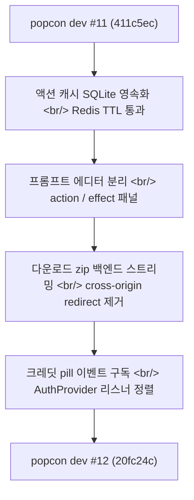
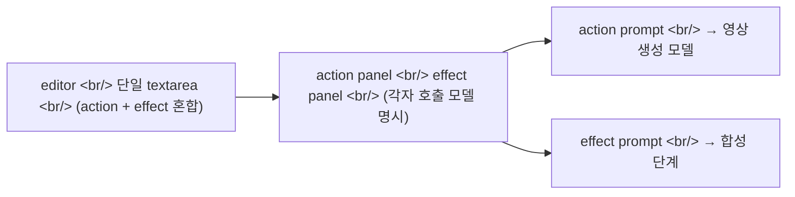

## 개요

[이전 글: #11 — 크레딧 시스템, R2 마이그레이션, ToonOut, brutal 리디자인](/posts/2026-05-07-popcon-dev11/)을 쓰고 나흘 동안, popcon에는 다섯 커밋이 들어갔다. 굵직한 마일스톤은 없지만 운영 중 발견된 작은 균열을 메우는 작업이었다 — 액션 캐시가 Redis TTL을 넘기지 못해 사라지는 문제, 프롬프트 에디터의 두 책임이 한 컴포넌트에 묶여있던 문제, 다운로드 zip이 크로스 오리진 리디렉트에서 깨지는 문제, 그리고 헤더의 크레딧 pill이 새로고침 없이는 갱신되지 않는 문제.

<!--more-->



다섯 커밋이지만 네 가지 패턴이 반복된다 — **"production에서 한 번 살아남으면, 짧은 코드라도 모서리가 드러난다."**

---

## 액션 캐시: Redis TTL을 넘어 SQLite로 영속화

popcon의 worker는 각 이모티콘 액션(흔들기, 윙크 등)에 대해 마스킹/합성 결과를 Redis에 캐시한다. 그런데 R2 마이그레이션 직후 production에서 TTL 만료 직후 같은 액션을 재호출하면 풀 파이프라인이 다시 도는 사례가 잡혔다.

원인은 단순하다. Redis는 메모리 캐시고, TTL은 비용 제약상 24시간 미만으로 짧다. 사용자 워크플로 자체가 며칠 걸리는 경우(베타 테스터가 주말 사이 다시 들어오는 패턴)에는 캐시 미스가 발생할 수밖에 없다.

해결책: Redis는 핫 캐시로 두고, SQLite를 cold tier로 추가한다.

```python
# backend/cache.py — 2-tier 캐시 어댑터
class ActionCache:
    def __init__(self, redis: Redis, sqlite_path: Path):
        self.redis = redis
        self.sqlite = SQLitePersistor(sqlite_path)

    async def get(self, key: str) -> bytes | None:
        if (hot := await self.redis.get(key)) is not None:
            return hot
        if (cold := self.sqlite.get(key)) is not None:
            # 다시 hot으로 끌어올림
            await self.redis.set(key, cold, ex=self.ttl)
            return cold
        return None

    async def set(self, key: str, value: bytes) -> None:
        await self.redis.set(key, value, ex=self.ttl)
        self.sqlite.set(key, value)
```

커밋은 한 줄짜리 메시지 (`fix(worker): persist action cache to SQLite to survive Redis TTL`) 였지만, 디스크 사용량 모니터링 알람을 함께 추가해야 했다. SQLite는 무제한 늘어나면 워커 디스크가 가득 차므로 LRU eviction을 worker side에서 cron으로 돌린다.

---

## 프롬프트 에디터: action / effect 분리

popcon editor에는 사용자가 직접 프롬프트를 수정하는 패널이 있다. 한 컴포넌트 안에 두 가지가 섞여 있었다:

1. **Action prompt** — 캐릭터의 동작(흔든다, 점프한다)
2. **Effect prompt** — 시각 효과(글로우, 별 반짝임)

UX적으로는 두 입력이 서로 다른 모델 호출에 들어간다 — action은 영상 생성 모델, effect는 합성 단계. 한 textarea에 두 가지를 섞으면 사용자가 어느 부분이 어디로 가는지 알기 어렵고, prompt template도 if-else로 분기해야 했다.



리팩터 중 부수 작업으로 `end_prompt` 필드도 걷어냈다 — 더 이상 사용하지 않는 레거시 키워드였다. 5개의 motion_effects 프리셋에 붙어 있던 redundant `Existing` 접두사도 같이 제거했다 (`fix(presets): drop redundant 'Existing' prefix`).

---

## 다운로드 zip: cross-origin redirect에서 backend 스트리밍으로

이게 오늘의 메인 사건이었다. 사용자가 "Download all emojis (zip)" 버튼을 누르면 "failed to fetch" 에러가 났다.

기존 흐름:
1. 프런트 → `/api/job/{id}/download` 호출
2. 백엔드 → R2 presigned URL로 302 리디렉트
3. 브라우저 → R2로 직접 다운로드

문제는 step 2. R2 presigned URL은 cross-origin이고, 브라우저는 자격 증명 쿠키가 붙은 fetch에서는 cross-origin 리디렉트를 따라가지 않는다. 정확히는 `credentials: 'include'` + redirect to different origin = CORS 미스매치.

해결책: **백엔드를 zip의 프록시 스트리머로 만든다.**

```python
# backend/storage.py — chunk streaming generator
def stream_object(key: str, chunk_size: int = 64 * 1024):
    """Stream an R2 object as (content_length, async generator) pair."""
    obj = s3_client.get_object(Bucket=R2_BUCKET, Key=key)
    length = obj["ContentLength"]

    async def chunks():
        for chunk in obj["Body"].iter_chunks(chunk_size):
            yield chunk

    return length, chunks()

# backend/main.py — StreamingResponse로 zip 패스스루
@app.get("/api/job/{job_id}/download")
async def download_job(job_id: str, user: CurrentUser = Depends(current_user_required)):
    _assert_can_access(job_id, user)
    key = _zip_key_for(job_id)
    length, gen = stream_object(key)
    return StreamingResponse(
        gen,
        media_type="application/zip",
        headers={
            "Content-Length": str(length),
            "Content-Disposition": f'attachment; filename="popcon-{job_id}.zip"',
        },
    )
```

`StreamingResponse`는 메모리에 전체 zip을 올리지 않고 64KB 청크로 흘려보낸다. 또 동일 오리진이라 쿠키/CORS 문제도 사라진다. 비용 트레이드오프는 명확하다 — 다운로드 트래픽이 fly.io egress를 한 번 더 통과한다. 하지만 zip 평균 크기가 수 MB 수준이라 현재 단계에서는 무시할 만하다.

테스트도 같이 갱신했다 — 기존 `test_download_object_returns_path`는 더 이상 의미가 없어서 `test_stream_object_yields_chunks_with_length`로 교체했다.

---

## 크레딧 pill: 사라지는 잔액 표시 안정화

다섯 번째 커밋의 모티프는 UI 버그였다. 헤더 우측의 크레딧 잔액 pill이 어떨 때는 표시되고 어떨 때는 안 보였다. 사용자 보고로 알게 된 패턴이었다.

원인은 두 갈래였다.

**(1) AuthProvider의 credits 초기화 타이밍.** `AuthProvider`는 user fetch가 끝난 뒤에야 `getCredits()`를 호출하는데, 그 사이에 `CreditPill` 컴포넌트는 이미 mount되어 `null`을 그린다. `null`이면 아무것도 안 보인다.

**(2) `BALANCE_MAY_CHANGE_EVENT` 구독 누락.** 결제/사용으로 잔액이 바뀌면 `dispatchEvent(new Event(BALANCE_MAY_CHANGE_EVENT))`를 쏘는데, `CreditPill`은 이 이벤트를 구독하지 않고 `AuthProvider`의 props로만 받았다. `AuthProvider`가 refresh되지 않으면 pill도 갱신되지 않는다.

수정:

```tsx
// frontend/components/AuthProvider.tsx
const refreshCredits = useCallback(async () => {
  if (!user) {
    setCredits(null);
    return;
  }
  try {
    setCredits(await getCredits());
  } catch (e) {
    // 잔액 fetch 실패해도 기존 값 유지 — pill이 사라지지 않도록
    console.warn("getCredits failed", e);
  }
}, [user]);

useEffect(() => {
  if (!user) return;
  refreshCredits();  // 초기 1회
  const onBalanceMayChange = () => { refreshCredits(); };
  window.addEventListener(BALANCE_MAY_CHANGE_EVENT, onBalanceMayChange);
  return () => window.removeEventListener(BALANCE_MAY_CHANGE_EVENT, onBalanceMayChange);
}, [user, refreshCredits]);
```

핵심 두 가지:

- **fetch 실패 시 기존 값 유지** — null로 덮어쓰지 않는다. UX적으로 pill이 깜빡이며 사라지는 것보다 stale 표시가 낫다.
- **이벤트 리스너 등록 위치** — `AuthProvider`가 단일 진리원이 되도록, `CreditPill`은 read-only consumer로 남긴다.

---

## 커밋 로그

| 메시지 | 변경 |
|---|---|
| fix(worker): persist action cache to SQLite to survive Redis TTL | backend/cache.py, worker/cron.py |
| refactor(presets): split action/effect, slim scaffolding, drop end_prompt | backend/presets/\*.py, frontend types |
| feat(panel): split prompt editor into action and effect | frontend/components/PromptEditor.tsx |
| fix(presets): drop redundant 'Existing' prefix on 5 motion_effects | data/motion_effects.json |
| fix(download): stream zip through backend, drop cross-origin redirect | backend/storage.py, backend/main.py, tests |

오늘의 마지막 12분짜리 세션에서는 위 다섯 외에 `AuthProvider.tsx` + `CreditPill.tsx` 정렬 작업이 더 들어갔지만, 아직 커밋되지 않은 상태로 #13의 첫 커밋이 될 예정이다.

---

## 인사이트

다섯 커밋이 모두 "production에서 한 번 굴린 뒤 드러난 결함"이라는 패턴을 따랐다. 그러니까 **dev #11까지의 큰 마일스톤은 인프라를 깐 것이고, dev #12는 그 인프라가 진짜 사용자 흐름과 맞물려 돌면서 새는 곳을 찾는 단계다.** 이 단계의 커밋은 메시지가 짧고 변경 라인이 적지만, 디버깅 시간 대비 코드 변경량이 가장 낮은 시기이기도 하다.

특히 zip 다운로드 이슈는 흥미로운 회고가 있었다. R2 마이그레이션 #11 때는 presigned URL을 직접 노출하는 게 "올바른" 패턴이라고 봤다 — 백엔드 대역폭을 절약하니까. 그런데 production 인증 흐름과 부딪히는 순간, 짧고 빠른 패치(백엔드 스트리밍)가 정답이었다. 비용을 절감하려고 추가한 redirection 한 단계가 디버깅 두 시간을 잡아먹었다. **모든 indirection에는 디버깅 비용이 따라온다**는 교훈이 또 한 번.

다음 cycle은 #13에서 — 크레딧 pill 안정화의 두 번째 단계와, 액션 캐시의 SQLite cold tier 사이즈 트래킹 알람부터 시작할 예정이다.
