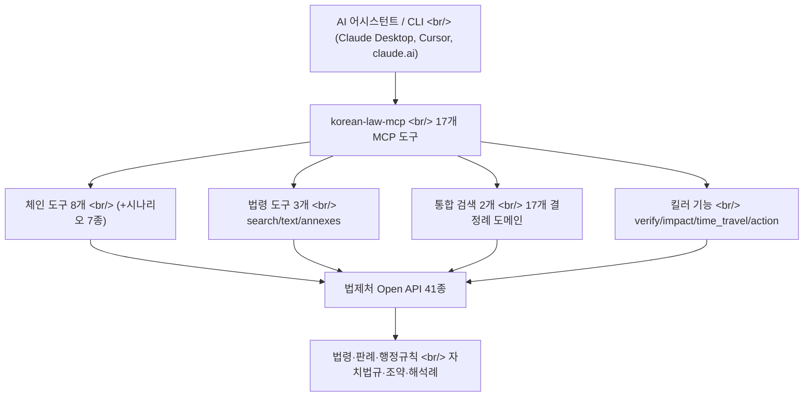

## 개요

[korean-law-mcp](https://github.com/chrisryugj/korean-law-mcp)는 [법제처](https://www.law.go.kr)의 [Open API](https://open.law.go.kr/LSO/openApi/guideList.do) 41개를 17개 [MCP](https://modelcontextprotocol.io) 도구로 압축한 [TypeScript](https://www.typescriptlang.org/) 서버다. 단순한 API 래퍼가 아니다 — LLM이 지어낸 가짜 조문을 잡아내는 인용 검증, 조문 한 줄의 파급효과를 그래프로 그리는 영향도 분석, 두 시점의 법조문을 자동 diff 하는 기능까지 들어 있다. 광진구청의 한 공무원이 "법제처를 백 번째 수동 검색하다 지쳐서" 만들었다는 이 프로젝트는, MCP 도구 설계에서 **"도구 수 ≠ 기능 수"** 라는 명제를 실증한 흥미로운 사례다.

<!--more-->

## 왜 이 프로젝트가 필요했나

대한민국에는 1,600개 이상의 현행 법률, 10,000개 이상의 [행정규칙](https://ko.wikipedia.org/wiki/%ED%96%89%EC%A0%95%EA%B7%9C%EC%B9%99), 그리고 [대법원](https://www.scourt.go.kr/)·[헌법재판소](https://www.ccourt.go.kr/)·[조세심판원](https://www.tt.go.kr/)·[관세청](https://www.customs.go.kr/)까지 이어지는 방대한 판례 체계가 있다. 이 모든 게 법제처라는 한 사이트에 모여 있지만, 데이터에 프로그래밍 방식으로 접근하려는 개발자 입장에서 경험은 좋지 않다. 법제처 [Open API](https://open.law.go.kr/LSO/openApi/guideList.do)는 무료 인증키(OC) 한 개로 41종의 엔드포인트를 열어주지만, 41개를 각각 다루는 것과 그것을 LLM이 쓸 수 있는 도구로 만드는 것은 전혀 다른 문제다.

[Model Context Protocol](https://modelcontextprotocol.io)은 [Anthropic](https://www.anthropic.com/news/model-context-protocol)이 2024년 11월 공개한 오픈 표준으로, AI 애플리케이션을 외부 데이터·도구에 연결하는 "USB-C 포트" 역할을 한다. [Claude Desktop](https://claude.com/download), [Cursor](https://cursor.com/docs/context/mcp), [Visual Studio Code](https://code.visualstudio.com/docs/copilot/chat/mcp-servers), [Zed](https://zed.dev/) 등 [다양한 클라이언트](https://modelcontextprotocol.io/clients)가 MCP 서버를 호출할 수 있다. korean-law-mcp는 법제처 API 위에 MCP 서버 계층을 올려, 자연어 질문 한 줄을 41개 API 호출 체인으로 변환한다.

## 89개에서 17개로 — 도구 압축의 발상

이 프로젝트의 핵심 설계 결정은 v2에서 v3로 넘어갈 때 일어났다. v2는 직관적인 접근을 택했다 — **API 하나당 도구 하나**, 그래서 41개 API가 89개 도구로 펼쳐졌다. 문제는 LLM 입장이다. MCP 클라이언트는 세션 시작 시 모든 도구의 [JSON Schema](https://json-schema.org/)를 컨텍스트에 로드하는데, 89개 스키마는 약 110KB로 **컨텍스트 윈도우의 절반을 도구 목록에만 소비**했다.

v3의 발상 전환은 **Dispatch Table + Domain Enum** 패턴이다. 비슷한 패턴의 도구를 `domain` 파라미터 하나로 통합한 것. 판례·헌재·조세심판·공정위·노동위 등 17개 도메인이 `search_decisions(domain)`과 `get_decision_text(domain)` 단 2개 도구로 합쳐졌다. 결과적으로 89개 → 15개(현재 17개)로 줄었고, 컨텍스트 비용은 약 110KB에서 20KB로 82% 감소했다. 주목할 점은 **기존 핸들러 함수는 한 줄도 수정하지 않았다**는 것 — 디스패치 계층만 새로 얹었다.

| | 법제처 원본 | v2 | v3 |
|---|:---:|:---:|:---:|
| API/도구 수 | 41 | 89 | 17 |
| AI 컨텍스트 비용 | - | ~110 KB | ~20 KB |
| 기능 커버리지 | - | 100% | 100% |

나머지 전문 도구(법령용어, 별표/서식, 개정 이력 등)는 사라지지 않았다. `discover_tools` → `execute_tool` 프록시 패턴으로, LLM이 필요할 때만 검색해서 호출한다. 이건 [MCP의 도구 검색](https://modelcontextprotocol.io/docs/learn/architecture) 패턴을 법령 도메인에 적용한 셈으로, 노출 도구는 적게 유지하면서 기능 커버리지는 100%를 지키는 트레이드오프다.

## 환각 방지 — verify_citations

v3.5에서 추가된 `verify_citations`는 이 프로젝트에서 가장 법률 도메인다운 기능이다. [ChatGPT](https://chatgpt.com/)나 [Claude](https://claude.ai)가 생성한 법률 답변에는 그럴듯하지만 존재하지 않는 조문이 섞이기 쉽다 — 이른바 [환각(hallucination)](https://en.wikipedia.org/wiki/Hallucination_(artificial_intelligence)). `verify_citations`는 사용자 텍스트에서 조문 인용을 정규식으로 추출하고, 직전 30자를 lookback 해서 법령명을 역추적한 뒤, 법제처 공식 DB와 병렬 교차검증한다. 결과는 ✓(실존) / ✗(없음, 존재 범위 제시) / ⚠(법령명 불명확) 세 가지로 분류된다.

흥미로운 건 이 기능을 실증 검증하는 과정에서 드러난 버그들이다. v3.5.3 릴리스 노트를 보면 실제 법제처 API로 5건을 테스트하다 false negative 3건을 발견했다. "민법"이 "난민법"으로 부분매칭되던 오매칭, 법제처 API가 항번호를 `"① "` 형태의 [유니코드 원숫자](https://en.wikipedia.org/wiki/Enclosed_Alphanumerics)로 리턴하는데 `parseInt`가 이를 제거해 NaN이 나오던 파싱 실패, 짧은 법령명("상법")이 검색 결과 34번째로 밀려 누락되던 문제. 환각을 잡는 도구 자체가 환각을 만들 뻔한 셈인데, 5/5 정확 판정까지 끌어올린 디버깅 기록이 README에 그대로 남아 있다.

v3.5.4에서는 한 발 더 나아가 `[NOT_FOUND]` / `[HALLUCINATION_DETECTED]` 같은 **머신 파싱 마커**를 모든 실패 응답에 도입했다. 실사용 피드백이 "못 찾으면 AI가 지맘대로 답변한다"였기 때문 — 일부 도구가 조회 실패 시 `isError` 플래그를 세팅하지 않아 LLM이 실패를 감지하지 못하고 창작 답변을 생성하던 근본 원인을 고친 것이다. MCP 도구가 LLM에게 "실패"를 명확히 신호하는 일이 생각보다 어렵다는 걸 보여주는 대목이다.

## v4.0의 세 가지 킬러 기능

가장 최근 메이저 버전인 v4.0은 세 개의 분석 도구를 동시에 추가했다.

`impact_map`은 조문 한 줄의 파급효과를 그래프로 그린다. "민법 제103조 인용한 판례"를 던지면 대법원 판례·헌재 결정·법령해석·행정심판·자치법규를 **역방향 탐색**하고, 그 조문이 인용한 다른 법령을 **정방향**으로 따라간 뒤, [mermaid](https://mermaid.js.org/) 그래프 코드를 자동 생성한다. [claude.ai](https://claude.ai)에서 바로 시각화된다.

`time_travel`은 두 시점의 법조문을 자동 diff 한다. "개인정보보호법 2020-01-01 vs 2025-11-01"이라고 하면 각 시점에 시행 중이던 본문을 가져와 조문 단위로 추가(+)/삭제(-)/변경(△)을 분류하고, 변경 전후 본문과 자수 변화량까지 보여준다. [개인정보보호법](https://www.law.go.kr/법령/개인정보 보호법)처럼 개정이 잦은 법령에서 특히 유용하다.

`action_plan`은 시민의 자연어를 5단계 실행 가이드로 변환한다. "전세금 못 받았어"를 입력하면 STEP 1 상황진단([주택임대차보호법](https://www.law.go.kr/법령/주택임대차보호법) 자동 식별) → STEP 2 권리·구제수단(판례) → STEP 3 신청기관·기한 → STEP 4 필요서류·양식 → STEP 5 함정·주의([대한법률구조공단](https://www.klac.or.kr/) 안내)로 펼쳐진다.

## 운영 측면의 디테일

README의 릴리스 노트는 원격 서버 운영에서 겪은 문제들을 솔직하게 기록한다. v3.3.0에서는 [fly.dev](https://fly.io/)에 올린 원격 서버가 주기적으로 [OOM](https://en.wikipedia.org/wiki/Out_of_memory) kill로 재시작되며 세션 ID가 무효화되던 문제를, MCP 공식 [stateless 패턴](https://modelcontextprotocol.io/docs/develop/build-server)으로 전환해 해결했다. 매 요청마다 fresh한 `Server + Transport`를 생성하고 요청 종료 시 즉시 해제하는 방식이다. API 키는 [AsyncLocalStorage](https://nodejs.org/api/async_context.html)로 요청 단위 격리해 [race condition](https://en.wikipedia.org/wiki/Race_condition)을 막았다.

v3.5.5의 핫픽스도 인상적이다. 법제처 Open API가 [Node.js](https://nodejs.org)의 기본 User-Agent(`undici/...`)를 봇으로 분류해 거부하기 시작하면서, 클라우드 호스팅 전체에서 도구가 죽었다. 에러 메시지가 "정확한 서버장비의 IP주소를 등록해 주세요"여서 IP 화이트리스트 차단으로 오인되기 쉬웠는데, 실제 원인은 UA 검증이었다. 일반 브라우저 UA를 기본 헤더에 주입하는 한 줄 패치로 전체 복구했다. 별표·서식 파싱은 같은 저자의 [kordoc](https://github.com/chrisryugj/kordoc) 엔진이 담당하며, HWPX·HWP·PDF·XLSX·DOCX를 [Markdown](https://en.wikipedia.org/wiki/Markdown)으로 자동 변환한다.

설치 경로도 다양하다. [Claude Code 플러그인](https://claude.com/claude-code) 한 줄 설치, [claude.ai](https://claude.ai) 커스텀 커넥터(`https://korean-law-mcp.fly.dev/mcp?oc=...`), 데스크톱 앱 설정 파일, [npm](https://www.npmjs.com/package/korean-law-mcp) 글로벌 설치, CLI 직접 사용까지 5가지를 지원한다. [MIT 라이선스](https://opensource.org/license/mit)이며 GitHub에서 1,700개 이상의 스타를 받았다.

## 인사이트

korean-law-mcp가 흥미로운 이유는 법령 검색 도구라서가 아니라, **MCP 도구 설계의 적정 추상화 수준**을 실증적으로 탐색한 기록이기 때문이다. v2의 "API 1개 = 도구 1개"는 직관적이지만 LLM 컨텍스트라는 희소 자원을 낭비했고, v3는 도메인 enum과 디스패치 테이블로 89개를 17개로 접으면서도 기능 커버리지 100%를 지켰다. 이건 [REST API](https://en.wikipedia.org/wiki/REST) 설계에서 엔드포인트를 잘게 쪼개는 관행과 정반대 방향인데, 소비자가 사람이 아니라 LLM일 때 추상화의 비용 함수가 달라진다는 걸 보여준다.

두 번째 교훈은 환각 방지가 단발 기능이 아니라 **시스템 전반의 신호 설계 문제**라는 점이다. `verify_citations`는 가짜 조문을 잡는 도구지만, 그 도구 자체가 false negative를 냈고, 더 근본적으로는 다른 도구들이 실패를 LLM에게 명확히 신호하지 않아 환각을 유발하고 있었다. `[NOT_FOUND]` 머신 마커 도입, `isError` 플래그 일괄 수정, 체인 도구의 silent-drop 패턴 제거 — 이 모든 게 "도구가 모르면 모른다고 말하게 만들기"라는 하나의 목표를 향한다. 법률처럼 정확성이 생명인 도메인에서 MCP 서버를 만든다면 반드시 마주칠 문제다.

세 번째로, 이 프로젝트는 공공 데이터를 LLM 친화적으로 재포장하는 일의 가치를 보여준다. 법제처 API는 이미 무료로 공개돼 있었지만, 약칭 자동 인식(`화관법` → `화학물질관리법`), 조문번호 변환(`제38조` ↔ `003800`), 17개 도메인 통합 검색 같은 도메인 지식을 입혀야 비로소 자연어 질문 한 줄로 쓸 수 있게 된다. 정부 부처가 API를 여는 것과 그 API가 실제로 쓰이는 것 사이의 간극을, 한 명의 공무원이 오픈소스로 메운 사례다. 같은 패턴 — 공공 API + MCP 래퍼 + 도메인 지식 — 은 세무, 특허, 통계 등 다른 공공 데이터 영역으로도 그대로 복제 가능하다.

## 참고

**프로젝트**
- [korean-law-mcp (GitHub)](https://github.com/chrisryugj/korean-law-mcp) — 본문에서 다룬 MCP 서버, MIT 라이선스
- [korean-law-mcp (npm)](https://www.npmjs.com/package/korean-law-mcp) — `npm install -g korean-law-mcp`
- [kordoc (GitHub)](https://github.com/chrisryugj/kordoc) — 같은 저자의 HWPX/HWP/PDF/XLSX/DOCX → Markdown 변환 엔진

**Model Context Protocol**
- [Model Context Protocol 공식 사이트](https://modelcontextprotocol.io) — 프로토콜 문서
- [MCP 발표 (Anthropic)](https://www.anthropic.com/news/model-context-protocol) — 2024년 11월 공개
- [MCP 아키텍처](https://modelcontextprotocol.io/docs/learn/architecture) — 서버·클라이언트·도구 개념
- [MCP 서버 만들기](https://modelcontextprotocol.io/docs/develop/build-server) — stateless 패턴 포함
- [MCP 클라이언트 목록](https://modelcontextprotocol.io/clients) — Claude Desktop, Cursor, VS Code, Zed 등

**법령 데이터 출처**
- [법제처](https://www.law.go.kr) — 국가법령정보센터
- [법제처 Open API 신청](https://open.law.go.kr/LSO/openApi/guideList.do) — 무료 인증키(OC) 발급
- [대법원](https://www.scourt.go.kr/) · [헌법재판소](https://www.ccourt.go.kr/) · [조세심판원](https://www.tt.go.kr/) · [관세청](https://www.customs.go.kr/) — 판례·결정례 출처
- [대한법률구조공단](https://www.klac.or.kr/) — action_plan이 안내하는 기관

**배경 개념**
- [LLM 환각](https://en.wikipedia.org/wiki/Hallucination_(artificial_intelligence)) — verify_citations가 막는 문제
- [JSON Schema](https://json-schema.org/) — MCP 도구 스키마 포맷
- [TypeScript](https://www.typescriptlang.org/) · [Node.js](https://nodejs.org) — 구현 스택
- [mermaid](https://mermaid.js.org/) — impact_map이 생성하는 그래프 포맷
