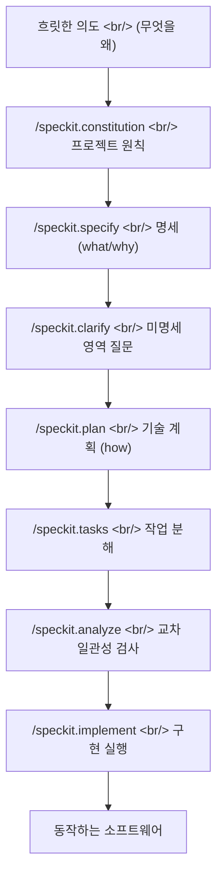

## 개요

[GitHub](https://github.com/)가 공개한 [Spec Kit](https://github.com/github/spec-kit)은 8개월 만에 별 9.8만 개를 모은 [스펙 주도 개발(Spec-Driven Development, SDD)](https://github.github.io/spec-kit/) 툴킷이다. 핵심 주장은 한 문장으로 압축된다 — **명세는 코딩이 시작되면 버려지는 발판이 아니라, 구현을 직접 생성하는 실행 가능한 산출물이어야 한다.** [바이브 코딩](https://en.wikipedia.org/wiki/Vibe_coding)이 프롬프트 한 방으로 코드를 뽑아내는 것과 정반대로, Spec Kit은 의도 → 명세 → 계획 → 작업 → 구현이라는 다단계 정제 과정을 [AI 코딩 에이전트](https://en.wikipedia.org/wiki/AI-assisted_software_development) 위에 슬래시 명령으로 깐다.

<!--more-->

## 바이브 코딩이 아니라 스펙 주도 개발

지난 2년간 [LLM](https://en.wikipedia.org/wiki/Large_language_model) 기반 코딩의 디폴트는 "프롬프트를 잘 쓰면 코드가 나온다"였다. [Cursor](https://cursor.com/)나 [GitHub Copilot](https://github.com/features/copilot) 같은 도구가 이 흐름을 가속했고, [Andrej Karpathy](https://karpathy.ai/)가 만든 "바이브 코딩"이라는 말이 그 정서를 정확히 포착했다 — 코드를 읽지 않고 느낌으로 받아들이는 개발. 문제는 이 방식이 작은 데모에서는 마법 같지만, 요구사항이 복잡해지면 무엇이 왜 만들어졌는지 추적할 수 없는 블랙박스가 된다는 점이다.

Spec Kit의 [핵심 철학](https://github.com/github/spec-kit#-core-philosophy)은 이 디폴트를 뒤집는다. 네 가지 기둥으로 정리된다 — **의도 주도 개발**(명세가 "어떻게"보다 "무엇"을 먼저 정의), **가드레일 기반의 풍부한 명세 작성**, **한 방 생성이 아닌 다단계 정제**, 그리고 **명세 해석을 위한 고급 AI 모델 능력에 대한 의존**. 마지막 항목이 중요하다. SDD는 AI가 약하던 시절에는 불가능했던 워크플로우다. 모델이 충분히 좋은 명세를 충분히 정확하게 구현으로 옮길 수 있게 되면서 비로소 "명세 = 소스코드"라는 등식이 현실적인 옵션이 됐다.

## 6단계 워크플로우 — 슬래시 명령으로 구현된 파이프라인

Spec Kit의 진입점은 [Python](https://www.python.org/) 기반 CLI인 `specify`다. [uv](https://docs.astral.sh/uv/)나 [pipx](https://pypa.github.io/pipx/)로 설치한 뒤 `specify init`을 실행하면, 사용 중인 에이전트 디렉터리(`.claude/commands/` 등)에 슬래시 명령 프롬프트 파일들이 깔린다. 이후 모든 작업은 에이전트 안에서 `/speckit.*` 명령으로 진행된다.

[핵심 명령](https://github.com/github/spec-kit#available-slash-commands)은 여섯 개다.

| 명령 | 역할 | 산출물 |
|---|---|---|
| `/speckit.constitution` | 프로젝트 governing 원칙 수립 | `.specify/memory/constitution.md` |
| `/speckit.specify` | 무엇을 왜 만들지 정의 (기술 스택 배제) | `specs/NNN-feature/spec.md` |
| `/speckit.plan` | 기술 스택과 아키텍처 결정 | `plan.md`, `research.md`, `data-model.md`, `contracts/` |
| `/speckit.tasks` | 실행 가능한 작업 목록 생성 | `tasks.md` |
| `/speckit.taskstoissues` | 작업을 [GitHub 이슈](https://docs.github.com/en/issues)로 변환 | GitHub Issues |
| `/speckit.implement` | 모든 작업을 의존성 순서대로 실행 | 동작하는 코드 |

여기에 품질 보강용 선택 명령이 세 개 더 붙는다 — `/speckit.clarify`(미명세 영역을 구조화된 질문으로 메움, `/speckit.plan` 전 권장), `/speckit.analyze`(작업 생성 후 산출물 간 교차 일관성·커버리지 검사), `/speckit.checklist`("영어로 쓴 유닛 테스트"라고 표현되는, 요구사항 완결성·명확성·일관성 검증 체크리스트 생성).

이 분리가 핵심이다. `specify`는 명세 정의 단계(`/specify`)에서 **기술 스택을 의도적으로 배제**하라고 강제한다. "무엇"과 "왜"가 "어떻게"와 섞이면 명세가 구현 디테일에 오염되고, 그러면 같은 명세로 다른 스택을 탐색하는 — Spec Kit이 말하는 "[창의적 탐색(Creative Exploration)](https://github.com/github/spec-kit#-development-phases)" — 능력이 사라진다.

## 30개 이상의 에이전트와 스킬 모드

Spec Kit은 특정 에이전트에 묶이지 않는다. [Claude Code](https://www.anthropic.com/claude-code), [Gemini CLI](https://github.com/google-gemini/gemini-cli), [Cursor](https://cursor.com/), Qwen CLI, [opencode](https://opencode.ai/), [Codex CLI](https://developers.openai.com/codex/cli/), GitHub Copilot 등 [30개 이상의 AI 코딩 에이전트](https://github.github.io/spec-kit/reference/integrations.html)를 지원한다. `specify init`을 인터랙티브로 실행하면 설치된 에이전트를 감지해 선택지를 주고, CI 같은 비인터랙티브 환경에서는 GitHub Copilot으로 폴백한다.

흥미로운 건 [스킬 모드](https://www.anthropic.com/news/skills)다. `--integration codex --integration-options="--skills"`처럼 실행하면 슬래시 명령 프롬프트 파일 대신 에이전트 스킬을 설치한다. 이 경우 명령 이름도 `/speckit.specify`가 아니라 `$speckit-specify` 형태가 된다. Anthropic이 [Claude Skills](https://www.anthropic.com/news/skills)로 밀고 있는 "재사용 가능한 절차적 지식 단위" 추상화를, Spec Kit이 자기 워크플로우 배포 채널로 흡수한 셈이다.

## 확장성 — 4계층 우선순위 스택

Spec Kit이 단순한 프롬프트 모음을 넘어 "툴킷"이라 불릴 수 있는 이유는 [확장 시스템](https://github.com/github/spec-kit#-making-spec-kit-your-own-extensions--presets)에 있다. 템플릿과 명령은 4계층 우선순위 스택으로 해석된다.

| 우선순위 | 계층 | 위치 |
|---|---|---|
| 1 (최상) | 프로젝트 로컬 오버라이드 | `.specify/templates/overrides/` |
| 2 | 프리셋 — 코어·확장 커스터마이즈 | `.specify/presets/templates/` |
| 3 | 확장 — 새 기능 추가 | `.specify/extensions/templates/` |
| 4 (최하) | Spec Kit 코어 | `.specify/templates/` |

**확장(Extension)**은 *Spec Kit이 할 수 있는 일*을 늘린다 — 새 명령과 새 개발 단계를 도입한다. **프리셋(Preset)**은 *Spec Kit이 일하는 방식*을 바꾼다 — 새 기능 추가 없이 코어와 확장의 템플릿·명령을 오버라이드한다. 템플릿은 런타임에 스택을 위에서부터 훑어 첫 매치를 쓰고, 확장·프리셋 명령은 설치 시점에 에이전트 디렉터리로 기록된다.

이 구조가 만든 결과가 흥미롭다. [커뮤니티 확장 카탈로그](https://speckit-community.github.io/extensions/)에는 이미 100개 가까운 확장이 등록돼 있다. [Jira](https://github.com/mbachorik/spec-kit-jira)·[Azure DevOps](https://github.com/pragya247/spec-kit-azure-devops) 연동, 구현 후 코드 리뷰, [V-Model](https://en.wikipedia.org/wiki/V-model_(software_development)) 테스트 추적성, [브라운필드](https://en.wikipedia.org/wiki/Brownfield_(software_development)) 부트스트랩, 토큰 비용 추적, [OWASP LLM 위협 모델링](https://owasp.org/www-project-top-10-for-large-language-model-applications/) 같은 것들이다. [obra/superpowers](https://github.com/obra/superpowers) 스킬 모음을 SDD 워크플로우에 연결하는 브리지 확장까지 있다. 코어는 의도적으로 얇게 두고, 도메인별 복잡성은 확장 생태계로 밀어낸 설계다.

## 세 가지 개발 단계와 실험적 목표

Spec Kit은 자신을 완성된 제품이 아니라 [실험](https://github.com/github/spec-kit#-experimental-goals)으로 규정한다. 검증하려는 가설은 명확하다 — **SDD는 특정 기술·언어·프레임워크에 묶이지 않은 프로세스**라는 것. 그래서 [세 가지 개발 단계](https://github.com/github/spec-kit#-development-phases)를 모두 다룬다. 0-to-1(그린필드, 처음부터 생성), 창의적 탐색(같은 명세로 여러 스택·아키텍처 병렬 구현), 반복적 개선(브라운필드, 레거시 현대화).

[상세 워크플로우 문서](https://github.com/github/spec-kit/blob/main/spec-driven.md)를 보면 단순히 명령을 순서대로 돌리라는 게 아니다. `/speckit.specify` 직후의 명세를 "최종"으로 취급하지 말고 에이전트와 대화하며 다듬으라고, `/speckit.plan`이 만든 계획을 에이전트 스스로 감사하게 하라고, 과잉 엔지니어링된 부분이 없는지 교차 점검하라고 반복적으로 강조한다. 즉 Spec Kit이 파는 건 명령어가 아니라 **AI 에이전트와 협업하는 규율 잡힌 절차** 자체다.

## 인사이트

Spec Kit을 흥미롭게 만드는 건 코드 그 자체가 아니다 — 본체는 Python CLI 하나와 마크다운 템플릿 모음, 그리고 슬래시 명령 프롬프트 파일들이 전부다. 진짜 베팅은 **추상화 계층을 한 단계 올린 것**에 있다. 지난 라운드의 단위는 "프롬프트"였다. Spec Kit이 미는 단위는 "명세 → 계획 → 작업"이라는 검증 가능한 산출물 체인이다. 프롬프트는 휘발하지만 명세는 git에 남고, diff되고, 리뷰되고, 재실행된다. 이건 [Karpathy](https://karpathy.ai/)의 바이브 코딩이 의도적으로 버린 바로 그 추적성을 되살리는 움직임이다.

두 번째 관찰 — Spec Kit은 에이전트 중립을 단순한 호환성 마케팅이 아니라 아키텍처 원칙으로 삼는다. 30개 이상의 에이전트, 슬래시 명령과 스킬 모드 양쪽 지원, CI 폴백까지. 이건 [GitHub](https://github.com/)이 특정 모델 벤더에 베팅하지 않겠다는 신호이자, SDD라는 프로세스가 모델 위에 깔리는 별도 계층임을 분명히 하는 설계 결정이다. 모델이 교체돼도 명세와 워크플로우는 남는다.

세 번째 — 8개월 만의 별 9.8만 개와 100개에 육박하는 커뮤니티 확장은, 코어를 얇게 두고 확장 우선순위 스택을 연 설계가 적중했음을 보여준다. [Jira](https://github.com/mbachorik/spec-kit-jira) 연동부터 [OWASP](https://owasp.org/www-project-top-10-for-large-language-model-applications/) 위협 모델링까지, GitHub이 직접 만들었다면 영원히 못 따라잡았을 도메인 다양성을 생태계가 메우고 있다. 다만 README 스스로 경고하듯 — 커뮤니티 확장은 검토·감사·보증되지 않는다. 얇은 코어의 비용은 신뢰 경계가 흐려진다는 점이다.

마지막으로, 이게 "실험"이라는 자기 규정을 진지하게 받아들일 필요가 있다. SDD가 작동하려면 모델이 명세를 충분히 정확하게 구현으로 옮길 수 있어야 하고, 그 가정은 도메인과 복잡도에 따라 깨진다. Spec Kit의 가치는 "정답"을 제시하는 데 있다기보다, **AI 시대의 소프트웨어 개발에서 인간이 무엇을 직접 쓰고 무엇을 위임할지의 경계선을 명세라는 산출물로 명시적으로 그어 보는 시도**에 있다. 다음 라운드의 키워드가 프롬프트 엔지니어링이 아니라 명세 엔지니어링이라면, Spec Kit은 그 첫 레퍼런스 구현 중 하나로 기록될 것이다.

## 참고

**Spec Kit**
- [github/spec-kit](https://github.com/github/spec-kit) — 메인 저장소 (MIT, Python, 별 9.8만 개, 2025-08 공개)
- [Spec Kit 공식 문서](https://github.github.io/spec-kit/) — 워크플로우·CLI 레퍼런스·통합 가이드
- [Spec-Driven Development 방법론 문서](https://github.com/github/spec-kit/blob/main/spec-driven.md) — 전체 프로세스 심층 설명
- [v0.8.9 릴리스](https://github.com/github/spec-kit/releases/tag/v0.8.9) — 2026-05-12, 최신 릴리스
- [지원 에이전트 통합 목록](https://github.github.io/spec-kit/reference/integrations.html) — 30개 이상 에이전트
- [커뮤니티 확장 카탈로그](https://speckit-community.github.io/extensions/) · [커뮤니티 프리셋](https://github.github.io/spec-kit/community/presets.html)

**배경 개념**
- [바이브 코딩 (Vibe coding)](https://en.wikipedia.org/wiki/Vibe_coding) — Spec Kit이 대척점으로 삼는 개발 방식
- [AI 보조 소프트웨어 개발](https://en.wikipedia.org/wiki/AI-assisted_software_development) · [대규모 언어 모델](https://en.wikipedia.org/wiki/Large_language_model)
- [V-Model](https://en.wikipedia.org/wiki/V-model_(software_development)) · [브라운필드 개발](https://en.wikipedia.org/wiki/Brownfield_(software_development))
- [Claude Skills](https://www.anthropic.com/news/skills) — Spec Kit의 스킬 모드가 흡수한 추상화
- [OWASP Top 10 for LLM Applications](https://owasp.org/www-project-top-10-for-large-language-model-applications/) — 커뮤니티 위협 모델 확장의 기반

**도구·생태계**
- [Claude Code](https://www.anthropic.com/claude-code) · [Gemini CLI](https://github.com/google-gemini/gemini-cli) · [GitHub Copilot](https://github.com/features/copilot) · [Cursor](https://cursor.com/) · [Codex CLI](https://developers.openai.com/codex/cli/) · [opencode](https://opencode.ai/)
- [uv](https://docs.astral.sh/uv/) · [pipx](https://pypa.github.io/pipx/) — Specify CLI 설치 도구
- [obra/superpowers](https://github.com/obra/superpowers) — SDD 워크플로우에 연결되는 스킬 모음
- [GitHub Issues](https://docs.github.com/en/issues) — `/speckit.taskstoissues` 출력 대상
