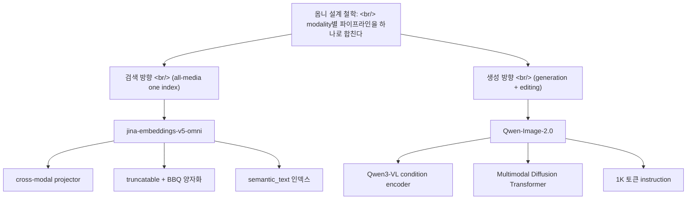
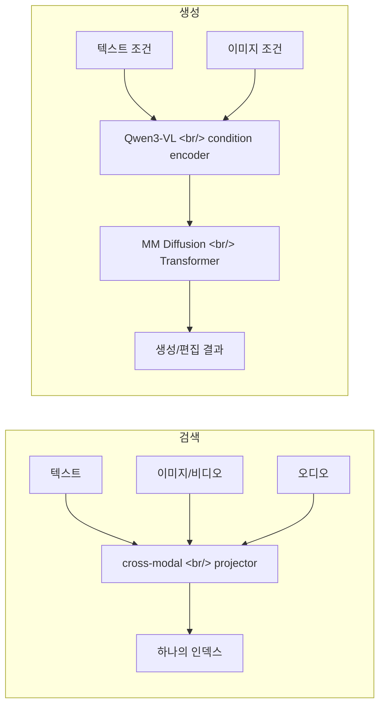

## 개요

같은 시기에 등장한 두 시스템이 같은 단어를 내걸었다 — **"omni"**. 한쪽은 텍스트·이미지·비디오·오디오를 [하나의 인덱스](https://en.wikipedia.org/wiki/Search_engine_indexing)에 넣고 한 번에 검색하는 [임베딩](https://en.wikipedia.org/wiki/Sentence_embedding) 모델([jina-embeddings-v5-omni](https://www.elastic.co/search-labs/blog/jina-embeddings-v5-omni-all-media-one-index)), 다른 한쪽은 고품질 생성과 정밀 편집을 한 프레임워크에 묶은 이미지 생성 [파운데이션 모델](https://en.wikipedia.org/wiki/Foundation_model)([Qwen-Image-2.0](https://arxiv.org/abs/2605.10730))이다. 검색과 생성이라는 정반대 방향의 작업이지만, 둘 다 **"여러 modality를 위한 별도 파이프라인"이라는 디폴트를 버리고 하나로 합친다**는 같은 설계 철학 위에 서 있다.

<!--more-->

## 1. jina-embeddings-v5-omni — 모든 미디어, 하나의 인덱스

[Elastic Search Labs](https://www.elastic.co/search-labs)의 [Scott Martens](https://www.elastic.co/search-labs/author/scott-martens)가 2026년 5월 11일 공개한 [jina-embeddings-v5-omni](https://www.elastic.co/search-labs/blog/jina-embeddings-v5-omni-all-media-one-index) 소개 글이다.

### 핵심

[멀티모달 검색](https://en.wikipedia.org/wiki/Multimedia_information_retrieval)의 오래된 통증은 modality마다 인덱싱 파이프라인이 따로 논다는 점이다. 텍스트는 텍스트 임베딩, 이미지는 [CLIP](https://en.wikipedia.org/wiki/Contrastive_Language-Image_Pre-training) 계열, 오디오는 또 다른 모델 — 그리고 이들을 가로지르는 검색은 누더기로 봉합된다. v5-omni는 텍스트(약 100개 언어)·이미지·비디오·오디오를 **하나의 [Elasticsearch](https://en.wikipedia.org/wiki/Elasticsearch) 인덱스**에 넣고 동시에 질의한다.

### 어떻게

전면 재학습이 아니라 **모듈식 조립**이다. 사전학습된 모델에서 인코더만 떼어 와 — 비전 쪽은 [SigLIP2](https://arxiv.org/abs/2502.14786) 계열, 오디오 쪽은 [Whisper-large-v3](https://github.com/openai/whisper) — 기존 jina-embeddings-v5-text 백본 앞단의 전처리기로 붙인다. 핵심은 학습된 **cross-modal projector**: 각 미디어 인코더의 출력을 텍스트 모델과 호환되는 임베딩 공간으로 번역하는 작은 어댑터다. small 버전 기준 신규 파라미터가 약 550만 개에 불과하다.

- **small**: 1024차원 임베딩, 32,768 토큰 컨텍스트, 확장 포함 16.6억 파라미터
- **nano**: 768차원 임베딩, 8,192 토큰 컨텍스트, 풀로드 시 10.04억 파라미터
- 두 버전 모두 retrieval·clustering·classification·semantic similarity용 [LoRA](https://arxiv.org/abs/2106.09685) 어댑터를 task별로 갈아 끼운다

### 스토리지 현실 감각

대규모 [벡터 검색](https://en.wikipedia.org/wiki/Vector_database)에서 임베딩 차원 수는 곧 비용이다. v5-omni는 두 가지로 답한다. 첫째 **truncation** — [Matryoshka 표현 학습](https://arxiv.org/abs/2205.13147) 방식으로 임베딩을 native 차원에서 32차원까지 잘라낼 수 있고, 64바이트 크기에서 스토리지를 93% 줄인다. 둘째 [Better Binary Quantization](https://www.elastic.co/search-labs/blog/better-binary-quantization-lucene-elasticsearch)(BBQ) 호환 — Elasticsearch의 양자화와 맞물려 "거의 동일한 성능"으로 정밀도 요구를 낮춘다. 그리고 결정적으로, v5-omni가 만드는 **텍스트 임베딩은 jina-embeddings-v5-text와 동일**하다. 기존 텍스트 인덱스를 그대로 멀티미디어 인덱스로 승격할 수 있다는 뜻이다.

### 벤치마크

- 텍스트 검색: [MMTEB](https://github.com/embeddings-benchmark/mteb) 스위트에서 동급 사이즈 최상위
- 시각 유사도: "자기보다 3배 큰 모델에만 졌다"; nano는 10~25배 큰 모델을 능가
- 시각 문서 검색: 1B 미만으로 3~7B 모델과 경쟁
- 오디오: [MAEB](https://huggingface.co/datasets/mteb/MAEB) 오디오 검색에서 상위권
- 비디오 temporal grounding: [Charades-STA](https://github.com/jiyanggao/TALL)에서 55.57(ByteDance Seed 1.6의 29.30 대비), MomentSeeker 58.93

### 왜 지금 의미가 큰가

이건 "임베딩 모델 하나가 더 나왔다"가 아니다. **검색 인프라의 추상화 계층을 한 단계 단순화한다.** Elasticsearch에서 `type: semantic_text`로 인덱스를 만들고 `inference_id`에 모델 이름만 넣으면, 텍스트가 아닌 입력은 Base64로 변환되어 같은 필드에 들어간다. modality 분기 로직이 애플리케이션 레벨에서 사라진다. [RAG](https://en.wikipedia.org/wiki/Retrieval-augmented_generation) 파이프라인을 짜본 사람이라면 이 단순화가 운영 비용의 어디를 깎는지 바로 안다.

## 2. Qwen-Image-2.0 — 생성과 편집을 한 프레임워크로

[arxiv 2605.10730](https://arxiv.org/abs/2605.10730), [Alibaba Qwen](https://qwenlm.github.io/) 팀의 75인 공동 저술, 2026년 5월 11일, [cs.CV](https://arxiv.org/list/cs.CV/recent).

### 핵심

**Qwen-Image-2.0**은 고품질 생성과 정밀한 이미지 편집을 단일 프레임워크로 통합한 omni-capable 이미지 생성 파운데이션 모델이다. 기존 모델들이 여전히 약한 지점 — 초장문 텍스트 렌더링, 다국어 [타이포그래피](https://en.wikipedia.org/wiki/Typography), 고해상도 [photorealism](https://en.wikipedia.org/wiki/Photorealism), 견고한 instruction following, 효율적 배포 — 을 정조준한다. 특히 텍스트가 많고 구성이 복잡한 장면에서.

### 어떻게

핵심 구조는 두 부품의 결합이다. **[Qwen3-VL](https://qwenlm.github.io/)을 condition encoder로** 쓰고, 그 위에 **Multimodal [Diffusion Transformer](https://arxiv.org/abs/2212.09748)**를 얹어 condition과 target을 함께 모델링한다. [diffusion model](https://en.wikipedia.org/wiki/Diffusion_model)의 denoising 백본을 [U-Net](https://en.wikipedia.org/wiki/U-Net) 대신 transformer로 가져간 [DiT](https://www.wpeebles.com/DiT) 계열이고, 여기에 대규모 데이터 큐레이션과 맞춤형 다단계 학습 파이프라인이 받친다. 이 구조 덕에 강한 [멀티모달 이해](https://en.wikipedia.org/wiki/Multimodal_learning)를 유지하면서도 생성과 편집을 유연하게 오간다.

### Contribution

- 슬라이드·포스터·인포그래픽·만화 같은 텍스트 풍부 콘텐츠 생성을 위해 **최대 1K 토큰 instruction** 지원
- 다국어 텍스트 충실도와 타이포그래피 대폭 개선
- 더 풍부한 디테일, 사실적 텍스처, 일관된 조명으로 photorealistic 생성 강화
- 다양한 스타일에 걸쳐 복잡한 프롬프트를 더 안정적으로 따름
- 광범위한 [human evaluation](https://en.wikipedia.org/wiki/Human_evaluation_of_machine_translation)에서 이전 Qwen-Image 모델들을 생성·편집 양쪽에서 큰 폭으로 능가

### 왜 지금 의미가 큰가

생성형 이미지 모델의 역사는 **생성과 편집의 분리**였다. [Stable Diffusion](https://en.wikipedia.org/wiki/Stable_Diffusion)으로 만들고, [ControlNet](https://github.com/lllyasviel/ControlNet)이나 [inpainting](https://en.wikipedia.org/wiki/Inpainting) 도구로 따로 고친다. Qwen-Image-2.0은 condition-target 공동 모델링으로 이 둘을 한 모델 안에 넣는다. condition encoder가 [VLM](https://en.wikipedia.org/wiki/Vision-language_model)이라는 점도 중요하다 — 텍스트 프롬프트뿐 아니라 이미지 조건도 같은 인코더가 이해하므로, "이 이미지를 이렇게 바꿔라"가 생성과 같은 경로를 탄다.

## 묶어서 본 흐름

검색 모델과 생성 모델, 정반대 작업인데 설계 결정이 데칼코마니처럼 겹친다.

| 항목 | jina-embeddings-v5-omni | Qwen-Image-2.0 |
|---|---|---|
| 방향 | 멀티모달 → 임베딩 (검색) | 조건 → 이미지 (생성/편집) |
| 통합 대상 | modality별 인덱싱 파이프라인 | 생성 모델 + 편집 모델 |
| 통합 수단 | cross-modal projector | Qwen3-VL condition encoder |
| 백본 | jina-embeddings-v5-text | Multimodal Diffusion Transformer |
| 재사용 전략 | 사전학습 인코더 + 작은 어댑터 | VLM을 condition encoder로 전용 |
| 배포 관점 | truncation·BBQ로 스토리지 절감 | 1K 토큰까지, 효율적 배포 강조 |

공통 패턴은 셋이다. 첫째, **사전학습 자산의 재사용** — jina는 SigLIP2·Whisper 인코더를, Qwen은 Qwen3-VL을 통째로 끌어다 쓴다. 처음부터 학습하지 않는다. 둘째, **공유 표현 공간으로의 투사** — jina의 projector는 모든 미디어를 텍스트 임베딩 공간으로, Qwen의 condition encoder는 텍스트·이미지 조건을 같은 diffusion 입력으로 모은다. 셋째, **배포 비용을 1급 설계 요소로** — jina는 truncation과 [양자화](https://en.wikipedia.org/wiki/Quantization_(signal_processing)), Qwen은 효율적 배포를 명시적 목표로 건다. 연구 데모가 아니라 운영 시스템을 전제로 한 설계다.

## 인사이트

`omni`라는 단어가 두 시스템에 동시에 붙은 건 우연이 아니다. 멀티모달 AI의 1세대는 **modality마다 전용 모델**이었다 — 이미지엔 CLIP, 오디오엔 Whisper, 텍스트엔 [BERT](https://en.wikipedia.org/wiki/BERT_(language_model)) 계열. 2세대는 이들을 [late fusion](https://en.wikipedia.org/wiki/Multimodal_learning)으로 봉합했다. 지금 보이는 흐름은 3세대다 — **하나의 표현 공간, 하나의 프레임워크**. jina-v5-omni는 검색 쪽에서, Qwen-Image-2.0은 생성 쪽에서 같은 지점에 도달한다. 흥미로운 건 둘 다 *완전한 통합*이 아니라 *영리한 재조립*이라는 점이다. 사전학습된 인코더를 떼어 와 작은 어댑터나 공동 모델링 레이어로 묶는다. 처음부터 omni 모델을 학습하는 비용은 여전히 천문학적이므로, 현실적인 omni는 모듈 재사용에서 나온다. 그리고 두 사례 모두 **배포 비용을 연구 단계에서 이미 설계에 박아 넣었다** — truncation, BBQ 양자화, 1K 토큰 instruction, 효율적 배포. 멀티모달이 데모를 넘어 인프라가 되는 단계에 들어섰다는 신호다. 다음 라운드의 질문은 "더 많은 modality"가 아니라 "이 통합을 얼마나 싸게, 얼마나 안정적으로 운영하느냐"가 될 것이다.

## 참고

**Primary sources**
- [One index, all media: Introducing jina-embeddings-v5-omni](https://www.elastic.co/search-labs/blog/jina-embeddings-v5-omni-all-media-one-index) — [Scott Martens](https://www.elastic.co/search-labs/author/scott-martens), [Elastic Search Labs](https://www.elastic.co/search-labs) (2026-05-11)
- [Qwen-Image-2.0 Technical Report (2605.10730)](https://arxiv.org/abs/2605.10730) — [Alibaba Qwen](https://qwenlm.github.io/) 팀 75인 공저 (2026-05-11, [cs.CV](https://arxiv.org/list/cs.CV/recent))

**Models & components**
- [SigLIP2 (2502.14786)](https://arxiv.org/abs/2502.14786) — jina-v5-omni가 비전 인코더로 차용
- [Whisper](https://github.com/openai/whisper) — jina-v5-omni가 오디오 인코더로 차용
- [Qwen](https://qwenlm.github.io/) — Qwen3-VL을 condition encoder로 쓰는 Qwen-Image-2.0의 모태
- [LoRA: Low-Rank Adaptation (2106.09685)](https://arxiv.org/abs/2106.09685) — task별 어댑터의 기반 기법
- [Matryoshka Representation Learning (2205.13147)](https://arxiv.org/abs/2205.13147) — truncatable 임베딩의 원리
- [Scalable Diffusion Models with Transformers — DiT (2212.09748)](https://arxiv.org/abs/2212.09748) — Multimodal Diffusion Transformer의 계보

**Background**
- [Multimedia information retrieval](https://en.wikipedia.org/wiki/Multimedia_information_retrieval) · [Vector database](https://en.wikipedia.org/wiki/Vector_database) · [Sentence embedding](https://en.wikipedia.org/wiki/Sentence_embedding)
- [Diffusion model](https://en.wikipedia.org/wiki/Diffusion_model) · [Vision-language model](https://en.wikipedia.org/wiki/Vision-language_model) · [Multimodal learning](https://en.wikipedia.org/wiki/Multimodal_learning)
- [Contrastive Language-Image Pre-training (CLIP)](https://en.wikipedia.org/wiki/Contrastive_Language-Image_Pre-training) — 1세대 멀티모달의 대표
- [Retrieval-augmented generation](https://en.wikipedia.org/wiki/Retrieval-augmented_generation) — 멀티모달 검색이 들어가는 대표 파이프라인
- [Better Binary Quantization](https://www.elastic.co/search-labs/blog/better-binary-quantization-lucene-elasticsearch) — Elasticsearch BBQ 설명
- [MTEB / MMTEB](https://github.com/embeddings-benchmark/mteb) — 임베딩 벤치마크 스위트
