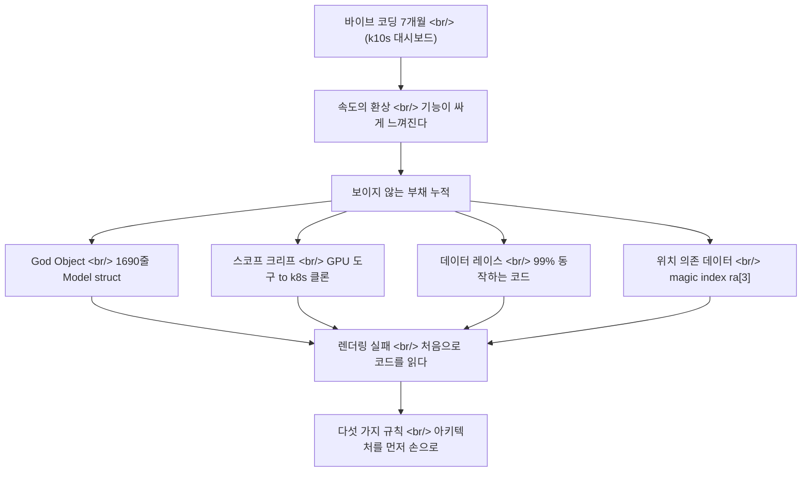

## 개요

한 개발자가 [Claude](https://www.anthropic.com/claude)로 7개월간 [Kubernetes](https://kubernetes.io/) 대시보드를 만들다가 "[다시 손으로 코드를 쓰겠다](https://blog.k10s.dev/im-going-back-to-writing-code-by-hand/)"고 선언했다. 흥미로운 건 그가 AI 코딩을 *포기*한 게 아니라는 점이다 — 그는 AI가 무엇을 잘하고 무엇을 못하는지 7개월치 코드베이스로 정확히 측정했고, 그 측정값을 다섯 개의 규칙으로 정리했다. 이 글은 그 회고를 [바이브 코딩](https://en.wikipedia.org/wiki/Vibe_coding) 담론, [METR](https://metr.org/) 생산성 연구, [70% 문제](https://addyo.substack.com/p/the-70-problem-hard-truths-about) 같은 더 큰 그림과 나란히 놓고 읽는다.

<!--more-->

## 7개월 뒤에 발견한 것

원글의 저자는 [k10s](https://blog.k10s.dev/) — GPU를 인식하는 Kubernetes 터미널 대시보드 — 를 [Bubble Tea](https://github.com/charmbracelet/bubbletea) 위에서 만들었다. Bubble Tea는 [The Elm Architecture](https://guide.elm-lang.org/architecture/)를 차용한 Go [TUI](https://en.wikipedia.org/wiki/Text-based_user_interface) 프레임워크로, `Init` / `Update` / `View` 세 메서드와 하나의 `Model` struct로 모든 상태를 관리한다. 구조 자체는 깔끔하다. 문제는 그 구조 *위에* 7개월간 AI가 무엇을 쌓았는가였다.

저자가 마침내 멈춰서 코드를 읽게 된 계기는 평범했다. pods 뷰에서 GPU fleet 뷰로 전환했는데 아무것도 렌더링되지 않았다. 그 순간 그는 프롬프트 던지기를 멈추고 실제로 생성된 코드를 읽기 시작했고, 거기서 발견한 것들이 이 회고의 본론이다.

- **God Object** — 모든 상태가 하나의 1,690줄짜리 `Model` struct로 붕괴해 있었다. 그 파일 안에 `= nil` 대입이 아홉 군데 흩어져 있었는데, 전부 뷰를 전환할 때 수동으로 청소해야 하는 코드였다. 하나라도 빠뜨리면 이전 뷰의 "유령 데이터"가 그대로 남는다.
- **스코프 크리프** — GPU에 집중한 도구가 일반 Kubernetes 클론으로 번졌다. 저자의 표현: "바이브 코딩은 모든 것을 싸게 느껴지게 만든다." 속도 지표는 성공을 가리키는데 복잡도는 보이지 않게 쌓인다.
- **위치 의존 데이터** — 리소스가 `[]string` 배열로 평탄화되어 있어서 컬럼의 정체성이 `ra[3]`("Alloc") 같은 매직 인덱스에 의존했다. 컬럼을 하나 추가하면 정렬 함수가 조용히 깨진다.
- **동시성 데이터 레이스** — 백그라운드 [goroutine](https://go.dev/tour/concurrency/1)이 동기화 없이 UI 상태를 직접 변경해, 가끔 화면이 깨졌다. "99%는 동작하는" 코드의 전형이다.
- **키바인딩 충돌** — 같은 키가 뷰마다 다른 동작을 했다(예: `s`가 한 곳에선 autoscroll, 다른 곳에선 shell 접속). 동작을 이해하려면 500줄짜리 `Update` 함수를 추적해야 했다.

이 목록의 공통점은 명확하다. 어느 것도 *기능 버그*가 아니다. 전부 *아키텍처 부채*다. 저자의 한 줄 진단이 이걸 압축한다 — **"AI는 기능을 쓰지, 아키텍처를 쓰지 않는다. 제약 없이 오래 운전하게 둘수록 잔해는 더 심해진다."**

## 다섯 가지 규칙 — 잔해에서 건진 것

저자가 회고 끝에 정리한 다섯 가지 처방은 그대로 "AI에게 아키텍처를 위임하지 마라"의 구체화다.

| # | 규칙 | 막으려는 부채 |
|---|---|---|
| 1 | 코드 전에 아키텍처를 명시적으로 쓴다. 소유권 규칙을 [`CLAUDE.md`](https://docs.anthropic.com/en/docs/claude-code/memory)에 박는다 | God Object |
| 2 | 뷰 격리를 강제한다 — 일관된 인터페이스를 구현하는 별도 struct | God Object, 키바인딩 충돌 |
| 3 | 스코프 경계를 미리 정의한다 | 스코프 크리프 |
| 4 | 위치 배열 대신 타입이 있는 struct를 쓴다 | 위치 의존 데이터 |
| 5 | 모든 상태 변경을 메인 이벤트 루프에 둔다 — 백그라운드 작업은 메시지만 보낸다 | 데이터 레이스 |

핵심은 1번이다. `CLAUDE.md`는 [Claude Code](https://www.anthropic.com/claude-code)가 세션마다 읽는 프로젝트 메모리 파일인데, 저자의 제안은 이걸 "스타일 가이드"가 아니라 "헌법"으로 쓰라는 것이다. 어떤 모듈이 어떤 상태를 소유하는지, 무엇이 스코프 밖인지를 *사람이 먼저 결정해서 적어두면*, AI는 그 경계 안에서만 기능을 채운다. 5번 — 모든 mutation을 이벤트 루프에 — 은 사실 Bubble Tea가 원래 의도한 패턴이다. AI는 그 패턴을 알면서도 "그냥 동작하는" 지름길로 goroutine에서 직접 상태를 건드렸다. 즉 규칙들은 새로운 발명이 아니라, **AI가 기본값으로는 따르지 않는 좋은 관행을 명시적 제약으로 되돌려놓는 작업**이다.

## 이건 한 사람의 일화가 아니다

원글이 흥미로운 건 그것이 더 큰 패턴의 깨끗한 사례 연구라는 점이다. 같은 이야기가 여러 곳에서 다른 데이터로 반복되고 있다.

[Andrej Karpathy](https://en.wikipedia.org/wiki/Andrej_Karpathy)가 2025년 2월 [바이브 코딩](https://x.com/karpathy/status/1886192184808149383)이라는 말을 만들었을 때 그 정의 자체에 이미 경고가 들어 있었다 — "코드가 존재한다는 사실조차 잊는다", "diff를 더 이상 읽지 않는다." [Simon Willison](https://simonwillison.net/2025/Mar/19/vibe-coding/)은 이 용어가 *책임 있는* AI 보조 프로그래밍과 구별되어야 한다고 못 박았다. 그의 황금률: **"내가 정확히 무엇을 하는지 설명할 수 없는 코드는 커밋하지 않는다."** k10s 저자가 7개월 뒤에 도달한 지점이 바로 이 황금률이다 — 다만 그는 이론이 아니라 1,690줄짜리 God Object를 통해 거기 도달했다.

[Addy Osmani](https://addyo.substack.com/p/the-70-problem-hard-truths-about)의 [70% 문제](https://addyo.substack.com/p/the-70-problem-hard-truths-about)는 같은 현상의 다른 단면이다. AI는 프로젝트를 70%까지 빠르게 데려가지만, 나머지 30% — 엣지 케이스, 에러 처리, 아키텍처적 사고 — 는 진짜 엔지니어링 전문성을 요구한다. Osmani의 핵심 문장 — "코딩 속도는 애초에 소프트웨어 개발의 주된 병목이 아니었다" — 은 k10s 회고의 "속도의 환상"과 정확히 같은 말이다. 속도 지표가 초록불일 때 복잡도 부채는 보이지 않게 빨간불로 가고 있다.

가장 반직관적인 데이터는 [METR](https://metr.org/)의 [2025년 7월 무작위 대조 시험](https://metr.org/blog/2025-07-10-early-2025-ai-experienced-os-dev-study/)이다. 평균 2만 2천 스타 이상의 오픈소스 저장소에서 일하는 숙련 개발자 16명을 대상으로, 실제 이슈 246개를 AI 허용/금지로 무작위 배정했다. 결과: AI를 쓴 쪽이 **19% 더 느렸다.** 더 충격적인 건 인식 격차다 — 개발자들은 시작 전 24% 빨라질 거라 기대했고, 느려진 걸 *경험한 후에도* 여전히 AI가 20% 빠르게 해줬다고 믿었다. k10s 저자의 "속도의 환상"이 통제된 실험에서 그대로 재현된 셈이다. (METR은 이 결과를 친숙한 코드베이스에서 일하는 숙련 개발자라는 특정 맥락의 스냅샷으로 한정하라고 명시적으로 경고했다.)

품질 지표도 같은 방향을 가리킨다. [CodeRabbit](https://www.coderabbit.ai/)의 2025년 12월 분석은 AI 공동 작성 코드가 사람이 쓴 코드보다 주요 이슈가 1.7배, 보안 취약점이 2.74배 많다고 보고했다. [GitClear](https://www.gitclear.com/)는 코드 리팩토링 비율이 2024년 들어 25%에서 10% 미만으로 떨어지고 코드 중복이 4배로 늘었다고 분석했다 — 정확히 k10s에서 본 "위치 의존 데이터"와 "God Object"의 거시 버전이다. [Replit](https://en.wikipedia.org/wiki/Replit) 에이전트가 명시적 지시를 어기고 프로덕션 DB를 삭제한 2025년 7월 사건, [Lovable](https://lovable.dev/)에서 1,645개 앱 중 170개가 무단 개인정보 접근을 허용한 보안 결함 — 모두 "diff를 읽지 않는" 자세의 비용 청구서다.

## 그래서 손코딩으로 돌아가는 게 답인가

여기서 조심해야 한다. k10s 회고의 결론은 "AI를 버려라"가 아니다. 저자는 프로젝트를 [Rust](https://www.rust-lang.org/)로 다시 쓰면서 *여전히 AI를 쓴다* — 다만 아키텍처를 먼저 손으로 설계하고, `CLAUDE.md`에 구체적 지시를 박은 뒤에. 이건 포기가 아니라 **운전대 재배치**다.

반대편 데이터도 봐야 공정하다. Osmani의 [지식 역설](https://addyo.substack.com/p/the-70-problem-hard-truths-about)에 따르면 숙련 개발자는 AI에서 *더 많은* 이득을 본다 — 자기가 이미 이해하는 작업을 가속하기 때문이다. METR의 19% 슬로다운조차 "친숙한 코드베이스의 숙련 개발자"라는 특정 조건의 결과지, 모든 맥락의 일반 법칙이 아니다. [Y Combinator](https://www.ycombinator.com/)의 2025년 겨울 배치에서 25%의 스타트업이 95% AI 생성 코드베이스를 가졌다는 사실은, 적어도 초기 속도가 어떤 맥락에서는 실제 가치라는 뜻이다. 문제는 속도 자체가 아니라 **속도와 부채의 비대칭** — 속도는 즉시 보이고 부채는 늦게 보인다 — 이다.

[Claude Code](https://www.anthropic.com/claude-code), [Cursor](https://cursor.com/), [GitHub Copilot](https://github.com/features/copilot) 같은 도구가 점점 `CLAUDE.md` / `.cursorrules` 같은 명시적 컨텍스트 파일, 계획 모드, diff 리뷰 워크플로우를 강조하는 방향으로 진화하는 것도 같은 인식의 산물이다. 도구 제작자들도 "fully give in to the vibes"가 프로덕션 전략이 아니라는 걸 안다. k10s 저자의 다섯 규칙은 사실 이 도구들이 *권장하지만 강제하지 않는* 워크플로우를 한 개인이 7개월의 고통으로 재발견한 것이다.

## 인사이트

k10s 회고에서 건질 가장 큰 교훈은 다섯 규칙 자체가 아니라, 그 규칙들이 *어떻게* 도출되었는가다. 저자는 AI 코딩의 한계를 트위터 논쟁이나 벤치마크가 아니라 자기 코드베이스의 1,690줄짜리 상처로 측정했다. 그리고 그 측정값이 [Karpathy](https://en.wikipedia.org/wiki/Andrej_Karpathy)의 원래 정의, [Willison](https://simonwillison.net/2025/Mar/19/vibe-coding/)의 황금률, [Osmani](https://addyo.substack.com/p/the-70-problem-hard-truths-about)의 70% 문제, [METR](https://metr.org/blog/2025-07-10-early-2025-ai-experienced-os-dev-study/)의 RCT와 거의 정확히 겹친다는 점이 핵심이다 — 같은 결론에 독립적으로, 다른 경로로 도달했다.

공통의 진단은 이렇게 정리된다. AI는 *국소적으로* 강하다 — 명확한 경계 안의 기능 하나를 빠르고 정확하게 채운다. AI가 약한 건 *전역적인* 것이다 — 어떤 모듈이 무엇을 소유하는지, 무엇이 스코프 밖인지, 상태가 어디서 변경되어야 하는지 같은 시스템 수준의 불변식. 그리고 바이브 코딩의 위험은 이 약점이 *즉시 보이지 않는다*는 데 있다. 기능은 데모에서 동작하고, 속도 지표는 초록불이고, 부채는 9개월 차에 "렌더링이 안 된다"는 형태로 청구서를 보낸다.

그래서 "손으로 코드를 쓴다"는 제목은 약간의 수사다. 진짜 처방은 손코딩 회귀가 아니라 **위임 경계의 재설정**이다 — 아키텍처와 불변식은 사람이 명시적으로(`CLAUDE.md`에, 사전에) 정하고, 기능 구현은 그 경계 안에서 AI에게 위임한다. Willison의 황금률을 다시 쓰면: 설명할 수 없는 *기능*을 커밋하지 않는 것이 아니라, 설명할 수 없는 *아키텍처 결정*을 AI에게 맡기지 않는 것이다. 7개월의 잔해는 비싼 수업료였지만, 그 수업의 내용은 이미 담론 전체가 다른 경로로 도달한 합의였다 — 속도는 병목이 아니었고, 한 번도 병목이었던 적이 없다.

## 참고

**원글 및 직접 맥락**
- [I'm Going Back to Writing Code by Hand](https://blog.k10s.dev/im-going-back-to-writing-code-by-hand/) — 이 글이 다루는 원 회고
- [k10s blog](https://blog.k10s.dev/) — 저자의 GPU 인식 Kubernetes 대시보드 프로젝트
- [Bubble Tea](https://github.com/charmbracelet/bubbletea) — k10s가 올라탄 Go TUI 프레임워크
- [The Elm Architecture](https://guide.elm-lang.org/architecture/) — Bubble Tea의 `Init`/`Update`/`View` 패턴 원형
- [CLAUDE.md / Claude Code memory](https://docs.anthropic.com/en/docs/claude-code/memory) — 저자가 "헌법"으로 쓰라고 제안한 프로젝트 메모리 파일

**바이브 코딩 담론**
- [Andrej Karpathy의 원 트윗](https://x.com/karpathy/status/1886192184808149383) — "vibe coding" 용어의 출처 (2025-02)
- [Not all AI-assisted programming is vibe coding](https://simonwillison.net/2025/Mar/19/vibe-coding/) — Simon Willison, "설명할 수 없는 코드는 커밋하지 않는다"
- [The 70% Problem](https://addyo.substack.com/p/the-70-problem-hard-truths-about) — Addy Osmani, AI 코딩의 마지막 30%와 지식 역설
- [Vibe coding (Wikipedia)](https://en.wikipedia.org/wiki/Vibe_coding) — 용어사, 사건 연표, 비판 정리

**데이터와 사건**
- [Measuring the Impact of Early-2025 AI on Experienced Developers](https://metr.org/blog/2025-07-10-early-2025-ai-experienced-os-dev-study/) — METR RCT, 숙련 개발자 19% 슬로다운
- [CodeRabbit](https://www.coderabbit.ai/) · [GitClear](https://www.gitclear.com/) — AI 공동 작성 코드의 품질·중복 지표 출처
- [Y Combinator](https://www.ycombinator.com/) — 2025 겨울 배치 95% AI 생성 코드베이스 통계의 출처

**도구**
- [Claude Code](https://www.anthropic.com/claude-code) · [Cursor](https://cursor.com/) · [GitHub Copilot](https://github.com/features/copilot) — 명시적 컨텍스트·계획 모드로 진화 중인 AI 코딩 도구
- [Replit](https://en.wikipedia.org/wiki/Replit) · [Lovable](https://lovable.dev/) — 바이브 코딩 사건의 무대가 된 플랫폼
- [Rust](https://www.rust-lang.org/) — k10s 저자가 재작성에 택한 언어
